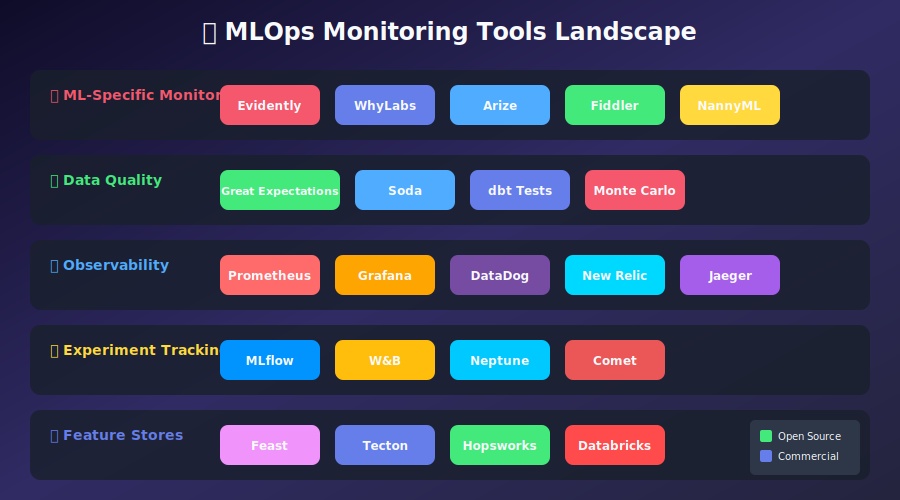
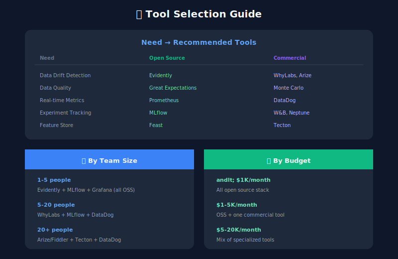
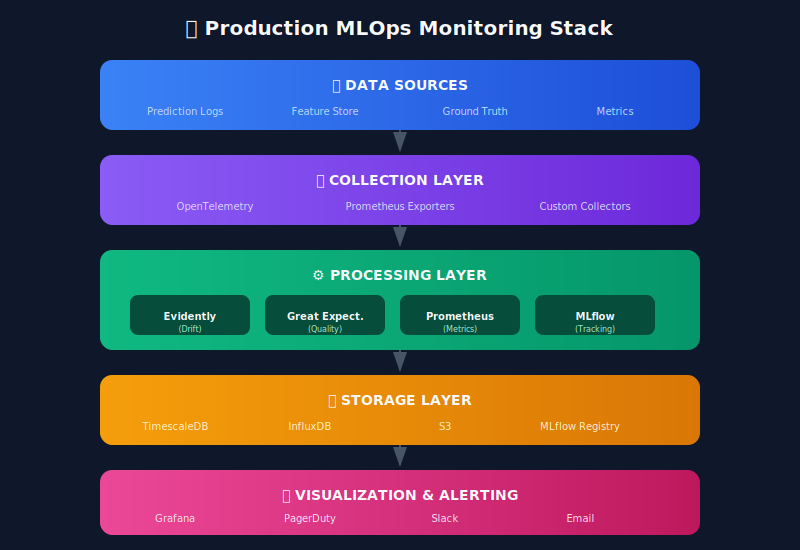

# 🛠️ Chapter 12: Tools & Frameworks

> **"The right tool for the right job makes all the difference."**

<p align="center">
  
</p>

---

## 🎯 Learning Objectives

- Understand the MLOps monitoring tools landscape

- Choose the right tools for your needs

- Integrate multiple tools into a cohesive stack

- Evaluate open-source vs commercial options

---

## Tools Landscape Overview


---

## Tool Deep Dives

### Evidently AI (Open Source)

```python
"""
Evidently AI - Open source ML monitoring toolkit
Best for: Data drift, model performance, data quality
"""

from evidently import ColumnMapping
from evidently.report import Report
from evidently.metric_preset import (
    DataDriftPreset,
    DataQualityPreset,
    TargetDriftPreset,
    ClassificationPreset
)
from evidently.metrics import *
from evidently.test_suite import TestSuite
from evidently.tests import *
import pandas as pd

# Setup column mapping
column_mapping = ColumnMapping(
    target='target',
    prediction='prediction',
    numerical_features=['age', 'income', 'credit_score'],
    categorical_features=['employment_type', 'region']
)

# Create drift report
drift_report = Report(metrics=[
    DataDriftPreset(),
    DataQualityPreset(),
    TargetDriftPreset()
])

drift_report.run(
    reference_data=training_data,
    current_data=production_data,
    column_mapping=column_mapping
)

# Save or display
drift_report.save_html('drift_report.html')

# Create test suite for CI/CD
test_suite = TestSuite(tests=[
    TestNumberOfColumnsWithMissingValues(lte=2),
    TestNumberOfRowsWithMissingValues(lte=10),
    TestNumberOfConstantColumns(eq=0),
    TestNumberOfDuplicatedRows(lte=5),
    TestColumnDrift(column_name='age'),
    TestShareOfDriftedColumns(lt=0.3)
])

test_suite.run(
    reference_data=training_data,
    current_data=production_data,
    column_mapping=column_mapping
)

# Get results programmatically
results = test_suite.as_dict()
print(f"Tests passed: {results['summary']['all_passed']}")

```

### Great Expectations

```python
"""
Great Expectations - Data validation framework
Best for: Data quality checks, pipeline validation
"""

import great_expectations as gx

# Initialize context
context = gx.get_context()

# Create expectation suite
suite_name = "ml_feature_validation"
suite = context.add_expectation_suite(suite_name)

# Define expectations for features
expectations = [
    # Schema expectations
    gx.expectations.ExpectColumnToExist(column="user_id"),
    gx.expectations.ExpectColumnToExist(column="age"),
    gx.expectations.ExpectColumnToExist(column="income"),

    # Type expectations
    gx.expectations.ExpectColumnValuesToBeOfType(column="age", type_="int"),
    gx.expectations.ExpectColumnValuesToBeOfType(column="income", type_="float"),

    # Value expectations
    gx.expectations.ExpectColumnValuesToBeBetween(
        column="age", min_value=0, max_value=120
    ),
    gx.expectations.ExpectColumnValuesToBeBetween(
        column="income", min_value=0, max_value=10000000
    ),

    # Null expectations
    gx.expectations.ExpectColumnValuesToNotBeNull(column="user_id"),
    gx.expectations.ExpectColumnValuesToNotBeNull(
        column="age", mostly=0.95  # Allow 5% nulls
    ),

    # Distribution expectations
    gx.expectations.ExpectColumnMeanToBeBetween(
        column="age", min_value=20, max_value=60
    ),
    gx.expectations.ExpectColumnStddevToBeBetween(
        column="income", min_value=10000, max_value=100000
    )
]

# Add to suite
for expectation in expectations:
    suite.add_expectation(expectation)

# Run validation
validator = context.get_validator(
    batch_request=batch_request,
    expectation_suite=suite
)

results = validator.validate()

if not results.success:
    failed = [r for r in results.results if not r.success]
    print(f"Validation failed: {len(failed)} expectations failed")

```

### Prometheus + Grafana

```python
"""
Prometheus + Grafana - Metrics collection and visualization
Best for: Real-time operational metrics, alerting
"""

from prometheus_client import (
    Counter, Histogram, Gauge, Summary,
    start_http_server, CollectorRegistry
)
import time

# Create custom registry
registry = CollectorRegistry()

# Define ML-specific metrics
ML_PREDICTIONS = Counter(
    'ml_predictions_total',
    'Total ML predictions',
    ['model', 'version', 'result'],
    registry=registry
)

ML_LATENCY = Histogram(
    'ml_prediction_latency_seconds',
    'Prediction latency in seconds',
    ['model'],
    buckets=[.005, .01, .025, .05, .075, .1, .25, .5, .75, 1.0, 2.5],
    registry=registry
)

ML_CONFIDENCE = Histogram(
    'ml_prediction_confidence',
    'Model confidence scores',
    ['model', 'class'],
    buckets=[0.1, 0.2, 0.3, 0.4, 0.5, 0.6, 0.7, 0.8, 0.9, 0.95, 0.99],
    registry=registry
)

ML_DATA_DRIFT = Gauge(
    'ml_data_drift_score',
    'Data drift PSI score',
    ['model', 'feature'],
    registry=registry
)

ML_MODEL_ACCURACY = Gauge(
    'ml_model_accuracy',
    'Model accuracy (rolling)',
    ['model', 'version'],
    registry=registry
)

# Grafana dashboard JSON
GRAFANA_DASHBOARD = {
    "title": "ML Model Monitoring",
    "panels": [
        {
            "title": "Prediction Rate",
            "type": "graph",
            "targets": [
                {"expr": "rate(ml_predictions_total[5m])"}
            ]
        },
        {
            "title": "P99 Latency",
            "type": "stat",
            "targets": [
                {"expr": "histogram_quantile(0.99, rate(ml_prediction_latency_seconds_bucket[5m]))"}
            ]
        },
        {
            "title": "Data Drift",
            "type": "heatmap",
            "targets": [
                {"expr": "ml_data_drift_score"}
            ]
        }
    ]
}

# Start metrics server
start_http_server(8000, registry=registry)

```

### MLflow

```python
"""
MLflow - ML lifecycle management
Best for: Experiment tracking, model registry, deployment
"""

import mlflow
from mlflow.tracking import MlflowClient

# Set tracking URI
mlflow.set_tracking_uri("http://mlflow-server:5000")

# Start experiment tracking
with mlflow.start_run(run_name="fraud_detection_v2"):
    # Log parameters
    mlflow.log_params({
        "model_type": "xgboost",
        "n_estimators": 100,
        "max_depth": 5,
        "learning_rate": 0.1
    })

    # Train model
    model = train_model(X_train, y_train)

    # Log metrics
    metrics = evaluate_model(model, X_test, y_test)
    mlflow.log_metrics({
        "accuracy": metrics['accuracy'],
        "precision": metrics['precision'],
        "recall": metrics['recall'],
        "f1": metrics['f1'],
        "auc_roc": metrics['auc_roc']
    })

    # Log artifacts
    mlflow.log_artifact("feature_importance.png")
    mlflow.log_artifact("confusion_matrix.png")

    # Log model
    mlflow.sklearn.log_model(
        model,
        "model",
        registered_model_name="fraud_detection"
    )

# Model registry management
client = MlflowClient()

# Transition to production
client.transition_model_version_stage(
    name="fraud_detection",
    version=2,
    stage="Production"
)

# Load production model
model = mlflow.sklearn.load_model("models:/fraud_detection/Production")

```

### WhyLabs (SaaS)

```python
"""
WhyLabs - ML observability platform
Best for: Continuous monitoring, drift detection at scale
"""

from whylogs.api.writer.whylabs import WhyLabsWriter
import whylogs as why
from whylogs.core.constraints import Constraints
from whylogs.core.constraints.factories import (
    greater_than_number,
    smaller_than_number,
    no_missing_values
)

# Configure WhyLabs
import os
os.environ["WHYLABS_API_KEY"] = "your-api-key"
os.environ["WHYLABS_DEFAULT_ORG_ID"] = "your-org-id"
os.environ["WHYLABS_DEFAULT_DATASET_ID"] = "model-1"

# Profile data
profile = why.log(df).profile()

# Send to WhyLabs
writer = WhyLabsWriter()
writer.write(profile)

# Define constraints
constraints = Constraints(
    greater_than_number(column_name="age", number=0),
    smaller_than_number(column_name="age", number=120),
    no_missing_values(column_name="user_id")
)

# Check constraints
report = constraints.generate_constraints_report(profile.view())
print(f"All passed: {report.all_passed}")

```

---

## Tool Selection Matrix



---

## Reference Architecture



---

## Implementation Checklist

```markdown
## MLOps Monitoring Implementation Checklist

### Phase 1: Foundation (Week 1-2)

- [ ] Set up Prometheus + Grafana

- [ ] Implement basic metrics (latency, throughput, errors)

- [ ] Create initial dashboards

- [ ] Set up PagerDuty/Slack alerting

### Phase 2: ML-Specific (Week 3-4)

- [ ] Implement prediction logging

- [ ] Add Evidently for drift detection

- [ ] Set up Great Expectations for data quality

- [ ] Create drift monitoring dashboard

### Phase 3: Advanced (Week 5-6)

- [ ] Integrate MLflow for experiment tracking

- [ ] Implement model registry

- [ ] Add A/B testing infrastructure

- [ ] Set up cost monitoring

### Phase 4: Governance (Week 7-8)

- [ ] Implement audit logging

- [ ] Create model cards

- [ ] Add fairness monitoring

- [ ] Document all processes

```

---

## 🔑 Key Takeaways

1. **Start simple** - Prometheus + Grafana covers 80% of needs

2. **Open source first** - Validate needs before buying

3. **Integrate, don't replace** - Tools work better together

4. **Consider total cost** - Including engineering time

5. **Plan for scale** - Choose tools that grow with you

---

## 📚 Resources

- [Evidently AI Documentation](https://docs.evidentlyai.com/)

- [Great Expectations](https://docs.greatexpectations.io/)

- [MLflow](https://mlflow.org/docs/latest/index.html)

- [Prometheus](https://prometheus.io/docs/)

- [Grafana](https://grafana.com/docs/)

---

**Congratulations!** 🎉 You've completed the MLOps Monitoring guide!

[← Back to Main Index](../README.md)

---

<div align="center">

**[⬆ Back to Top](#)** | **[📚 Main Repository](https://github.com/Gaurav14cs17/ml_system_design)**

Made with 💜 by [Gaurav14cs17](https://github.com/Gaurav14cs17)

</div>
