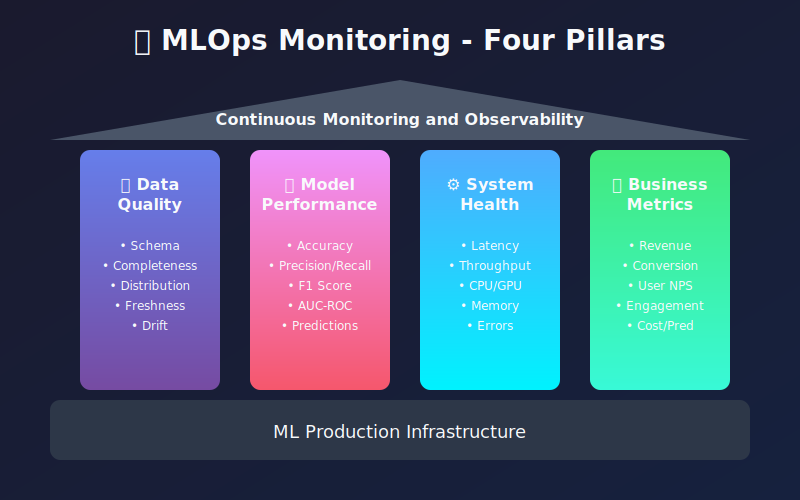
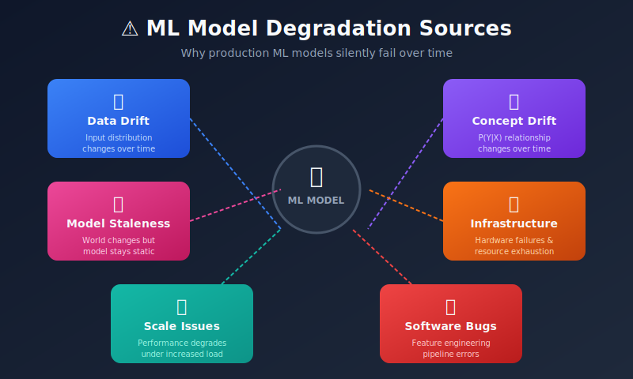
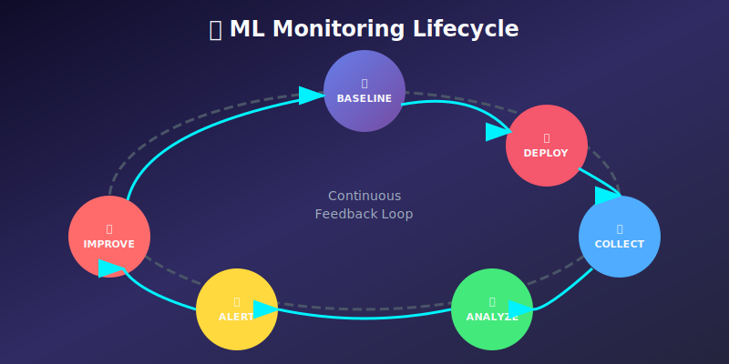

# 🔍 MLOps Monitoring: The Complete Guide

> **"You can't improve what you don't measure."** — Peter Drucker

<p align="center">
  
</p>

## 📖 Table of Contents

| Chapter | Topic | Description |
|---------|-------|-------------|
| 01 | [Introduction to MLOps Monitoring](./01_introduction_to_mlops_monitoring/) | Why monitoring matters, key concepts, and monitoring lifecycle |
| 02 | [Model Performance Monitoring](./02_model_performance_monitoring/) | Tracking accuracy, latency, throughput, and model degradation |
| 03 | [Data Drift Detection](./03_data_drift_detection/) | Identifying changes in input data distributions |
| 04 | [Concept Drift Detection](./04_concept_drift_detection/) | Detecting changes in the relationship between features and targets |
| 05 | [Feature Store Monitoring](./05_feature_store_monitoring/) | Monitoring feature pipelines and data quality |
| 06 | [Logging and Observability](./06_logging_and_observability/) | Building observable ML systems with proper logging |
| 07 | [Alerting Systems](./07_alerting_systems/) | Setting up intelligent alerts and incident response |
| 08 | [A/B Testing & Experimentation](./08_ab_testing_experimentation/) | Running experiments and measuring business impact |
| 09 | [Infrastructure Monitoring](./09_infrastructure_monitoring/) | Monitoring compute, memory, GPU, and system health |
| 10 | [Cost Monitoring & Optimization](./10_cost_monitoring_optimization/) | Tracking and optimizing ML infrastructure costs |
| 11 | [Compliance & Governance](./11_compliance_governance/) | Audit trails, model cards, and regulatory compliance |
| 12 | [Tools & Frameworks](./12_tools_and_frameworks/) | Comprehensive guide to monitoring tools ecosystem |

---

## 🎯 Why MLOps Monitoring?

Machine Learning models in production are **living systems**. Unlike traditional software, ML models can silently degrade over time due to:



---

## 📐 Mathematical Foundations

Understanding the statistical theory behind ML monitoring is crucial for effective system observability.

### Distribution Shift Detection

When monitoring ML systems, we're fundamentally comparing probability distributions. Let \( P_{train}(X) \) be the training distribution and \( P_{prod}(X) \) be the production distribution.

#### Population Stability Index (PSI)

The **Population Stability Index** quantifies how much a distribution has shifted:

```math
PSI = \sum_{i=1}^{n} (P_i^{actual} - P_i^{expected}) \cdot \ln\left(\frac{P_i^{actual}}{P_i^{expected}}\right)
```

Where:
- \( P_i^{actual} \) = proportion of observations in bin \( i \) for current data
- \( P_i^{expected} \) = proportion of observations in bin \( i \) for reference data

| PSI Value | Interpretation |
|-----------|----------------|
| PSI < 0.1 | No significant change |
| 0.1 ≤ PSI < 0.2 | Moderate change — monitor |
| PSI ≥ 0.2 | Significant change — action required |

#### Kolmogorov-Smirnov Test

The **KS test** measures the maximum distance between two cumulative distribution functions:

```math
D_{KS} = \sup_x |F_{train}(x) - F_{prod}(x)|
```

The null hypothesis \( H_0 \): Both samples come from the same distribution. Reject if \( p < \alpha \) (typically 0.05).

#### Jensen-Shannon Divergence

Unlike KL divergence, **JS divergence** is symmetric and bounded:

```math
JS(P \| Q) = \frac{1}{2} D_{KL}(P \| M) + \frac{1}{2} D_{KL}(Q \| M)
```

Where \( M = \frac{1}{2}(P + Q) \) is the mixture distribution and \( D_{KL} \) is the Kullback-Leibler divergence:

```math
D_{KL}(P \| Q) = \sum_i P(i) \log\frac{P(i)}{Q(i)}
```

---

## 🔄 Monitoring Lifecycle

<p align="center">
  
</p>

### The Continuous Feedback Loop

1. **Baseline** — Establish reference metrics during training/validation
2. **Deploy** — Release model to production with monitoring hooks
3. **Collect** — Gather predictions, features, and ground truth
4. **Analyze** — Apply statistical tests to detect anomalies
5. **Alert** — Trigger notifications when thresholds are breached
6. **Improve** — Retrain, recalibrate, or rollback as needed

---

## 📊 Key Metrics at a Glance

### Model Performance Metrics

| Metric | Formula | Alert Threshold |
|--------|---------|-----------------|
| **Accuracy** | \( \frac{TP + TN}{TP + TN + FP + FN} \) | < baseline - 5% |
| **Precision** | \( \frac{TP}{TP + FP} \) | Context-dependent |
| **Recall** | \( \frac{TP}{TP + FN} \) | Context-dependent |
| **F1 Score** | \( 2 \cdot \frac{Precision \cdot Recall}{Precision + Recall} \) | < baseline - 5% |
| **AUC-ROC** | Area under ROC curve | < 0.7 |

### Data Quality Metrics

| Metric | Description | Alert Threshold |
|--------|-------------|-----------------|
| **Missing Values** | % of null/NaN values | > 5% |
| **Schema Violations** | Type mismatches | Any |
| **Value Range** | Out of expected bounds | > 1% |
| **Cardinality Change** | Unique value count change | > 10% |
| **PSI** | Distribution stability | > 0.2 |

### Latency Percentiles

Monitoring response time requires understanding percentiles:

- **P50 (Median)**: 50% of requests are faster than this
- **P95**: 95% of requests are faster — captures most user experience
- **P99**: 99% of requests are faster — captures tail latency

```math
P_k = x_{(\lceil k \cdot n / 100 \rceil)}
```

Where \( x_{(i)} \) is the \( i \)-th order statistic.

---

## 🧮 Statistical Testing Framework

### Hypothesis Testing for Drift Detection

When comparing distributions, we formulate:

- **Null Hypothesis** \( H_0 \): No drift (distributions are identical)
- **Alternative** \( H_1 \): Drift detected (distributions differ)

**Decision Rules:**
- If \( p < \alpha \): Reject \( H_0 \) (drift detected)
- If \( p \geq \alpha \): Fail to reject \( H_0 \) (no significant drift)

### Power Analysis

Before monitoring, compute required sample size for detecting drift:

```math
n = \left(\frac{z_{\alpha/2} + z_{\beta}}{\delta}\right)^2 \cdot 2\sigma^2
```

Where:
- \( z_{\alpha/2} \) = critical value for significance level
- \( z_{\beta} \) = critical value for power \( (1-\beta) \)
- \( \delta \) = minimum detectable effect size
- \( \sigma^2 \) = variance estimate

---

## 📚 Learning Path


---

## 🛠️ Technology Stack Overview

<p align="center">
  
</p>

### Key Tools by Category

| Category | Tools |
|----------|-------|
| **Data Drift** | Evidently AI, Great Expectations, Deepchecks |
| **Model Monitoring** | MLflow, Weights & Biases, Neptune |
| **Infrastructure** | Prometheus, Grafana, Datadog |
| **Alerting** | PagerDuty, OpsGenie, Slack |
| **Experimentation** | LaunchDarkly, Split, Optimizely |

---

## 📖 References & Resources

- [Google's ML Engineering Best Practices](https://developers.google.com/machine-learning/guides/rules-of-ml)
- [MLOps Community](https://mlops.community/)
- [Evidently AI Documentation](https://docs.evidentlyai.com/)
- [Great Expectations](https://greatexpectations.io/)
- [Prometheus & Grafana](https://prometheus.io/docs/visualization/grafana/)

---

## 🎓 Mathematical Prerequisites

This guide assumes familiarity with:

- **Probability Theory**: Random variables, distributions, expectation
- **Statistical Inference**: Hypothesis testing, confidence intervals
- **Information Theory**: Entropy, divergence measures
- **Linear Algebra**: For understanding model internals

---

## 🤝 Contributing

Each chapter contains:
- 📝 Detailed theoretical explanations with mathematical foundations
- 📊 Visual diagrams illustrating key concepts
- 💻 Practical code examples (kept minimal, focused on concepts)
- 🎯 Best practices and anti-patterns
- 📈 Real-world case studies

---

**Next:** [01 - Introduction to MLOps Monitoring →](./01_introduction_to_mlops_monitoring/)

---

<div align="center">

**[⬆ Back to Top](#)** | **[📚 Main Repository](https://github.com/Gaurav14cs17/ml_system_design)**

Made with 💜 by [Gaurav14cs17](https://github.com/Gaurav14cs17)

</div>
