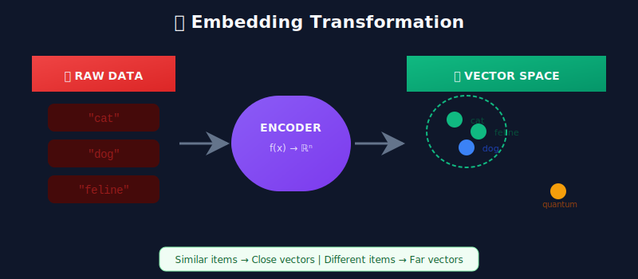
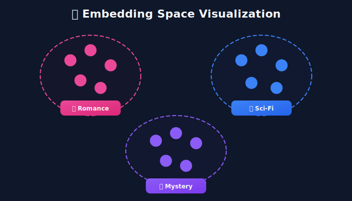
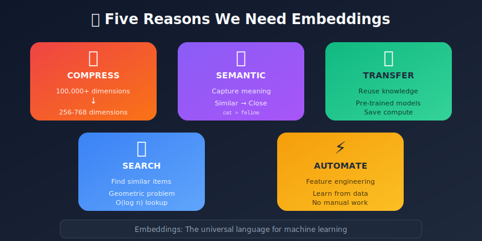
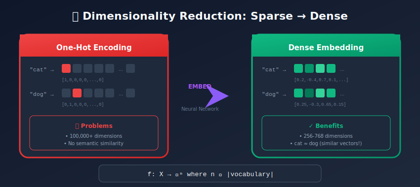
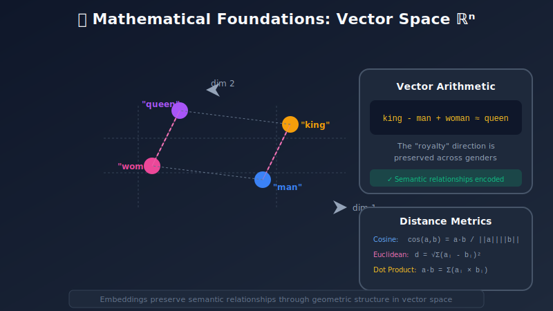
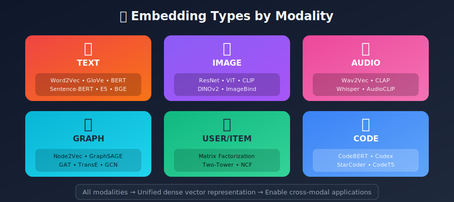
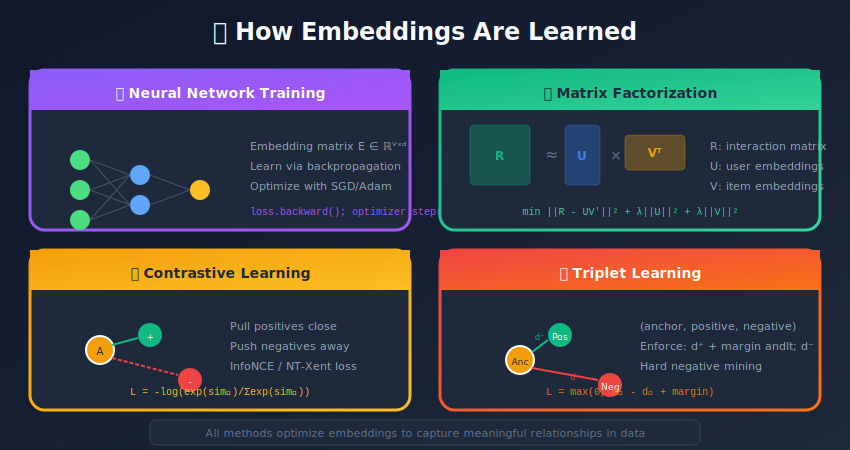
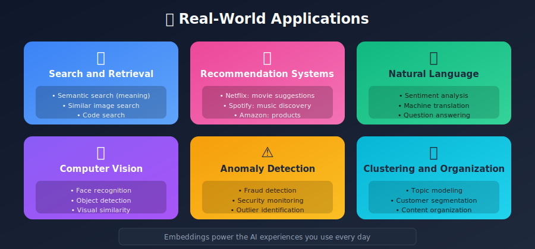
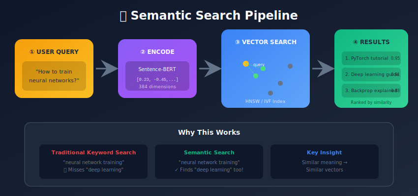

# Introduction to Embeddings: The Foundation of Modern ML Systems

<p align="center">
  
  
</p>

---

## 🎯 Visual Overview



---

## Table of Contents

1. [What Are Embeddings?](#what-are-embeddings)

2. [Why Do We Need Embeddings?](#why-do-we-need-embeddings)

3. [The Mathematics Behind Embeddings](#the-mathematics-behind-embeddings)

4. [Properties of Good Embeddings](#properties-of-good-embeddings)

5. [Types of Embeddings](#types-of-embeddings)

6. [Embedding Dimensions](#embedding-dimensions)

7. [How Embeddings Are Learned](#how-embeddings-are-learned)

8. [Real-World Applications](#real-world-applications)

9. [Challenges and Considerations](#challenges-and-considerations)

10. [Summary](#summary)

---

## What Are Embeddings?

**Embeddings are dense, low-dimensional, learned representations of high-dimensional data.** They transform discrete, categorical, or complex data into continuous vector spaces where similar items are positioned close together.

### The Core Intuition

Imagine you have a library with millions of books. Instead of organizing them alphabetically (which tells you nothing about content), embeddings organize them in a multi-dimensional space where:

- Mystery novels cluster together

- Romance novels form their own cluster

- A mystery-romance hybrid sits between both clusters



```
Traditional Representation (One-Hot Encoding):
"cat"  → [1, 0, 0, 0, 0, ...] (10,000+ dimensions)
"dog"  → [0, 1, 0, 0, 0, ...]
"feline" → [0, 0, 1, 0, 0, ...]

Embedding Representation:
"cat"    → [0.2, -0.4, 0.7, 0.1, ...]  (128-1024 dimensions)
"dog"    → [0.25, -0.3, 0.65, 0.15, ...]  (similar to cat!)
"feline" → [0.19, -0.41, 0.72, 0.09, ...]  (very similar to cat!)

```

### Formal Definition

An **embedding function** is a learned mapping:

```math
f_\theta: \mathcal{X} \rightarrow \mathbb{R}^d

```

where:

- $\mathcal{X}$ is the input space (words, images, users, products, etc.)

- $\mathbb{R}^d$ is a $d$-dimensional real-valued vector space

- $\theta$ are the learned parameters

- The function preserves **semantic similarity**: $\text{sim}(x_i, x_j) \approx \text{sim}(f(x_i), f(x_j))$

---

## Why Do We Need Embeddings?



### 1. Dimensionality Reduction



Raw data representations are often extremely high-dimensional:

- A vocabulary of 100,000 words → 100,000-dimensional one-hot vectors

- An image of 224×224 pixels → 150,528-dimensional vector

- A user's behavior history → potentially millions of features

Embeddings compress this to manageable dimensions (typically 64-1024).

### 2. Semantic Similarity Capture

One-hot encodings treat all items as equally different:

```math
d(\mathbf{x}_{\text{cat}}, \mathbf{x}_{\text{dog}}) = d(\mathbf{x}_{\text{cat}}, \mathbf{x}_{\text{physics}}) = \sqrt{2}

```

Embeddings capture meaningful relationships:

```math
d(\mathbf{e}_{\text{cat}}, \mathbf{e}_{\text{dog}}) \ll d(\mathbf{e}_{\text{cat}}, \mathbf{e}_{\text{physics}})

```

This enables machines to understand that "cat" and "dog" share semantic properties (animals, pets) that "quantum physics" does not.

### 3. Transfer Learning

Pre-trained embeddings encode general knowledge that transfers across tasks:

- Word embeddings trained on Wikipedia help with sentiment analysis

- Image embeddings from ImageNet help with medical imaging

- This saves enormous computational resources

### 4. Enabling Similarity Search

With embeddings, finding similar items becomes a geometric problem:

```python
# Find products similar to a query
similar_products = find_nearest_neighbors(
    query_embedding,
    product_embeddings,
    k=10
)

```

### 5. Feature Engineering Automation

Traditional ML required manual feature engineering. Embeddings learn features automatically:

```
Traditional: Define features like word_length, contains_vowels, is_noun...
Embeddings: Neural network learns relevant features from data

```

---

## The Mathematics Behind Embeddings



### Formal Definition

An **embedding** is a learned function that maps elements from a discrete or high-dimensional space into a continuous, lower-dimensional vector space:

```math
f: \mathcal{X} \rightarrow \mathbb{R}^d

```

where $\mathcal{X}$ is the input domain and $d \ll |\mathcal{X}|$ is the embedding dimension.

### Vector Space Properties

Embeddings live in a **metric space** equipped with:

#### 1. Distance and Similarity Functions

| Metric | Definition | Properties |
|--------|------------|------------|
| **Euclidean (L2)** | $d(\mathbf{a}, \mathbf{b}) = \sqrt{\sum_{i=1}^{d}(a_i - b_i)^2}$ | True metric, sensitive to magnitude |
| **Cosine Similarity** | $\cos(\mathbf{a}, \mathbf{b}) = \frac{\mathbf{a} \cdot \mathbf{b}}{\|\mathbf{a}\| \|\mathbf{b}\|}$ | Scale-invariant, range $[-1, 1]$ |
| **Dot Product** | $\mathbf{a} \cdot \mathbf{b} = \sum_{i=1}^{d} a_i b_i$ | Fast computation, magnitude-dependent |

**Important Relationship:** For unit-normalized vectors ($\|\mathbf{a}\| = \|\mathbf{b}\| = 1$):

```math
\cos(\mathbf{a}, \mathbf{b}) = \mathbf{a} \cdot \mathbf{b} \quad \text{and} \quad d_{\text{euclidean}}^2 = 2(1 - \cos(\mathbf{a}, \mathbf{b}))

```

#### 2. Vector Arithmetic (Analogical Reasoning)

A remarkable property of well-trained embeddings is that semantic relationships are captured as **linear directions**:

```math
\vec{v}_{\text{king}} - \vec{v}_{\text{man}} + \vec{v}_{\text{woman}} \approx \vec{v}_{\text{queen}}

```

This can be understood as:

- The vector $(\vec{v}_{\text{king}} - \vec{v}_{\text{man}})$ encodes the concept of "royalty"

- Adding this to $\vec{v}_{\text{woman}}$ yields the female equivalent

More generally, for analogies $a:b :: c:d$:

```math
\vec{v}_b - \vec{v}_a + \vec{v}_c \approx \vec{v}_d

```

### The Embedding Matrix

For discrete vocabularies $V$, embeddings are stored as a **lookup table**:

```math
\mathbf{E} \in \mathbb{R}^{|V| \times d}

```

Where:

- $|V|$ = vocabulary/catalog size (e.g., 50,000 words)

- $d$ = embedding dimension (e.g., 768)

**Embedding Lookup:** For item with index $i$:

```math
\text{embed}(i) = \mathbf{E}_{i,:} = \mathbf{e}_i \in \mathbb{R}^d

```

This is mathematically equivalent to multiplying by a one-hot vector: $\mathbf{e}_i = \mathbf{E}^\top \mathbf{x}_{\text{one-hot}}$

### Learning Objectives

Embedding models are trained to satisfy the **similarity preservation** constraint. Common loss functions:

#### Contrastive Loss (InfoNCE)

```math
\mathcal{L}_{\text{InfoNCE}} = -\mathbb{E}\left[\log \frac{\exp(\text{sim}(f(x), f(x^+))/\tau)}{\sum_{j=1}^{N} \exp(\text{sim}(f(x), f(x_j^-))/\tau)}\right]

```

where $\tau$ is a temperature hyperparameter and $x^+$ are positive pairs.

#### Triplet Loss

```math
\mathcal{L}_{\text{triplet}} = \max(0, d(f(a), f(p)) - d(f(a), f(n)) + \alpha)

```

where $(a, p, n)$ is an anchor-positive-negative triplet and $\alpha$ is the margin.

#### Multiple Negatives Ranking Loss

```math
\mathcal{L}_{\text{MNRL}} = -\frac{1}{B}\sum_{i=1}^{B} \log \frac{\exp(s(q_i, d_i^+))}{\sum_{j=1}^{B} \exp(s(q_i, d_j))}

```

where $B$ is the batch size and in-batch negatives are used.

---

## Properties of Good Embeddings

### 1. Semantic Coherence
Similar concepts should have similar embeddings:

```python
cosine_similarity(embed("happy"), embed("joyful")) > 0.8
cosine_similarity(embed("happy"), embed("sad")) < 0.3

```

### 2. Geometric Structure
Relationships should be preserved geometrically:

```python
# Analogies work
embed("paris") - embed("france") ≈ embed("tokyo") - embed("japan")

# Clustering makes sense
cluster(embed("sports words")) ≠ cluster(embed("food words"))

```

### 3. Appropriate Dimensionality

- Too few dimensions → information loss

- Too many dimensions → overfitting, computational cost

- Sweet spot: usually 64-512 for most applications

### 4. Normalization
Many applications benefit from unit-normalized embeddings:

```python
embedding = embedding / np.linalg.norm(embedding)
# Now: ||embedding|| = 1
# Benefit: dot product = cosine similarity

```

### 5. Stability
Small changes in input should cause small changes in embedding:

```python
# Typo robustness
embed("machine learning") ≈ embed("machin learning")

```

---

## Types of Embeddings



### By Data Type

| Data Type | Examples | Common Methods |
|-----------|----------|----------------|
| **Text** | Words, sentences, documents | Word2Vec, BERT, Sentence-BERT |
| **Images** | Photos, medical scans | ResNet, CLIP, ViT |
| **Graphs** | Social networks, molecules | Node2Vec, GraphSAGE |
| **Audio** | Speech, music | Wav2Vec, CLAP |
| **Users/Items** | Recommendations | Matrix Factorization, Two-Tower |
| **Code** | Programs, functions | CodeBERT, Codex |

### By Learning Approach

#### 1. Self-Supervised Embeddings
Learned from unlabeled data using pretext tasks:

- **Masked prediction**: Predict missing parts (BERT, MAE)

- **Contrastive learning**: Distinguish similar vs. dissimilar (SimCLR, MoCo)

- **Next token prediction**: Predict what comes next (GPT, Word2Vec)

#### 2. Supervised Embeddings
Learned with labeled data:

- Classification objectives

- Metric learning with explicit labels

- Multi-task learning

#### 3. Hybrid Embeddings
Combine multiple approaches:

- Pre-train self-supervised, fine-tune supervised

- Multi-modal learning (CLIP: images + text)

---

## Embedding Dimensions

### Choosing the Right Dimension

| Application | Typical Dimensions | Reasoning |
|-------------|-------------------|-----------|
| Simple products | 64-128 | Limited semantic complexity |
| Words | 100-300 | Vocabulary relationships |
| Sentences | 384-768 | Compositional meaning |
| Images | 512-2048 | Visual complexity |
| Multi-modal | 512-1024 | Shared representation space |

### The Trade-offs

```
Higher Dimensions:
  ✓ More expressive
  ✓ Better accuracy (up to a point)
  ✗ More storage
  ✗ Slower similarity search
  ✗ Risk of overfitting

Lower Dimensions:
  ✓ Faster operations
  ✓ Less storage
  ✓ Better generalization
  ✗ May lose important information

```

### Empirical Rule

Start with **dimension ≈ 4 × log₂(vocabulary_size)** and tune based on:

- Downstream task performance

- Latency requirements

- Storage constraints

---

## How Embeddings Are Learned



### 1. Neural Network Training

The most common approach: embeddings are parameters in a neural network optimized via backpropagation.

```python
import torch.nn as nn

class EmbeddingModel(nn.Module):
    def __init__(self, vocab_size, embed_dim):
        super().__init__()
        # This is the embedding matrix
        self.embeddings = nn.Embedding(vocab_size, embed_dim)

    def forward(self, input_ids):
        return self.embeddings(input_ids)

# During training, gradients update the embedding weights
loss.backward()
optimizer.step()

```

### 2. Matrix Factorization

Decompose a sparse interaction matrix into dense factors:

```
R ≈ U × V^T

Where:

- R = user-item interaction matrix (sparse)

- U = user embeddings

- V = item embeddings

```

### 3. Contrastive Learning

Learn by comparing positive and negative pairs:

```python
def contrastive_loss(anchor, positive, negatives, temperature=0.1):
    # Positive pair similarity
    pos_sim = cosine_similarity(anchor, positive) / temperature

    # Negative pair similarities
    neg_sims = cosine_similarity(anchor, negatives) / temperature

    # InfoNCE loss
    loss = -pos_sim + log(sum(exp(neg_sims)))
    return loss

```

### 4. Triplet Learning

Learn from (anchor, positive, negative) triplets:

```python
def triplet_loss(anchor, positive, negative, margin=0.2):
    pos_dist = distance(anchor, positive)
    neg_dist = distance(anchor, negative)
    return max(0, pos_dist - neg_dist + margin)

```

---

## Real-World Applications



### 1. Search and Information Retrieval


- Semantic search (meaning, not just keywords)

- Similar image search

- Code search

### 2. Recommendation Systems

```
User Embedding × Item Embedding = Relevance Score

```
- Netflix: movie recommendations

- Spotify: music discovery

- Amazon: product suggestions

### 3. Natural Language Processing

- Sentiment analysis

- Named entity recognition

- Machine translation

- Question answering

### 4. Computer Vision

- Face recognition

- Object detection

- Image classification

- Visual similarity

### 5. Anomaly Detection

```
if distance(new_item_embedding, normal_cluster) > threshold:
    flag_as_anomaly()

```

### 6. Clustering and Organization

- Topic modeling

- Customer segmentation

- Content organization

---

## Challenges and Considerations


### 1. Cold Start Problem
New items/users have no interaction history for training:

- **Solutions**: Use content-based features, hybrid approaches

### 2. Embedding Drift
Real-world distributions change over time:

- **Solutions**: Regular retraining, online learning, monitoring

### 3. Bias and Fairness
Embeddings can encode societal biases from training data:

```python
# Problematic: Historical bias encoded
embed("doctor") closer to embed("man") than embed("woman")

```
- **Solutions**: Debiasing techniques, careful data curation

### 4. Interpretability
Embeddings are dense and not human-interpretable:

- **Solutions**: Probing tasks, visualization (t-SNE, UMAP)

### 5. Computational Cost
Training and storing embeddings at scale is expensive:

- **Solutions**: Dimensionality reduction, quantization, efficient indexing

### 6. Domain Mismatch
Pre-trained embeddings may not transfer well:

- **Solutions**: Domain adaptation, fine-tuning

---

## Summary

### Key Takeaways

1. **Embeddings transform complex data into dense vectors** where similarity is meaningful

2. **They enable modern ML systems** including search, recommendations, and NLP

3. **Good embeddings capture semantic relationships** through geometric structure

4. **Multiple learning approaches exist**: self-supervised, supervised, contrastive

5. **Dimension choice matters**: balance expressiveness vs. efficiency

6. **Challenges include**: cold start, drift, bias, and computational cost

### What's Next?

In the following sections, we'll deep-dive into:

- **Word Embeddings**: Word2Vec, GloVe, FastText

- **Sentence/Document Embeddings**: Transformers, Sentence-BERT

- **Image Embeddings**: CNN-based, Vision Transformers

- **Vector Databases**: Storing and searching billions of embeddings

- **Production Systems**: Building real-world embedding pipelines

---

## References

1. Mikolov, T., et al. "Efficient Estimation of Word Representations in Vector Space" (Word2Vec)

2. Pennington, J., et al. "GloVe: Global Vectors for Word Representation"

3. Devlin, J., et al. "BERT: Pre-training of Deep Bidirectional Transformers"

4. He, K., et al. "Deep Residual Learning for Image Recognition" (ResNet)

5. Radford, A., et al. "Learning Transferable Visual Models From Natural Language Supervision" (CLIP)

---

*Next: [Word Embeddings →](../02_word_embeddings/README.md)*

---

<div align="center">

**[⬆ Back to Top](#)** | **[📚 Main Repository](https://github.com/Gaurav14cs17/ml_system_design)**

Made with 💜 by [Gaurav14cs17](https://github.com/Gaurav14cs17)

</div>
