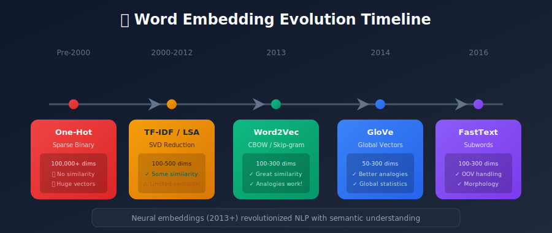
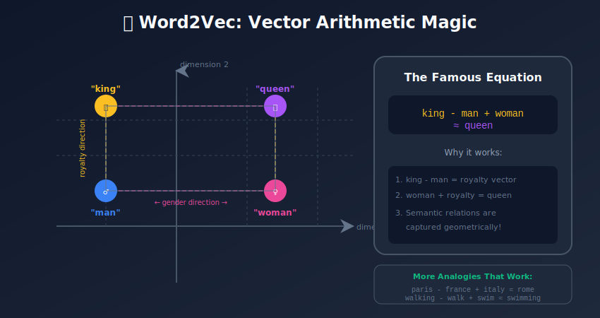
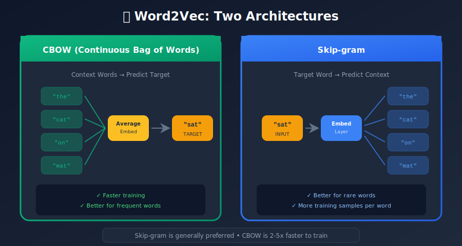

# Word Embeddings: From Words to Vectors

<p align="center">
  
  
</p>

---

## 🎯 Visual Overview





---

## Table of Contents

1. [Introduction](#introduction)

2. [The Evolution of Word Representations](#the-evolution-of-word-representations)

3. [Word2Vec: The Revolution](#word2vec-the-revolution)

4. [GloVe: Global Vectors](#glove-global-vectors)

5. [FastText: Subword Embeddings](#fasttext-subword-embeddings)

6. [Comparison of Methods](#comparison-of-methods)

7. [Training Word Embeddings](#training-word-embeddings)

8. [Evaluating Word Embeddings](#evaluating-word-embeddings)

9. [Practical Implementation](#practical-implementation)

10. [Advanced Topics](#advanced-topics)

11. [Summary](#summary)

---

## Introduction

Word embeddings are dense vector representations of words where semantically similar words are mapped to nearby points in a continuous vector space. They are the foundational building blocks that revolutionized Natural Language Processing (NLP).

### Why Word Embeddings Matter

Before word embeddings, NLP systems treated words as discrete symbols with no inherent relationship:

```
"cat" → one-hot: [0, 0, 0, 1, 0, 0, ..., 0]  (vocabulary position 4)
"dog" → one-hot: [0, 0, 1, 0, 0, 0, ..., 0]  (vocabulary position 3)

Problem: cat and dog appear equally different as cat and democracy

```

Word embeddings changed this by learning:

```
"cat" → [0.2, -0.1, 0.8, 0.3, ...]
"dog" → [0.25, -0.15, 0.75, 0.28, ...]  ← Nearby in vector space!
"democracy" → [-0.5, 0.9, -0.1, 0.6, ...]  ← Far from animals

```

---

## The Evolution of Word Representations

### 1. One-Hot Encoding (Pre-2000s)

**Representation**: Sparse binary vectors

```python
vocabulary = ["the", "cat", "sat", "on", "mat"]

one_hot = {
    "the": [1, 0, 0, 0, 0],
    "cat": [0, 1, 0, 0, 0],
    "sat": [0, 0, 1, 0, 0],
    "on":  [0, 0, 0, 1, 0],
    "mat": [0, 0, 0, 0, 1]
}

```

**Problems**:

- High dimensionality (|V| dimensions)

- No semantic similarity

- Curse of dimensionality

### 2. Distributional Semantics (2000s)

**Principle**: "You shall know a word by the company it keeps" - J.R. Firth

**Co-occurrence Matrices**:

```
Count how often words appear together in a context window

           the  cat  sat  on   mat
     the   0    5    3    8    2
     cat   5    0    10   2    4
     sat   3    10   0    6    3
     on    8    2    6    0    5
     mat   2    4    3    5    0

```

**TF-IDF Vectors**: Weight by term frequency × inverse document frequency

**Latent Semantic Analysis (LSA)**: Apply SVD to reduce dimensionality

### 3. Neural Word Embeddings (2013+)

**Breakthrough**: Learn embeddings through neural network training

- Word2Vec (2013)

- GloVe (2014)

- FastText (2016)

- ELMo (2018)

- BERT (2018) - Contextual embeddings

---

## Word2Vec: The Revolution

Word2Vec, introduced by Mikolov et al. at Google in 2013, demonstrated that simple neural networks could learn powerful word representations.

### The Key Insight

Words appearing in similar contexts have similar meanings. Word2Vec operationalizes this through two architectures:



### Architecture 1: Continuous Bag of Words (CBOW)

**Task**: Predict the target word from surrounding context words

```
Context: "The cat ___ on the mat"
Target: "sat"

Input: [the, cat, on, the, mat] → Predict: sat

```

**Architecture**:

```
Context Words → Average Embeddings → Hidden Layer → Softmax → Target Word
     [w₁, w₂, w₄, w₅]        ↓              ↓           ↓
          ↓              mean(E[wᵢ])      Wₒᵤₜ       P(w₃)
      Embedding             ↓              ↓           ↓
      Matrix E         h ∈ ℝᵈ         scores      argmax

```

**CBOW Implementation**:

```python
import torch
import torch.nn as nn

class CBOW(nn.Module):
    def __init__(self, vocab_size, embed_dim):
        super().__init__()
        self.embeddings = nn.Embedding(vocab_size, embed_dim)
        self.linear = nn.Linear(embed_dim, vocab_size)

    def forward(self, context_words):
        # context_words: [batch, context_size]
        embeds = self.embeddings(context_words)  # [batch, context_size, embed_dim]
        avg_embed = embeds.mean(dim=1)  # [batch, embed_dim]
        logits = self.linear(avg_embed)  # [batch, vocab_size]
        return logits

```

### Architecture 2: Skip-gram

**Task**: Predict context words from the target word (inverse of CBOW)

```
Target: "sat"
Predict: ["the", "cat", "on", "the", "mat"]

Input: sat → Predict: context words

```

**Architecture**:

```
Target Word → Embedding → Hidden Layer → Softmax → Context Words
    w₃           ↓           ↓            ↓
    ↓          E[w₃]        Wₒᵤₜ      P(w₁), P(w₂), P(w₄), P(w₅)
Embedding        ↓           ↓            ↓
Matrix E     h ∈ ℝᵈ       scores      for each context position

```

**Skip-gram typically works better for rare words** since each word gets more training signal.

### Training Optimization: Negative Sampling

Computing softmax over entire vocabulary is computationally prohibitive:

```math
P(w_o | w_i) = \frac{\exp(\mathbf{v}_{w_o}^\top \mathbf{v}_{w_i})}{\sum_{j=1}^{|V|} \exp(\mathbf{v}_{w_j}^\top \mathbf{v}_{w_i})}

```

The denominator requires summing over **all words** in vocabulary $|V|$ (often 100,000+).

**Solution: Negative Sampling (NEG)**

Replace the softmax with a **binary classification task**:

```math
\mathcal{L}_{\text{NEG}} = \log \sigma(\mathbf{v}_{w_o}^\top \mathbf{v}_{w_i}) + \sum_{k=1}^{K} \mathbb{E}_{w_k \sim P_n(w)} \left[ \log \sigma(-\mathbf{v}_{w_k}^\top \mathbf{v}_{w_i}) \right]

```

where:

- $\sigma(x) = 1/(1 + e^{-x})$ is the sigmoid function

- $K$ is the number of negative samples (typically 5-15)

- $P\_n(w) \propto f(w)^{3/4}$ is the noise distribution (unigram raised to 3/4 power)

```python
def negative_sampling_loss(target_embed, context_embed, negative_embeds):
    """
    Maximize: log σ(v_context · v_target) + Σ log σ(-v_neg · v_target)
    """
    # Positive pair
    pos_score = torch.sigmoid(torch.dot(target_embed, context_embed))
    pos_loss = -torch.log(pos_score)

    # Negative pairs
    neg_scores = torch.sigmoid(-torch.matmul(negative_embeds, target_embed))
    neg_loss = -torch.sum(torch.log(neg_scores))

    return pos_loss + neg_loss

```

### Word2Vec Hyperparameters

| Parameter | Typical Value | Effect |
|-----------|---------------|--------|
| Embedding dimension | 100-300 | Higher = more expressive |
| Window size | 5-10 | Larger = more syntactic |
| Min count | 5-10 | Filter rare words |
| Negative samples | 5-15 | More = better but slower |
| Learning rate | 0.025 | Standard SGD rate |
| Epochs | 5-20 | More data = fewer epochs |

### Famous Word2Vec Results

**Vector Arithmetic (Analogical Reasoning):**

The learned embeddings exhibit remarkable linear structure:

| Analogy | Vector Operation | Result |
|---------|------------------|--------|
| king : man :: queen : ? | $\vec{v}\_{\text{king}} - \vec{v}\_{\text{man}} + \vec{v}\_{\text{woman}}$ | ≈ $\vec{v}\_{\text{queen}}$ |
| Paris : France :: Rome : ? | $\vec{v}\_{\text{Paris}} - \vec{v}\_{\text{France}} + \vec{v}\_{\text{Italy}}$ | ≈ $\vec{v}\_{\text{Rome}}$ |
| walking : walk :: swimming : ? | $\vec{v}\_{\text{walking}} - \vec{v}\_{\text{walk}} + \vec{v}\_{\text{swim}}$ | ≈ $\vec{v}\_{\text{swimming}}$ |

**Geometric Interpretation:**

- The vector $(\vec{v}\_{\text{king}} - \vec{v}\_{\text{man}})$ captures the "royalty" direction

- This direction is consistent across gender pairs

- Similar patterns exist for country-capital, verb tenses, comparatives, etc.

**Clustering Properties:**

- Countries cluster in geographic/cultural regions

- Verbs cluster by tense (past, present, future)

- Adjectives cluster by sentiment and intensity

---

## GloVe: Global Vectors

GloVe (Global Vectors for Word Representation), developed at Stanford in 2014, combines the advantages of global matrix factorization and local context window methods.

### The Key Insight

Word2Vec only uses local context windows. GloVe leverages **global co-occurrence statistics** while training with a local objective.

### Co-occurrence Matrix

First, build a co-occurrence matrix X where Xᵢⱼ counts how often word j appears in the context of word i:

```python
def build_cooccurrence_matrix(corpus, window_size=10, vocab_size=10000):
    """
    Build co-occurrence matrix with distance weighting
    """
    cooc = np.zeros((vocab_size, vocab_size))

    for sentence in corpus:
        for i, word_i in enumerate(sentence):
            for j in range(max(0, i - window_size), min(len(sentence), i + window_size + 1)):
                if i != j:
                    word_j = sentence[j]
                    distance = abs(i - j)
                    # Weight by inverse distance
                    weight = 1.0 / distance
                    cooc[word_i][word_j] += weight

    return cooc

```

### GloVe Objective Function

GloVe minimizes a **weighted least-squares regression** on the co-occurrence matrix:

```math
\mathcal{J} = \sum_{i,j=1}^{|V|} f(X_{ij}) \left( \mathbf{w}_i^\top \tilde{\mathbf{w}}_j + b_i + \tilde{b}_j - \log X_{ij} \right)^2

```

where:

- $X\_{ij}$ is the co-occurrence count of words $i$ and $j$

- $\mathbf{w}\_i, \tilde{\mathbf{w}}\_j \in \mathbb{R}^d$ are word vectors (separate for target and context)

- $b\_i, \tilde{b}\_j \in \mathbb{R}$ are bias terms

- $f(x)$ is a weighting function to prevent frequent words from dominating

**Weighting Function:**

```math
f(x) = \begin{cases} (x/x_{\max})^\alpha & \text{if } x < x_{\max} \\ 1 & \text{otherwise} \end{cases}

```

where typically $x\_{\max} = 100$ and $\alpha = 0.75$.

**Weighting Function**:

```python
def weighting_function(x, x_max=100, alpha=0.75):
    """
    Prevent frequent words from dominating
    """
    if x < x_max:
        return (x / x_max) ** alpha
    return 1.0

```

### GloVe Implementation

```python
import torch
import torch.nn as nn

class GloVe(nn.Module):
    def __init__(self, vocab_size, embed_dim, x_max=100, alpha=0.75):
        super().__init__()
        self.x_max = x_max
        self.alpha = alpha

        # Word vectors (main and context)
        self.w_embeddings = nn.Embedding(vocab_size, embed_dim)
        self.c_embeddings = nn.Embedding(vocab_size, embed_dim)

        # Biases
        self.w_bias = nn.Embedding(vocab_size, 1)
        self.c_bias = nn.Embedding(vocab_size, 1)

        # Initialize
        self._init_weights()

    def _init_weights(self):
        for embed in [self.w_embeddings, self.c_embeddings]:
            nn.init.uniform_(embed.weight, -0.5, 0.5)
        for bias in [self.w_bias, self.c_bias]:
            nn.init.zeros_(bias.weight)

    def forward(self, word_i, word_j, cooc_value):
        # Get embeddings
        w_i = self.w_embeddings(word_i)
        c_j = self.c_embeddings(word_j)
        b_i = self.w_bias(word_i).squeeze()
        b_j = self.c_bias(word_j).squeeze()

        # Compute prediction
        prediction = torch.sum(w_i * c_j, dim=1) + b_i + b_j

        # Target
        target = torch.log(cooc_value)

        # Weighting
        weight = torch.where(
            cooc_value < self.x_max,
            (cooc_value / self.x_max) ** self.alpha,
            torch.ones_like(cooc_value)
        )

        # Weighted MSE loss
        loss = weight * (prediction - target) ** 2
        return loss.mean()

    def get_embedding(self, word_idx):
        """Final embedding = w + c (sum of both)"""
        return self.w_embeddings.weight[word_idx] + self.c_embeddings.weight[word_idx]

```

### GloVe vs Word2Vec

| Aspect | Word2Vec | GloVe |
|--------|----------|-------|
| Training | Stochastic (local context) | Global co-occurrence |
| Efficiency | Faster training | Requires matrix construction |
| Rare words | Skip-gram better | Struggles more |
| Semantic structure | Good | Often better analogies |
| Implementation | Simpler | More complex |

---

## FastText: Subword Embeddings

FastText, developed by Facebook AI Research in 2016, extends Word2Vec by representing words as bags of character n-grams.

### The Key Insight

Words are not atomic units. They have internal structure:

```
"unhappiness" = "un" + "happi" + "ness"
"running" = "run" + "ning"

```

### Subword Representation

Each word is represented as a bag of character n-grams:

```python
def get_subwords(word, min_n=3, max_n=6):
    """
    Extract character n-grams from a word
    """
    word = f"<{word}>"  # Add boundary markers
    subwords = []

    for n in range(min_n, max_n + 1):
        for i in range(len(word) - n + 1):
            subwords.append(word[i:i+n])

    return subwords

# Example
get_subwords("where")
# Output: ['<wh', 'whe', 'her', 'ere', 're>', '<whe', 'wher', 'here', 'ere>',
#          '<wher', 'where', 'here>', '<where', 'where>']

```

### Word Vector Computation

A word's vector is the sum of its subword vectors:

```python
def get_word_vector(word, subword_embeddings, word_embedding=None):
    """
    Word vector = word embedding + sum of subword embeddings
    """
    subwords = get_subwords(word)

    vector = np.zeros(embed_dim)
    if word_embedding is not None:
        vector += word_embedding

    for sw in subwords:
        if sw in subword_embeddings:
            vector += subword_embeddings[sw]

    return vector / (len(subwords) + 1)  # Average

```

### Benefits of Subword Embeddings

#### 1. Out-of-Vocabulary (OOV) Handling

```python
# Word2Vec/GloVe: Unknown word → No embedding
embed("unfriendliness")  # ??? (if not in vocabulary)

# FastText: Can still compute embedding from subwords
embed("unfriendliness") = embed("<un") + embed("unf") + ... + embed("ess>")

```

#### 2. Morphological Awareness

```python
# Similar words share subwords
embed("running") ≈ embed("runner")  # Share "run", "unn"
embed("unhappy") ≈ embed("unhelpful")  # Share "<un", "unh"

```

#### 3. Better for Morphologically Rich Languages

- German: "Kraftfahrzeug-Haftpflichtversicherung" (car liability insurance)

- Turkish: "Çekoslovakyalılaştıramadıklarımızdanmışsınız"

- Finnish, Hungarian, Arabic, etc.

### FastText Architecture

```python
class FastText(nn.Module):
    def __init__(self, vocab_size, subword_vocab_size, embed_dim):
        super().__init__()
        self.word_embeddings = nn.Embedding(vocab_size, embed_dim)
        self.subword_embeddings = nn.Embedding(subword_vocab_size, embed_dim)
        self.output = nn.Linear(embed_dim, vocab_size)

    def get_word_vector(self, word_idx, subword_indices):
        word_embed = self.word_embeddings(word_idx)
        subword_embed = self.subword_embeddings(subword_indices).mean(dim=0)
        return word_embed + subword_embed

    def forward(self, center_word, center_subwords, context_words):
        # Get center word representation
        center_embed = self.get_word_vector(center_word, center_subwords)

        # Predict context (skip-gram style)
        logits = self.output(center_embed)
        return logits

```

### FastText Hyperparameters

| Parameter | Typical Value | Effect |
|-----------|---------------|--------|
| min_n | 3 | Minimum n-gram size |
| max_n | 6 | Maximum n-gram size |
| bucket | 2,000,000 | Hash table size for subwords |
| embed_dim | 100-300 | Vector size |

---

## Comparison of Methods

### Quantitative Comparison

| Method | Analogy Accuracy | Similarity Correlation | OOV Handling |
|--------|------------------|----------------------|--------------|
| Word2Vec (Skip-gram) | 65-70% | 0.65-0.70 | None |
| Word2Vec (CBOW) | 60-65% | 0.63-0.68 | None |
| GloVe | 70-75% | 0.70-0.75 | None |
| FastText | 65-70% | 0.68-0.73 | Excellent |

### When to Use What

**Word2Vec (Skip-gram)**:

- Quick prototyping

- Large training corpus

- Focus on rare words

**Word2Vec (CBOW)**:

- Faster training needed

- Focus on frequent words

- Smaller corpus

**GloVe**:

- Benchmark comparisons

- Need best analogy performance

- Have pre-computed co-occurrence

**FastText**:

- Morphologically rich languages

- OOV words expected

- Noisy/misspelled text

---

## Training Word Embeddings

### Data Preparation

```python
import re
from collections import Counter

def prepare_corpus(texts, min_count=5):
    """
    Prepare corpus for word embedding training
    """
    # Tokenize
    all_words = []
    for text in texts:
        words = re.findall(r'\b[a-z]+\b', text.lower())
        all_words.extend(words)

    # Count and filter
    word_counts = Counter(all_words)
    vocab = {word: idx for idx, (word, count) in enumerate(word_counts.items())
             if count >= min_count}
    vocab['<UNK>'] = len(vocab)

    # Convert to indices
    corpus = []
    for text in texts:
        words = re.findall(r'\b[a-z]+\b', text.lower())
        indices = [vocab.get(w, vocab['<UNK>']) for w in words]
        corpus.append(indices)

    return corpus, vocab

def generate_skipgram_pairs(corpus, window_size=5):
    """
    Generate (center, context) pairs for skip-gram
    """
    pairs = []
    for sentence in corpus:
        for i, center in enumerate(sentence):
            start = max(0, i - window_size)
            end = min(len(sentence), i + window_size + 1)
            for j in range(start, end):
                if i != j:
                    pairs.append((center, sentence[j]))
    return pairs

```

### Training Loop

```python
def train_word2vec(model, pairs, vocab_size, epochs=5,
                   lr=0.025, neg_samples=5):
    """
    Train Word2Vec with negative sampling
    """
    optimizer = torch.optim.SparseAdam(model.parameters(), lr=lr)

    # Negative sampling distribution (word frequency ^ 0.75)
    neg_dist = get_negative_distribution(vocab_size)

    for epoch in range(epochs):
        total_loss = 0
        random.shuffle(pairs)

        for center, context in pairs:
            # Sample negatives
            negatives = sample_negatives(neg_dist, neg_samples, exclude=context)

            # Forward pass
            loss = model.negative_sampling_loss(center, context, negatives)

            # Backward pass
            optimizer.zero_grad()
            loss.backward()
            optimizer.step()

            total_loss += loss.item()

        print(f"Epoch {epoch+1}, Loss: {total_loss/len(pairs):.4f}")

```

### Using Pre-trained Models

```python
# Gensim - Easy loading of pre-trained embeddings
import gensim.downloader as api

# Load pre-trained Word2Vec (Google News)
word2vec = api.load("word2vec-google-news-300")

# Load pre-trained GloVe
glove = api.load("glove-wiki-gigaword-300")

# Load pre-trained FastText
fasttext = api.load("fasttext-wiki-news-subwords-300")

# Usage
vector = word2vec["king"]
similar = word2vec.most_similar("king", topn=5)
analogy = word2vec.most_similar(positive=["king", "woman"], negative=["man"])

```

---

## Evaluating Word Embeddings

### Intrinsic Evaluation

#### 1. Word Similarity

Compare embedding similarity to human similarity judgments:

```python
from scipy.stats import spearmanr

def evaluate_similarity(embeddings, similarity_dataset):
    """
    Evaluate on datasets like SimLex-999, WordSim-353
    """
    human_scores = []
    model_scores = []

    for word1, word2, human_score in similarity_dataset:
        if word1 in embeddings and word2 in embeddings:
            model_score = cosine_similarity(
                embeddings[word1], embeddings[word2]
            )
            human_scores.append(human_score)
            model_scores.append(model_score)

    correlation, p_value = spearmanr(human_scores, model_scores)
    return correlation

```

#### 2. Word Analogies

Test: a is to b as c is to ?

```python
def evaluate_analogies(embeddings, analogy_dataset):
    """
    Evaluate on Google analogy dataset
    """
    correct = 0
    total = 0

    for a, b, c, d in analogy_dataset:
        if all(w in embeddings for w in [a, b, c, d]):
            # Compute: d ≈ b - a + c
            predicted_vec = embeddings[b] - embeddings[a] + embeddings[c]

            # Find nearest (excluding a, b, c)
            nearest = find_nearest(predicted_vec, embeddings, exclude=[a, b, c])

            if nearest == d:
                correct += 1
            total += 1

    return correct / total

# Analogy categories
semantic_analogies = [
    ("athens", "greece", "oslo", "norway"),
    ("king", "queen", "man", "woman"),
]

syntactic_analogies = [
    ("good", "better", "bad", "worse"),
    ("walk", "walking", "swim", "swimming"),
]

```

### Extrinsic Evaluation

Test embeddings on downstream tasks:

```python
# Sentiment Analysis
def evaluate_sentiment(embeddings, sentiment_dataset):
    X = [average_embedding(text, embeddings) for text, label in sentiment_dataset]
    y = [label for text, label in sentiment_dataset]

    from sklearn.linear_model import LogisticRegression
    clf = LogisticRegression()

    from sklearn.model_selection import cross_val_score
    scores = cross_val_score(clf, X, y, cv=5)
    return scores.mean()

# Named Entity Recognition
# Part-of-Speech Tagging
# Text Classification

```

---

## Practical Implementation

### Complete Training Pipeline

```python
import numpy as np
import torch
import torch.nn as nn
from torch.utils.data import Dataset, DataLoader
from collections import Counter
import random

class Word2VecDataset(Dataset):
    def __init__(self, corpus, vocab, window_size=5, neg_samples=5):
        self.pairs = []
        self.neg_samples = neg_samples
        self.vocab_size = len(vocab)

        # Build word frequency distribution for negative sampling
        word_counts = Counter()
        for sentence in corpus:
            word_counts.update(sentence)

        # Negative sampling distribution (freq^0.75)
        freqs = np.array([word_counts.get(i, 0) for i in range(self.vocab_size)])
        freqs = np.power(freqs, 0.75)
        self.neg_probs = freqs / freqs.sum()

        # Generate pairs
        for sentence in corpus:
            for i, center in enumerate(sentence):
                start = max(0, i - window_size)
                end = min(len(sentence), i + window_size + 1)
                for j in range(start, end):
                    if i != j:
                        self.pairs.append((center, sentence[j]))

    def __len__(self):
        return len(self.pairs)

    def __getitem__(self, idx):
        center, context = self.pairs[idx]

        # Sample negatives
        negatives = np.random.choice(
            self.vocab_size,
            size=self.neg_samples,
            p=self.neg_probs
        )

        return {
            'center': torch.tensor(center),
            'context': torch.tensor(context),
            'negatives': torch.tensor(negatives)
        }

class SkipGramNegativeSampling(nn.Module):
    def __init__(self, vocab_size, embed_dim):
        super().__init__()
        self.center_embeddings = nn.Embedding(vocab_size, embed_dim)
        self.context_embeddings = nn.Embedding(vocab_size, embed_dim)

        # Initialize
        nn.init.xavier_uniform_(self.center_embeddings.weight)
        nn.init.xavier_uniform_(self.context_embeddings.weight)

    def forward(self, center, context, negatives):
        # Get embeddings
        center_embed = self.center_embeddings(center)  # [batch, dim]
        context_embed = self.context_embeddings(context)  # [batch, dim]
        neg_embed = self.context_embeddings(negatives)  # [batch, neg_samples, dim]

        # Positive score
        pos_score = torch.sum(center_embed * context_embed, dim=1)  # [batch]
        pos_loss = -torch.log(torch.sigmoid(pos_score) + 1e-10)

        # Negative scores
        neg_score = torch.bmm(neg_embed, center_embed.unsqueeze(2)).squeeze()  # [batch, neg]
        neg_loss = -torch.sum(torch.log(torch.sigmoid(-neg_score) + 1e-10), dim=1)

        return (pos_loss + neg_loss).mean()

    def get_embedding(self, word_idx):
        return self.center_embeddings.weight[word_idx].detach().numpy()

def train_word2vec_full(texts, embed_dim=100, window_size=5,
                        neg_samples=5, epochs=5, batch_size=256, lr=0.001):
    """
    Full Word2Vec training pipeline
    """
    # Prepare data
    corpus, vocab = prepare_corpus(texts)
    dataset = Word2VecDataset(corpus, vocab, window_size, neg_samples)
    dataloader = DataLoader(dataset, batch_size=batch_size, shuffle=True)

    # Model
    model = SkipGramNegativeSampling(len(vocab), embed_dim)
    optimizer = torch.optim.Adam(model.parameters(), lr=lr)

    # Training
    for epoch in range(epochs):
        total_loss = 0
        for batch in dataloader:
            loss = model(batch['center'], batch['context'], batch['negatives'])

            optimizer.zero_grad()
            loss.backward()
            optimizer.step()

            total_loss += loss.item()

        print(f"Epoch {epoch+1}/{epochs}, Loss: {total_loss/len(dataloader):.4f}")

    # Extract embeddings
    embeddings = {word: model.get_embedding(idx) for word, idx in vocab.items()}

    return embeddings, vocab, model

```

### Saving and Loading Embeddings

```python
def save_embeddings(embeddings, vocab, filepath):
    """Save embeddings in Word2Vec text format"""
    with open(filepath, 'w') as f:
        f.write(f"{len(vocab)} {len(next(iter(embeddings.values())))}\n")
        for word, idx in vocab.items():
            vector = embeddings[word]
            vector_str = ' '.join(map(str, vector))
            f.write(f"{word} {vector_str}\n")

def load_embeddings(filepath):
    """Load embeddings from Word2Vec text format"""
    embeddings = {}
    with open(filepath, 'r') as f:
        header = f.readline()
        for line in f:
            parts = line.strip().split()
            word = parts[0]
            vector = np.array([float(x) for x in parts[1:]])
            embeddings[word] = vector
    return embeddings

```

---

## Advanced Topics

### 1. Contextual Embeddings

Static embeddings give one vector per word, but words have multiple meanings:

```
"bank" → river bank? financial bank?
"bat" → animal? sports equipment?

```

**Solution**: Contextual embeddings (ELMo, BERT) generate different vectors based on context.

### 2. Cross-lingual Embeddings

Map words from different languages to the same space:

```python
# Align English and French embeddings
# "dog" (en) ≈ "chien" (fr) in shared space

```

Methods:

- Supervised alignment (parallel dictionaries)

- Unsupervised alignment (adversarial training)

### 3. Retrofitting

Inject knowledge graph information into embeddings:

```python
# Original: embedding("dog")
# Knowledge graph: dog IS-A mammal, dog HAS fur
# Retrofitted: embedding("dog") pushed closer to mammal, fur

```

### 4. Debiasing

Remove unwanted biases from embeddings:

```python
# Problem: embed("programmer") closer to embed("man") than embed("woman")
# Solution: Project out gender direction from profession words

def debias_embeddings(embeddings, gender_pairs):
    # Identify gender direction
    gender_direction = compute_gender_direction(embeddings, gender_pairs)

    # Project it out from neutral words
    for word in neutral_words:
        embeddings[word] = remove_component(embeddings[word], gender_direction)

    return embeddings

```

---

## Summary

### Key Takeaways

1. **Word embeddings revolutionized NLP** by learning meaningful word representations

2. **Word2Vec introduced efficient neural training** with Skip-gram and CBOW

3. **GloVe combines global statistics** with local training objectives

4. **FastText handles OOV words** through subword representations

5. **Evaluation includes** intrinsic (similarity, analogies) and extrinsic (downstream tasks)

6. **Modern systems use contextual embeddings** (BERT, etc.) for even better representations

### Choosing the Right Approach

| Scenario | Recommendation |
|----------|----------------|
| Quick baseline | Pre-trained Word2Vec/GloVe |
| Domain-specific | Train on domain corpus |
| Noisy/OOV text | FastText |
| Polysemous words | Contextual (BERT) |
| Low resource | Cross-lingual transfer |

---

## References

1. Mikolov, T., et al. (2013). "Efficient Estimation of Word Representations in Vector Space"

2. Mikolov, T., et al. (2013). "Distributed Representations of Words and Phrases"

3. Pennington, J., et al. (2014). "GloVe: Global Vectors for Word Representation"

4. Bojanowski, P., et al. (2017). "Enriching Word Vectors with Subword Information"

5. Levy, O., et al. (2015). "Improving Distributional Similarity with Lessons Learned from Word Embeddings"

---

*Previous: [← Introduction to Embeddings](../01_introduction_to_embeddings/README.md) | Next: [Sentence/Document Embeddings →](../03_sentence_document_embeddings/README.md)*

---

<div align="center">

**[⬆ Back to Top](#)** | **[📚 Main Repository](https://github.com/Gaurav14cs17/ml_system_design)**

Made with 💜 by [Gaurav14cs17](https://github.com/Gaurav14cs17)

</div>
