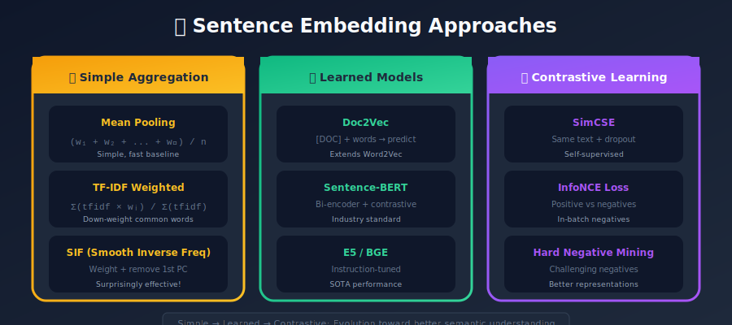
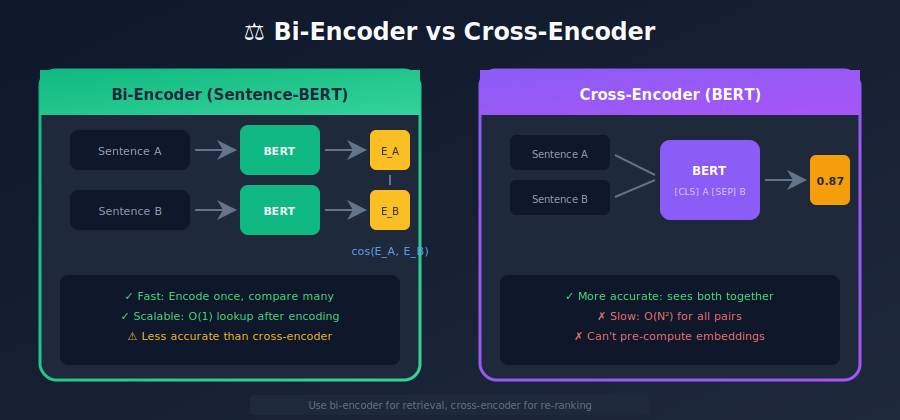
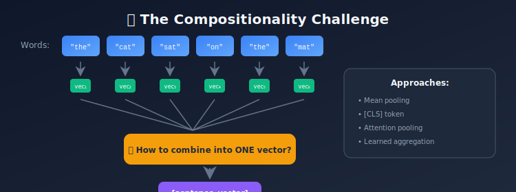
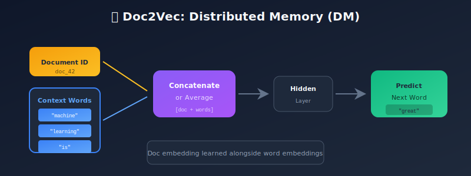
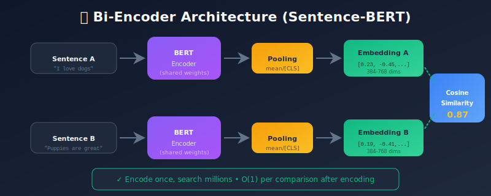

# Sentence and Document Embeddings: Beyond Words

<p align="center">
  
  
</p>

---

## 🎯 Visual Overview






---

## Table of Contents

1. [Introduction](#introduction)

2. [The Challenge of Compositionality](#the-challenge-of-compositionality)

3. [Simple Aggregation Methods](#simple-aggregation-methods)

4. [Doc2Vec: Paragraph Vectors](#doc2vec-paragraph-vectors)

5. [Recurrent Neural Networks](#recurrent-neural-networks)

6. [Transformer-Based Embeddings](#transformer-based-embeddings)

7. [Sentence-BERT and Bi-Encoders](#sentence-bert-and-bi-encoders)

8. [Contrastive Learning Approaches](#contrastive-learning-approaches)

9. [Specialized Domain Embeddings](#specialized-domain-embeddings)

10. [Practical Implementation](#practical-implementation)

11. [Evaluation and Benchmarks](#evaluation-and-benchmarks)

12. [Summary](#summary)

---

## Introduction

While word embeddings capture the meaning of individual words, many NLP applications require understanding at the sentence or document level:

- **Semantic Search**: Find documents similar to a query

- **Text Classification**: Categorize documents by topic/sentiment

- **Duplicate Detection**: Identify similar or duplicate content

- **Clustering**: Group related documents together

- **Question Answering**: Match questions to relevant passages

### The Core Challenge

How do we combine word meanings into a meaningful sentence/document representation?



---

## The Challenge of Compositionality

### Why Can't We Just Average?

Consider these sentences:

```
Sentence A: "The dog bit the man"
Sentence B: "The man bit the dog"

```

Same words, completely different meanings! Simple averaging loses:

- **Word order**: Subject-verb-object relationships

- **Negation**: "I love this" vs "I don't love this"

- **Emphasis**: "He definitely won" vs "He won"

- **Context**: "I went to the bank" (river or financial?)

### Desiderata for Good Sentence Embeddings

1. **Semantic similarity**: Similar sentences → similar vectors

2. **Order sensitivity**: Capture syntactic structure

3. **Compositionality**: Build meaning from parts

4. **Efficiency**: Fast to compute at scale

5. **Domain transfer**: Work across different domains

---

## Simple Aggregation Methods

Despite limitations, simple methods work surprisingly well as baselines.

### 1. Mean Pooling

Average all word vectors:

```python
import numpy as np

def mean_pooling(sentence, word_embeddings):
    """
    Simple average of word embeddings
    """
    vectors = [word_embeddings[word] for word in sentence if word in word_embeddings]
    if not vectors:
        return np.zeros(embedding_dim)
    return np.mean(vectors, axis=0)

# Example
sentence = "the cat sat on the mat"
embedding = mean_pooling(sentence.split(), word2vec)

```

**Pros**: Simple, fast, works okay
**Cons**: Ignores word order, weights all words equally

### 2. TF-IDF Weighted Average

Weight words by their importance:

```python
from sklearn.feature_extraction.text import TfidfVectorizer

def tfidf_weighted_embedding(sentence, word_embeddings, tfidf_weights):
    """
    TF-IDF weighted average of word embeddings
    """
    vectors = []
    weights = []

    for word in sentence:
        if word in word_embeddings and word in tfidf_weights:
            vectors.append(word_embeddings[word])
            weights.append(tfidf_weights[word])

    if not vectors:
        return np.zeros(embedding_dim)

    weights = np.array(weights)
    weights = weights / weights.sum()  # Normalize

    return np.average(vectors, axis=0, weights=weights)

```

### 3. Smooth Inverse Frequency (SIF)

Developed at Princeton, SIF significantly improves on averaging:

```python
def compute_sif_embeddings(sentences, word_embeddings, word_frequencies, a=1e-3):
    """
    Smooth Inverse Frequency embeddings

    1. Compute weighted average (down-weight frequent words)
    2. Remove first principal component (common discourse vector)
    """
    embeddings = []

    for sentence in sentences:
        # Step 1: Weighted average
        vectors = []
        weights = []

        for word in sentence:
            if word in word_embeddings:
                freq = word_frequencies.get(word, 0)
                weight = a / (a + freq)  # SIF weighting
                vectors.append(word_embeddings[word] * weight)

        if vectors:
            embeddings.append(np.mean(vectors, axis=0))
        else:
            embeddings.append(np.zeros(embedding_dim))

    embeddings = np.array(embeddings)

    # Step 2: Remove first principal component
    from sklearn.decomposition import PCA
    pca = PCA(n_components=1)
    pca.fit(embeddings)
    pc = pca.components_[0]

    # Remove projection onto first PC
    embeddings = embeddings - np.outer(embeddings @ pc, pc)

    return embeddings

```

**Why it works**:

- Frequent words (the, is, a) add noise → down-weight them

- Common discourse component (present in all sentences) → remove it

---

## Doc2Vec: Paragraph Vectors

Doc2Vec (2014) extends Word2Vec to learn document embeddings directly.

### Distributed Memory (DM)

Similar to CBOW, but with a document vector:



### Distributed Bag of Words (DBOW)

Similar to Skip-gram, predict words from document:

```
Input: doc_id → Predict: [word₁, word₂, word₃, ...]

Architecture:
  Document ID → Doc Embedding → Hidden → Softmax → Words in Document

```

### Implementation

```python
from gensim.models.doc2vec import Doc2Vec, TaggedDocument

# Prepare documents
documents = [
    TaggedDocument(words=["machine", "learning", "is", "great"], tags=["doc_0"]),
    TaggedDocument(words=["deep", "learning", "transforms", "ai"], tags=["doc_1"]),
    # ... more documents
]

# Train model
model = Doc2Vec(
    documents,
    vector_size=100,
    window=5,
    min_count=2,
    workers=4,
    epochs=40,
    dm=1  # 1 for DM, 0 for DBOW
)

# Get document vector
doc_vector = model.dv["doc_0"]

# Infer vector for new document
new_doc = ["neural", "networks", "are", "powerful"]
inferred_vector = model.infer_vector(new_doc)

# Find similar documents
similar = model.dv.most_similar("doc_0", topn=5)

```

### Limitations of Doc2Vec

- Requires training a new document vector for unseen documents

- Inference can be slow and unstable

- Doesn't leverage pre-trained language models

---

## Recurrent Neural Networks

RNNs and LSTMs process sequences and can produce fixed-size outputs.

### LSTM Encoder

```python
import torch
import torch.nn as nn

class LSTMEncoder(nn.Module):
    def __init__(self, vocab_size, embed_dim, hidden_dim, num_layers=1):
        super().__init__()
        self.embedding = nn.Embedding(vocab_size, embed_dim)
        self.lstm = nn.LSTM(
            embed_dim,
            hidden_dim,
            num_layers=num_layers,
            batch_first=True,
            bidirectional=True
        )
        self.hidden_dim = hidden_dim

    def forward(self, input_ids, lengths):
        # Embed tokens
        embeds = self.embedding(input_ids)  # [batch, seq_len, embed_dim]

        # Pack for efficiency with variable lengths
        packed = nn.utils.rnn.pack_padded_sequence(
            embeds, lengths, batch_first=True, enforce_sorted=False
        )

        # Run LSTM
        _, (hidden, _) = self.lstm(packed)

        # Concatenate forward and backward hidden states
        # hidden: [2*num_layers, batch, hidden_dim]
        hidden = torch.cat([hidden[-2], hidden[-1]], dim=1)

        return hidden  # [batch, 2*hidden_dim]

```

### Pooling Strategies

```python
class LSTMEncoderWithPooling(nn.Module):
    def __init__(self, vocab_size, embed_dim, hidden_dim, pooling='last'):
        super().__init__()
        self.embedding = nn.Embedding(vocab_size, embed_dim)
        self.lstm = nn.LSTM(embed_dim, hidden_dim, batch_first=True, bidirectional=True)
        self.pooling = pooling

    def forward(self, input_ids, mask):
        embeds = self.embedding(input_ids)
        outputs, (hidden, _) = self.lstm(embeds)

        if self.pooling == 'last':
            # Use last hidden state
            return torch.cat([hidden[-2], hidden[-1]], dim=1)

        elif self.pooling == 'mean':
            # Mean of all outputs (masked)
            mask = mask.unsqueeze(-1).float()
            return (outputs * mask).sum(dim=1) / mask.sum(dim=1)

        elif self.pooling == 'max':
            # Max pooling (masked)
            outputs = outputs.masked_fill(~mask.unsqueeze(-1), float('-inf'))
            return outputs.max(dim=1)[0]

```

---

## Transformer-Based Embeddings

Transformers (2017) revolutionized NLP with attention mechanisms.

### BERT Embeddings

BERT produces contextual token embeddings. How do we get sentence embeddings?

```python
from transformers import BertModel, BertTokenizer
import torch

tokenizer = BertTokenizer.from_pretrained('bert-base-uncased')
model = BertModel.from_pretrained('bert-base-uncased')

def get_bert_embedding(text, pooling='cls'):
    """
    Extract sentence embedding from BERT
    """
    inputs = tokenizer(text, return_tensors='pt', padding=True, truncation=True)

    with torch.no_grad():
        outputs = model(**inputs)

    # outputs.last_hidden_state: [batch, seq_len, hidden_dim]
    # outputs.pooler_output: [batch, hidden_dim] (CLS with extra layer)

    if pooling == 'cls':
        # Use [CLS] token embedding
        return outputs.last_hidden_state[:, 0, :]

    elif pooling == 'mean':
        # Mean of all tokens (excluding padding)
        attention_mask = inputs['attention_mask'].unsqueeze(-1)
        embeddings = outputs.last_hidden_state * attention_mask
        return embeddings.sum(dim=1) / attention_mask.sum(dim=1)

    elif pooling == 'max':
        # Max pooling
        return outputs.last_hidden_state.max(dim=1)[0]

# Example
embedding = get_bert_embedding("The quick brown fox jumps over the lazy dog")
print(embedding.shape)  # [1, 768]

```

### The [CLS] Token Problem

BERT's [CLS] token was trained for **Next Sentence Prediction**, not semantic similarity:

```python
# This may give poor results!
sim = cosine_similarity(
    get_bert_embedding("I love this movie", pooling='cls'),
    get_bert_embedding("This film is amazing", pooling='cls')
)
# Often lower than expected!

```

**Issue**: BERT's native [CLS] embedding isn't optimized for sentence similarity tasks.

---

## Sentence-BERT and Bi-Encoders

### The Cross-Encoder Problem

BERT can compare sentences, but requires both sentences as input:

```python
# Cross-encoder (BERT for sentence pair classification)
inputs = tokenizer(
    "I love this movie",
    "This film is amazing",
    return_tensors='pt'
)
# Input: [CLS] sent1 [SEP] sent2 [SEP]

```

**Problem**: For N sentences, comparing all pairs requires N² forward passes!

### Bi-Encoder Solution

Sentence-BERT (SBERT) uses a **bi-encoder** architecture:



**Advantage**: Compute embeddings once, then use efficient similarity search!

### Sentence-BERT Implementation

```python
from sentence_transformers import SentenceTransformer

# Load pre-trained model
model = SentenceTransformer('all-MiniLM-L6-v2')

# Encode sentences
sentences = [
    "The cat sits on the mat",
    "A feline is resting on a rug",
    "The stock market crashed today"
]

embeddings = model.encode(sentences)

# Compute similarities
from sklearn.metrics.pairwise import cosine_similarity
similarities = cosine_similarity(embeddings)

print(similarities)
# [[1.0, 0.85, 0.12],
#  [0.85, 1.0, 0.10],
#  [0.12, 0.10, 1.0]]

```

### Training Sentence-BERT

SBERT is trained with various objectives:

#### 1. Natural Language Inference (NLI)

```python
# Classification objective: entailment, neutral, contradiction
class SBERTClassifier(nn.Module):
    def __init__(self, encoder, hidden_dim):
        super().__init__()
        self.encoder = encoder
        self.classifier = nn.Linear(hidden_dim * 3, 3)

    def forward(self, sent_a, sent_b):
        embed_a = self.encoder(sent_a)
        embed_b = self.encoder(sent_b)

        # Concatenate: [u, v, |u-v|]
        combined = torch.cat([
            embed_a,
            embed_b,
            torch.abs(embed_a - embed_b)
        ], dim=1)

        return self.classifier(combined)

```

#### 2. Siamese Network with Contrastive Loss

```python
def contrastive_loss(embed_a, embed_b, label, margin=0.5):
    """
    label = 1 if similar, 0 if dissimilar
    """
    distance = torch.pairwise_distance(embed_a, embed_b)

    loss = label * distance.pow(2) + \
           (1 - label) * torch.clamp(margin - distance, min=0).pow(2)

    return loss.mean()

```

#### 3. Triplet Loss

```python
def triplet_loss(anchor, positive, negative, margin=0.3):
    """
    Push anchor closer to positive, away from negative
    """
    pos_dist = torch.pairwise_distance(anchor, positive)
    neg_dist = torch.pairwise_distance(anchor, negative)

    loss = torch.clamp(pos_dist - neg_dist + margin, min=0)
    return loss.mean()

```

### Popular SBERT Models

| Model | Dimensions | Speed | Use Case |
|-------|------------|-------|----------|
| `all-MiniLM-L6-v2` | 384 | Very Fast | General purpose |
| `all-mpnet-base-v2` | 768 | Fast | Best quality |
| `multi-qa-mpnet-base-dot-v1` | 768 | Fast | Question-answering |
| `paraphrase-multilingual-MiniLM-L12-v2` | 384 | Fast | Multilingual |

---

## Contrastive Learning Approaches

Modern sentence embeddings heavily use contrastive learning.

### SimCSE: Simple Contrastive Sentence Embeddings

#### Unsupervised SimCSE

Use dropout as data augmentation:

```python
def unsupervised_simcse_loss(model, sentences, temperature=0.05):
    """
    Pass same sentence through model twice with different dropout masks
    """
    # First pass
    embed1 = model(sentences)  # [batch, dim]

    # Second pass (different dropout)
    embed2 = model(sentences)  # [batch, dim]

    # Similarity matrix
    sim_matrix = cosine_similarity(embed1, embed2) / temperature

    # Labels: diagonal (same sentence = positive pair)
    labels = torch.arange(len(sentences))

    # Cross-entropy loss
    loss = F.cross_entropy(sim_matrix, labels)

    return loss

```

#### Supervised SimCSE

Use NLI data for positive/negative pairs:

```python
def supervised_simcse_loss(model, anchors, positives, negatives, temperature=0.05):
    """
    Anchor-positive: entailment pairs
    Anchor-negative: contradiction pairs
    """
    anchor_embed = model(anchors)
    pos_embed = model(positives)
    neg_embed = model(negatives)

    # Positive similarities
    pos_sim = cosine_similarity(anchor_embed, pos_embed) / temperature

    # Negative similarities (including in-batch negatives)
    neg_sim = cosine_similarity(anchor_embed, neg_embed) / temperature

    # InfoNCE loss
    logits = torch.cat([pos_sim.diag().unsqueeze(1), neg_sim], dim=1)
    labels = torch.zeros(len(anchors), dtype=torch.long)

    return F.cross_entropy(logits, labels)

```

### E5: Embeddings from Bidirectional Encoders

E5 uses a unified training approach:

```python
# E5 prompt templates
query_template = "query: {}"
passage_template = "passage: {}"

# Encoding
from sentence_transformers import SentenceTransformer

model = SentenceTransformer('intfloat/e5-large-v2')

# For queries
query_embedding = model.encode("query: What is machine learning?")

# For passages
passage_embedding = model.encode("passage: Machine learning is a subset of AI...")

```

### BGE: BAAI General Embedding

State-of-the-art embeddings with instruction-following:

```python
from sentence_transformers import SentenceTransformer

model = SentenceTransformer('BAAI/bge-large-en-v1.5')

# With instruction prefix for queries
instruction = "Represent this sentence for retrieving relevant passages: "
query = instruction + "What is deep learning?"

query_embedding = model.encode(query)
passage_embedding = model.encode("Deep learning uses neural networks...")

```

---

## Specialized Domain Embeddings

### Scientific Text: SciBERT & Specter

```python
from transformers import AutoTokenizer, AutoModel

# SciBERT for scientific text
tokenizer = AutoTokenizer.from_pretrained('allenai/scibert_scivocab_uncased')
model = AutoModel.from_pretrained('allenai/scibert_scivocab_uncased')

# SPECTER for research papers (uses title + abstract)
from sentence_transformers import SentenceTransformer
specter = SentenceTransformer('allenai/specter')

paper_embedding = specter.encode(
    "BERT: Pre-training of Deep Bidirectional Transformers. "
    "We introduce BERT, which stands for Bidirectional Encoder..."
)

```

### Legal Text: Legal-BERT

```python
from transformers import AutoModel, AutoTokenizer

model = AutoModel.from_pretrained('nlpaueb/legal-bert-base-uncased')
tokenizer = AutoTokenizer.from_pretrained('nlpaueb/legal-bert-base-uncased')

```

### Medical Text: BioBERT & PubMedBERT

```python
# BioBERT
model = AutoModel.from_pretrained('dmis-lab/biobert-base-cased-v1.2')

# PubMedBERT (trained from scratch on PubMed)
model = AutoModel.from_pretrained('microsoft/BiomedNLP-PubMedBERT-base-uncased-abstract')

```

### Code: CodeBERT & CodeT5

```python
from transformers import RobertaModel, RobertaTokenizer

# CodeBERT for code understanding
tokenizer = RobertaTokenizer.from_pretrained('microsoft/codebert-base')
model = RobertaModel.from_pretrained('microsoft/codebert-base')

code = """
def fibonacci(n):
    if n <= 1:
        return n
    return fibonacci(n-1) + fibonacci(n-2)
"""

inputs = tokenizer(code, return_tensors='pt')
outputs = model(**inputs)

```

### Financial Text: FinBERT

```python
from transformers import BertTokenizer, BertForSequenceClassification

# FinBERT for financial sentiment
tokenizer = BertTokenizer.from_pretrained('ProsusAI/finbert')
model = BertForSequenceClassification.from_pretrained('ProsusAI/finbert')

```

---

## Practical Implementation

### Complete Sentence Embedding Pipeline

```python
import torch
import torch.nn as nn
from transformers import AutoModel, AutoTokenizer
from typing import List, Union
import numpy as np

class SentenceEncoder:
    """
    Production-ready sentence encoder
    """

    def __init__(
        self,
        model_name: str = 'sentence-transformers/all-MiniLM-L6-v2',
        device: str = None,
        max_length: int = 512,
        pooling: str = 'mean'
    ):
        self.device = device or ('cuda' if torch.cuda.is_available() else 'cpu')
        self.max_length = max_length
        self.pooling = pooling

        self.tokenizer = AutoTokenizer.from_pretrained(model_name)
        self.model = AutoModel.from_pretrained(model_name).to(self.device)
        self.model.eval()

    def _mean_pooling(self, model_output, attention_mask):
        token_embeddings = model_output[0]
        mask_expanded = attention_mask.unsqueeze(-1).expand(token_embeddings.size()).float()
        sum_embeddings = torch.sum(token_embeddings * mask_expanded, 1)
        sum_mask = torch.clamp(mask_expanded.sum(1), min=1e-9)
        return sum_embeddings / sum_mask

    def _cls_pooling(self, model_output):
        return model_output[0][:, 0]

    def encode(
        self,
        sentences: Union[str, List[str]],
        batch_size: int = 32,
        normalize: bool = True,
        show_progress: bool = False
    ) -> np.ndarray:
        """
        Encode sentences to embeddings
        """
        if isinstance(sentences, str):
            sentences = [sentences]

        all_embeddings = []

        for i in range(0, len(sentences), batch_size):
            batch = sentences[i:i + batch_size]

            # Tokenize
            encoded = self.tokenizer(
                batch,
                padding=True,
                truncation=True,
                max_length=self.max_length,
                return_tensors='pt'
            ).to(self.device)

            # Encode
            with torch.no_grad():
                outputs = self.model(**encoded)

            # Pool
            if self.pooling == 'mean':
                embeddings = self._mean_pooling(outputs, encoded['attention_mask'])
            elif self.pooling == 'cls':
                embeddings = self._cls_pooling(outputs)

            # Normalize
            if normalize:
                embeddings = torch.nn.functional.normalize(embeddings, p=2, dim=1)

            all_embeddings.append(embeddings.cpu().numpy())

        return np.vstack(all_embeddings)

    def similarity(self, sentences1: List[str], sentences2: List[str]) -> np.ndarray:
        """
        Compute pairwise similarities
        """
        embeddings1 = self.encode(sentences1)
        embeddings2 = self.encode(sentences2)
        return np.dot(embeddings1, embeddings2.T)

# Usage
encoder = SentenceEncoder()

sentences = [
    "The quick brown fox jumps over the lazy dog",
    "A fast auburn fox leaps above a sleepy canine",
    "Machine learning is transforming industries",
]

embeddings = encoder.encode(sentences)
similarities = encoder.similarity(sentences[:2], sentences)

print(f"Embedding shape: {embeddings.shape}")
print(f"Similarity matrix:\n{similarities}")

```

### Fine-tuning for Domain Adaptation

```python
import torch
from torch.utils.data import DataLoader, Dataset
from transformers import AutoModel, AutoTokenizer, AdamW
from tqdm import tqdm

class SentencePairDataset(Dataset):
    def __init__(self, pairs, labels, tokenizer, max_length=128):
        self.pairs = pairs
        self.labels = labels
        self.tokenizer = tokenizer
        self.max_length = max_length

    def __len__(self):
        return len(self.pairs)

    def __getitem__(self, idx):
        sent1, sent2 = self.pairs[idx]
        label = self.labels[idx]

        enc1 = self.tokenizer(
            sent1, padding='max_length', truncation=True,
            max_length=self.max_length, return_tensors='pt'
        )
        enc2 = self.tokenizer(
            sent2, padding='max_length', truncation=True,
            max_length=self.max_length, return_tensors='pt'
        )

        return {
            'input_ids1': enc1['input_ids'].squeeze(),
            'attention_mask1': enc1['attention_mask'].squeeze(),
            'input_ids2': enc2['input_ids'].squeeze(),
            'attention_mask2': enc2['attention_mask'].squeeze(),
            'label': torch.tensor(label, dtype=torch.float)
        }

class ContrastiveSentenceEncoder(nn.Module):
    def __init__(self, model_name):
        super().__init__()
        self.encoder = AutoModel.from_pretrained(model_name)

    def mean_pooling(self, outputs, attention_mask):
        token_embeddings = outputs[0]
        mask_expanded = attention_mask.unsqueeze(-1).expand(token_embeddings.size()).float()
        return torch.sum(token_embeddings * mask_expanded, 1) / torch.clamp(mask_expanded.sum(1), min=1e-9)

    def forward(self, input_ids, attention_mask):
        outputs = self.encoder(input_ids=input_ids, attention_mask=attention_mask)
        embeddings = self.mean_pooling(outputs, attention_mask)
        return torch.nn.functional.normalize(embeddings, p=2, dim=1)

def train_contrastive(model, dataloader, epochs=3, lr=2e-5, temperature=0.05):
    optimizer = AdamW(model.parameters(), lr=lr)
    model.train()

    for epoch in range(epochs):
        total_loss = 0

        for batch in tqdm(dataloader):
            # Encode both sentences
            embed1 = model(batch['input_ids1'], batch['attention_mask1'])
            embed2 = model(batch['input_ids2'], batch['attention_mask2'])

            # Cosine similarity
            similarity = torch.sum(embed1 * embed2, dim=1) / temperature

            # Contrastive loss
            labels = batch['label']  # 1 for similar, 0 for dissimilar
            loss = torch.nn.functional.binary_cross_entropy_with_logits(
                similarity, labels
            )

            optimizer.zero_grad()
            loss.backward()
            optimizer.step()

            total_loss += loss.item()

        print(f"Epoch {epoch+1}, Loss: {total_loss/len(dataloader):.4f}")

# Example usage
tokenizer = AutoTokenizer.from_pretrained('bert-base-uncased')
model = ContrastiveSentenceEncoder('bert-base-uncased')

# Prepare data
pairs = [
    ("I love this product", "This product is great"),
    ("The weather is nice", "It's raining heavily"),
]
labels = [1, 0]  # 1 = similar, 0 = dissimilar

dataset = SentencePairDataset(pairs, labels, tokenizer)
dataloader = DataLoader(dataset, batch_size=16, shuffle=True)

train_contrastive(model, dataloader)

```

---

## Evaluation and Benchmarks

### Standard Benchmarks

#### 1. Semantic Textual Similarity (STS)

```python
from scipy.stats import spearmanr

def evaluate_sts(encoder, sts_dataset):
    """
    Evaluate on STS Benchmark
    """
    sentences1 = [pair[0] for pair in sts_dataset]
    sentences2 = [pair[1] for pair in sts_dataset]
    gold_scores = [pair[2] for pair in sts_dataset]

    # Get embeddings
    embed1 = encoder.encode(sentences1)
    embed2 = encoder.encode(sentences2)

    # Compute cosine similarities
    pred_scores = (embed1 * embed2).sum(axis=1)

    # Spearman correlation
    correlation, _ = spearmanr(pred_scores, gold_scores)

    return correlation

```

#### 2. MTEB: Massive Text Embedding Benchmark

```python
from mteb import MTEB
from sentence_transformers import SentenceTransformer

# Load model
model = SentenceTransformer('sentence-transformers/all-MiniLM-L6-v2')

# Run evaluation
evaluation = MTEB(tasks=["STSBenchmark", "ArguAna", "TREC-COVID"])
results = evaluation.run(model)

```

MTEB covers:

- **Classification**: Sentiment, topic, intent

- **Clustering**: Document grouping

- **Pair Classification**: Paraphrase, NLI

- **Reranking**: Query-document relevance

- **Retrieval**: Dense passage retrieval

- **STS**: Semantic similarity

- **Summarization**: Summary evaluation

### Custom Evaluation

```python
def evaluate_retrieval(encoder, queries, documents, relevance_labels, k=10):
    """
    Evaluate retrieval performance
    """
    query_embeddings = encoder.encode(queries)
    doc_embeddings = encoder.encode(documents)

    # Compute all similarities
    similarities = query_embeddings @ doc_embeddings.T

    # Get top-k for each query
    rankings = np.argsort(-similarities, axis=1)[:, :k]

    # Compute metrics
    recall_at_k = 0
    mrr = 0

    for i, relevant_docs in enumerate(relevance_labels):
        retrieved = set(rankings[i])
        relevant = set(relevant_docs)

        # Recall@K
        recall_at_k += len(retrieved & relevant) / len(relevant)

        # MRR
        for rank, doc_id in enumerate(rankings[i]):
            if doc_id in relevant:
                mrr += 1 / (rank + 1)
                break

    return {
        'recall@k': recall_at_k / len(queries),
        'mrr': mrr / len(queries)
    }

```

---

## Summary

### Key Takeaways

1. **Simple methods work**: Mean pooling, TF-IDF weighting, SIF provide strong baselines

2. **BERT [CLS] isn't optimal**: Needs fine-tuning for sentence similarity

3. **Sentence-BERT enables efficient similarity**: Bi-encoder architecture scales to millions

4. **Contrastive learning is powerful**: SimCSE, E5, BGE achieve state-of-the-art results

5. **Domain matters**: Specialized models (SciBERT, BioBERT) excel in their domains

6. **Evaluation is multifaceted**: STS, retrieval, classification all matter

### Choosing the Right Model

| Scenario | Recommendation |
|----------|----------------|
| General purpose | `all-MiniLM-L6-v2` (fast) or `all-mpnet-base-v2` (quality) |
| Multilingual | `paraphrase-multilingual-MiniLM-L12-v2` |
| Retrieval/QA | `e5-large-v2` or `bge-large-en-v1.5` |
| Scientific | `allenai/specter` or `allenai/scibert` |
| Code | `microsoft/codebert-base` |
| Low latency | `all-MiniLM-L6-v2` |
| Max quality | `bge-large-en-v1.5` or fine-tune for domain |

---

## References

1. Le, Q., & Mikolov, T. (2014). "Distributed Representations of Sentences and Documents"

2. Reimers, N., & Gurevych, I. (2019). "Sentence-BERT: Sentence Embeddings using Siamese BERT-Networks"

3. Gao, T., et al. (2021). "SimCSE: Simple Contrastive Learning of Sentence Embeddings"

4. Wang, L., et al. (2022). "Text Embeddings by Weakly-Supervised Contrastive Pre-training" (E5)

5. Xiao, S., et al. (2023). "C-Pack: Packaged Resources To Advance General Chinese Embedding" (BGE)

---

*Previous: [← Word Embeddings](../02_word_embeddings/README.md) | Next: [Image Embeddings →](../04_image_embeddings/README.md)*

---

<div align="center">

**[⬆ Back to Top](#)** | **[📚 Main Repository](https://github.com/Gaurav14cs17/ml_system_design)**

Made with 💜 by [Gaurav14cs17](https://github.com/Gaurav14cs17)

</div>
