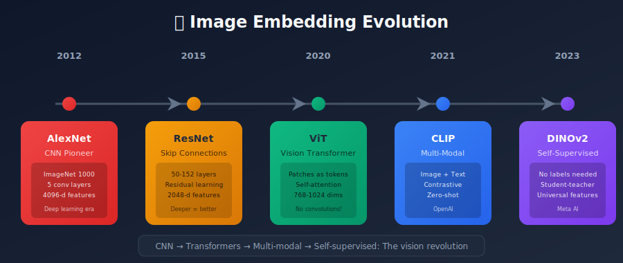
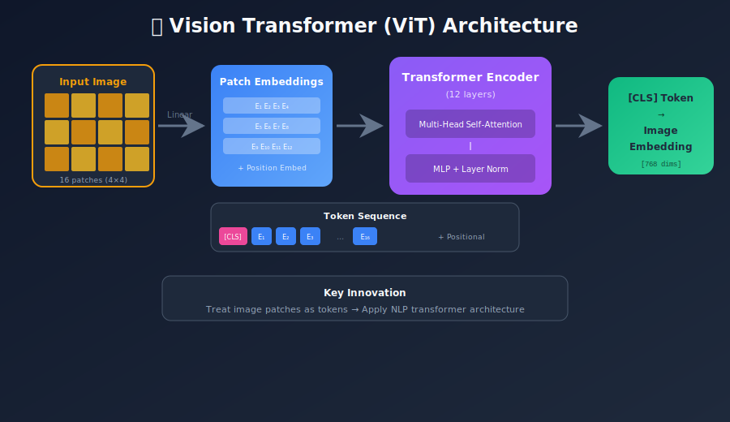
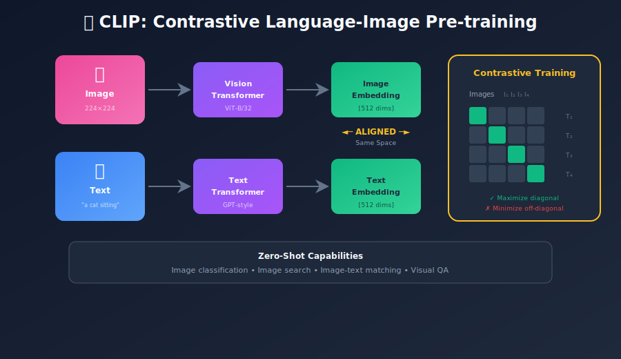
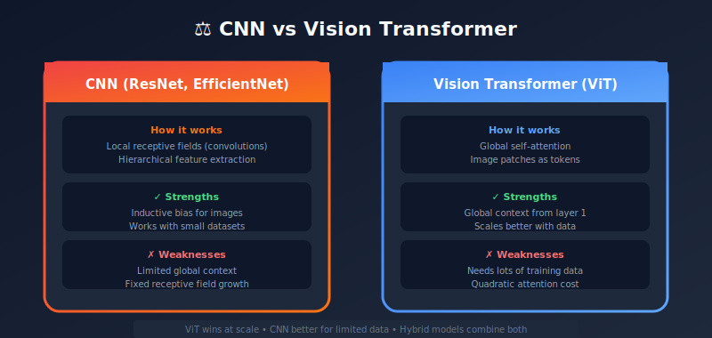

# Image Embeddings: Visual Representations in Vector Space

<p align="center">
  
  
</p>

---

## 🎯 Visual Overview







---

## Table of Contents
1. [Introduction](#introduction)
2. [CNN-Based Embeddings](#cnn-based-embeddings)
3. [Vision Transformers (ViT)](#vision-transformers-vit)
4. [Contrastive Learning: CLIP & Beyond](#contrastive-learning-clip-beyond)
5. [Self-Supervised Methods](#self-supervised-methods)
6. [Multi-Modal Embeddings](#multi-modal-embeddings)
7. [Fine-Tuning Image Embeddings](#fine-tuning-image-embeddings)
8. [Practical Implementation](#practical-implementation)
9. [Applications](#applications)
10. [Summary](#summary)

---

## Introduction

Image embeddings transform visual data into dense vector representations, enabling:
- **Visual Search**: Find similar images
- **Classification**: Categorize images
- **Clustering**: Group related visuals
- **Cross-Modal Search**: Text-to-image, image-to-text

### The Evolution

```
1990s: Hand-crafted features (SIFT, HOG)
2012: CNN revolution (AlexNet)
2015: Deep residual networks (ResNet)
2017: Attention mechanisms
2020: Vision Transformers (ViT)
2021: CLIP (multi-modal)
2023: DINOv2, EVA-CLIP
```

---

## CNN-Based Embeddings

### ResNet Feature Extraction

```python
import torch
import torchvision.models as models
import torchvision.transforms as transforms
from PIL import Image

class ResNetEmbedder:
    def __init__(self, model_name='resnet50', layer='avgpool'):

        # Load pre-trained model
        self.model = getattr(models, model_name)(pretrained=True)
        self.model.eval()

        # Remove classification head
        if layer == 'avgpool':
            self.model = torch.nn.Sequential(*list(self.model.children())[:-1])

        # Preprocessing
        self.transform = transforms.Compose([
            transforms.Resize(256),
            transforms.CenterCrop(224),
            transforms.ToTensor(),
            transforms.Normalize(
                mean=[0.485, 0.456, 0.406],
                std=[0.229, 0.224, 0.225]
            )
        ])

    def embed(self, image_path):
        image = Image.open(image_path).convert('RGB')
        tensor = self.transform(image).unsqueeze(0)

        with torch.no_grad():
            embedding = self.model(tensor)

        return embedding.squeeze().numpy()

# Usage
embedder = ResNetEmbedder()
embedding = embedder.embed("cat.jpg")  # [2048] dimensions
```

### Popular CNN Architectures

| Model | Dimensions | ImageNet Acc | Speed |
|-------|------------|--------------|-------|
| ResNet-50 | 2048 | 76.1% | Fast |
| ResNet-152 | 2048 | 78.3% | Medium |
| EfficientNet-B7 | 2560 | 84.3% | Slow |
| ConvNeXt-Large | 1536 | 87.5% | Medium |

---

## Vision Transformers (ViT)

### Architecture Overview

```
Image → Patch Embedding → Transformer Encoder → [CLS] Token → Embedding

Image (224×224×3)
      ↓
Split into patches (14×14 patches of 16×16)
      ↓
Linear projection to embeddings
      ↓
+ Positional embeddings + [CLS] token
      ↓
Transformer Encoder (12 layers)
      ↓
[CLS] token embedding → Final representation
```

### ViT Implementation

```python
from transformers import ViTModel, ViTImageProcessor
import torch
from PIL import Image

class ViTEmbedder:
    def __init__(self, model_name='google/vit-base-patch16-224'):
        self.processor = ViTImageProcessor.from_pretrained(model_name)
        self.model = ViTModel.from_pretrained(model_name)
        self.model.eval()

    def embed(self, image_path, pooling='cls'):
        image = Image.open(image_path).convert('RGB')
        inputs = self.processor(image, return_tensors='pt')

        with torch.no_grad():
            outputs = self.model(**inputs)

        if pooling == 'cls':
            return outputs.last_hidden_state[:, 0, :].squeeze().numpy()
        elif pooling == 'mean':
            return outputs.last_hidden_state.mean(dim=1).squeeze().numpy()

        return outputs.last_hidden_state.squeeze().numpy()

# Usage
embedder = ViTEmbedder()
embedding = embedder.embed("cat.jpg")  # [768] dimensions
```

---

## Contrastive Learning: CLIP & Beyond

### CLIP Architecture

CLIP (Contrastive Language-Image Pre-training) learns aligned text and image embeddings:



### Using CLIP

```python
import torch
from PIL import Image
from transformers import CLIPProcessor, CLIPModel

class CLIPEmbedder:
    def __init__(self, model_name='openai/clip-vit-base-patch32'):
        self.processor = CLIPProcessor.from_pretrained(model_name)
        self.model = CLIPModel.from_pretrained(model_name)
        self.model.eval()

    def embed_image(self, image_path):
        image = Image.open(image_path).convert('RGB')
        inputs = self.processor(images=image, return_tensors='pt')

        with torch.no_grad():
            embedding = self.model.get_image_features(**inputs)

        return embedding.squeeze().numpy()

    def embed_text(self, text):
        inputs = self.processor(text=text, return_tensors='pt', padding=True)

        with torch.no_grad():
            embedding = self.model.get_text_features(**inputs)

        return embedding.squeeze().numpy()

    def similarity(self, image_path, texts):
        image = Image.open(image_path).convert('RGB')
        inputs = self.processor(
            text=texts, images=image,
            return_tensors='pt', padding=True
        )

        with torch.no_grad():
            outputs = self.model(**inputs)

        logits = outputs.logits_per_image
        probs = logits.softmax(dim=1)

        return probs.squeeze().numpy()

# Usage
clip = CLIPEmbedder()

# Image-to-image search
img_emb = clip.embed_image("cat.jpg")

# Text-to-image search
text_emb = clip.embed_text("a photo of a cat")

# Zero-shot classification
labels = ["a cat", "a dog", "a car", "a building"]
probs = clip.similarity("mystery.jpg", labels)
print(dict(zip(labels, probs)))
```

### CLIP Variants

| Model | Image Encoder | Dim | Performance |
|-------|--------------|-----|-------------|
| CLIP ViT-B/32 | ViT-Base | 512 | Baseline |
| CLIP ViT-L/14 | ViT-Large | 768 | Better |
| OpenCLIP ViT-G/14 | ViT-Giant | 1024 | Excellent |
| EVA-CLIP | EVA | 1024 | State-of-art |

---

## Self-Supervised Methods

### DINOv2

```python
import torch
from transformers import AutoImageProcessor, AutoModel
from PIL import Image

class DINOv2Embedder:
    def __init__(self, model_name='facebook/dinov2-base'):
        self.processor = AutoImageProcessor.from_pretrained(model_name)
        self.model = AutoModel.from_pretrained(model_name)
        self.model.eval()

    def embed(self, image_path):
        image = Image.open(image_path).convert('RGB')
        inputs = self.processor(image, return_tensors='pt')

        with torch.no_grad():
            outputs = self.model(**inputs)

        return outputs.last_hidden_state[:, 0, :].squeeze().numpy()

# DINOv2 excels at dense visual tasks (segmentation, depth)
embedder = DINOv2Embedder()
embedding = embedder.embed("scene.jpg")
```

### MAE (Masked Autoencoders)

```python
from transformers import ViTMAEModel, ViTImageProcessor

# MAE learns by reconstructing masked patches
model = ViTMAEModel.from_pretrained('facebook/vit-mae-base')
processor = ViTImageProcessor.from_pretrained('facebook/vit-mae-base')
```

---

## Multi-Modal Embeddings

### Unified Vision-Language Space

```python
from sentence_transformers import SentenceTransformer
from PIL import Image

# CLIP-based model for both images and text
model = SentenceTransformer('clip-ViT-B-32')

# Encode images
img_embedding = model.encode(Image.open("cat.jpg"))

# Encode text
text_embedding = model.encode("a cute cat sitting")

# Same embedding space - can compare directly!
similarity = np.dot(img_embedding, text_embedding)
```

### Applications

1. **Text-to-Image Search**: Find images matching text query
2. **Image-to-Text Search**: Find captions/descriptions for images
3. **Zero-Shot Classification**: Classify without training examples
4. **Visual Question Answering**: Combine with LLMs

---

## Fine-Tuning Image Embeddings

### Contrastive Fine-Tuning

```python
import torch
import torch.nn as nn
import torch.nn.functional as F

class ContrastiveImageEncoder(nn.Module):
    def __init__(self, base_model, embed_dim=256):
        super().__init__()
        self.backbone = base_model

        # Get backbone output dimension
        with torch.no_grad():
            dummy = torch.randn(1, 3, 224, 224)
            backbone_dim = self.backbone(dummy).shape[-1]

        self.projector = nn.Sequential(
            nn.Linear(backbone_dim, 512),
            nn.ReLU(),
            nn.Linear(512, embed_dim)
        )

    def forward(self, x):
        features = self.backbone(x)
        embeddings = self.projector(features)
        return F.normalize(embeddings, dim=-1)

def contrastive_loss(embeddings, labels, temperature=0.07):
    """
    Supervised contrastive loss
    """
    similarity = embeddings @ embeddings.T / temperature

    # Create positive pair mask (same label)
    labels = labels.unsqueeze(1)
    mask = (labels == labels.T).float()

    # Remove diagonal
    mask = mask - torch.eye(len(labels), device=mask.device)

    # Compute loss
    exp_sim = torch.exp(similarity)
    log_prob = similarity - torch.log(exp_sim.sum(dim=1, keepdim=True))

    # Mean over positive pairs
    loss = -(mask * log_prob).sum() / mask.sum()

    return loss
```

---

## Practical Implementation

### Complete Image Search System

```python
import numpy as np
from pathlib import Path
import faiss
from PIL import Image
import torch
from transformers import CLIPProcessor, CLIPModel

class ImageSearchEngine:
    def __init__(self, model_name='openai/clip-vit-base-patch32'):
        self.processor = CLIPProcessor.from_pretrained(model_name)
        self.model = CLIPModel.from_pretrained(model_name)
        self.model.eval()

        self.index = None
        self.image_paths = []
        self.embed_dim = 512

    def _embed_image(self, image):
        inputs = self.processor(images=image, return_tensors='pt')
        with torch.no_grad():
            embedding = self.model.get_image_features(**inputs)
        return embedding.squeeze().numpy()

    def _embed_text(self, text):
        inputs = self.processor(text=text, return_tensors='pt')
        with torch.no_grad():
            embedding = self.model.get_text_features(**inputs)
        return embedding.squeeze().numpy()

    def build_index(self, image_folder, batch_size=32):
        """Index all images in folder"""
        image_folder = Path(image_folder)
        extensions = {'.jpg', '.jpeg', '.png', '.webp'}

        self.image_paths = [
            p for p in image_folder.rglob('*')
            if p.suffix.lower() in extensions
        ]

        embeddings = []
        for i in range(0, len(self.image_paths), batch_size):
            batch_paths = self.image_paths[i:i+batch_size]
            images = [Image.open(p).convert('RGB') for p in batch_paths]

            inputs = self.processor(images=images, return_tensors='pt')
            with torch.no_grad():
                batch_embeddings = self.model.get_image_features(**inputs)

            embeddings.append(batch_embeddings.numpy())

        embeddings = np.vstack(embeddings).astype('float32')

        # Normalize for cosine similarity
        faiss.normalize_L2(embeddings)

        # Build FAISS index
        self.index = faiss.IndexFlatIP(self.embed_dim)
        self.index.add(embeddings)

        return len(self.image_paths)

    def search_by_image(self, query_image_path, k=10):
        """Find similar images"""
        image = Image.open(query_image_path).convert('RGB')
        query = self._embed_image(image).astype('float32').reshape(1, -1)
        faiss.normalize_L2(query)

        scores, indices = self.index.search(query, k)

        return [
            {'path': str(self.image_paths[i]), 'score': float(s)}
            for i, s in zip(indices[0], scores[0])
        ]

    def search_by_text(self, query_text, k=10):
        """Find images matching text"""
        query = self._embed_text(query_text).astype('float32').reshape(1, -1)
        faiss.normalize_L2(query)

        scores, indices = self.index.search(query, k)

        return [
            {'path': str(self.image_paths[i]), 'score': float(s)}
            for i, s in zip(indices[0], scores[0])
        ]

# Usage
engine = ImageSearchEngine()
num_images = engine.build_index("/path/to/images")
print(f"Indexed {num_images} images")

# Search by image
results = engine.search_by_image("query.jpg", k=5)

# Search by text
results = engine.search_by_text("sunset over mountains", k=5)
```

---

## Applications

1. **E-commerce Visual Search**: Find products by photo
2. **Content Moderation**: Detect similar harmful content
3. **Reverse Image Search**: Find image origins
4. **Face Recognition**: Verify/identify faces
5. **Medical Imaging**: Find similar cases
6. **Creative Tools**: Style transfer, image generation

---

## Summary

### Key Takeaways

1. **CNNs to Transformers**: ViT now dominates, especially for large-scale
2. **CLIP revolutionized multimodal**: Aligned image-text space
3. **Self-supervised works**: DINOv2, MAE don't need labels
4. **Fine-tuning helps**: Domain-specific adaptation improves results
5. **Efficient search**: FAISS enables billion-scale similarity

### Model Selection Guide

| Use Case | Recommended Model |
|----------|------------------|
| General visual search | CLIP ViT-L/14 |
| Dense prediction | DINOv2 |
| Speed-critical | MobileNet or EfficientNet-B0 |
| Multi-modal | CLIP or OpenCLIP |
| Domain-specific | Fine-tuned ResNet/ViT |

---

*Previous: [← Sentence Embeddings](../03_sentence_document_embeddings/README.md) | Next: [Graph Embeddings →](../05_graph_embeddings/README.md)*

---

<div align="center">

**[⬆ Back to Top](#)** | **[📚 Main Repository](https://github.com/Gaurav14cs17/ml_system_design)**

Made with 💜 by [Gaurav14cs17](https://github.com/Gaurav14cs17)

</div>
