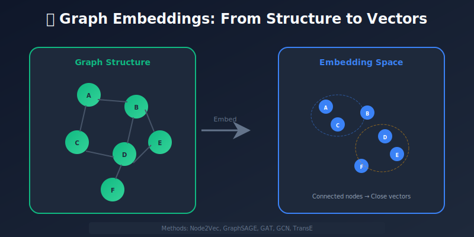
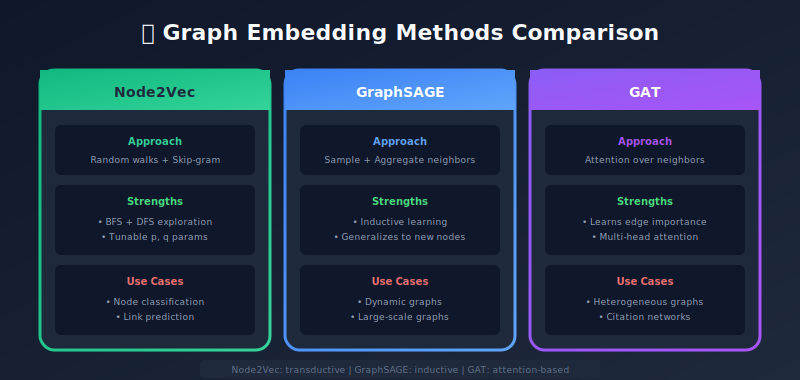
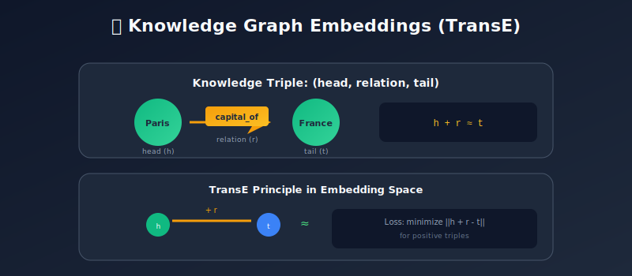
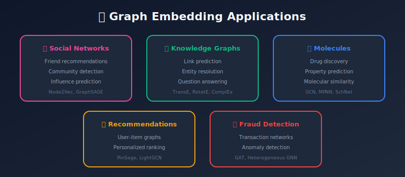

# Graph Embeddings: Learning Representations of Networks

<p align="center">
  
  
</p>

---

## 🎯 Visual Overview







---

## Table of Contents
1. [Introduction](#introduction)
2. [Graph Fundamentals](#graph-fundamentals)
3. [Random Walk Methods](#random-walk-methods)
4. [Graph Neural Networks](#graph-neural-networks)
5. [Knowledge Graph Embeddings](#knowledge-graph-embeddings)
6. [Heterogeneous Graph Embeddings](#heterogeneous-graph-embeddings)
7. [Temporal Graph Embeddings](#heterogeneous-graph-embeddings)
8. [Practical Implementation](#practical-implementation)
9. [Applications](#applications)
10. [Summary](#summary)

---

## Introduction

Graphs are everywhere:

- **Social Networks**: Users connected by friendships

- **Recommendation Systems**: Users, items, interactions

- **Molecular Structures**: Atoms and bonds

- **Knowledge Bases**: Entities and relationships

- **Citation Networks**: Papers citing other papers

Graph embeddings learn vector representations for nodes, edges, or entire graphs.



---

## Graph Fundamentals

### Key Concepts

```python
import networkx as nx
import numpy as np

# Create a graph
G = nx.Graph()
G.add_edges_from([
    ('A', 'B'), ('A', 'C'), ('B', 'C'),
    ('B', 'D'), ('C', 'D'), ('D', 'E')
])

# Node features (optional)
features = {
    'A': [1, 0, 0],
    'B': [0, 1, 0],
    'C': [0, 0, 1],
    'D': [1, 1, 0],
    'E': [0, 1, 1]
}

# Adjacency matrix
A = nx.adjacency_matrix(G).todense()

# Degree matrix
D = np.diag(np.array(A.sum(axis=1)).flatten())

# Laplacian: L = D - A
L = D - A

```

### What Makes a Good Graph Embedding?

1. **Structural similarity**: Connected nodes have similar embeddings
2. **Community preservation**: Clusters remain intact
3. **Role similarity**: Nodes with similar structural roles are close
4. **Scalability**: Works on large graphs

---

## Random Walk Methods

### DeepWalk

Uses random walks + Word2Vec approach:

```python
import numpy as np
from gensim.models import Word2Vec
import random

def random_walk(graph, start_node, walk_length):
    """Generate a random walk starting from a node"""
    walk = [start_node]
    current = start_node

    for _ in range(walk_length - 1):
        neighbors = list(graph.neighbors(current))
        if neighbors:
            current = random.choice(neighbors)
            walk.append(current)
        else:
            break

    return walk

def generate_walks(graph, num_walks, walk_length):
    """Generate multiple random walks for each node"""
    walks = []
    nodes = list(graph.nodes())

    for _ in range(num_walks):
        random.shuffle(nodes)
        for node in nodes:
            walk = random_walk(graph, node, walk_length)
            walks.append([str(n) for n in walk])

    return walks

def deepwalk(graph, embed_dim=128, walk_length=80,
             num_walks=10, window=10):
    """
    DeepWalk: Random walks + Word2Vec
    """
    walks = generate_walks(graph, num_walks, walk_length)

    model = Word2Vec(
        walks,
        vector_size=embed_dim,
        window=window,
        min_count=0,
        sg=1,  # Skip-gram
        workers=4,
        epochs=5
    )

    embeddings = {node: model.wv[node] for node in graph.nodes()}
    return embeddings

# Usage
embeddings = deepwalk(G)
print(embeddings['A'].shape)  # [128]

```

### Node2Vec

Extends DeepWalk with biased random walks:

```python
def node2vec_walk(graph, start, walk_length, p=1.0, q=1.0):
    """
    Biased random walk with parameters p and q
    - p: Return parameter (likelihood of returning to previous node)
    - q: In-out parameter (BFS vs DFS exploration)
    """
    walk = [start]

    while len(walk) < walk_length:
        current = walk[-1]
        neighbors = list(graph.neighbors(current))

        if not neighbors:
            break

        if len(walk) == 1:
            walk.append(random.choice(neighbors))
        else:
            prev = walk[-2]
            probabilities = []

            for neighbor in neighbors:
                if neighbor == prev:
                    # Return to previous node
                    probabilities.append(1.0 / p)
                elif graph.has_edge(neighbor, prev):
                    # Neighbor of previous (BFS-like)
                    probabilities.append(1.0)
                else:
                    # Far from previous (DFS-like)
                    probabilities.append(1.0 / q)

            probabilities = np.array(probabilities)
            probabilities /= probabilities.sum()

            next_node = np.random.choice(neighbors, p=probabilities)
            walk.append(next_node)

    return walk

# p=1, q=1: DeepWalk (uniform)
# p<1: Encourage backtracking (local exploration)
# q<1: Encourage going outward (global exploration)

```

### Using node2vec Library

```python
from node2vec import Node2Vec

# Generate embeddings
node2vec = Node2Vec(
    G,
    dimensions=64,
    walk_length=30,
    num_walks=200,
    p=1.0,
    q=0.5,  # Encourage exploration
    workers=4
)

model = node2vec.fit(window=10, min_count=1, batch_words=4)

# Get embedding
embedding = model.wv['A']

# Find similar nodes
similar_nodes = model.wv.most_similar('A', topn=5)

```

---

## Graph Neural Networks

### Message Passing Framework

GNNs work by aggregating information from neighbors:

```
h_v^(k+1) = UPDATE(h_v^(k), AGGREGATE({h_u^(k) : u ∈ N(v)}))

```

### Graph Convolutional Network (GCN)

```python
import torch
import torch.nn as nn
import torch.nn.functional as F

class GCNLayer(nn.Module):
    def __init__(self, in_features, out_features):
        super().__init__()
        self.linear = nn.Linear(in_features, out_features)

    def forward(self, x, adj):
        """
        x: Node features [num_nodes, in_features]
        adj: Normalized adjacency matrix [num_nodes, num_nodes]
        """
        # Aggregate neighbor features
        support = self.linear(x)
        output = torch.matmul(adj, support)
        return output

class GCN(nn.Module):
    def __init__(self, input_dim, hidden_dim, output_dim, num_layers=2):
        super().__init__()
        self.layers = nn.ModuleList()

        # Input layer
        self.layers.append(GCNLayer(input_dim, hidden_dim))

        # Hidden layers
        for _ in range(num_layers - 2):
            self.layers.append(GCNLayer(hidden_dim, hidden_dim))

        # Output layer
        self.layers.append(GCNLayer(hidden_dim, output_dim))

    def forward(self, x, adj):
        for i, layer in enumerate(self.layers[:-1]):
            x = layer(x, adj)
            x = F.relu(x)
            x = F.dropout(x, p=0.5, training=self.training)

        x = self.layers[-1](x, adj)
        return x

def normalize_adjacency(adj):
    """Symmetric normalization: D^(-1/2) A D^(-1/2)"""
    adj = adj + torch.eye(adj.size(0))  # Add self-loops
    degree = adj.sum(dim=1)
    d_inv_sqrt = torch.pow(degree, -0.5)
    d_inv_sqrt[torch.isinf(d_inv_sqrt)] = 0
    d_mat = torch.diag(d_inv_sqrt)
    return d_mat @ adj @ d_mat

```

### GraphSAGE (Sampling and Aggregating)

```python
class GraphSAGELayer(nn.Module):
    def __init__(self, in_features, out_features, aggregator='mean'):
        super().__init__()
        self.aggregator = aggregator
        self.linear = nn.Linear(in_features * 2, out_features)

    def forward(self, x, adj):
        # Aggregate neighbor features
        if self.aggregator == 'mean':
            neighbor_agg = torch.matmul(adj, x) / (adj.sum(dim=1, keepdim=True) + 1e-10)
        elif self.aggregator == 'max':
            neighbor_agg = scatter_max(x, adj)[0]

        # Concatenate self and neighbor features
        combined = torch.cat([x, neighbor_agg], dim=1)
        output = self.linear(combined)

        # Normalize
        output = F.normalize(output, p=2, dim=1)

        return output

```

### Graph Attention Network (GAT)

```python
class GATLayer(nn.Module):
    def __init__(self, in_features, out_features, num_heads=8, dropout=0.6):
        super().__init__()
        self.num_heads = num_heads
        self.out_per_head = out_features // num_heads

        self.W = nn.Linear(in_features, out_features, bias=False)
        self.a = nn.Parameter(torch.zeros(num_heads, 2 * self.out_per_head))
        self.leaky_relu = nn.LeakyReLU(0.2)
        self.dropout = nn.Dropout(dropout)

        nn.init.xavier_uniform_(self.a)

    def forward(self, x, adj):
        batch_size = x.size(0)

        # Linear transformation
        h = self.W(x).view(batch_size, self.num_heads, self.out_per_head)

        # Attention coefficients
        a_input = torch.cat([
            h.repeat(1, 1, batch_size).view(batch_size, batch_size, self.num_heads, self.out_per_head),
            h.repeat(batch_size, 1, 1).view(batch_size, batch_size, self.num_heads, self.out_per_head)
        ], dim=-1)

        e = self.leaky_relu((a_input * self.a).sum(dim=-1))

        # Mask non-edges
        mask = (adj == 0).unsqueeze(-1).expand_as(e)
        e.masked_fill_(mask, float('-inf'))

        # Softmax attention
        attention = F.softmax(e, dim=1)
        attention = self.dropout(attention)

        # Weighted aggregation
        output = torch.matmul(attention.transpose(1, 2), h)
        output = output.view(batch_size, -1)

        return output

```

---

## Knowledge Graph Embeddings

Knowledge graphs: (head, relation, tail) triples

- (Einstein, born_in, Germany)

- (Germany, capital, Berlin)

### TransE

```python
class TransE(nn.Module):
    """
    Scoring function: ||h + r - t||
    Idea: Tail should be close to head + relation
    """
    def __init__(self, num_entities, num_relations, embed_dim):
        super().__init__()
        self.entity_embeddings = nn.Embedding(num_entities, embed_dim)
        self.relation_embeddings = nn.Embedding(num_relations, embed_dim)

        # Initialize
        nn.init.xavier_uniform_(self.entity_embeddings.weight)
        nn.init.xavier_uniform_(self.relation_embeddings.weight)

    def forward(self, heads, relations, tails):
        h = self.entity_embeddings(heads)
        r = self.relation_embeddings(relations)
        t = self.entity_embeddings(tails)

        # Score: negative distance (higher = more likely)
        score = -torch.norm(h + r - t, p=2, dim=1)
        return score

    def loss(self, pos_heads, pos_relations, pos_tails,
             neg_heads, neg_relations, neg_tails, margin=1.0):
        pos_score = self.forward(pos_heads, pos_relations, pos_tails)
        neg_score = self.forward(neg_heads, neg_relations, neg_tails)

        # Margin ranking loss
        loss = torch.clamp(margin - pos_score + neg_score, min=0)
        return loss.mean()

```

### Other KG Embedding Methods

| Method | Scoring Function | Properties |
|--------|-----------------|------------|
| TransE | \|\|h + r - t\|\| | Simple, 1-to-1 relations |
| TransR | \|\|h·Wᵣ + r - t·Wᵣ\|\| | Relation-specific spaces |
| RotatE | \|\|h ∘ r - t\|\| | Rotation in complex space |
| ComplEx | Re(⟨h, r, t̄⟩) | Complex embeddings |
| DistMult | ⟨h, r, t⟩ | Symmetric relations |

---

## Heterogeneous Graph Embeddings

Graphs with multiple node/edge types.

### Metapath2Vec

```python
def metapath_walk(graph, start_node, metapath, walk_length):
    """
    Walk following a metapath pattern
    Example metapath: ['author', 'paper', 'author']
    """
    walk = [start_node]
    current = start_node
    path_index = 0

    for _ in range(walk_length - 1):
        current_type = metapath[path_index % len(metapath)]
        next_type = metapath[(path_index + 1) % len(metapath)]

        # Get neighbors of the next type
        neighbors = [
            n for n in graph.neighbors(current)
            if graph.nodes[n]['type'] == next_type
        ]

        if neighbors:
            current = random.choice(neighbors)
            walk.append(current)
            path_index += 1
        else:
            break

    return walk

```

### Heterogeneous Graph Transformer (HGT)

```python
class HGTLayer(nn.Module):
    def __init__(self, hidden_dim, num_heads, num_node_types, num_edge_types):
        super().__init__()
        self.num_heads = num_heads
        self.d_k = hidden_dim // num_heads

        # Type-specific transformations
        self.W_Q = nn.ModuleDict({
            str(t): nn.Linear(hidden_dim, hidden_dim)
            for t in range(num_node_types)
        })
        self.W_K = nn.ModuleDict({
            str(t): nn.Linear(hidden_dim, hidden_dim)
            for t in range(num_node_types)
        })
        self.W_V = nn.ModuleDict({
            str(t): nn.Linear(hidden_dim, hidden_dim)
            for t in range(num_node_types)
        })

        # Edge-type attention
        self.edge_attention = nn.ParameterDict({
            str(t): nn.Parameter(torch.zeros(num_heads, self.d_k, self.d_k))
            for t in range(num_edge_types)
        })

```

---

## Practical Implementation

### Using PyTorch Geometric

```python
import torch
from torch_geometric.nn import GCNConv, SAGEConv, GATConv
from torch_geometric.data import Data
import torch.nn.functional as F

class GNNEncoder(torch.nn.Module):
    def __init__(self, input_dim, hidden_dim, output_dim, model_type='gcn'):
        super().__init__()

        if model_type == 'gcn':
            self.conv1 = GCNConv(input_dim, hidden_dim)
            self.conv2 = GCNConv(hidden_dim, output_dim)
        elif model_type == 'sage':
            self.conv1 = SAGEConv(input_dim, hidden_dim)
            self.conv2 = SAGEConv(hidden_dim, output_dim)
        elif model_type == 'gat':
            self.conv1 = GATConv(input_dim, hidden_dim, heads=8)
            self.conv2 = GATConv(hidden_dim * 8, output_dim, heads=1)

    def forward(self, x, edge_index):
        x = self.conv1(x, edge_index)
        x = F.relu(x)
        x = F.dropout(x, p=0.5, training=self.training)
        x = self.conv2(x, edge_index)
        return x

# Create graph data
edge_index = torch.tensor([
    [0, 1, 1, 2, 2, 3],
    [1, 0, 2, 1, 3, 2]
], dtype=torch.long)

x = torch.randn(4, 16)  # 4 nodes, 16 features

data = Data(x=x, edge_index=edge_index)

# Train model
model = GNNEncoder(16, 32, 64, 'gcn')
embeddings = model(data.x, data.edge_index)

```

### Link Prediction Example

```python
import torch
from torch_geometric.utils import negative_sampling

def link_prediction_loss(pos_edge_index, node_embeddings):
    """
    Train embeddings for link prediction
    """
    # Positive edges
    pos_src = pos_edge_index[0]
    pos_dst = pos_edge_index[1]
    pos_score = (node_embeddings[pos_src] * node_embeddings[pos_dst]).sum(dim=1)

    # Negative sampling
    neg_edge_index = negative_sampling(
        edge_index=pos_edge_index,
        num_nodes=node_embeddings.size(0),
        num_neg_samples=pos_edge_index.size(1)
    )
    neg_src = neg_edge_index[0]
    neg_dst = neg_edge_index[1]
    neg_score = (node_embeddings[neg_src] * node_embeddings[neg_dst]).sum(dim=1)

    # Binary cross-entropy
    pos_loss = F.binary_cross_entropy_with_logits(pos_score, torch.ones_like(pos_score))
    neg_loss = F.binary_cross_entropy_with_logits(neg_score, torch.zeros_like(neg_score))

    return pos_loss + neg_loss

```

---

## Applications

1. **Social Networks**: Friend recommendations, community detection
2. **Drug Discovery**: Molecular property prediction
3. **Fraud Detection**: Identify suspicious patterns
4. **Recommendation Systems**: User-item interactions
5. **Knowledge Graphs**: Question answering, reasoning
6. **Citation Networks**: Paper similarity, impact prediction

---

## Summary

### Key Methods

| Method | Type | Best For |
|--------|------|----------|
| DeepWalk | Random Walk | Homogeneous graphs |
| Node2Vec | Random Walk | Flexible BFS/DFS |
| GCN | GNN | Semi-supervised learning |
| GraphSAGE | GNN | Inductive (new nodes) |
| GAT | GNN | Attention-based aggregation |
| TransE | KG Embedding | Knowledge graphs |

### Choosing the Right Approach

- **Small graphs + transductive**: Node2Vec

- **Large graphs + inductive**: GraphSAGE

- **Need attention**: GAT

- **Knowledge graphs**: TransE, RotatE

- **Heterogeneous**: Metapath2Vec, HGT

---

*Previous: [← Image Embeddings](../04_image_embeddings/README.md) | Next: [Vector Databases →](../06_vector_databases/README.md)*

---

<div align="center">

**[⬆ Back to Top](#)** | **[📚 Main Repository](https://github.com/Gaurav14cs17/ml_system_design)**

Made with 💜 by [Gaurav14cs17](https://github.com/Gaurav14cs17)

</div>
