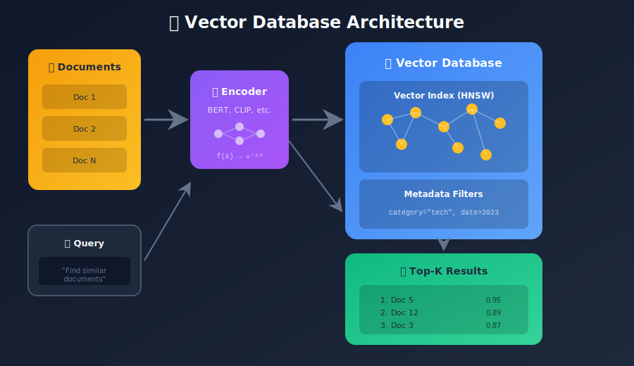
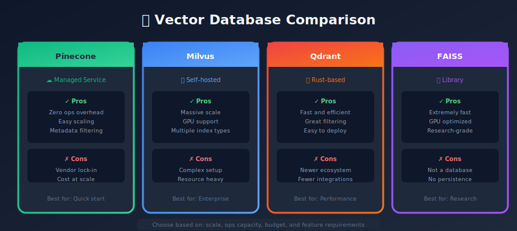

# Vector Databases: Storing and Querying Embeddings at Scale

<p align="center">
  
  
</p>

---

## 🎯 Visual Overview





---

## Table of Contents

1. [Introduction](#introduction)

2. [Why Vector Databases?](#why-vector-databases)

3. [Key Concepts](#key-concepts)

4. [Popular Vector Databases](#popular-vector-databases)

5. [Indexing Strategies](#indexing-strategies)

6. [Comparison of Solutions](#comparison-of-solutions)

7. [Practical Implementation](#practical-implementation)

8. [Production Considerations](#production-considerations)

9. [Summary](#summary)

---

## Introduction

Vector databases are specialized data stores designed for efficient storage, indexing, and retrieval of high-dimensional vector data (embeddings).

### Traditional DB vs Vector DB

```
Traditional Database:
  Query: SELECT * FROM users WHERE name = 'John'
  Result: Exact match

Vector Database:
  Query: Find 10 items most similar to vector [0.2, -0.4, 0.8, ...]
  Result: Approximate nearest neighbors ranked by similarity

```

---

## Why Vector Databases?

### The Scale Challenge

```
1M documents × 768 dimensions × 4 bytes = 3 GB
100M documents × 768 dimensions × 4 bytes = 300 GB
1B documents × 768 dimensions × 4 bytes = 3 TB

```

### Brute Force Limitations

```python
import numpy as np
import time

# 1M vectors, 768 dimensions
vectors = np.random.randn(1_000_000, 768).astype('float32')
query = np.random.randn(768).astype('float32')

start = time.time()
# Brute force: compute all similarities
similarities = vectors @ query
top_k = np.argsort(-similarities)[:10]
print(f"Brute force: {time.time() - start:.2f}s")

# Result: ~0.5-1s per query (too slow for production!)

```

### Vector DB Benefits

1. **Sub-millisecond queries** on billion-scale data

2. **Approximate nearest neighbor** (ANN) algorithms

3. **Hybrid search**: vectors + metadata filters

4. **Distributed**: horizontal scaling

5. **Persistence**: durability and recovery

---

## Key Concepts

### Distance Metrics

```python
import numpy as np

def euclidean_distance(a, b):
    """L2 distance - Pythagorean theorem"""
    return np.sqrt(np.sum((a - b) ** 2))

def cosine_similarity(a, b):
    """Angle between vectors (normalized dot product)"""
    return np.dot(a, b) / (np.linalg.norm(a) * np.linalg.norm(b))

def dot_product(a, b):
    """Raw dot product (for normalized vectors = cosine)"""
    return np.dot(a, b)

# When to use what:
# - Cosine: Text embeddings (magnitude doesn't matter)
# - Euclidean: Image embeddings, spatial data
# - Dot Product: When vectors are normalized

```

### Index Types

| Index | Description | Speed | Recall | Memory |
|-------|-------------|-------|--------|--------|
| Flat | Brute force | Slow | 100% | Low |
| IVF | Inverted file | Fast | 95-99% | Low |
| HNSW | Graph-based | Very fast | 99%+ | High |
| PQ | Quantization | Fast | 90-95% | Very low |

---

## Popular Vector Databases

### 1. Pinecone (Managed)

```python
import pinecone
from pinecone import Pinecone, ServerlessSpec

# Initialize
pc = Pinecone(api_key="YOUR_API_KEY")

# Create index
pc.create_index(
    name="embeddings",
    dimension=768,
    metric="cosine",
    spec=ServerlessSpec(cloud="aws", region="us-east-1")
)

index = pc.Index("embeddings")

# Upsert vectors
index.upsert(vectors=[
    {"id": "doc1", "values": [0.1, 0.2, ...], "metadata": {"category": "tech"}},
    {"id": "doc2", "values": [0.3, 0.4, ...], "metadata": {"category": "sports"}},
])

# Query
results = index.query(
    vector=[0.15, 0.25, ...],
    top_k=10,
    include_metadata=True,
    filter={"category": {"$eq": "tech"}}
)

```

### 2. Weaviate (Open Source)

```python
import weaviate
from weaviate.classes.config import Configure, Property, DataType

# Connect
client = weaviate.connect_to_local()

# Create collection
client.collections.create(
    name="Document",
    vectorizer_config=Configure.Vectorizer.none(),
    properties=[
        Property(name="content", data_type=DataType.TEXT),
        Property(name="category", data_type=DataType.TEXT),
    ]
)

collection = client.collections.get("Document")

# Insert with vectors
collection.data.insert(
    properties={"content": "Machine learning is...", "category": "tech"},
    vector=[0.1, 0.2, ...]
)

# Query
results = collection.query.near_vector(
    near_vector=[0.15, 0.25, ...],
    limit=10,
    filters=weaviate.classes.query.Filter.by_property("category").equal("tech")
)

```

### 3. Milvus (Open Source)

```python
from pymilvus import connections, Collection, FieldSchema, CollectionSchema, DataType

# Connect
connections.connect("default", host="localhost", port="19530")

# Define schema
fields = [
    FieldSchema(name="id", dtype=DataType.INT64, is_primary=True, auto_id=True),
    FieldSchema(name="embedding", dtype=DataType.FLOAT_VECTOR, dim=768),
    FieldSchema(name="category", dtype=DataType.VARCHAR, max_length=100),
]
schema = CollectionSchema(fields, "Document embeddings")

# Create collection
collection = Collection("documents", schema)

# Create index
collection.create_index(
    field_name="embedding",
    index_params={
        "metric_type": "COSINE",
        "index_type": "HNSW",
        "params": {"M": 16, "efConstruction": 200}
    }
)

# Insert
collection.insert([
    [[0.1, 0.2, ...]],  # embeddings
    ["tech"]  # categories
])

# Query
collection.load()
results = collection.search(
    data=[[0.15, 0.25, ...]],
    anns_field="embedding",
    param={"metric_type": "COSINE", "params": {"ef": 100}},
    limit=10,
    expr="category == 'tech'"
)

```

### 4. Qdrant (Open Source)

```python
from qdrant_client import QdrantClient
from qdrant_client.models import VectorParams, Distance, PointStruct, Filter, FieldCondition, MatchValue

# Connect
client = QdrantClient("localhost", port=6333)

# Create collection
client.create_collection(
    collection_name="documents",
    vectors_config=VectorParams(size=768, distance=Distance.COSINE)
)

# Insert
client.upsert(
    collection_name="documents",
    points=[
        PointStruct(
            id=1,
            vector=[0.1, 0.2, ...],
            payload={"category": "tech", "title": "ML Guide"}
        ),
    ]
)

# Query with filter
results = client.search(
    collection_name="documents",
    query_vector=[0.15, 0.25, ...],
    limit=10,
    query_filter=Filter(
        must=[FieldCondition(key="category", match=MatchValue(value="tech"))]
    )
)

```

### 5. ChromaDB (Lightweight)

```python
import chromadb
from chromadb.config import Settings

# Initialize
client = chromadb.Client(Settings(persist_directory="./chroma_db"))

# Create collection
collection = client.create_collection(
    name="documents",
    metadata={"hnsw:space": "cosine"}
)

# Add documents
collection.add(
    ids=["doc1", "doc2"],
    embeddings=[[0.1, 0.2, ...], [0.3, 0.4, ...]],
    metadatas=[{"category": "tech"}, {"category": "sports"}],
    documents=["ML is great", "Football match"]
)

# Query
results = collection.query(
    query_embeddings=[[0.15, 0.25, ...]],
    n_results=10,
    where={"category": "tech"}
)

```

### 6. FAISS (Library)

```python
import faiss
import numpy as np

# Create index
dimension = 768
index = faiss.IndexFlatL2(dimension)  # Brute force

# Or with IVF (faster for large datasets)
nlist = 100  # Number of clusters
quantizer = faiss.IndexFlatL2(dimension)
index = faiss.IndexIVFFlat(quantizer, dimension, nlist)

# Train (required for IVF)
training_vectors = np.random.randn(10000, dimension).astype('float32')
index.train(training_vectors)

# Add vectors
vectors = np.random.randn(100000, dimension).astype('float32')
index.add(vectors)

# Search
query = np.random.randn(1, dimension).astype('float32')
distances, indices = index.search(query, k=10)

# Save/Load
faiss.write_index(index, "my_index.faiss")
index = faiss.read_index("my_index.faiss")

```

---

## Indexing Strategies

### HNSW (Hierarchical Navigable Small World)

Best for: High recall, in-memory workloads

```python
# FAISS HNSW
index = faiss.IndexHNSWFlat(dimension, M=32)  # M = connections per node
index.hnsw.efConstruction = 200  # Build quality
index.hnsw.efSearch = 100  # Search quality

# Parameters:
# M: Connections per node (16-64, higher = better recall, more memory)
# efConstruction: Build-time quality (100-500)
# efSearch: Query-time quality (higher = better recall, slower)

```

### IVF (Inverted File Index)

Best for: Large datasets, moderate recall

```python
# FAISS IVF
nlist = 1000  # Number of clusters
index = faiss.IndexIVFFlat(quantizer, dimension, nlist)
index.nprobe = 50  # Clusters to search (higher = better recall)

# Rule of thumb:
# nlist ≈ sqrt(n_vectors)
# nprobe ≈ nlist / 10 to nlist / 5

```

### Product Quantization (PQ)

Best for: Memory-constrained, large scale

```python
# FAISS IVF+PQ
m = 8  # Number of subvectors
nlist = 1000
index = faiss.IndexIVFPQ(quantizer, dimension, nlist, m, 8)

# Memory reduction: ~32x (768*4 bytes → ~96 bytes per vector)
# Trade-off: Lower recall

```

---

## Comparison of Solutions

| Solution | Type | Scalability | Ease of Use | Features |
|----------|------|-------------|-------------|----------|
| Pinecone | Managed | Excellent | Very Easy | Full-featured |
| Weaviate | Self-hosted | Good | Easy | GraphQL, modules |
| Milvus | Self-hosted | Excellent | Medium | High performance |
| Qdrant | Self-hosted | Good | Easy | Rust, fast |
| ChromaDB | Embedded | Limited | Very Easy | Simple, local |
| FAISS | Library | Excellent | Medium | Most flexible |
| pgvector | Extension | Good | Easy | PostgreSQL |

### When to Use What

- **Prototype/Local**: ChromaDB

- **Production (managed)**: Pinecone

- **Production (self-hosted)**: Qdrant or Milvus

- **Existing PostgreSQL**: pgvector

- **Maximum control**: FAISS

- **GraphQL/Semantic**: Weaviate

---

## Practical Implementation

### Complete RAG System with Vector DB

```python
import chromadb
from sentence_transformers import SentenceTransformer
from typing import List, Dict

class RAGSystem:
    def __init__(self, collection_name: str = "documents"):
        self.encoder = SentenceTransformer('all-MiniLM-L6-v2')
        self.client = chromadb.PersistentClient(path="./rag_db")

        self.collection = self.client.get_or_create_collection(
            name=collection_name,
            metadata={"hnsw:space": "cosine"}
        )

    def add_documents(self, documents: List[str],
                      metadatas: List[Dict] = None,
                      ids: List[str] = None):
        """Add documents to the vector store"""
        if ids is None:
            ids = [f"doc_{i}" for i in range(len(documents))]

        embeddings = self.encoder.encode(documents).tolist()

        self.collection.add(
            ids=ids,
            embeddings=embeddings,
            documents=documents,
            metadatas=metadatas or [{}] * len(documents)
        )

        return len(documents)

    def search(self, query: str, n_results: int = 5,
               where: Dict = None) -> List[Dict]:
        """Search for similar documents"""
        query_embedding = self.encoder.encode([query]).tolist()

        results = self.collection.query(
            query_embeddings=query_embedding,
            n_results=n_results,
            where=where,
            include=["documents", "metadatas", "distances"]
        )

        return [
            {
                "id": results["ids"][0][i],
                "document": results["documents"][0][i],
                "metadata": results["metadatas"][0][i],
                "distance": results["distances"][0][i]
            }
            for i in range(len(results["ids"][0]))
        ]

    def delete(self, ids: List[str]):
        """Delete documents by ID"""
        self.collection.delete(ids=ids)

# Usage
rag = RAGSystem()

# Add documents
rag.add_documents(
    documents=[
        "Machine learning is a subset of artificial intelligence.",
        "Deep learning uses neural networks with many layers.",
        "Natural language processing deals with text and speech.",
    ],
    metadatas=[
        {"topic": "ml", "source": "textbook"},
        {"topic": "dl", "source": "paper"},
        {"topic": "nlp", "source": "course"},
    ]
)

# Search
results = rag.search("What is deep learning?", n_results=3)
for r in results:
    print(f"{r['distance']:.3f}: {r['document']}")

```

---

## Production Considerations

### 1. Index Management

```python
# Periodic reindexing for optimal performance
def reindex_collection(client, collection_name):
    collection = client.get_collection(collection_name)

    # Export data
    all_data = collection.get(include=["embeddings", "documents", "metadatas"])

    # Recreate with new settings
    client.delete_collection(collection_name)
    new_collection = client.create_collection(
        name=collection_name,
        metadata={"hnsw:M": 32, "hnsw:construction_ef": 200}
    )

    # Re-add data
    new_collection.add(
        ids=all_data["ids"],
        embeddings=all_data["embeddings"],
        documents=all_data["documents"],
        metadatas=all_data["metadatas"]
    )

```

### 2. Monitoring

```python
# Key metrics to track
metrics = {
    "query_latency_p99": "< 100ms",
    "recall_at_10": "> 0.95",
    "index_size_gb": "monitor growth",
    "qps": "queries per second",
}

```

### 3. Scaling Strategies

- **Sharding**: Split data across multiple indices

- **Replication**: Multiple copies for read scaling

- **Tiered storage**: Hot/cold data separation

- **Caching**: Cache frequent queries

---

## Summary

### Key Takeaways

1. **Vector DBs are essential** for embedding search at scale

2. **HNSW** provides best recall-speed tradeoff

3. **Choose based on scale**: ChromaDB → Qdrant → Milvus

4. **Metadata filtering** enables hybrid search

5. **Monitor performance** and tune index parameters

### Quick Selection Guide

| Scale | Managed | Self-Hosted |
|-------|---------|-------------|
| < 100K vectors | ChromaDB | ChromaDB |
| 100K - 10M | Pinecone | Qdrant |
| 10M - 1B | Pinecone | Milvus |
| > 1B | Pinecone Enterprise | Milvus Cluster |

---

*Previous: [← Graph Embeddings](../05_graph_embeddings/README.md) | Next: [Similarity Search & ANN →](../07_similarity_search_ann/README.md)*

---

<div align="center">

**[⬆ Back to Top](#)** | **[📚 Main Repository](https://github.com/Gaurav14cs17/ml_system_design)**

Made with 💜 by [Gaurav14cs17](https://github.com/Gaurav14cs17)

</div>
