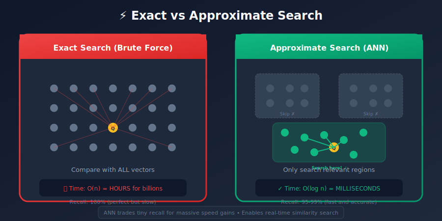
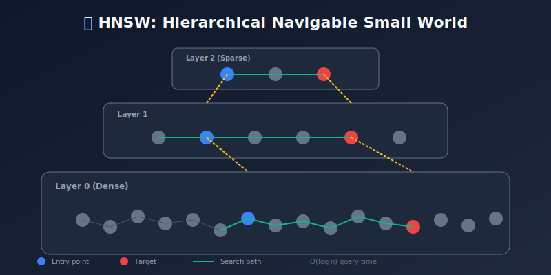
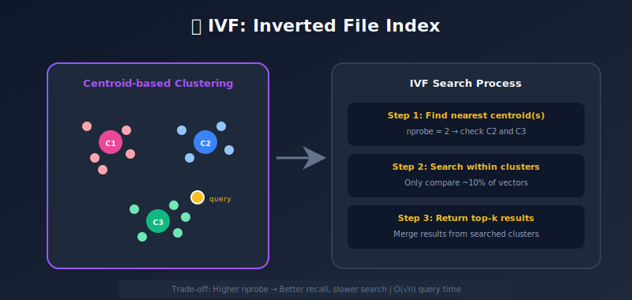
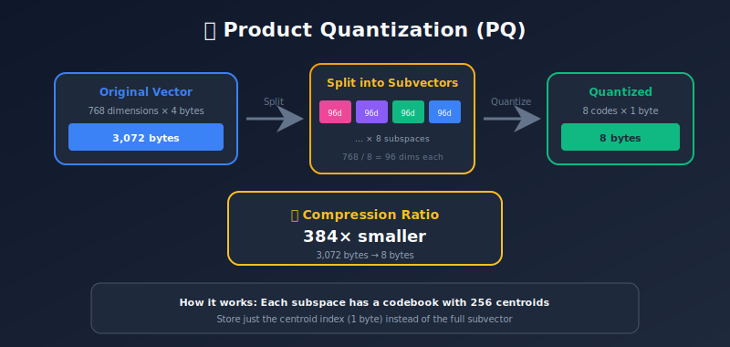

# Similarity Search & Approximate Nearest Neighbors (ANN)

<p align="center">
  
  
</p>

---

## 🎯 Visual Overview







---

## Table of Contents
1. [Introduction](#introduction)
2. [Exact vs Approximate Search](#exact-vs-approximate-search)
3. [Distance Metrics](#distance-metrics)
4. [ANN Algorithms](#ann-algorithms)
5. [HNSW Deep Dive](#hnsw-deep-dive)
6. [Product Quantization](#product-quantization)
7. [Benchmarking and Tuning](#benchmarking-and-tuning)
8. [Practical Implementation](#practical-implementation)
9. [Summary](#summary)

---

## Introduction

Similarity search finds items closest to a query in embedding space. At scale, exact search is too slow—we need approximations.

```
Query: Find 10 most similar items to vector Q
Dataset: 1 billion vectors

Exact search: O(n × d) = 1B × 768 comparisons ≈ hours
ANN search: O(log n × d) ≈ milliseconds
```

---

## Exact vs Approximate Search

### Exact Search (Brute Force)

```python
import numpy as np

def exact_search(query, database, k=10):
    """
    O(n × d) complexity
    """

    # Compute all distances
    distances = np.linalg.norm(database - query, axis=1)

    # Get top-k
    indices = np.argsort(distances)[:k]

    return indices, distances[indices]

# For 1M vectors: ~500ms per query
```

### Approximate Search

Trade perfect accuracy for speed:
- **Recall@k**: What fraction of true top-k are returned?
- **Latency**: Query time
- **Memory**: Index size

```
Target: 95-99% recall with 10-100x speedup
```

---

## Distance Metrics

### Euclidean (L2) Distance

```python
def euclidean_distance(a, b):
    return np.sqrt(np.sum((a - b) ** 2))

# Properties:
# - Measures absolute difference
# - Affected by vector magnitude
# - Use for: spatial data, unnormalized embeddings
```

### Cosine Similarity

```python
def cosine_similarity(a, b):
    return np.dot(a, b) / (np.linalg.norm(a) * np.linalg.norm(b))

def cosine_distance(a, b):
    return 1 - cosine_similarity(a, b)

# Properties:
# - Measures angular difference
# - Ignores magnitude (direction only)
# - Use for: text embeddings, normalized vectors
```

### Inner Product (Dot Product)

```python
def inner_product(a, b):
    return np.dot(a, b)

# Properties:
# - For normalized vectors: equivalent to cosine
# - Faster to compute (no normalization)
# - Use for: normalized embeddings, MIPS problems
```

### Converting Between Metrics

```python

# If vectors are L2-normalized (||v|| = 1):
# cosine_similarity(a, b) = dot(a, b)
# euclidean_distance(a, b)² = 2 - 2 * dot(a, b)

def normalize_vectors(vectors):
    norms = np.linalg.norm(vectors, axis=1, keepdims=True)
    return vectors / norms
```

---

## ANN Algorithms

### 1. Tree-Based: KD-Tree

```python
from sklearn.neighbors import KDTree

# Build tree
tree = KDTree(vectors, leaf_size=40)

# Query
distances, indices = tree.query(query.reshape(1, -1), k=10)

# Limitations:
# - Curse of dimensionality (poor for d > 20)
# - Not suitable for high-dimensional embeddings
```

### 2. Locality Sensitive Hashing (LSH)

```python
import numpy as np

class RandomProjectionLSH:
    def __init__(self, dim, num_tables=10, hash_size=10):
        self.num_tables = num_tables
        self.hash_size = hash_size

        # Random hyperplanes
        self.projections = [
            np.random.randn(hash_size, dim)
            for _ in range(num_tables)
        ]

        self.tables = [{} for _ in range(num_tables)]

    def _hash(self, vector, table_idx):
        projection = self.projections[table_idx]
        return tuple((projection @ vector > 0).astype(int))

    def add(self, idx, vector):
        for t in range(self.num_tables):
            h = self._hash(vector, t)
            if h not in self.tables[t]:
                self.tables[t][h] = []
            self.tables[t][h].append(idx)

    def query(self, vector, vectors_db):
        candidates = set()
        for t in range(self.num_tables):
            h = self._hash(vector, t)
            if h in self.tables[t]:
                candidates.update(self.tables[t][h])

        # Re-rank candidates exactly
        if not candidates:
            return []

        candidate_list = list(candidates)
        distances = [
            np.linalg.norm(vectors_db[i] - vector)
            for i in candidate_list
        ]

        sorted_indices = np.argsort(distances)
        return [candidate_list[i] for i in sorted_indices]
```

### 3. IVF (Inverted File Index)

```python
import faiss
import numpy as np

class IVFIndex:
    def __init__(self, dim, nlist=100):
        """
        nlist: number of Voronoi cells (clusters)
        """
        self.dim = dim
        self.nlist = nlist

        # Coarse quantizer
        self.quantizer = faiss.IndexFlatL2(dim)
        self.index = faiss.IndexIVFFlat(self.quantizer, dim, nlist)

    def train(self, vectors):
        """Train on sample of vectors"""
        self.index.train(vectors.astype('float32'))

    def add(self, vectors):
        """Add vectors to index"""
        self.index.add(vectors.astype('float32'))

    def search(self, query, k=10, nprobe=10):
        """
        nprobe: number of clusters to search
        Higher nprobe = better recall, slower
        """
        self.index.nprobe = nprobe
        distances, indices = self.index.search(
            query.reshape(1, -1).astype('float32'), k
        )
        return indices[0], distances[0]

# Usage
index = IVFIndex(dim=768, nlist=100)
index.train(training_vectors)
index.add(all_vectors)
indices, distances = index.search(query, k=10, nprobe=20)
```

### 4. HNSW (Hierarchical Navigable Small World)

See detailed section below.

---

## HNSW Deep Dive

### How HNSW Works

HNSW builds a multi-layer graph:
- **Layer 0**: Contains all points, densely connected
- **Higher layers**: Progressively fewer points, long-range connections
- **Search**: Start at top layer, greedily descend



### HNSW Parameters

```python
import hnswlib
import numpy as np

class HNSWIndex:
    def __init__(self, dim, max_elements, M=16, ef_construction=200):
        """
        Parameters:
        - M: Max connections per node (16-64)
          Higher = better recall, more memory
        - ef_construction: Build-time beam width (100-500)
          Higher = better graph quality, slower build
        """
        self.index = hnswlib.Index(space='cosine', dim=dim)
        self.index.init_index(
            max_elements=max_elements,
            M=M,
            ef_construction=ef_construction
        )

    def add(self, vectors, ids=None):
        if ids is None:
            ids = np.arange(len(vectors))
        self.index.add_items(vectors, ids)

    def search(self, query, k=10, ef=100):
        """
        ef: Query-time beam width (k to 1000)
        Higher = better recall, slower query
        """
        self.index.set_ef(ef)
        labels, distances = self.index.knn_query(query, k=k)
        return labels, distances

# Tuning guidelines:
# M=16: Good default, ~64 bytes/vector overhead
# M=32: Better recall, ~128 bytes/vector overhead
# ef_construction: 2-10x final ef value
# ef (query): Start at 2*k, increase for better recall
```

### HNSW Memory Estimation

```python
def estimate_hnsw_memory(num_vectors, dim, M=16):
    """
    Estimate memory usage for HNSW index
    """

    # Vector data
    vector_bytes = num_vectors * dim * 4  # float32

    # Graph structure (approximate)
    # Each node has up to M neighbors at each layer
    # Average ~1.5 layers per node
    graph_bytes = num_vectors * M * 4 * 1.5  # int32 neighbor IDs

    total_bytes = vector_bytes + graph_bytes

    return {
        'vectors_gb': vector_bytes / 1e9,
        'graph_gb': graph_bytes / 1e9,
        'total_gb': total_bytes / 1e9
    }

# Example: 10M vectors, 768 dim, M=16
# Vectors: 30.7 GB, Graph: 1.0 GB, Total: ~32 GB
```

---

## Product Quantization

PQ compresses vectors for memory efficiency.

### How PQ Works

```
Original vector: [768 dimensions] → 3072 bytes (float32)

Split into subvectors: [96d] [96d] [96d] [96d] [96d] [96d] [96d] [96d]
                         ↓     ↓     ↓     ↓     ↓     ↓     ↓     ↓
Quantize each to:       c1    c2    c3    c4    c5    c6    c7    c8
                         ↓     ↓     ↓     ↓     ↓     ↓     ↓     ↓
Store as codes:        [8 bytes total] → 32x compression!

Reconstruction: Look up centroid for each code, concatenate
```

### FAISS PQ Implementation

```python
import faiss
import numpy as np

class PQIndex:
    def __init__(self, dim, m=8, nbits=8):
        """
        Parameters:
        - m: Number of subquantizers (how many chunks)
        - nbits: Bits per subquantizer (8 = 256 centroids)
        """
        self.dim = dim
        self.m = m

        # bytes_per_vector = m * nbits / 8
        self.index = faiss.IndexPQ(dim, m, nbits)

    def train(self, vectors):
        """Train codebook on sample"""
        self.index.train(vectors.astype('float32'))

    def add(self, vectors):
        self.index.add(vectors.astype('float32'))

    def search(self, query, k=10):
        distances, indices = self.index.search(
            query.reshape(1, -1).astype('float32'), k
        )
        return indices[0], distances[0]

# Memory comparison:
# Original: 768 * 4 = 3072 bytes/vector
# PQ (m=8): 8 bytes/vector
# Compression: 384x
```

### IVF + PQ (Best of Both)

```python
import faiss

def create_ivf_pq_index(dim, nlist=1000, m=8, nbits=8):
    """
    Combine IVF clustering with PQ compression
    """
    quantizer = faiss.IndexFlatL2(dim)
    index = faiss.IndexIVFPQ(quantizer, dim, nlist, m, nbits)
    return index

# Usage
index = create_ivf_pq_index(768, nlist=1000, m=64, nbits=8)
index.train(training_data)
index.add(all_data)

index.nprobe = 50  # Clusters to search
distances, indices = index.search(query, k=10)
```

---

## Benchmarking and Tuning

### Key Metrics

```python
import time
import numpy as np

def benchmark_index(index, queries, ground_truth, k=10):
    """
    Benchmark ANN index performance
    """

    # Latency
    start = time.time()
    results = [index.search(q, k=k) for q in queries]
    latency = (time.time() - start) / len(queries) * 1000  # ms

    # Recall
    recalls = []
    for i, (indices, _) in enumerate(results):
        true_neighbors = set(ground_truth[i][:k])
        found_neighbors = set(indices[:k])
        recall = len(true_neighbors & found_neighbors) / k
        recalls.append(recall)

    return {
        'latency_ms': latency,
        'recall@k': np.mean(recalls),
        'qps': 1000 / latency
    }
```

### Recall-Latency Tradeoff

```python
def tune_hnsw(index, queries, ground_truth, k=10):
    """
    Find optimal ef parameter
    """
    results = []

    for ef in [16, 32, 64, 128, 256, 512]:
        index.set_ef(ef)
        metrics = benchmark_index(index, queries, ground_truth, k)
        metrics['ef'] = ef
        results.append(metrics)

        print(f"ef={ef}: recall={metrics['recall@k']:.3f}, "
              f"latency={metrics['latency_ms']:.2f}ms")

    return results

# Typical results:
# ef=16:  recall=0.85, latency=0.5ms
# ef=64:  recall=0.95, latency=1.5ms
# ef=256: recall=0.99, latency=5.0ms
```

---

## Practical Implementation

### Production-Ready ANN System

```python
import faiss
import numpy as np
from typing import List, Tuple
import os

class ProductionANNIndex:
    def __init__(self, dim: int, index_type: str = 'hnsw',
                 use_gpu: bool = False):
        self.dim = dim
        self.index_type = index_type
        self.use_gpu = use_gpu
        self.index = None
        self.id_map = {}

    def build_index(self, vectors: np.ndarray,
                    ids: List[str] = None,
                    nlist: int = None):
        """Build index from vectors"""
        n = len(vectors)
        vectors = vectors.astype('float32')

        # Normalize for cosine similarity
        faiss.normalize_L2(vectors)

        if self.index_type == 'flat':
            self.index = faiss.IndexFlatIP(self.dim)

        elif self.index_type == 'hnsw':
            self.index = faiss.IndexHNSWFlat(self.dim, 32)
            self.index.hnsw.efConstruction = 200

        elif self.index_type == 'ivf':
            nlist = nlist or int(np.sqrt(n))
            quantizer = faiss.IndexFlatIP(self.dim)
            self.index = faiss.IndexIVFFlat(
                quantizer, self.dim, nlist, faiss.METRIC_INNER_PRODUCT
            )
            self.index.train(vectors)

        elif self.index_type == 'ivfpq':
            nlist = nlist or int(np.sqrt(n))
            m = min(64, self.dim // 4)
            quantizer = faiss.IndexFlatIP(self.dim)
            self.index = faiss.IndexIVFPQ(
                quantizer, self.dim, nlist, m, 8
            )
            self.index.train(vectors)

        # GPU acceleration
        if self.use_gpu:
            res = faiss.StandardGpuResources()
            self.index = faiss.index_cpu_to_gpu(res, 0, self.index)

        self.index.add(vectors)

        # ID mapping
        if ids:
            self.id_map = {i: id_ for i, id_ in enumerate(ids)}

        return self

    def search(self, query: np.ndarray, k: int = 10,
               ef: int = 100, nprobe: int = 50) -> List[Tuple[str, float]]:
        """Search for nearest neighbors"""
        query = query.astype('float32').reshape(1, -1)
        faiss.normalize_L2(query)

        # Set search parameters
        if hasattr(self.index, 'hnsw'):
            self.index.hnsw.efSearch = ef
        if hasattr(self.index, 'nprobe'):
            self.index.nprobe = nprobe

        scores, indices = self.index.search(query, k)

        results = []
        for idx, score in zip(indices[0], scores[0]):
            if idx >= 0:
                id_ = self.id_map.get(idx, str(idx))
                results.append((id_, float(score)))

        return results

    def save(self, path: str):
        """Save index to disk"""
        if self.use_gpu:
            index_cpu = faiss.index_gpu_to_cpu(self.index)
            faiss.write_index(index_cpu, path)
        else:
            faiss.write_index(self.index, path)

    def load(self, path: str):
        """Load index from disk"""
        self.index = faiss.read_index(path)
        if self.use_gpu:
            res = faiss.StandardGpuResources()
            self.index = faiss.index_cpu_to_gpu(res, 0, self.index)
        return self

# Usage
index = ProductionANNIndex(dim=768, index_type='hnsw')
index.build_index(vectors, ids=['doc1', 'doc2', ...])

results = index.search(query_vector, k=10)
for doc_id, score in results:
    print(f"{doc_id}: {score:.3f}")

index.save("my_index.faiss")
```

---

## Summary

### Algorithm Comparison

| Algorithm | Build Time | Query Time | Memory | Recall |
|-----------|------------|------------|--------|--------|
| Flat | O(1) | O(n) | 1x | 100% |
| IVF | O(n) | O(√n) | 1x | 95%+ |
| HNSW | O(n log n) | O(log n) | 1.5x | 99%+ |
| PQ | O(n) | O(n) | 0.03x | 90%+ |
| IVF+PQ | O(n) | O(√n) | 0.03x | 90%+ |

### Selection Guide

- **< 100K vectors**: Flat index (exact)
- **100K - 10M**: HNSW (best quality)
- **10M - 1B**: IVF + HNSW or IVF + PQ
- **Memory constrained**: PQ or IVF+PQ
- **GPU available**: Flat or IVF (FAISS GPU)

### Key Tuning Parameters

| Index | Parameter | Effect |
|-------|-----------|--------|
| HNSW | M | Connections (16-64) |
| HNSW | ef | Search quality (k to 500) |
| IVF | nlist | Clusters (√n typical) |
| IVF | nprobe | Clusters searched (1-100) |
| PQ | m | Subquantizers (8-64) |

---

*Previous: [← Vector Databases](../06_vector_databases/README.md) | Next: [Embedding Model Training →](../08_embedding_model_training/README.md)*

---

<div align="center">

**[⬆ Back to Top](#)** | **[📚 Main Repository](https://github.com/Gaurav14cs17/ml_system_design)**

Made with 💜 by [Gaurav14cs17](https://github.com/Gaurav14cs17)

</div>
