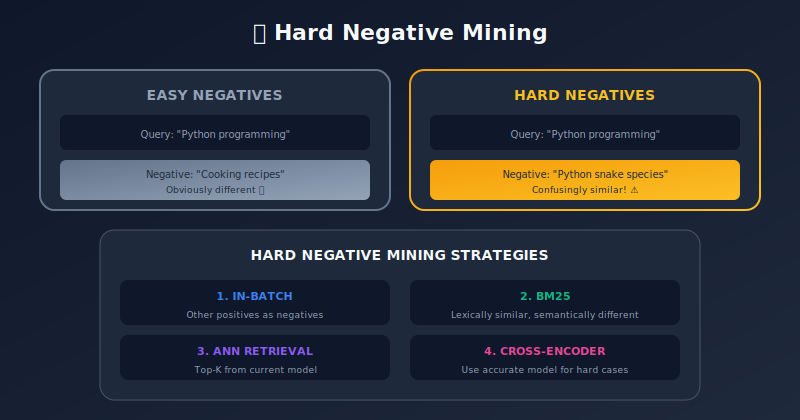

# Embedding Model Training: From Data to Vectors

<p align="center">
  
  
</p>

---

## 🎯 Visual Overview




---

## Table of Contents
1. [Introduction](#introduction)
2. [Training Objectives](#training-objectives)
3. [Data Preparation](#data-preparation)
4. [Contrastive Learning](#contrastive-learning)
5. [Hard Negative Mining](#hard-negative-mining)
6. [Multi-Task Training](#multi-task-training)
7. [Distillation and Compression](#distillation-and-compression)
8. [Practical Training Pipeline](#practical-training-pipeline)
9. [Summary](#summary)

---

## Introduction

Training embedding models involves learning representations where similar items are close and dissimilar items are far apart in vector space.

### Key Questions

1. **What makes items similar?** (Training signal)
2. **How do we push similar items together?** (Loss function)
3. **How do we find dissimilar items?** (Negative sampling)
4. **How do we scale training?** (Distributed, efficient)

---

## Training Objectives

### 1. Classification-Based

Train as classifier, use hidden layers as embeddings:

```python
import torch
import torch.nn as nn

class ClassificationEmbedder(nn.Module):
    def __init__(self, backbone, num_classes, embed_dim=256):
        super().__init__()
        self.backbone = backbone
        self.projector = nn.Linear(backbone.output_dim, embed_dim)
        self.classifier = nn.Linear(embed_dim, num_classes)

    def forward(self, x, return_embedding=False):
        features = self.backbone(x)
        embedding = self.projector(features)

        if return_embedding:
            return embedding

        logits = self.classifier(embedding)
        return logits

# Training
criterion = nn.CrossEntropyLoss()
loss = criterion(model(x), labels)
```

### 2. Metric Learning

Directly optimize embedding distances:

```python
def triplet_loss(anchor, positive, negative, margin=0.3):
    """
    anchor closer to positive than negative by margin
    """
    pos_dist = torch.pairwise_distance(anchor, positive)
    neg_dist = torch.pairwise_distance(anchor, negative)
    loss = torch.clamp(pos_dist - neg_dist + margin, min=0)
    return loss.mean()

def contrastive_loss(embed1, embed2, label, margin=1.0):
    """
    label=1: similar (pull together)
    label=0: dissimilar (push apart)
    """
    dist = torch.pairwise_distance(embed1, embed2)
    loss = label * dist.pow(2) + (1 - label) * torch.clamp(margin - dist, min=0).pow(2)
    return loss.mean()
```

### 3. Self-Supervised

Learn from data structure without labels:

```python
def simclr_loss(z1, z2, temperature=0.5):
    """
    z1, z2: augmented views of same samples
    """
    batch_size = z1.shape[0]

    # Normalize
    z1 = F.normalize(z1, dim=1)
    z2 = F.normalize(z2, dim=1)

    # Concatenate
    z = torch.cat([z1, z2], dim=0)

    # Similarity matrix
    sim = torch.mm(z, z.T) / temperature

    # Mask out self-similarity
    mask = torch.eye(2 * batch_size, device=z.device).bool()
    sim.masked_fill_(mask, float('-inf'))

    # Labels: positive pairs are at offset batch_size
    labels = torch.cat([
        torch.arange(batch_size, 2*batch_size),
        torch.arange(batch_size)
    ]).to(z.device)

    return F.cross_entropy(sim, labels)
```

---

## Data Preparation

### Text Embedding Data

```python
from dataclasses import dataclass
from typing import List, Tuple
import random

@dataclass
class TrainingExample:
    anchor: str
    positive: str
    negatives: List[str]

def prepare_nli_data(nli_dataset):
    """
    Convert NLI to embedding training data
    Entailment → positive pair
    Contradiction → hard negative
    """
    examples = []

    for item in nli_dataset:
        premise = item['premise']
        hypothesis = item['hypothesis']
        label = item['label']

        if label == 'entailment':
            # Positive pair
            examples.append(TrainingExample(
                anchor=premise,
                positive=hypothesis,
                negatives=[]
            ))

    return examples

def prepare_retrieval_data(query_doc_pairs):
    """
    Convert search logs to training data
    """
    examples = []
    all_docs = [doc for _, doc in query_doc_pairs]

    for query, positive_doc in query_doc_pairs:
        # Random negatives
        negatives = random.sample(
            [d for d in all_docs if d != positive_doc],
            k=10
        )

        examples.append(TrainingExample(
            anchor=query,
            positive=positive_doc,
            negatives=negatives
        ))

    return examples
```

### Image Embedding Data

```python
import torchvision.transforms as T
from torch.utils.data import Dataset

class ContrastiveImageDataset(Dataset):
    def __init__(self, image_paths, labels=None):
        self.image_paths = image_paths
        self.labels = labels

        # Augmentation for contrastive learning
        self.augment = T.Compose([
            T.RandomResizedCrop(224, scale=(0.2, 1.0)),
            T.RandomHorizontalFlip(),
            T.ColorJitter(0.4, 0.4, 0.4, 0.1),
            T.RandomGrayscale(p=0.2),
            T.ToTensor(),
            T.Normalize([0.485, 0.456, 0.406], [0.229, 0.224, 0.225])
        ])

    def __len__(self):
        return len(self.image_paths)

    def __getitem__(self, idx):
        image = Image.open(self.image_paths[idx]).convert('RGB')

        # Two augmented views
        view1 = self.augment(image)
        view2 = self.augment(image)

        if self.labels is not None:
            return view1, view2, self.labels[idx]
        return view1, view2
```

---

## Contrastive Learning

### InfoNCE Loss

```python
def info_nce_loss(query, positive, negatives, temperature=0.07):
    """
    InfoNCE: Noise Contrastive Estimation

    query: [batch, dim]
    positive: [batch, dim]
    negatives: [batch, num_neg, dim] or [num_neg, dim] (shared)
    """
    batch_size = query.shape[0]

    # Normalize embeddings
    query = F.normalize(query, dim=1)
    positive = F.normalize(positive, dim=1)

    # Positive similarity
    pos_sim = torch.sum(query * positive, dim=1, keepdim=True)  # [batch, 1]

    # Negative similarities
    if negatives.dim() == 2:
        # Shared negatives
        negatives = F.normalize(negatives, dim=1)
        neg_sim = torch.mm(query, negatives.T)  # [batch, num_neg]
    else:
        # Per-sample negatives
        negatives = F.normalize(negatives, dim=2)
        neg_sim = torch.bmm(query.unsqueeze(1), negatives.transpose(1, 2))
        neg_sim = neg_sim.squeeze(1)  # [batch, num_neg]

    # Concatenate and compute loss
    logits = torch.cat([pos_sim, neg_sim], dim=1) / temperature
    labels = torch.zeros(batch_size, dtype=torch.long, device=query.device)

    return F.cross_entropy(logits, labels)
```

### In-Batch Negatives

```python
def in_batch_negatives_loss(query_embeds, doc_embeds, temperature=0.05):
    """
    Use other samples in batch as negatives
    Efficient: no extra forward passes
    """
    batch_size = query_embeds.shape[0]

    # Normalize
    query_embeds = F.normalize(query_embeds, dim=1)
    doc_embeds = F.normalize(doc_embeds, dim=1)

    # All-pairs similarity
    similarity = torch.mm(query_embeds, doc_embeds.T) / temperature

    # Labels: diagonal is positive (query_i matches doc_i)
    labels = torch.arange(batch_size, device=similarity.device)

    # Symmetric loss
    loss_q2d = F.cross_entropy(similarity, labels)
    loss_d2q = F.cross_entropy(similarity.T, labels)

    return (loss_q2d + loss_d2q) / 2
```

### Multiple Negatives Ranking Loss

```python
class MultipleNegativesRankingLoss(nn.Module):
    """
    Used by Sentence-BERT
    All other positives in batch serve as negatives
    """
    def __init__(self, scale=20.0):
        super().__init__()
        self.scale = scale
        self.cross_entropy = nn.CrossEntropyLoss()

    def forward(self, anchor_embeds, positive_embeds):
        # [batch, dim] each
        scores = torch.mm(anchor_embeds, positive_embeds.T) * self.scale
        labels = torch.arange(len(anchor_embeds), device=scores.device)
        return self.cross_entropy(scores, labels)
```

---

## Hard Negative Mining

### Why Hard Negatives Matter

```
Easy negatives: Random documents (very different from query)
  → Model learns nothing after initial training

Hard negatives: Similar but incorrect documents
  → Forces model to learn fine-grained distinctions
```

### Mining Strategies

```python
class HardNegativeMiner:
    def __init__(self, model, index):
        self.model = model
        self.index = index  # FAISS or similar

    def mine_hard_negatives(self, queries, positive_ids, k=100,
                            exclude_top_n=1, num_negatives=10):
        """
        Find hard negatives by retrieving similar (but incorrect) docs
        """
        hard_negatives = []

        # Encode queries
        with torch.no_grad():
            query_embeds = self.model.encode(queries)

        # Search index
        _, all_indices = self.index.search(query_embeds, k)

        for i, (pos_id, retrieved) in enumerate(zip(positive_ids, all_indices)):
            # Filter out positive and top-n (might be duplicates)
            negatives = [
                idx for j, idx in enumerate(retrieved)
                if idx != pos_id and j >= exclude_top_n
            ][:num_negatives]

            hard_negatives.append(negatives)

        return hard_negatives

    def mine_in_batch_hard_negatives(self, anchor_embeds, positive_embeds):
        """
        Use hardest in-batch negatives
        """
        # Similarity matrix
        sims = torch.mm(anchor_embeds, positive_embeds.T)

        # Mask diagonal (positive pairs)
        mask = torch.eye(len(sims), device=sims.device).bool()
        sims.masked_fill_(mask, float('-inf'))

        # Hardest negative for each anchor
        hardest_idx = sims.argmax(dim=1)

        return positive_embeds[hardest_idx]
```

### Cross-Encoder Negatives

```python
def mine_with_cross_encoder(queries, candidates, cross_encoder,
                            positive_ids, k=10):
    """
    Use cross-encoder to find hard negatives
    Cross-encoder is more accurate than bi-encoder
    """
    hard_negatives = []

    for query, pos_id in zip(queries, positive_ids):
        # Score all candidates
        pairs = [(query, cand) for cand in candidates]
        scores = cross_encoder.predict(pairs)

        # Sort by score (high = hard negative)
        sorted_indices = np.argsort(-scores)

        # Take top-k that aren't the positive
        negatives = [
            candidates[idx] for idx in sorted_indices
            if idx != pos_id
        ][:k]

        hard_negatives.append(negatives)

    return hard_negatives
```

---

## Multi-Task Training

### Training on Multiple Datasets

```python
class MultiTaskEmbeddingModel(nn.Module):
    def __init__(self, encoder, task_heads):
        super().__init__()
        self.encoder = encoder
        self.task_heads = nn.ModuleDict(task_heads)

    def forward(self, x, task=None):
        embeddings = self.encoder(x)

        if task is None:
            return embeddings

        return self.task_heads[task](embeddings)

class MultiTaskTrainer:
    def __init__(self, model, dataloaders, task_weights=None):
        self.model = model
        self.dataloaders = dataloaders
        self.task_weights = task_weights or {
            task: 1.0 for task in dataloaders
        }
        self.iterators = {
            task: iter(dl) for task, dl in dataloaders.items()
        }

    def get_batch(self, task):
        try:
            return next(self.iterators[task])
        except StopIteration:
            self.iterators[task] = iter(self.dataloaders[task])
            return next(self.iterators[task])

    def train_step(self, optimizer):
        total_loss = 0

        for task in self.dataloaders:
            batch = self.get_batch(task)
            loss = self.compute_task_loss(batch, task)

            weighted_loss = loss * self.task_weights[task]
            total_loss += weighted_loss

        optimizer.zero_grad()
        total_loss.backward()
        optimizer.step()

        return total_loss.item()
```

### Instruction-Following Embeddings

```python
# E5/BGE style: prepend task instruction
task_instructions = {
    "retrieval": "Represent this document for retrieval: ",
    "classification": "Classify this text: ",
    "clustering": "Identify the topic: ",
    "similarity": "Find similar texts to: ",
}

class InstructionEmbedder:
    def __init__(self, model, tokenizer):
        self.model = model
        self.tokenizer = tokenizer

    def encode(self, texts, task="retrieval"):
        instruction = task_instructions.get(task, "")

        # Prepend instruction
        instructed_texts = [instruction + t for t in texts]

        # Encode
        inputs = self.tokenizer(
            instructed_texts,
            padding=True,
            truncation=True,
            return_tensors='pt'
        )

        with torch.no_grad():
            outputs = self.model(**inputs)

        # Mean pooling
        embeddings = self.mean_pooling(outputs, inputs['attention_mask'])
        return F.normalize(embeddings, dim=1)
```

---

## Distillation and Compression

### Knowledge Distillation

```python
class DistillationTrainer:
    def __init__(self, teacher, student, temperature=4.0, alpha=0.5):
        self.teacher = teacher.eval()
        self.student = student
        self.temperature = temperature
        self.alpha = alpha  # Balance distillation vs task loss

    def distillation_loss(self, student_embeds, teacher_embeds):
        """
        MSE between normalized embeddings
        """
        student_norm = F.normalize(student_embeds, dim=1)
        teacher_norm = F.normalize(teacher_embeds, dim=1)
        return F.mse_loss(student_norm, teacher_norm)

    def train_step(self, batch, task_loss_fn, optimizer):
        # Get teacher embeddings
        with torch.no_grad():
            teacher_embeds = self.teacher.encode(batch['texts'])

        # Get student embeddings
        student_embeds = self.student.encode(batch['texts'])

        # Task loss
        task_loss = task_loss_fn(student_embeds, batch)

        # Distillation loss
        distill_loss = self.distillation_loss(student_embeds, teacher_embeds)

        # Combined loss
        loss = self.alpha * task_loss + (1 - self.alpha) * distill_loss

        optimizer.zero_grad()
        loss.backward()
        optimizer.step()

        return loss.item()
```

### Dimensionality Reduction

```python
class MatryoshkaEmbedding(nn.Module):
    """
    Train embeddings that work at multiple dimensions
    Useful for trading off quality vs efficiency
    """
    def __init__(self, encoder, dimensions=[64, 128, 256, 512, 768]):
        super().__init__()
        self.encoder = encoder
        self.dimensions = sorted(dimensions)

    def forward(self, x, dim=None):
        full_embed = self.encoder(x)

        if dim is None:
            return full_embed

        # Truncate to requested dimension
        return full_embed[..., :dim]

    def compute_loss(self, anchor, positive, negatives):
        """
        Compute loss at each dimension level
        """
        total_loss = 0

        for dim in self.dimensions:
            a = anchor[..., :dim]
            p = positive[..., :dim]
            n = negatives[..., :dim]

            loss = info_nce_loss(a, p, n)
            total_loss += loss

        return total_loss / len(self.dimensions)

# Usage: Query with smaller dimension for speed
fast_embed = model(text, dim=128)  # Fast, lower quality
full_embed = model(text, dim=768)  # Slower, higher quality
```

---

## Practical Training Pipeline

### Complete Training Script

```python
import torch
from torch.utils.data import DataLoader
from transformers import AutoModel, AutoTokenizer, AdamW
from torch.cuda.amp import GradScaler, autocast
import wandb

class EmbeddingTrainer:
    def __init__(
        self,
        model_name: str = 'bert-base-uncased',
        embed_dim: int = 768,
        learning_rate: float = 2e-5,
        temperature: float = 0.05,
        use_amp: bool = True
    ):
        self.device = torch.device('cuda' if torch.cuda.is_available() else 'cpu')

        self.tokenizer = AutoTokenizer.from_pretrained(model_name)
        self.model = AutoModel.from_pretrained(model_name).to(self.device)

        self.temperature = temperature
        self.use_amp = use_amp
        self.scaler = GradScaler() if use_amp else None

        self.optimizer = AdamW(self.model.parameters(), lr=learning_rate)

    def encode(self, texts, max_length=512):
        inputs = self.tokenizer(
            texts,
            padding=True,
            truncation=True,
            max_length=max_length,
            return_tensors='pt'
        ).to(self.device)

        outputs = self.model(**inputs)

        # Mean pooling
        attention_mask = inputs['attention_mask']
        embeddings = outputs.last_hidden_state
        mask = attention_mask.unsqueeze(-1).expand(embeddings.size()).float()
        pooled = torch.sum(embeddings * mask, 1) / torch.clamp(mask.sum(1), min=1e-9)

        return F.normalize(pooled, dim=1)

    def train_epoch(self, dataloader, epoch):
        self.model.train()
        total_loss = 0

        for batch_idx, batch in enumerate(dataloader):
            anchors = batch['anchor']
            positives = batch['positive']

            with autocast(enabled=self.use_amp):
                # Encode
                anchor_embeds = self.encode(anchors)
                positive_embeds = self.encode(positives)

                # In-batch negatives loss
                loss = in_batch_negatives_loss(
                    anchor_embeds, positive_embeds, self.temperature
                )

            # Backward
            self.optimizer.zero_grad()

            if self.use_amp:
                self.scaler.scale(loss).backward()
                self.scaler.step(self.optimizer)
                self.scaler.update()
            else:
                loss.backward()
                self.optimizer.step()

            total_loss += loss.item()

            if batch_idx % 100 == 0:
                print(f"Epoch {epoch}, Batch {batch_idx}, Loss: {loss.item():.4f}")

        return total_loss / len(dataloader)

    def evaluate(self, eval_dataloader):
        self.model.eval()

        all_anchors = []
        all_positives = []

        with torch.no_grad():
            for batch in eval_dataloader:
                anchor_embeds = self.encode(batch['anchor'])
                positive_embeds = self.encode(batch['positive'])

                all_anchors.append(anchor_embeds.cpu())
                all_positives.append(positive_embeds.cpu())

        anchors = torch.cat(all_anchors)
        positives = torch.cat(all_positives)

        # Compute recall@k
        similarities = torch.mm(anchors, positives.T)
        ranks = (similarities.argsort(dim=1, descending=True) ==
                 torch.arange(len(anchors)).unsqueeze(1)).float().argmax(dim=1)

        recall_at_1 = (ranks == 0).float().mean().item()
        recall_at_10 = (ranks < 10).float().mean().item()

        return {'recall@1': recall_at_1, 'recall@10': recall_at_10}

    def save(self, path):
        self.model.save_pretrained(path)
        self.tokenizer.save_pretrained(path)

# Usage
trainer = EmbeddingTrainer(model_name='bert-base-uncased')

for epoch in range(10):
    train_loss = trainer.train_epoch(train_loader, epoch)
    metrics = trainer.evaluate(eval_loader)
    print(f"Epoch {epoch}: Loss={train_loss:.4f}, R@1={metrics['recall@1']:.3f}")

trainer.save("./my_embedding_model")
```

---

## Summary

### Key Takeaways

1. **Contrastive learning is king**: InfoNCE, in-batch negatives work well
2. **Hard negatives matter**: Mining improves fine-grained distinctions
3. **Multi-task helps**: Training on diverse data improves generalization
4. **Distillation enables efficiency**: Compress large models to small
5. **Scale carefully**: Mixed precision, gradient accumulation for large batches

### Training Checklist

- [ ] Prepare positive pairs (NLI, paraphrases, click data)
- [ ] Implement hard negative mining
- [ ] Use large batch sizes (in-batch negatives)
- [ ] Normalize embeddings
- [ ] Tune temperature (0.01-0.1 typical)
- [ ] Evaluate on held-out retrieval/similarity tasks

---

*Previous: [← Similarity Search](../07_similarity_search_ann/README.md) | Next: [Evaluation Metrics →](../09_evaluation_metrics/README.md)*

---

<div align="center">

**[⬆ Back to Top](#)** | **[📚 Main Repository](https://github.com/Gaurav14cs17/ml_system_design)**

Made with 💜 by [Gaurav14cs17](https://github.com/Gaurav14cs17)

</div>
