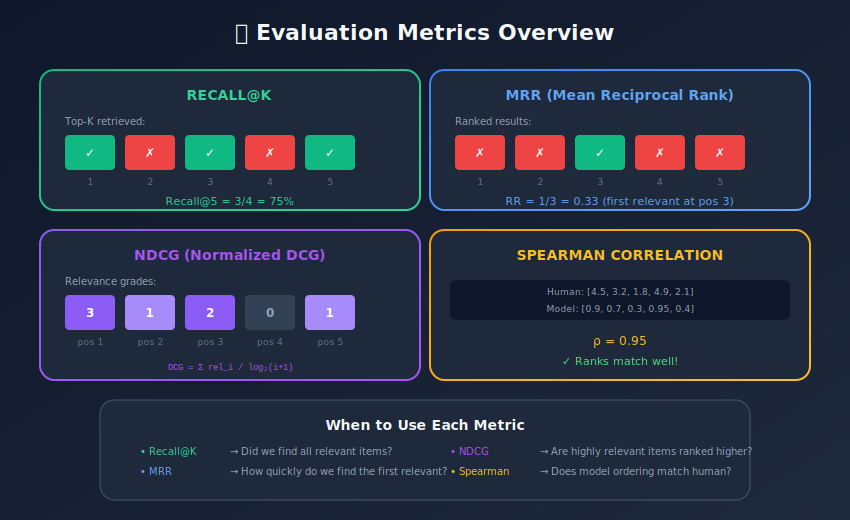
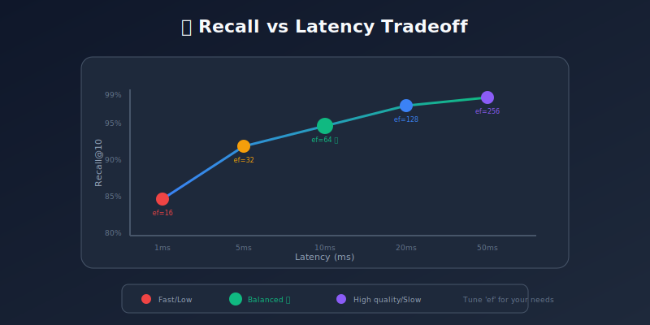
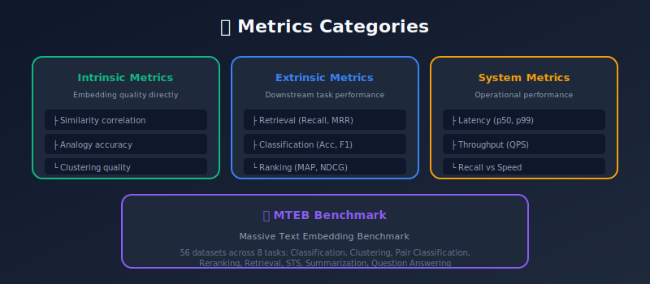

# Evaluation Metrics for Embedding Systems

<p align="center">
  
  
</p>

---

## 🎯 Visual Overview





---

## Table of Contents
1. [Introduction](#introduction)
2. [Intrinsic Evaluation](#intrinsic-evaluation)
3. [Retrieval Metrics](#retrieval-metrics)
4. [Ranking Metrics](#ranking-metrics)
5. [Clustering Metrics](#clustering-metrics)
6. [Semantic Similarity](#semantic-similarity)
7. [ANN Quality Metrics](#ann-quality-metrics)
8. [Practical Evaluation Pipeline](#practical-evaluation-pipeline)
9. [Summary](#summary)

---

## Introduction

Evaluating embeddings is multi-faceted: we measure both the quality of representations and the efficiency of retrieval systems.

### Evaluation Categories



---

## Intrinsic Evaluation

### Word Similarity

```python
from scipy.stats import spearmanr
import numpy as np

def evaluate_word_similarity(embeddings, similarity_dataset):
    """
    Evaluate on datasets like SimLex-999, WordSim-353
    Returns: Spearman correlation with human judgments
    """
    human_scores = []
    model_scores = []

    for word1, word2, human_score in similarity_dataset:
        if word1 in embeddings and word2 in embeddings:
            # Model similarity (cosine)
            v1 = embeddings[word1]
            v2 = embeddings[word2]
            model_score = np.dot(v1, v2) / (np.linalg.norm(v1) * np.linalg.norm(v2))

            human_scores.append(human_score)
            model_scores.append(model_score)

    correlation, p_value = spearmanr(human_scores, model_scores)

    return {
        'spearman': correlation,
        'p_value': p_value,
        'coverage': len(model_scores) / len(similarity_dataset)
    }

```

### Word Analogies

```python
def evaluate_analogies(embeddings, analogy_dataset, topk=1):
    """
    Analogy: a is to b as c is to ?
    Solve: d = b - a + c
    """
    correct = 0
    total = 0

    for a, b, c, d in analogy_dataset:
        if all(w in embeddings for w in [a, b, c, d]):
            # Predicted vector
            predicted = embeddings[b] - embeddings[a] + embeddings[c]

            # Find nearest (exclude a, b, c)
            best_score = float('-inf')
            best_word = None

            for word, vec in embeddings.items():
                if word not in [a, b, c]:
                    score = np.dot(predicted, vec) / (
                        np.linalg.norm(predicted) * np.linalg.norm(vec)
                    )
                    if score > best_score:
                        best_score = score
                        best_word = word

            if best_word == d:
                correct += 1
            total += 1

    return {
        'accuracy': correct / total if total > 0 else 0,
        'total': total
    }

```

---

## Retrieval Metrics

### Recall@K

```python
def recall_at_k(retrieved, relevant, k):
    """
    What fraction of relevant items are in top-k?

    retrieved: list of retrieved item IDs
    relevant: set of relevant item IDs
    """
    retrieved_k = set(retrieved[:k])
    relevant_set = set(relevant)

    if len(relevant_set) == 0:
        return 0.0

    return len(retrieved_k & relevant_set) / len(relevant_set)

def evaluate_recall(queries, retrieved_results, ground_truth, k_values=[1, 5, 10, 100]):
    """
    Evaluate recall at multiple k values
    """
    recalls = {k: [] for k in k_values}

    for query_id, retrieved in retrieved_results.items():
        relevant = ground_truth.get(query_id, [])

        for k in k_values:
            r = recall_at_k(retrieved, relevant, k)
            recalls[k].append(r)

    return {f'recall@{k}': np.mean(recalls[k]) for k in k_values}

```

### Precision@K

```python
def precision_at_k(retrieved, relevant, k):
    """
    What fraction of top-k are relevant?
    """
    retrieved_k = set(retrieved[:k])
    relevant_set = set(relevant)

    if k == 0:
        return 0.0

    return len(retrieved_k & relevant_set) / k

```

### Mean Reciprocal Rank (MRR)

```python
def reciprocal_rank(retrieved, relevant):
    """
    1 / rank of first relevant item
    """
    relevant_set = set(relevant)

    for rank, item in enumerate(retrieved, 1):
        if item in relevant_set:
            return 1.0 / rank

    return 0.0

def mean_reciprocal_rank(all_retrieved, all_relevant):
    """
    Average reciprocal rank across queries
    """
    rrs = []

    for query_id in all_retrieved:
        retrieved = all_retrieved[query_id]
        relevant = all_relevant.get(query_id, [])
        rrs.append(reciprocal_rank(retrieved, relevant))

    return np.mean(rrs)

```

### Mean Average Precision (MAP)

```python
def average_precision(retrieved, relevant):
    """
    Average precision at each relevant item position
    """
    relevant_set = set(relevant)

    if len(relevant_set) == 0:
        return 0.0

    precisions = []
    num_relevant_seen = 0

    for rank, item in enumerate(retrieved, 1):
        if item in relevant_set:
            num_relevant_seen += 1
            precision = num_relevant_seen / rank
            precisions.append(precision)

    if len(precisions) == 0:
        return 0.0

    return np.mean(precisions)

def mean_average_precision(all_retrieved, all_relevant):
    """
    MAP across all queries
    """
    aps = []

    for query_id in all_retrieved:
        retrieved = all_retrieved[query_id]
        relevant = all_relevant.get(query_id, [])
        aps.append(average_precision(retrieved, relevant))

    return np.mean(aps)

```

---

## Ranking Metrics

### Normalized Discounted Cumulative Gain (NDCG)

```python
def dcg_at_k(relevance_scores, k):
    """
    Discounted Cumulative Gain
    Accounts for position and relevance grade
    """
    relevance_scores = np.array(relevance_scores[:k])
    positions = np.arange(1, len(relevance_scores) + 1)

    # DCG = Σ (2^rel - 1) / log2(pos + 1)
    gains = (2 ** relevance_scores - 1) / np.log2(positions + 1)

    return np.sum(gains)

def ndcg_at_k(retrieved_scores, ideal_scores, k):
    """
    Normalized DCG: DCG / ideal DCG
    """
    dcg = dcg_at_k(retrieved_scores, k)

    # Ideal: sorted by relevance descending
    ideal = dcg_at_k(sorted(ideal_scores, reverse=True), k)

    if ideal == 0:
        return 0.0

    return dcg / ideal

def evaluate_ndcg(queries, predictions, relevance_grades, k_values=[5, 10, 20]):
    """
    Evaluate NDCG at multiple cutoffs

    relevance_grades: {query_id: {doc_id: grade}}
    """
    results = {}

    for k in k_values:
        ndcgs = []

        for query_id, retrieved in predictions.items():
            grades = relevance_grades.get(query_id, {})

            # Get relevance scores for retrieved docs
            retrieved_scores = [grades.get(doc_id, 0) for doc_id in retrieved[:k]]

            # Get all relevance scores for ideal ordering
            ideal_scores = list(grades.values())

            ndcg = ndcg_at_k(retrieved_scores, ideal_scores, k)
            ndcgs.append(ndcg)

        results[f'ndcg@{k}'] = np.mean(ndcgs)

    return results

```

---

## Clustering Metrics

### Adjusted Rand Index (ARI)

```python
from sklearn.metrics import adjusted_rand_score, normalized_mutual_info_score

def evaluate_clustering(embeddings, labels, n_clusters=None):
    """
    Cluster embeddings and compare to ground truth
    """
    from sklearn.cluster import KMeans

    if n_clusters is None:
        n_clusters = len(set(labels))

    # Cluster embeddings
    kmeans = KMeans(n_clusters=n_clusters, random_state=42)
    predicted_labels = kmeans.fit_predict(embeddings)

    # Compare to ground truth
    ari = adjusted_rand_score(labels, predicted_labels)
    nmi = normalized_mutual_info_score(labels, predicted_labels)

    return {
        'adjusted_rand_index': ari,
        'normalized_mutual_info': nmi
    }

```

### V-Measure

```python
from sklearn.metrics import v_measure_score, homogeneity_score, completeness_score

def v_measure_evaluation(true_labels, predicted_labels):
    """
    V-Measure: harmonic mean of homogeneity and completeness
    """
    return {
        'v_measure': v_measure_score(true_labels, predicted_labels),
        'homogeneity': homogeneity_score(true_labels, predicted_labels),
        'completeness': completeness_score(true_labels, predicted_labels)
    }

```

---

## Semantic Similarity

### Semantic Textual Similarity (STS)

```python
from scipy.stats import pearsonr, spearmanr

def evaluate_sts(model, sts_dataset):
    """
    Evaluate on STS Benchmark (0-5 similarity scores)
    """
    sentence1_list = [item['sentence1'] for item in sts_dataset]
    sentence2_list = [item['sentence2'] for item in sts_dataset]
    gold_scores = [item['score'] for item in sts_dataset]

    # Get embeddings
    embeddings1 = model.encode(sentence1_list)
    embeddings2 = model.encode(sentence2_list)

    # Compute cosine similarities
    pred_scores = []
    for e1, e2 in zip(embeddings1, embeddings2):
        sim = np.dot(e1, e2) / (np.linalg.norm(e1) * np.linalg.norm(e2))
        pred_scores.append(sim)

    # Correlations
    pearson = pearsonr(pred_scores, gold_scores)[0]
    spearman = spearmanr(pred_scores, gold_scores)[0]

    return {
        'pearson': pearson,
        'spearman': spearman
    }

```

### Sentence Embedding Benchmarks

```python
class SentenceEmbeddingEvaluator:
    """
    Comprehensive evaluation on multiple benchmarks
    """
    def __init__(self, model):
        self.model = model

    def evaluate_transfer(self, task_name, train_data, test_data):
        """
        Evaluate transfer learning performance
        """
        from sklearn.linear_model import LogisticRegression

        # Encode
        X_train = self.model.encode([d['text'] for d in train_data])
        y_train = [d['label'] for d in train_data]
        X_test = self.model.encode([d['text'] for d in test_data])
        y_test = [d['label'] for d in test_data]

        # Train classifier
        clf = LogisticRegression(max_iter=1000)
        clf.fit(X_train, y_train)

        # Evaluate
        accuracy = clf.score(X_test, y_test)

        return {task_name: accuracy}

    def full_evaluation(self, benchmarks):
        """
        Run all evaluations
        """
        results = {}

        for name, benchmark in benchmarks.items():
            if benchmark['type'] == 'sts':
                results.update(self.evaluate_sts(benchmark['data']))
            elif benchmark['type'] == 'transfer':
                results.update(self.evaluate_transfer(
                    name, benchmark['train'], benchmark['test']
                ))

        return results

```

---

## ANN Quality Metrics

### Recall vs Latency

```python
import time

def evaluate_ann_quality(index, queries, ground_truth, k=10,
                         param_grid=None):
    """
    Measure recall at different latency points
    """
    if param_grid is None:
        param_grid = [
            {'ef': 16}, {'ef': 32}, {'ef': 64},
            {'ef': 128}, {'ef': 256}, {'ef': 512}
        ]

    results = []

    for params in param_grid:
        # Set parameters
        for key, value in params.items():
            if hasattr(index, key):
                setattr(index, key, value)
            elif hasattr(index, 'hnsw'):
                setattr(index.hnsw, 'efSearch', value)

        # Measure latency
        start = time.time()
        all_results = []

        for query in queries:
            _, indices = index.search(query.reshape(1, -1), k)
            all_results.append(indices[0])

        latency = (time.time() - start) / len(queries) * 1000  # ms

        # Measure recall
        recalls = []
        for query_id, retrieved in enumerate(all_results):
            true_neighbors = set(ground_truth[query_id][:k])
            found = set(retrieved[:k])
            recall = len(true_neighbors & found) / k
            recalls.append(recall)

        results.append({
            'params': params,
            'recall@k': np.mean(recalls),
            'latency_ms': latency,
            'qps': 1000 / latency
        })

    return results

```

### Build Time and Memory

```python
import psutil
import time

def evaluate_index_efficiency(index_builder, vectors, queries, ground_truth):
    """
    Measure build time, memory, and query performance
    """
    process = psutil.Process()

    # Memory before
    mem_before = process.memory_info().rss / 1e9  # GB

    # Build time
    start = time.time()
    index = index_builder(vectors)
    build_time = time.time() - start

    # Memory after
    mem_after = process.memory_info().rss / 1e9  # GB

    # Query performance
    start = time.time()
    for query in queries:
        index.search(query.reshape(1, -1), k=10)
    query_time = (time.time() - start) / len(queries) * 1000  # ms

    return {
        'build_time_sec': build_time,
        'memory_gb': mem_after - mem_before,
        'query_latency_ms': query_time,
        'vectors_count': len(vectors)
    }

```

---

## Practical Evaluation Pipeline

### Complete Evaluation Framework

```python
import json
from dataclasses import dataclass
from typing import Dict, List, Any

@dataclass
class EvaluationResult:
    metric: str
    value: float
    details: Dict[str, Any] = None

class EmbeddingEvaluator:
    def __init__(self, model, device='cuda'):
        self.model = model
        self.device = device

    def encode_batch(self, texts, batch_size=32):
        """Encode texts in batches"""
        embeddings = []

        for i in range(0, len(texts), batch_size):
            batch = texts[i:i+batch_size]
            batch_embeds = self.model.encode(batch)
            embeddings.append(batch_embeds)

        return np.vstack(embeddings)

    def evaluate_retrieval(self, queries, corpus, qrels, k_values=[1, 5, 10, 100]):
        """
        Full retrieval evaluation

        qrels: {query_id: [relevant_doc_ids]}
        """
        # Encode
        query_embeddings = self.encode_batch(queries['text'].tolist())
        corpus_embeddings = self.encode_batch(corpus['text'].tolist())

        # Retrieve
        similarity = np.dot(query_embeddings, corpus_embeddings.T)
        rankings = np.argsort(-similarity, axis=1)

        # Metrics
        results = {}

        for k in k_values:
            recalls = []
            precisions = []

            for i, query_id in enumerate(queries['id']):
                relevant = set(qrels.get(query_id, []))
                retrieved = set(corpus['id'].iloc[rankings[i][:k]].tolist())

                if len(relevant) > 0:
                    recalls.append(len(retrieved & relevant) / len(relevant))
                    precisions.append(len(retrieved & relevant) / k)

            results[f'recall@{k}'] = np.mean(recalls)
            results[f'precision@{k}'] = np.mean(precisions)

        # MRR
        mrrs = []
        for i, query_id in enumerate(queries['id']):
            relevant = set(qrels.get(query_id, []))
            for rank, doc_idx in enumerate(rankings[i], 1):
                if corpus['id'].iloc[doc_idx] in relevant:
                    mrrs.append(1.0 / rank)
                    break
            else:
                mrrs.append(0.0)

        results['mrr'] = np.mean(mrrs)

        return results

    def evaluate_sts(self, sts_data):
        """STS evaluation"""
        embeddings1 = self.encode_batch(sts_data['sentence1'].tolist())
        embeddings2 = self.encode_batch(sts_data['sentence2'].tolist())

        # Cosine similarity
        predictions = []
        for e1, e2 in zip(embeddings1, embeddings2):
            sim = np.dot(e1, e2) / (np.linalg.norm(e1) * np.linalg.norm(e2))
            predictions.append(sim)

        gold = sts_data['score'].tolist()

        return {
            'pearson': pearsonr(predictions, gold)[0],
            'spearman': spearmanr(predictions, gold)[0]
        }

    def full_evaluation(self, benchmarks):
        """Run complete evaluation suite"""
        all_results = {}

        for name, config in benchmarks.items():
            print(f"Evaluating {name}...")

            if config['type'] == 'retrieval':
                results = self.evaluate_retrieval(
                    config['queries'],
                    config['corpus'],
                    config['qrels']
                )
            elif config['type'] == 'sts':
                results = self.evaluate_sts(config['data'])
            elif config['type'] == 'classification':
                results = self.evaluate_classification(
                    config['train'],
                    config['test']
                )

            all_results[name] = results

        return all_results

    def generate_report(self, results, output_path=None):
        """Generate evaluation report"""
        report = {
            'model': str(self.model.__class__.__name__),
            'results': results,
            'summary': {}
        }

        # Compute averages
        for benchmark, metrics in results.items():
            for metric, value in metrics.items():
                key = f'avg_{metric}'
                if key not in report['summary']:
                    report['summary'][key] = []
                report['summary'][key].append(value)

        for key in report['summary']:
            report['summary'][key] = np.mean(report['summary'][key])

        if output_path:
            with open(output_path, 'w') as f:
                json.dump(report, f, indent=2)

        return report

# Usage
evaluator = EmbeddingEvaluator(model)

benchmarks = {
    'msmarco': {
        'type': 'retrieval',
        'queries': msmarco_queries,
        'corpus': msmarco_corpus,
        'qrels': msmarco_qrels
    },
    'sts_benchmark': {
        'type': 'sts',
        'data': sts_data
    }
}

results = evaluator.full_evaluation(benchmarks)
report = evaluator.generate_report(results, 'evaluation_report.json')

```

---

## Summary

### Key Metrics by Task

| Task | Primary Metrics | Secondary Metrics |
|------|-----------------|-------------------|
| Retrieval | Recall@K, MRR | MAP, Precision@K |
| Ranking | NDCG@K | MRR, MAP |
| Similarity | Spearman | Pearson |
| Clustering | ARI, NMI | V-Measure |
| ANN | Recall, Latency | QPS, Memory |

### Evaluation Checklist

- [ ] Intrinsic: Word similarity, analogies
- [ ] Retrieval: Recall@K, MRR on domain data
- [ ] Transfer: Classification accuracy
- [ ] Similarity: STS correlation
- [ ] System: Latency, throughput, memory

### Common Pitfalls

1. **Overfitting to benchmarks**: Evaluate on held-out domain data
2. **Ignoring efficiency**: Fast but low-quality is often useless
3. **Single metric focus**: Use multiple complementary metrics
4. **Missing baselines**: Compare against BM25, random

---

*Previous: [← Embedding Training](../08_embedding_model_training/README.md) | Next: [Production Deployment →](../10_production_deployment/README.md)*

---

<div align="center">

**[⬆ Back to Top](#)** | **[📚 Main Repository](https://github.com/Gaurav14cs17/ml_system_design)**

Made with 💜 by [Gaurav14cs17](https://github.com/Gaurav14cs17)

</div>
