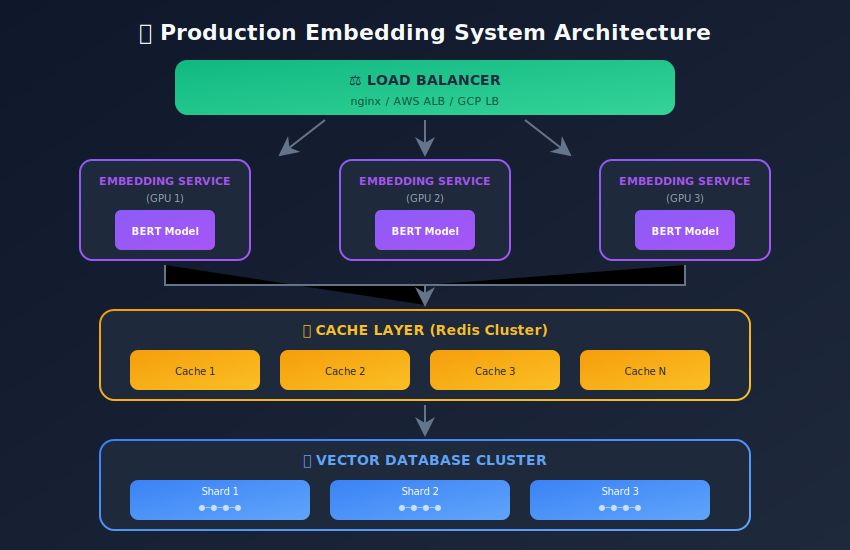
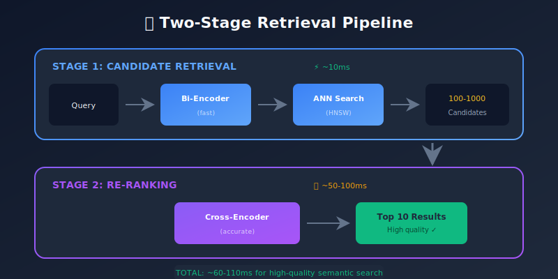
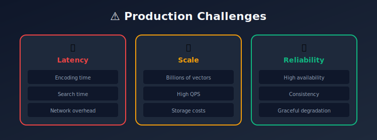

# Production Deployment of Embedding Systems

<p align="center">
  
  
</p>

---

## 🎯 Visual Overview





---

## Table of Contents
1. [Introduction](#introduction)
2. [System Architecture](#system-architecture)
3. [Model Serving](#model-serving)
4. [Scaling Strategies](#scaling-strategies)
5. [Monitoring and Observability](#monitoring-and-observability)
6. [Cost Optimization](#cost-optimization)
7. [Reliability and Fault Tolerance](#reliability-and-fault-tolerance)
8. [Practical Implementation](#practical-implementation)
9. [Summary](#summary)

---

## Introduction

Deploying embedding systems at scale requires careful consideration of latency, throughput, cost, and reliability.

### Production Challenges



---

## System Architecture

### Two-Stage Retrieval

```
Query → [Embedding Model] → Query Vector
                               ↓
                    [Vector Index (ANN)]
                               ↓
                    Candidate Documents (100-1000)
                               ↓
                    [Re-ranker (Cross-Encoder)]
                               ↓
                    Final Results (10-50)

```

### Reference Architecture

```python
"""
Production Embedding System Architecture

Components:
1. Embedding Service (Model serving)
2. Vector Database (Index + storage)
3. Reranking Service (Optional)
4. Caching Layer
5. Load Balancer
"""

from dataclasses import dataclass
from typing import List, Dict, Optional
import redis
import time

@dataclass
class SearchResult:
    id: str
    score: float
    metadata: Dict

class EmbeddingSearchSystem:
    def __init__(
        self,
        embedding_service_url: str,
        vector_db_client,
        reranker_url: Optional[str] = None,
        cache_client: Optional[redis.Redis] = None
    ):
        self.embedding_service = embedding_service_url
        self.vector_db = vector_db_client
        self.reranker = reranker_url
        self.cache = cache_client

    def search(
        self,
        query: str,
        k: int = 10,
        filters: Dict = None,
        use_reranker: bool = True
    ) -> List[SearchResult]:

        # 1. Check cache
        cache_key = self._cache_key(query, k, filters)
        if self.cache:
            cached = self.cache.get(cache_key)
            if cached:
                return self._deserialize(cached)

        # 2. Encode query
        query_vector = self._encode(query)

        # 3. ANN search
        candidates = self.vector_db.search(
            query_vector,
            k=k * 10 if use_reranker else k,
            filters=filters
        )

        # 4. Rerank (optional)
        if use_reranker and self.reranker:
            candidates = self._rerank(query, candidates, k)
        else:
            candidates = candidates[:k]

        # 5. Cache results
        if self.cache:
            self.cache.setex(cache_key, 3600, self._serialize(candidates))

        return candidates

```

---

## Model Serving

### FastAPI Embedding Service

```python
from fastapi import FastAPI, HTTPException
from pydantic import BaseModel
from typing import List
import torch
from transformers import AutoModel, AutoTokenizer
import numpy as np

app = FastAPI()

class EmbeddingRequest(BaseModel):
    texts: List[str]
    normalize: bool = True

class EmbeddingResponse(BaseModel):
    embeddings: List[List[float]]
    latency_ms: float

class EmbeddingService:
    def __init__(self, model_name: str = 'sentence-transformers/all-MiniLM-L6-v2'):
        self.device = torch.device('cuda' if torch.cuda.is_available() else 'cpu')
        self.tokenizer = AutoTokenizer.from_pretrained(model_name)
        self.model = AutoModel.from_pretrained(model_name).to(self.device)
        self.model.eval()

    @torch.no_grad()
    def encode(self, texts: List[str], normalize: bool = True) -> np.ndarray:
        inputs = self.tokenizer(
            texts,
            padding=True,
            truncation=True,
            max_length=512,
            return_tensors='pt'
        ).to(self.device)

        outputs = self.model(**inputs)

        # Mean pooling
        attention_mask = inputs['attention_mask']
        embeddings = outputs.last_hidden_state
        mask = attention_mask.unsqueeze(-1).expand(embeddings.size()).float()
        pooled = torch.sum(embeddings * mask, 1) / torch.clamp(mask.sum(1), min=1e-9)

        if normalize:
            pooled = torch.nn.functional.normalize(pooled, p=2, dim=1)

        return pooled.cpu().numpy()

service = EmbeddingService()

@app.post("/embed", response_model=EmbeddingResponse)
async def embed(request: EmbeddingRequest):
    start = time.time()

    try:
        embeddings = service.encode(request.texts, request.normalize)
        latency = (time.time() - start) * 1000

        return EmbeddingResponse(
            embeddings=embeddings.tolist(),
            latency_ms=latency
        )
    except Exception as e:
        raise HTTPException(status_code=500, detail=str(e))

@app.get("/health")
async def health():
    return {"status": "healthy"}

```

### Triton Inference Server

```python
# config.pbtxt for Triton
"""
name: "embedding_model"
platform: "onnxruntime_onnx"
max_batch_size: 32
input [
  {
    name: "input_ids"
    data_type: TYPE_INT64
    dims: [-1]
  },
  {
    name: "attention_mask"
    data_type: TYPE_INT64
    dims: [-1]
  }
]
output [
  {
    name: "embeddings"
    data_type: TYPE_FP32
    dims: [768]
  }
]
dynamic_batching {
  preferred_batch_size: [8, 16, 32]
  max_queue_delay_microseconds: 100
}
"""

# Convert to ONNX
import torch
from transformers import AutoModel, AutoTokenizer

def export_to_onnx(model_name, output_path):
    tokenizer = AutoTokenizer.from_pretrained(model_name)
    model = AutoModel.from_pretrained(model_name)
    model.eval()

    dummy_input = tokenizer(
        "Example text",
        return_tensors='pt',
        padding='max_length',
        max_length=512
    )

    torch.onnx.export(
        model,
        (dummy_input['input_ids'], dummy_input['attention_mask']),
        output_path,
        input_names=['input_ids', 'attention_mask'],
        output_names=['last_hidden_state'],
        dynamic_axes={
            'input_ids': {0: 'batch', 1: 'sequence'},
            'attention_mask': {0: 'batch', 1: 'sequence'},
            'last_hidden_state': {0: 'batch', 1: 'sequence'}
        },
        opset_version=14
    )

```

### Batching for Throughput

```python
import asyncio
from collections import deque

class BatchingEmbeddingService:
    def __init__(self, model, max_batch_size=32, max_wait_ms=10):
        self.model = model
        self.max_batch_size = max_batch_size
        self.max_wait_ms = max_wait_ms
        self.queue = deque()
        self.lock = asyncio.Lock()

    async def embed_single(self, text: str):
        """Add to batch queue and wait for result"""
        future = asyncio.Future()

        async with self.lock:
            self.queue.append((text, future))

            if len(self.queue) >= self.max_batch_size:
                await self._process_batch()

        # Start timer for max wait
        asyncio.create_task(self._timeout_trigger())

        return await future

    async def _timeout_trigger(self):
        await asyncio.sleep(self.max_wait_ms / 1000)
        async with self.lock:
            if self.queue:
                await self._process_batch()

    async def _process_batch(self):
        if not self.queue:
            return

        # Collect batch
        batch = []
        futures = []
        while self.queue and len(batch) < self.max_batch_size:
            text, future = self.queue.popleft()
            batch.append(text)
            futures.append(future)

        # Process
        embeddings = self.model.encode(batch)

        # Return results
        for future, embedding in zip(futures, embeddings):
            future.set_result(embedding)

```

---

## Scaling Strategies

### Horizontal Scaling

```yaml
# Kubernetes deployment
apiVersion: apps/v1
kind: Deployment
metadata:
  name: embedding-service
spec:
  replicas: 3
  selector:
    matchLabels:
      app: embedding-service
  template:
    metadata:
      labels:
        app: embedding-service
    spec:
      containers:
      - name: embedding
        image: embedding-service:latest
        resources:
          requests:
            memory: "4Gi"
            cpu: "2"
            nvidia.com/gpu: "1"
          limits:
            memory: "8Gi"
            cpu: "4"
            nvidia.com/gpu: "1"
        ports:
        - containerPort: 8000
---
apiVersion: autoscaling/v2
kind: HorizontalPodAutoscaler
metadata:
  name: embedding-hpa
spec:
  scaleTargetRef:
    apiVersion: apps/v1
    kind: Deployment
    name: embedding-service
  minReplicas: 2
  maxReplicas: 10
  metrics:
  - type: Resource
    resource:
      name: cpu
      target:
        type: Utilization
        averageUtilization: 70

```

### Index Sharding

```python
class ShardedVectorIndex:
    """
    Distribute vectors across multiple shards
    """
    def __init__(self, num_shards: int, shard_clients: List):
        self.num_shards = num_shards
        self.shards = shard_clients

    def _get_shard(self, doc_id: str) -> int:
        """Consistent hashing for shard assignment"""
        return hash(doc_id) % self.num_shards

    def add(self, doc_id: str, vector: np.ndarray, metadata: Dict):
        shard_id = self._get_shard(doc_id)
        self.shards[shard_id].add(doc_id, vector, metadata)

    async def search(self, query_vector: np.ndarray, k: int) -> List[SearchResult]:
        """Search all shards in parallel"""
        tasks = [
            shard.search(query_vector, k)
            for shard in self.shards
        ]

        all_results = await asyncio.gather(*tasks)

        # Merge and re-rank
        merged = []
        for results in all_results:
            merged.extend(results)

        # Sort by score and take top-k
        merged.sort(key=lambda x: x.score, reverse=True)
        return merged[:k]

```

---

## Monitoring and Observability

### Key Metrics

```python
from prometheus_client import Counter, Histogram, Gauge

# Latency
embedding_latency = Histogram(
    'embedding_latency_seconds',
    'Time to generate embeddings',
    buckets=[0.01, 0.025, 0.05, 0.1, 0.25, 0.5, 1.0]
)

search_latency = Histogram(
    'search_latency_seconds',
    'Time to search vector index',
    buckets=[0.001, 0.005, 0.01, 0.025, 0.05, 0.1]
)

# Throughput
requests_total = Counter(
    'embedding_requests_total',
    'Total embedding requests',
    ['status']
)

# Quality
retrieval_recall = Gauge(
    'retrieval_recall_at_10',
    'Recall@10 on evaluation set'
)

# Resource
gpu_memory_used = Gauge(
    'gpu_memory_used_bytes',
    'GPU memory usage'
)

# Instrumentation
import time
from functools import wraps

def instrument_latency(histogram):
    def decorator(func):
        @wraps(func)
        async def wrapper(*args, **kwargs):
            start = time.time()
            try:
                result = await func(*args, **kwargs)
                requests_total.labels(status='success').inc()
                return result
            except Exception as e:
                requests_total.labels(status='error').inc()
                raise
            finally:
                histogram.observe(time.time() - start)
        return wrapper
    return decorator

@instrument_latency(embedding_latency)
async def embed(texts):
    return model.encode(texts)

```

### Alerting Rules

```yaml
# Prometheus alerting rules
groups:
- name: embedding-alerts
  rules:
  - alert: HighEmbeddingLatency
    expr: histogram_quantile(0.99, embedding_latency_seconds) > 0.5
    for: 5m
    labels:
      severity: warning
    annotations:
      summary: "High embedding latency (p99 > 500ms)"

  - alert: LowRecall
    expr: retrieval_recall_at_10 < 0.8
    for: 15m
    labels:
      severity: critical
    annotations:
      summary: "Retrieval recall dropped below 80%"

  - alert: HighErrorRate
    expr: rate(embedding_requests_total{status="error"}[5m]) > 0.01
    for: 5m
    labels:
      severity: warning
    annotations:
      summary: "Error rate above 1%"

```

### Logging

```python
import structlog
from typing import Any

logger = structlog.get_logger()

class ObservableEmbeddingService:
    def __init__(self, model):
        self.model = model

    async def embed(self, request_id: str, texts: List[str]) -> np.ndarray:
        log = logger.bind(
            request_id=request_id,
            num_texts=len(texts),
            total_chars=sum(len(t) for t in texts)
        )

        log.info("embedding_request_started")
        start = time.time()

        try:
            embeddings = self.model.encode(texts)

            log.info(
                "embedding_request_completed",
                latency_ms=(time.time() - start) * 1000,
                embedding_shape=embeddings.shape
            )

            return embeddings

        except Exception as e:
            log.error(
                "embedding_request_failed",
                error=str(e),
                latency_ms=(time.time() - start) * 1000
            )
            raise

```

---

## Cost Optimization

### Model Quantization

```python
import torch
from transformers import AutoModel

def quantize_model(model_name, output_path):
    """Quantize model to INT8 for faster inference"""
    model = AutoModel.from_pretrained(model_name)

    # Dynamic quantization
    quantized = torch.quantization.quantize_dynamic(
        model,
        {torch.nn.Linear},
        dtype=torch.qint8
    )

    torch.save(quantized.state_dict(), output_path)
    return quantized

# Comparison
# FP32: ~400MB, ~10ms/batch
# INT8: ~100MB, ~5ms/batch (on CPU)

```

### Dimensionality Reduction

```python
class EfficientEmbedding:
    def __init__(self, full_model, target_dim=256):
        self.model = full_model
        self.target_dim = target_dim
        self.pca = None

    def fit_pca(self, sample_texts: List[str]):
        """Fit PCA on sample embeddings"""
        from sklearn.decomposition import PCA

        embeddings = self.model.encode(sample_texts)
        self.pca = PCA(n_components=self.target_dim)
        self.pca.fit(embeddings)

    def encode(self, texts: List[str]) -> np.ndarray:
        embeddings = self.model.encode(texts)

        if self.pca:
            embeddings = self.pca.transform(embeddings)

        return embeddings

# Storage savings: 768d → 256d = 66% reduction

```

### Caching Strategy

```python
import hashlib
import redis
import pickle

class EmbeddingCache:
    def __init__(self, redis_client: redis.Redis, ttl: int = 86400):
        self.redis = redis_client
        self.ttl = ttl

    def _key(self, text: str) -> str:
        return f"emb:{hashlib.md5(text.encode()).hexdigest()}"

    def get(self, text: str) -> Optional[np.ndarray]:
        cached = self.redis.get(self._key(text))
        if cached:
            return pickle.loads(cached)
        return None

    def set(self, text: str, embedding: np.ndarray):
        self.redis.setex(
            self._key(text),
            self.ttl,
            pickle.dumps(embedding)
        )

    def get_batch(self, texts: List[str]) -> tuple:
        """Get cached embeddings and uncached texts"""
        cached = {}
        uncached = []

        for text in texts:
            emb = self.get(text)
            if emb is not None:
                cached[text] = emb
            else:
                uncached.append(text)

        return cached, uncached

```

---

## Reliability and Fault Tolerance

### Circuit Breaker

```python
from enum import Enum
import time

class CircuitState(Enum):
    CLOSED = "closed"
    OPEN = "open"
    HALF_OPEN = "half_open"

class CircuitBreaker:
    def __init__(
        self,
        failure_threshold: int = 5,
        recovery_timeout: int = 30
    ):
        self.failure_threshold = failure_threshold
        self.recovery_timeout = recovery_timeout
        self.failures = 0
        self.last_failure_time = None
        self.state = CircuitState.CLOSED

    def can_execute(self) -> bool:
        if self.state == CircuitState.CLOSED:
            return True

        if self.state == CircuitState.OPEN:
            if time.time() - self.last_failure_time > self.recovery_timeout:
                self.state = CircuitState.HALF_OPEN
                return True
            return False

        return True  # HALF_OPEN

    def record_success(self):
        self.failures = 0
        self.state = CircuitState.CLOSED

    def record_failure(self):
        self.failures += 1
        self.last_failure_time = time.time()

        if self.failures >= self.failure_threshold:
            self.state = CircuitState.OPEN

    async def execute(self, func, *args, **kwargs):
        if not self.can_execute():
            raise Exception("Circuit breaker is open")

        try:
            result = await func(*args, **kwargs)
            self.record_success()
            return result
        except Exception as e:
            self.record_failure()
            raise

```

### Graceful Degradation

```python
class ResilientSearchService:
    def __init__(self, primary_index, fallback_index=None):
        self.primary = primary_index
        self.fallback = fallback_index
        self.circuit_breaker = CircuitBreaker()

    async def search(self, query: str, k: int) -> List[SearchResult]:
        # Try primary with circuit breaker
        try:
            if self.circuit_breaker.can_execute():
                results = await asyncio.wait_for(
                    self.primary.search(query, k),
                    timeout=1.0
                )
                self.circuit_breaker.record_success()
                return results
        except Exception as e:
            self.circuit_breaker.record_failure()
            logger.warning("Primary search failed", error=str(e))

        # Fallback to secondary
        if self.fallback:
            try:
                return await self.fallback.search(query, k)
            except Exception as e:
                logger.error("Fallback search failed", error=str(e))

        # Return empty results
        logger.error("All search backends failed")
        return []

```

---

## Practical Implementation

### Docker Compose Setup

```yaml
version: '3.8'

services:
  embedding-service:
    build: ./embedding-service
    ports:
      - "8000:8000"
    environment:
      - MODEL_NAME=sentence-transformers/all-MiniLM-L6-v2
      - WORKERS=4
    deploy:
      resources:
        reservations:
          devices:
            - driver: nvidia
              count: 1
              capabilities: [gpu]

  vector-db:
    image: qdrant/qdrant:latest
    ports:
      - "6333:6333"
    volumes:
      - qdrant_data:/qdrant/storage

  redis:
    image: redis:7-alpine
    ports:
      - "6379:6379"

  prometheus:
    image: prom/prometheus:latest
    ports:
      - "9090:9090"
    volumes:
      - ./prometheus.yml:/etc/prometheus/prometheus.yml

volumes:
  qdrant_data:

```

---

## Summary

### Deployment Checklist

- [ ] Model optimization (quantization, ONNX)
- [ ] Batching for throughput
- [ ] Caching layer
- [ ] Horizontal scaling (K8s HPA)
- [ ] Index sharding for large scale
- [ ] Monitoring and alerting
- [ ] Circuit breakers
- [ ] Graceful degradation
- [ ] Cost monitoring

### Performance Targets

| Metric | Target |
|--------|--------|
| Embedding latency (p99) | < 50ms |
| Search latency (p99) | < 20ms |
| Throughput | > 1000 QPS |
| Availability | 99.9% |
| Recall@10 | > 95% |

---

*Previous: [← Evaluation Metrics](../09_evaluation_metrics/README.md) | Next: [Use Cases →](../11_use_cases_applications/README.md)*

---

<div align="center">

**[⬆ Back to Top](#)** | **[📚 Main Repository](https://github.com/Gaurav14cs17/ml_system_design)**

Made with 💜 by [Gaurav14cs17](https://github.com/Gaurav14cs17)

</div>
