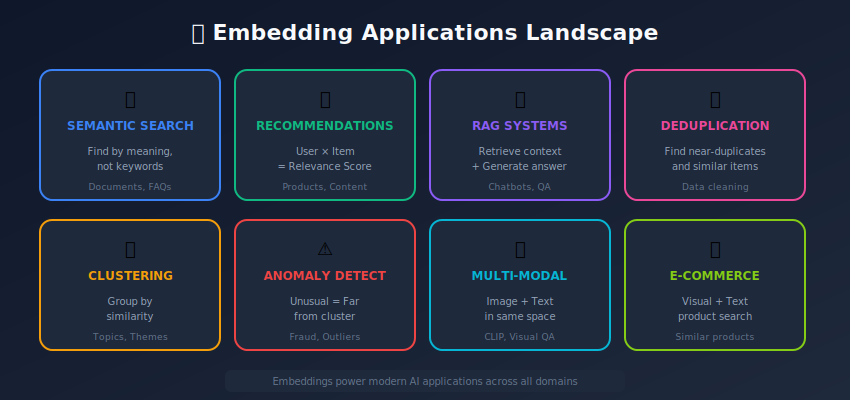
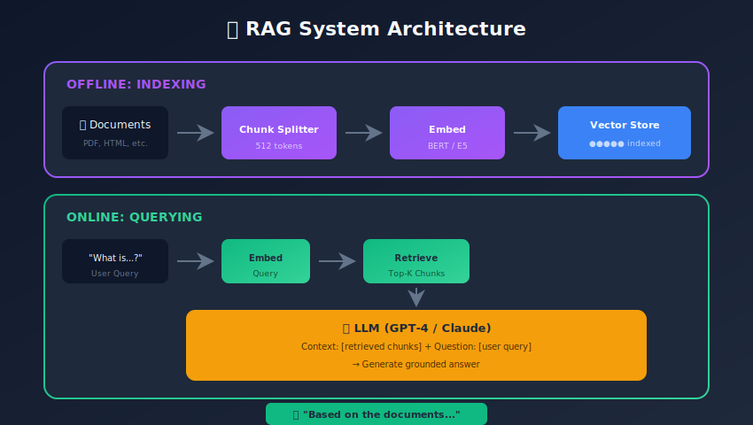
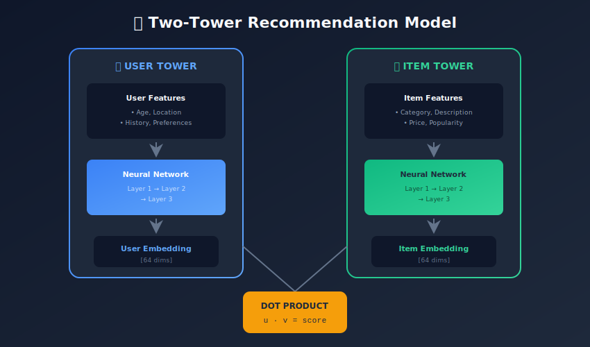

# Use Cases and Applications of Embedding Systems

<p align="center">
  
  
</p>

---

## 🎯 Visual Overview







---

## Table of Contents
1. [Semantic Search](#semantic-search)
2. [Recommendation Systems](#recommendation-systems)
3. [RAG (Retrieval-Augmented Generation)](#rag-retrieval-augmented-generation)
4. [Duplicate Detection](#duplicate-detection)
5. [Clustering and Topic Modeling](#clustering-and-topic-modeling)
6. [Anomaly Detection](#anomaly-detection)
7. [Multi-Modal Applications](#multi-modal-applications)
8. [E-commerce Applications](#e-commerce-applications)
9. [Summary](#summary)

---

## Semantic Search

### Traditional vs Semantic Search

```
Keyword Search: "apple phone" → matches "Apple", "phone"
Semantic Search: "apple phone" → understands intent, finds iPhone results

Query: "how to fix slow computer"
Keyword: Matches "fix", "slow", "computer"
Semantic: Understands "performance optimization", "speed up PC"

```

### Implementation

```python
from sentence_transformers import SentenceTransformer
import faiss
import numpy as np

class SemanticSearchEngine:
    def __init__(self, model_name='all-MiniLM-L6-v2'):
        self.model = SentenceTransformer(model_name)
        self.index = None
        self.documents = []

    def index_documents(self, documents: list):
        self.documents = documents
        embeddings = self.model.encode(documents, show_progress_bar=True)

        # Normalize for cosine similarity
        faiss.normalize_L2(embeddings)

        # Build FAISS index
        dim = embeddings.shape[1]
        self.index = faiss.IndexFlatIP(dim)
        self.index.add(embeddings.astype('float32'))

    def search(self, query: str, k: int = 10):
        query_embedding = self.model.encode([query])
        faiss.normalize_L2(query_embedding)

        scores, indices = self.index.search(query_embedding.astype('float32'), k)

        results = []
        for idx, score in zip(indices[0], scores[0]):
            results.append({
                'document': self.documents[idx],
                'score': float(score)
            })

        return results

# Usage
engine = SemanticSearchEngine()
engine.index_documents([
    "How to train a machine learning model",
    "Best practices for deep learning",
    "Introduction to neural networks",
    "Python programming tutorial"
])

results = engine.search("teach me about AI")

```

### Hybrid Search (BM25 + Semantic)

```python
from rank_bm25 import BM25Okapi

class HybridSearchEngine:
    def __init__(self, semantic_model, alpha=0.5):
        self.semantic = SentenceTransformer(semantic_model)
        self.bm25 = None
        self.alpha = alpha  # Weight for semantic scores

    def index(self, documents):
        self.documents = documents

        # BM25 index
        tokenized = [doc.lower().split() for doc in documents]
        self.bm25 = BM25Okapi(tokenized)

        # Semantic index
        embeddings = self.semantic.encode(documents)
        faiss.normalize_L2(embeddings)

        dim = embeddings.shape[1]
        self.faiss_index = faiss.IndexFlatIP(dim)
        self.faiss_index.add(embeddings.astype('float32'))

    def search(self, query: str, k: int = 10):
        # BM25 scores
        tokenized_query = query.lower().split()
        bm25_scores = self.bm25.get_scores(tokenized_query)

        # Normalize BM25 scores
        if bm25_scores.max() > 0:
            bm25_scores = bm25_scores / bm25_scores.max()

        # Semantic scores
        query_emb = self.semantic.encode([query])
        faiss.normalize_L2(query_emb)
        semantic_scores, _ = self.faiss_index.search(query_emb.astype('float32'), len(self.documents))
        semantic_scores = semantic_scores[0]

        # Combine scores
        combined = self.alpha * semantic_scores + (1 - self.alpha) * bm25_scores

        # Get top-k
        top_indices = np.argsort(-combined)[:k]

        return [
            {'document': self.documents[i], 'score': float(combined[i])}
            for i in top_indices
        ]

```

---

## Recommendation Systems

### Two-Tower Architecture

```python
import torch
import torch.nn as nn

class TwoTowerModel(nn.Module):
    """
    User Tower: User features → User embedding
    Item Tower: Item features → Item embedding
    Score = dot(user_embedding, item_embedding)
    """
    def __init__(self, user_dim, item_dim, embed_dim=64):
        super().__init__()

        self.user_tower = nn.Sequential(
            nn.Linear(user_dim, 128),
            nn.ReLU(),
            nn.Linear(128, embed_dim)
        )

        self.item_tower = nn.Sequential(
            nn.Linear(item_dim, 128),
            nn.ReLU(),
            nn.Linear(128, embed_dim)
        )

    def encode_user(self, user_features):
        return torch.nn.functional.normalize(
            self.user_tower(user_features), dim=-1
        )

    def encode_item(self, item_features):
        return torch.nn.functional.normalize(
            self.item_tower(item_features), dim=-1
        )

    def forward(self, user_features, item_features):
        user_emb = self.encode_user(user_features)
        item_emb = self.encode_item(item_features)
        return (user_emb * item_emb).sum(dim=-1)

# Training with contrastive loss
def train_step(model, user_batch, pos_items, neg_items, temperature=0.1):
    user_emb = model.encode_user(user_batch)
    pos_emb = model.encode_item(pos_items)
    neg_emb = model.encode_item(neg_items)

    pos_scores = (user_emb * pos_emb).sum(dim=-1) / temperature
    neg_scores = (user_emb * neg_emb).sum(dim=-1) / temperature

    loss = -torch.log(
        torch.exp(pos_scores) / (torch.exp(pos_scores) + torch.exp(neg_scores))
    ).mean()

    return loss

```

### Content-Based Recommendations

```python
class ContentRecommender:
    def __init__(self, model_name='all-MiniLM-L6-v2'):
        self.model = SentenceTransformer(model_name)
        self.item_embeddings = None
        self.items = []

    def index_items(self, items):
        """Index items by their text descriptions"""
        self.items = items
        texts = [item['description'] for item in items]
        self.item_embeddings = self.model.encode(texts)
        faiss.normalize_L2(self.item_embeddings)

    def recommend_similar(self, item_id, k=10):
        """Find similar items"""
        item_emb = self.item_embeddings[item_id:item_id+1]

        similarities = np.dot(self.item_embeddings, item_emb.T).flatten()
        top_indices = np.argsort(-similarities)[1:k+1]  # Exclude self

        return [
            {'item': self.items[i], 'score': float(similarities[i])}
            for i in top_indices
        ]

    def recommend_from_history(self, viewed_item_ids, k=10):
        """Recommend based on user's viewing history"""
        # Average embedding of viewed items
        history_emb = self.item_embeddings[viewed_item_ids].mean(axis=0)
        history_emb = history_emb / np.linalg.norm(history_emb)

        similarities = np.dot(self.item_embeddings, history_emb)

        # Exclude already viewed
        for idx in viewed_item_ids:
            similarities[idx] = -float('inf')

        top_indices = np.argsort(-similarities)[:k]

        return [
            {'item': self.items[i], 'score': float(similarities[i])}
            for i in top_indices
        ]

```

---

## RAG (Retrieval-Augmented Generation)

### Basic RAG Pipeline

```python
from openai import OpenAI

class RAGSystem:
    def __init__(self, embedding_model, llm_client, vector_store):
        self.embedder = SentenceTransformer(embedding_model)
        self.llm = llm_client
        self.vector_store = vector_store

    def add_documents(self, documents, metadatas=None):
        embeddings = self.embedder.encode(documents)
        self.vector_store.add(embeddings, documents, metadatas)

    def query(self, question, k=5, system_prompt=None):
        # 1. Retrieve relevant documents
        query_emb = self.embedder.encode([question])
        retrieved = self.vector_store.search(query_emb, k=k)

        # 2. Build context
        context = "\n\n".join([doc['text'] for doc in retrieved])

        # 3. Generate answer with LLM
        prompt = f"""Answer the question based on the context below.

Context:
{context}

Question: {question}

Answer:"""

        response = self.llm.chat.completions.create(
            model="gpt-4",
            messages=[
                {"role": "system", "content": system_prompt or "You are a helpful assistant."},
                {"role": "user", "content": prompt}
            ]
        )

        return {
            'answer': response.choices[0].message.content,
            'sources': retrieved
        }

```

### Advanced RAG with Reranking

```python
class AdvancedRAG:
    def __init__(self, embedder, reranker, llm):
        self.embedder = embedder
        self.reranker = reranker  # Cross-encoder
        self.llm = llm

    def query(self, question, k_retrieve=20, k_rerank=5):
        # 1. Initial retrieval (bi-encoder)
        candidates = self.retrieve(question, k=k_retrieve)

        # 2. Rerank with cross-encoder
        reranked = self.rerank(question, candidates, k=k_rerank)

        # 3. Generate with sources
        return self.generate(question, reranked)

    def rerank(self, question, candidates, k):
        pairs = [(question, doc['text']) for doc in candidates]
        scores = self.reranker.predict(pairs)

        ranked = sorted(
            zip(candidates, scores),
            key=lambda x: x[1],
            reverse=True
        )

        return [doc for doc, _ in ranked[:k]]

```

---

## Duplicate Detection

### Near-Duplicate Detection

```python
class DuplicateDetector:
    def __init__(self, model, threshold=0.9):
        self.model = SentenceTransformer(model)
        self.threshold = threshold
        self.embeddings = None
        self.items = []

    def find_duplicates(self, texts):
        """Find all duplicate pairs in a collection"""
        embeddings = self.model.encode(texts)
        faiss.normalize_L2(embeddings)

        # All-pairs similarity
        similarities = np.dot(embeddings, embeddings.T)

        duplicates = []
        n = len(texts)

        for i in range(n):
            for j in range(i+1, n):
                if similarities[i, j] >= self.threshold:
                    duplicates.append({
                        'pair': (i, j),
                        'similarity': float(similarities[i, j]),
                        'text1': texts[i][:100],
                        'text2': texts[j][:100]
                    })

        return duplicates

    def deduplicate(self, texts):
        """Remove duplicates, keeping first occurrence"""
        if not texts:
            return []

        embeddings = self.model.encode(texts)
        faiss.normalize_L2(embeddings)

        kept_indices = [0]  # Always keep first

        for i in range(1, len(texts)):
            # Check similarity with all kept items
            kept_embs = embeddings[kept_indices]
            similarities = np.dot(kept_embs, embeddings[i])

            if similarities.max() < self.threshold:
                kept_indices.append(i)

        return [texts[i] for i in kept_indices]

```

---

## Clustering and Topic Modeling

### Embedding-Based Clustering

```python
from sklearn.cluster import KMeans
from collections import Counter

class TopicClusterer:
    def __init__(self, model):
        self.model = SentenceTransformer(model)

    def cluster_documents(self, documents, n_clusters=10):
        embeddings = self.model.encode(documents)

        kmeans = KMeans(n_clusters=n_clusters, random_state=42)
        labels = kmeans.fit_predict(embeddings)

        # Organize by cluster
        clusters = {}
        for doc, label in zip(documents, labels):
            if label not in clusters:
                clusters[label] = []
            clusters[label].append(doc)

        return clusters, kmeans.cluster_centers_

    def get_cluster_keywords(self, clusters, top_k=5):
        """Extract representative keywords per cluster"""
        keywords = {}

        for cluster_id, docs in clusters.items():
            # Simple: most common words
            all_words = ' '.join(docs).lower().split()
            word_counts = Counter(all_words)

            # Filter stopwords
            stopwords = {'the', 'a', 'an', 'is', 'are', 'was', 'were'}
            keywords[cluster_id] = [
                word for word, _ in word_counts.most_common(top_k + 10)
                if word not in stopwords
            ][:top_k]

        return keywords

```

---

## Anomaly Detection

### Embedding-Based Anomaly Detection

```python
class EmbeddingAnomalyDetector:
    def __init__(self, model, contamination=0.1):
        self.model = SentenceTransformer(model)
        self.contamination = contamination
        self.threshold = None
        self.reference_embeddings = None

    def fit(self, normal_texts):
        """Fit on normal/expected data"""
        self.reference_embeddings = self.model.encode(normal_texts)
        faiss.normalize_L2(self.reference_embeddings)

        # Compute distances to nearest neighbors
        distances = self._compute_distances(self.reference_embeddings)

        # Set threshold at (1 - contamination) percentile
        self.threshold = np.percentile(distances, (1 - self.contamination) * 100)

    def _compute_distances(self, embeddings):
        """Compute distance to centroid"""
        centroid = embeddings.mean(axis=0)
        centroid = centroid / np.linalg.norm(centroid)

        similarities = np.dot(embeddings, centroid)
        return 1 - similarities  # Distance = 1 - similarity

    def predict(self, texts):
        """Predict if texts are anomalous"""
        embeddings = self.model.encode(texts)
        faiss.normalize_L2(embeddings)

        # Distance to reference centroid
        centroid = self.reference_embeddings.mean(axis=0)
        centroid = centroid / np.linalg.norm(centroid)

        similarities = np.dot(embeddings, centroid)
        distances = 1 - similarities

        # Anomaly if distance > threshold
        predictions = distances > self.threshold

        return predictions, distances

```

---

## Multi-Modal Applications

### Image-Text Search with CLIP

```python
from transformers import CLIPProcessor, CLIPModel
from PIL import Image

class MultiModalSearch:
    def __init__(self):
        self.processor = CLIPProcessor.from_pretrained('openai/clip-vit-base-patch32')
        self.model = CLIPModel.from_pretrained('openai/clip-vit-base-patch32')
        self.image_embeddings = None
        self.images = []

    def index_images(self, image_paths):
        self.images = image_paths
        embeddings = []

        for path in image_paths:
            image = Image.open(path)
            inputs = self.processor(images=image, return_tensors="pt")

            with torch.no_grad():
                emb = self.model.get_image_features(**inputs)

            embeddings.append(emb.numpy())

        self.image_embeddings = np.vstack(embeddings)
        faiss.normalize_L2(self.image_embeddings)

    def search_by_text(self, query, k=10):
        """Find images matching text description"""
        inputs = self.processor(text=query, return_tensors="pt")

        with torch.no_grad():
            text_emb = self.model.get_text_features(**inputs)

        text_emb = text_emb.numpy()
        faiss.normalize_L2(text_emb)

        similarities = np.dot(self.image_embeddings, text_emb.T).flatten()
        top_indices = np.argsort(-similarities)[:k]

        return [
            {'image': self.images[i], 'score': float(similarities[i])}
            for i in top_indices
        ]

    def search_by_image(self, query_image_path, k=10):
        """Find similar images"""
        image = Image.open(query_image_path)
        inputs = self.processor(images=image, return_tensors="pt")

        with torch.no_grad():
            query_emb = self.model.get_image_features(**inputs)

        query_emb = query_emb.numpy()
        faiss.normalize_L2(query_emb)

        similarities = np.dot(self.image_embeddings, query_emb.T).flatten()
        top_indices = np.argsort(-similarities)[:k]

        return [
            {'image': self.images[i], 'score': float(similarities[i])}
            for i in top_indices
        ]

```

---

## E-commerce Applications

### Product Search and Discovery

```python
class EcommerceSearchSystem:
    def __init__(self, text_model, image_model):
        self.text_embedder = SentenceTransformer(text_model)
        self.image_embedder = CLIPModel.from_pretrained(image_model)
        self.products = []

    def index_products(self, products):
        """
        products: list of {id, title, description, image_path, category, price}
        """
        self.products = products

        # Text embeddings (title + description)
        texts = [f"{p['title']} {p['description']}" for p in products]
        self.text_embeddings = self.text_embedder.encode(texts)

        # Image embeddings
        self.image_embeddings = self._encode_images(
            [p['image_path'] for p in products]
        )

    def search(self, query=None, image=None, filters=None, k=20):
        """Multi-modal search with filters"""
        scores = np.zeros(len(self.products))

        if query:
            query_emb = self.text_embedder.encode([query])
            text_scores = np.dot(self.text_embeddings, query_emb.T).flatten()
            scores += text_scores

        if image:
            image_emb = self._encode_images([image])
            image_scores = np.dot(self.image_embeddings, image_emb.T).flatten()
            scores += image_scores

        # Apply filters
        if filters:
            for product_idx, product in enumerate(self.products):
                if not self._matches_filters(product, filters):
                    scores[product_idx] = -float('inf')

        top_indices = np.argsort(-scores)[:k]

        return [
            {'product': self.products[i], 'score': float(scores[i])}
            for i in top_indices
            if scores[i] > -float('inf')
        ]

    def _matches_filters(self, product, filters):
        if 'category' in filters:
            if product['category'] not in filters['category']:
                return False
        if 'min_price' in filters:
            if product['price'] < filters['min_price']:
                return False
        if 'max_price' in filters:
            if product['price'] > filters['max_price']:
                return False
        return True

```

---

## Summary

### Application Overview

| Application | Embedding Type | Key Technique |
|------------|----------------|---------------|
| Semantic Search | Text | Bi-encoder + ANN |
| Recommendations | User/Item | Two-tower model |
| RAG | Text | Retrieval + Generation |
| Duplicates | Text/Image | Similarity threshold |
| Clustering | Text | K-means on embeddings |
| Anomaly Detection | Any | Distance from normal |
| Multi-modal | CLIP | Shared embedding space |
| E-commerce | Text + Image | Hybrid search + filters |

### Key Patterns

1. **Encode once, search many**: Pre-compute embeddings
2. **Two-stage retrieval**: Bi-encoder → Cross-encoder
3. **Hybrid approaches**: Combine keyword + semantic
4. **Filtering**: Apply metadata filters post-retrieval

---

*Previous: [← Production Deployment](../10_production_deployment/README.md) | Next: [Advanced Topics →](../12_advanced_topics/README.md)*

---

<div align="center">

**[⬆ Back to Top](#)** | **[📚 Main Repository](https://github.com/Gaurav14cs17/ml_system_design)**

Made with 💜 by [Gaurav14cs17](https://github.com/Gaurav14cs17)

</div>
