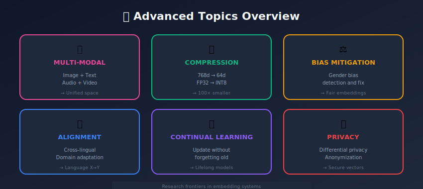
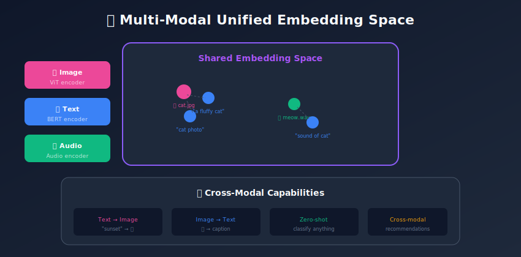
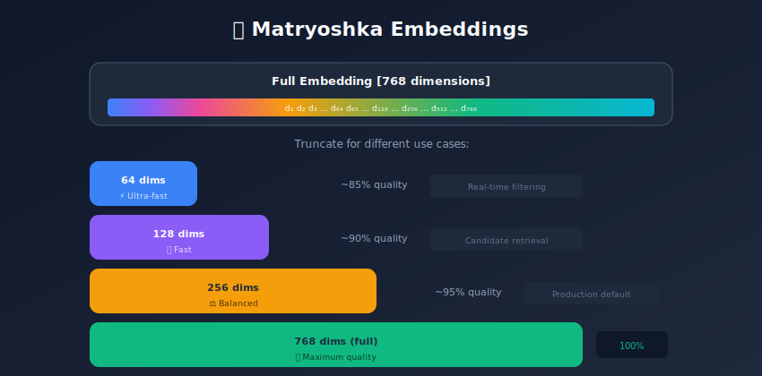

# Advanced Topics in Embedding Systems

<p align="center">
  
  
</p>

---

## 🎯 Visual Overview







---

## Table of Contents
1. [Multi-Modal Embeddings](#multi-modal-embeddings)
2. [Contextual and Dynamic Embeddings](#contextual-and-dynamic-embeddings)
3. [Embedding Compression](#embedding-compression)
4. [Embedding Alignment](#embedding-alignment)
5. [Bias and Fairness](#bias-and-fairness)
6. [Continual Learning](#continual-learning)
7. [Privacy-Preserving Embeddings](#privacy-preserving-embeddings)
8. [Future Directions](#future-directions)
9. [Summary](#summary)

---

## Multi-Modal Embeddings

### Unified Representation Space

CLIP-style models learn joint image-text spaces:

```python
import torch
import torch.nn as nn
from transformers import CLIPModel

class MultiModalEmbedder:
    def __init__(self, model_name='openai/clip-vit-large-patch14'):
        self.model = CLIPModel.from_pretrained(model_name)
        self.model.eval()

    def embed_text(self, texts):
        inputs = self.processor(text=texts, return_tensors="pt", padding=True)
        with torch.no_grad():
            return self.model.get_text_features(**inputs)

    def embed_image(self, images):
        inputs = self.processor(images=images, return_tensors="pt")
        with torch.no_grad():
            return self.model.get_image_features(**inputs)

    def cross_modal_similarity(self, texts, images):
        text_emb = self.embed_text(texts)
        image_emb = self.embed_image(images)

        # Normalize
        text_emb = text_emb / text_emb.norm(dim=-1, keepdim=True)
        image_emb = image_emb / image_emb.norm(dim=-1, keepdim=True)

        return text_emb @ image_emb.T
```

### Training Multi-Modal Models

```python
class CLIPStyleTraining(nn.Module):
    def __init__(self, vision_encoder, text_encoder, embed_dim):
        super().__init__()
        self.vision_encoder = vision_encoder
        self.text_encoder = text_encoder

        # Projection heads
        self.vision_proj = nn.Linear(vision_encoder.output_dim, embed_dim)
        self.text_proj = nn.Linear(text_encoder.output_dim, embed_dim)

        # Learnable temperature
        self.logit_scale = nn.Parameter(torch.ones([]) * np.log(1/0.07))

    def forward(self, images, texts):

        # Encode
        image_features = self.vision_proj(self.vision_encoder(images))
        text_features = self.text_proj(self.text_encoder(texts))

        # Normalize
        image_features = image_features / image_features.norm(dim=-1, keepdim=True)
        text_features = text_features / text_features.norm(dim=-1, keepdim=True)

        # Compute similarity
        logit_scale = self.logit_scale.exp()
        logits_per_image = logit_scale * image_features @ text_features.T
        logits_per_text = logits_per_image.T

        return logits_per_image, logits_per_text

    def contrastive_loss(self, logits_per_image, logits_per_text):
        batch_size = logits_per_image.shape[0]
        labels = torch.arange(batch_size, device=logits_per_image.device)

        loss_i2t = F.cross_entropy(logits_per_image, labels)
        loss_t2i = F.cross_entropy(logits_per_text, labels)

        return (loss_i2t + loss_t2i) / 2
```

### Beyond Vision-Language

```python

# Audio-Text (CLAP)
# Code-Text (CodeBERT)
# Video-Text (VideoCLIP)
# 3D-Text (ULIP)

class ModalityAgnosticEncoder:
    """
    Unified interface for any modality
    """
    def __init__(self, modality_encoders, shared_dim=768):
        self.encoders = modality_encoders
        self.projectors = {
            mod: nn.Linear(enc.output_dim, shared_dim)
            for mod, enc in modality_encoders.items()
        }

    def encode(self, data, modality):
        features = self.encoders[modality](data)
        projected = self.projectors[modality](features)
        return F.normalize(projected, dim=-1)
```

---

## Contextual and Dynamic Embeddings

### Contextualized Word Embeddings

```python
from transformers import BertModel, BertTokenizer

class ContextualEmbedder:
    def __init__(self, model_name='bert-base-uncased'):
        self.tokenizer = BertTokenizer.from_pretrained(model_name)
        self.model = BertModel.from_pretrained(model_name)

    def get_word_embedding(self, sentence, word, layer=-1):
        """Get embedding of a word in context"""
        inputs = self.tokenizer(sentence, return_tensors='pt')

        with torch.no_grad():
            outputs = self.model(**inputs, output_hidden_states=True)

        hidden_states = outputs.hidden_states[layer]

        # Find word tokens
        tokens = self.tokenizer.tokenize(sentence)
        word_tokens = self.tokenizer.tokenize(word)

        # Find position (simplified)
        for i, token in enumerate(tokens):
            if token == word_tokens[0]:

                # Return embedding at this position (+1 for [CLS])
                return hidden_states[0, i+1]

        return None

# Example: "bank" has different embeddings in different contexts
embedder = ContextualEmbedder()
emb1 = embedder.get_word_embedding("I went to the bank to deposit money", "bank")
emb2 = embedder.get_word_embedding("I sat by the river bank", "bank")

# emb1 ≠ emb2 (different meanings)
```

### Time-Aware Embeddings

```python
class TemporalEmbedding(nn.Module):
    """
    Embeddings that change over time
    Useful for: User preferences, trending topics
    """
    def __init__(self, base_embeddings, time_dim=32):
        super().__init__()
        self.base = base_embeddings
        self.embed_dim = base_embeddings.weight.shape[1]

        # Time encoding
        self.time_encoder = nn.Sequential(
            nn.Linear(1, time_dim),
            nn.ReLU(),
            nn.Linear(time_dim, self.embed_dim)
        )

    def forward(self, item_ids, timestamps):
        base_emb = self.base(item_ids)
        time_offset = self.time_encoder(timestamps.unsqueeze(-1))
        return base_emb + time_offset
```

---

## Embedding Compression

### Quantization

```python
import faiss

def quantize_embeddings(embeddings, nbits=8):
    """
    Scalar quantization: float32 → int8
    ~4x memory reduction
    """

    # Compute min/max per dimension
    mins = embeddings.min(axis=0)
    maxs = embeddings.max(axis=0)

    # Scale to [0, 255]
    scale = 255.0 / (maxs - mins + 1e-10)

    quantized = ((embeddings - mins) * scale).astype(np.uint8)

    return quantized, mins, scale

def dequantize(quantized, mins, scale):
    return (quantized.astype(np.float32) / scale) + mins

# Product Quantization (more aggressive)
def product_quantize(embeddings, m=8, nbits=8):
    """
    Split vector into m subvectors, quantize each
    Compression: d*4 bytes → m bytes
    """
    d = embeddings.shape[1]
    pq = faiss.ProductQuantizer(d, m, nbits)
    pq.train(embeddings.astype('float32'))

    codes = pq.compute_codes(embeddings.astype('float32'))
    return codes, pq
```

### Dimensionality Reduction

```python
class MatryoshkaRepresentationLearning:
    """
    Learn embeddings that work at multiple dimensions
    Original paper: "Matryoshka Representation Learning"
    """
    def __init__(self, encoder, dimensions=[64, 128, 256, 512, 768]):
        self.encoder = encoder
        self.dimensions = sorted(dimensions)

    def encode(self, texts, target_dim=None):
        full_embedding = self.encoder.encode(texts)

        if target_dim:
            return full_embedding[..., :target_dim]
        return full_embedding

    def train_loss(self, anchor, positive, negatives):
        """
        Compute loss at each dimension level
        """
        total_loss = 0

        for dim in self.dimensions:
            a = anchor[..., :dim]
            p = positive[..., :dim]
            n = negatives[..., :dim]

            loss = contrastive_loss(a, p, n)

            # Weight smaller dimensions more (they're harder)
            weight = 1.0 / np.sqrt(dim)
            total_loss += weight * loss

        return total_loss

# Usage: Trade quality for speed
model = MatryoshkaModel()

# Fast search (lower quality)
fast_emb = model.encode(texts, target_dim=64)

# Quality search
full_emb = model.encode(texts, target_dim=768)
```

### Binary Embeddings

```python
class BinaryEmbedding:
    """
    Convert to binary vectors for ultra-fast search
    Use Hamming distance instead of cosine
    """
    def __init__(self, base_encoder, binary_dim=256):
        self.encoder = base_encoder
        self.binary_dim = binary_dim

        # Projection to binary dimension
        self.projection = nn.Linear(
            base_encoder.embed_dim,
            binary_dim
        )

    def encode(self, texts):
        base_emb = self.encoder.encode(texts)
        projected = self.projection(torch.tensor(base_emb))

        # Binarize (sign function)
        binary = (projected > 0).float()
        return binary

    def hamming_distance(self, a, b):
        """Fast: XOR + popcount"""
        return (a != b).sum(dim=-1)

# 768d float32 → 256 bits = 32 bytes
# 96x memory reduction!
```

---

## Embedding Alignment

### Cross-Lingual Alignment

```python
class CrossLingualAligner:
    """
    Align embeddings from different languages
    """
    def __init__(self, source_embeddings, target_embeddings):
        self.source = source_embeddings
        self.target = target_embeddings

    def procrustes_alignment(self, source_words, target_words):
        """
        Find rotation matrix W such that:
        source_embeddings @ W ≈ target_embeddings
        """

        # Get embeddings for aligned word pairs
        X = np.array([self.source[w] for w in source_words])
        Y = np.array([self.target[w] for w in target_words])

        # SVD to find optimal rotation
        U, _, Vt = np.linalg.svd(X.T @ Y)
        W = U @ Vt

        return W

    def align(self, embeddings, W):
        """Apply alignment transformation"""
        return embeddings @ W
```

### Domain Adaptation

```python
class DomainAdaptation:
    """
    Adapt pre-trained embeddings to new domain
    """
    def __init__(self, base_model, domain_corpus):
        self.base_model = base_model
        self.domain_corpus = domain_corpus

    def continued_pretraining(self, epochs=3):
        """
        Continue MLM training on domain data
        """
        from transformers import Trainer, TrainingArguments

        training_args = TrainingArguments(
            output_dir='./domain_adapted',
            num_train_epochs=epochs,
            learning_rate=2e-5,
            per_device_train_batch_size=16
        )

        trainer = Trainer(
            model=self.base_model,
            args=training_args,
            train_dataset=self.domain_corpus
        )

        trainer.train()

    def contrastive_adaptation(self, domain_pairs):
        """
        Fine-tune on domain-specific similarity pairs
        """

        # Train with domain positive/negative pairs
        pass
```

---

## Bias and Fairness

### Detecting Bias

```python
class BiasDetector:
    def __init__(self, embeddings):
        self.embeddings = embeddings

    def compute_weat(self, target_words_1, target_words_2,
                     attribute_words_1, attribute_words_2):
        """
        Word Embedding Association Test
        Measures association between word sets
        """
        def association(w, A, B):
            w_emb = self.embeddings[w]

            sim_A = np.mean([
                cosine_sim(w_emb, self.embeddings[a])
                for a in A
            ])
            sim_B = np.mean([
                cosine_sim(w_emb, self.embeddings[b])
                for b in B
            ])

            return sim_A - sim_B

        # Target set associations
        s_X = np.mean([association(w, attribute_words_1, attribute_words_2)
                       for w in target_words_1])
        s_Y = np.mean([association(w, attribute_words_1, attribute_words_2)
                       for w in target_words_2])

        # Effect size
        combined = target_words_1 + target_words_2
        assocs = [association(w, attribute_words_1, attribute_words_2)
                  for w in combined]

        effect_size = (s_X - s_Y) / np.std(assocs)

        return effect_size

# Example: Gender bias test
# target_words_1 = ["programmer", "engineer", "scientist"]
# target_words_2 = ["nurse", "teacher", "librarian"]
# attribute_words_1 = ["man", "male", "he"]
# attribute_words_2 = ["woman", "female", "she"]
```

### Debiasing Techniques

```python
class EmbeddingDebiaser:
    """
    Remove unwanted bias directions from embeddings
    """
    def __init__(self, embeddings):
        self.embeddings = embeddings

    def compute_bias_direction(self, word_pairs):
        """
        word_pairs: [("man", "woman"), ("king", "queen"), ...]
        """
        differences = []

        for w1, w2 in word_pairs:
            diff = self.embeddings[w1] - self.embeddings[w2]
            differences.append(diff)

        # PCA to find main bias direction
        from sklearn.decomposition import PCA
        pca = PCA(n_components=1)
        pca.fit(differences)

        return pca.components_[0]

    def debias(self, bias_direction, words_to_debias):
        """
        Project out bias direction from embeddings
        """
        bias_direction = bias_direction / np.linalg.norm(bias_direction)

        debiased = {}
        for word in words_to_debias:
            emb = self.embeddings[word]

            # Remove projection onto bias direction
            projection = np.dot(emb, bias_direction) * bias_direction
            debiased[word] = emb - projection

        return debiased
```

---

## Continual Learning

### Avoiding Catastrophic Forgetting

```python
class EWCEmbeddingUpdater:
    """
    Elastic Weight Consolidation for embeddings
    Prevents forgetting when learning new data
    """
    def __init__(self, model, importance_weight=1000):
        self.model = model
        self.importance_weight = importance_weight
        self.fisher_info = {}
        self.optimal_params = {}

    def compute_fisher_information(self, dataloader):
        """
        Compute Fisher Information Matrix
        Measures parameter importance
        """
        self.model.eval()

        for name, param in self.model.named_parameters():
            self.fisher_info[name] = torch.zeros_like(param)

        for batch in dataloader:
            self.model.zero_grad()
            output = self.model(batch)
            loss = self.compute_loss(output)
            loss.backward()

            for name, param in self.model.named_parameters():
                if param.grad is not None:
                    self.fisher_info[name] += param.grad ** 2

        # Normalize
        for name in self.fisher_info:
            self.fisher_info[name] /= len(dataloader)

    def ewc_loss(self):
        """
        Penalty for deviating from important parameters
        """
        loss = 0

        for name, param in self.model.named_parameters():
            if name in self.fisher_info:
                loss += (self.fisher_info[name] *
                        (param - self.optimal_params[name]) ** 2).sum()

        return self.importance_weight * loss
```

### Incremental Index Updates

```python
class IncrementalVectorIndex:
    """
    Add new vectors without rebuilding entire index
    """
    def __init__(self, dim, initial_capacity=10000):
        self.dim = dim

        # Base index (periodically rebuilt)
        self.base_index = faiss.IndexFlatIP(dim)

        # Buffer for new vectors
        self.buffer = []
        self.buffer_ids = []
        self.max_buffer_size = 10000

    def add(self, vector, id):
        self.buffer.append(vector)
        self.buffer_ids.append(id)

        if len(self.buffer) >= self.max_buffer_size:
            self._merge_buffer()

    def _merge_buffer(self):
        """Merge buffer into base index"""
        if self.buffer:
            vectors = np.array(self.buffer).astype('float32')
            self.base_index.add(vectors)
            self.buffer = []
            self.buffer_ids = []

    def search(self, query, k=10):

        # Search base index
        base_scores, base_ids = self.base_index.search(query, k)

        # Search buffer
        if self.buffer:
            buffer_array = np.array(self.buffer).astype('float32')
            buffer_scores = np.dot(buffer_array, query.T).flatten()

            # Merge results
            all_scores = np.concatenate([base_scores[0], buffer_scores])
            all_ids = list(range(len(base_ids[0]))) + self.buffer_ids

            top_k = np.argsort(-all_scores)[:k]
            return [all_ids[i] for i in top_k], all_scores[top_k]

        return base_ids[0].tolist(), base_scores[0]
```

---

## Privacy-Preserving Embeddings

### Differential Privacy

```python
class DPEmbeddingTrainer:
    """
    Train embeddings with differential privacy
    """
    def __init__(self, model, epsilon=1.0, delta=1e-5):
        self.model = model
        self.epsilon = epsilon
        self.delta = delta

    def clip_gradients(self, max_norm=1.0):
        """Clip per-sample gradients"""
        total_norm = 0

        for param in self.model.parameters():
            if param.grad is not None:
                param_norm = param.grad.norm()
                total_norm += param_norm ** 2

        total_norm = total_norm ** 0.5

        clip_coef = max_norm / (total_norm + 1e-6)
        if clip_coef < 1:
            for param in self.model.parameters():
                if param.grad is not None:
                    param.grad.mul_(clip_coef)

    def add_noise(self, noise_scale):
        """Add Gaussian noise to gradients"""
        for param in self.model.parameters():
            if param.grad is not None:
                noise = torch.randn_like(param.grad) * noise_scale
                param.grad.add_(noise)
```

### Embedding Anonymization

```python
class AnonymizedEmbeddings:
    """
    Generate embeddings that can't be traced to original data
    """
    def __init__(self, base_model, noise_level=0.1):
        self.model = base_model
        self.noise_level = noise_level

    def encode(self, texts, add_noise=True):
        embeddings = self.model.encode(texts)

        if add_noise:
            noise = np.random.normal(0, self.noise_level, embeddings.shape)
            embeddings = embeddings + noise

            # Re-normalize
            embeddings = embeddings / np.linalg.norm(embeddings, axis=-1, keepdims=True)

        return embeddings
```

---

## Future Directions

### Emerging Trends

1. **Foundation Models**: Unified embeddings for all modalities
2. **Efficient Transformers**: Linear attention, sparse attention
3. **Neural Architecture Search**: Auto-designed embedding models
4. **Federated Embeddings**: Learn without centralizing data
5. **Quantum Embeddings**: Quantum computers for embedding learning

### Research Frontiers

```python

# Concept: Self-improving embeddings
class ContinuallyLearningEmbedder:
    """
    Embeddings that improve from user interactions
    """
    def __init__(self, base_model):
        self.model = base_model
        self.feedback_buffer = []

    def collect_feedback(self, query, clicked_result, ignored_results):
        """Learn from user behavior"""
        self.feedback_buffer.append({
            'query': query,
            'positive': clicked_result,
            'negatives': ignored_results
        })

        if len(self.feedback_buffer) >= 1000:
            self.update_model()

    def update_model(self):
        """Fine-tune on collected feedback"""

        # Contrastive learning on feedback
        pass
```

---

## Summary

### Advanced Techniques Overview

| Topic | Key Concept | Application |
|-------|-------------|-------------|
| Multi-Modal | Shared embedding space | Cross-modal search |
| Contextual | Dynamic per-context | Polysemous words |
| Compression | Quantization, PQ | Scale to billions |
| Alignment | Cross-lingual mapping | Translation |
| Debiasing | Remove bias direction | Fair ML |
| Continual | EWC, incremental | Evolving data |
| Privacy | DP, noise injection | Sensitive data |

### Key Takeaways

1. **Multi-modal is the future**: Unified embeddings for all data types
2. **Compression enables scale**: 10-100x reduction possible
3. **Bias is real**: Measure and mitigate actively
4. **Systems evolve**: Plan for updates and drift
5. **Privacy matters**: Consider from the start

---

## References

1. Radford et al. (2021). "Learning Transferable Visual Models" (CLIP)
2. Kusupati et al. (2022). "Matryoshka Representation Learning"
3. Bolukbasi et al. (2016). "Man is to Computer Programmer as Woman is to Homemaker?"
4. Kirkpatrick et al. (2017). "Overcoming Catastrophic Forgetting"
5. Abadi et al. (2016). "Deep Learning with Differential Privacy"

---

*Previous: [← Use Cases](../11_use_cases_applications/README.md) | [Back to Main →](../README.md)*

---

<div align="center">

**[⬆ Back to Top](#)** | **[📚 Main Repository](https://github.com/Gaurav14cs17/ml_system_design)**

Made with 💜 by [Gaurav14cs17](https://github.com/Gaurav14cs17)

</div>
