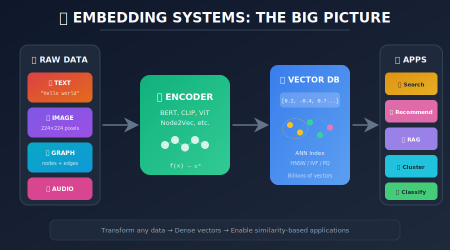
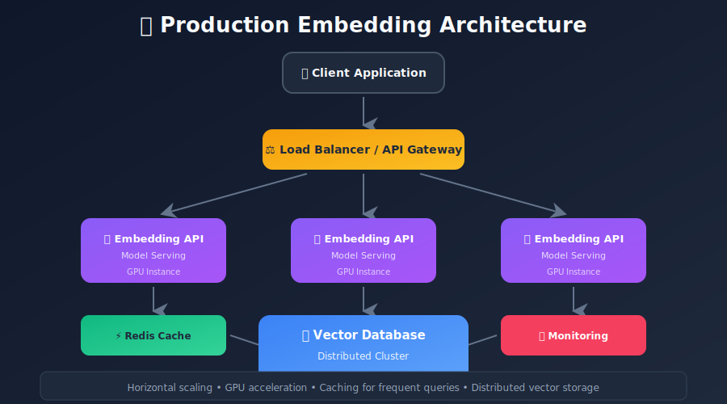
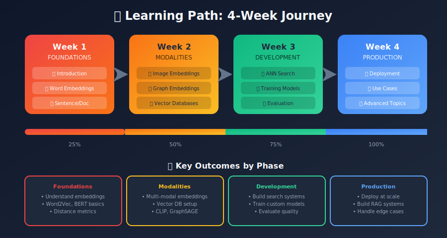

# Embedding Systems: A Comprehensive Guide

<p align="center">
  
  
  
</p>

<p align="center">
  <strong>From Theory to Production: Everything You Need to Know About Embeddings</strong>
</p>

---



---

## 📚 Overview

Embeddings are the backbone of modern ML systems. This comprehensive guide covers everything from fundamental concepts to production deployment, written in an accessible blog-style format with practical code examples.

### What You'll Learn

- 🎯 **Core Concepts**: What embeddings are and why they matter

- 🔤 **Text Embeddings**: Words, sentences, and documents

- 🖼️ **Visual Embeddings**: Images and multi-modal representations

- 🕸️ **Graph Embeddings**: Networks and knowledge graphs

- 🗄️ **Storage & Search**: Vector databases and ANN algorithms

- 🏭 **Production**: Training, evaluation, and deployment at scale

- 🚀 **Applications**: Real-world use cases and implementations

---

## 📖 Table of Contents

### Part 1: Foundations

| Chapter | Topic | Description |
|---------|-------|-------------|
| 01 | [**Introduction to Embeddings**](./01_introduction_to_embeddings/README.md) | What are embeddings, why we need them, mathematical foundations |
| 02 | [**Word Embeddings**](./02_word_embeddings/README.md) | Word2Vec, GloVe, FastText - the revolution that started it all |
| 03 | [**Sentence & Document Embeddings**](./03_sentence_document_embeddings/README.md) | From words to paragraphs: BERT, Sentence-BERT, and beyond |

### Part 2: Modalities

| Chapter | Topic | Description |
|---------|-------|-------------|
| 04 | [**Image Embeddings**](./04_image_embeddings/README.md) | CNN, ViT, CLIP - visual representations |
| 05 | [**Graph Embeddings**](./05_graph_embeddings/README.md) | Node2Vec, GNN, knowledge graphs |

### Part 3: Infrastructure

| Chapter | Topic | Description |
|---------|-------|-------------|
| 06 | [**Vector Databases**](./06_vector_databases/README.md) | Pinecone, Milvus, Qdrant, FAISS - storing billions of vectors |
| 07 | [**Similarity Search & ANN**](./07_similarity_search_ann/README.md) | HNSW, IVF, PQ - finding needles in haystacks |

### Part 4: Development

| Chapter | Topic | Description |
|---------|-------|-------------|
| 08 | [**Embedding Model Training**](./08_embedding_model_training/README.md) | Contrastive learning, hard negatives, multi-task training |
| 09 | [**Evaluation Metrics**](./09_evaluation_metrics/README.md) | Recall, MRR, NDCG - measuring what matters |
| 10 | [**Production Deployment**](./10_production_deployment/README.md) | Scaling, monitoring, reliability |

### Part 5: Applications

| Chapter | Topic | Description |
|---------|-------|-------------|
| 11 | [**Use Cases & Applications**](./11_use_cases_applications/README.md) | Search, RAG, recommendations, and more |
| 12 | [**Advanced Topics**](./12_advanced_topics/README.md) | Multi-modal, compression, bias, privacy |

---

## 🎯 Quick Start by Use Case

### "I want to build a search engine"
1. [Sentence Embeddings](./03_sentence_document_embeddings/README.md) → Choose your encoder
2. [Vector Databases](./06_vector_databases/README.md) → Store your embeddings
3. [Use Cases: Semantic Search](./11_use_cases_applications/README.md#semantic-search) → Implementation guide

### "I want to build a recommendation system"
1. [Introduction](./01_introduction_to_embeddings/README.md) → Understand the basics
2. [Use Cases: Recommendations](./11_use_cases_applications/README.md#recommendation-systems) → Two-tower models
3. [ANN Search](./07_similarity_search_ann/README.md) → Fast retrieval

### "I want to build a RAG system"
1. [Sentence Embeddings](./03_sentence_document_embeddings/README.md) → Document encoding
2. [Vector Databases](./06_vector_databases/README.md) → Knowledge storage
3. [Use Cases: RAG](./11_use_cases_applications/README.md#rag-retrieval-augmented-generation) → Full pipeline

### "I want to deploy embeddings at scale"
1. [Production Deployment](./10_production_deployment/README.md) → Architecture & scaling
2. [Similarity Search](./07_similarity_search_ann/README.md) → Index optimization
3. [Evaluation](./09_evaluation_metrics/README.md) → Monitoring quality

---

## 🛠️ Technologies Covered

### Embedding Models

- **Text**: Word2Vec, GloVe, FastText, BERT, Sentence-BERT, E5, BGE

- **Vision**: ResNet, ViT, CLIP, DINOv2
- **Graphs**: Node2Vec, GraphSAGE, GAT, TransE

- **Multi-Modal**: CLIP, CLAP, ImageBind

### Vector Databases

- **Managed**: Pinecone

- **Self-Hosted**: Milvus, Qdrant, Weaviate, ChromaDB

- **Libraries**: FAISS, Annoy, ScaNN

### ML Frameworks

- PyTorch, TensorFlow

- Hugging Face Transformers

- Sentence-Transformers

- PyTorch Geometric

---

## 📊 Key Metrics Cheatsheet

| Metric | What It Measures | When to Use |
|--------|------------------|-------------|
| **Recall@K** | % of relevant items in top-K | Retrieval systems |
| **MRR** | Rank of first relevant item | Single answer needed |
| **NDCG** | Ranking quality with grades | Graded relevance |
| **Spearman** | Correlation with human judgment | Similarity tasks |
| **ARI** | Clustering quality | Topic modeling |

---

## 📐 Mathematical Foundations

### What is an Embedding?

An embedding is a **learned mapping** from a discrete or high-dimensional space to a continuous, dense vector space:

```math
f: \mathcal{X} \rightarrow \mathbb{R}^d

```

where:

- $\mathcal{X}$ is the input space (words, images, graphs, etc.)

- $\mathbb{R}^d$ is the $d$-dimensional real-valued embedding space

- The function $f$ preserves semantic relationships

### The Embedding Hypothesis

> **Similar objects in the input space should map to nearby points in the embedding space.**

Mathematically, for items $x\_i$ and $x\_j$:

```math
\text{sim}(x_i, x_j) \approx \text{sim}(f(x_i), f(x_j))

```

### Key Distance and Similarity Metrics

| Metric | Formula | Use Case | Range |
|--------|---------|----------|-------|
| **Cosine Similarity** | $\displaystyle\frac{\mathbf{a} \cdot \mathbf{b}}{\|\mathbf{a}\| \|\mathbf{b}\|}$ | Text, normalized vectors | $[-1, 1]$ |
| **Euclidean Distance** | $\sqrt{\sum\_{i=1}^{d}(a\_i - b\_i)^2}$ | Images, clustering | $[0, \infty)$ |
| **Dot Product** | $\sum\_{i=1}^{d} a\_i \cdot b\_i$ | Normalized embeddings | $(-\infty, \infty)$ |
| **Manhattan Distance** | $\sum\_{i=1}^{d}\|a\_i - b\_i\|$ | Sparse features | $[0, \infty)$ |

### The Embedding Matrix

For discrete inputs (vocabulary $V$), embeddings are stored as a lookup table:

```math
\mathbf{E} \in \mathbb{R}^{|V| \times d}

```

The embedding for item $i$ is simply row $i$ of the matrix: $\mathbf{e}\_i = \mathbf{E}[i, :]$

### Learning Objectives

Most embedding methods optimize variations of:

**Contrastive Loss (InfoNCE):**

```math
\mathcal{L} = -\log \frac{\exp(\text{sim}(f(x), f(x^+))/\tau)}{\sum_{x^- \in \mathcal{N}} \exp(\text{sim}(f(x), f(x^-))/\tau)}

```

**Triplet Loss:**

```math
\mathcal{L} = \max(0, d(a, p) - d(a, n) + \text{margin})

```

where $a$ is anchor, $p$ is positive, $n$ is negative, and $\tau$ is temperature.

---

## 💡 Key Concepts at a Glance

### Embedding Dimensions by Modality

| Modality | Typical Dimensions | Examples |
|----------|-------------------|----------|
| **Word Embeddings** | 100-300 | Word2Vec, GloVe, FastText |
| **Sentence Embeddings** | 384-768 | MiniLM (384), BERT (768) |
| **Image Embeddings** | 512-2048 | CLIP (512), ResNet (2048) |
| **Multi-modal** | 512-1024 | CLIP, ImageBind |

### Similarity Computation

For **normalized embeddings** (‖e‖ = 1), cosine similarity equals dot product:

```math
\text{cos}(\mathbf{a}, \mathbf{b}) = \mathbf{a} \cdot \mathbf{b} \quad \text{when } \|\mathbf{a}\| = \|\mathbf{b}\| = 1

```

This enables efficient batch similarity computation via matrix multiplication.

### Index Types Performance

| Index | Build Time | Query Time | Memory | Recall | Best For |
|-------|------------|------------|--------|--------|----------|
| **Flat** | O(1) | O(n) | 1× | 100% | Small datasets, exact |
| **IVF** | O(n) | O(√n) | 1× | 95%+ | Balanced performance |
| **HNSW** | O(n·log n) | O(log n) | 1.5× | 99%+ | Low-latency search |
| **PQ** | O(n) | O(n) | 0.03× | 90%+ | Memory-constrained |
| **IVF-PQ** | O(n) | O(√n) | 0.1× | 92%+ | Billions of vectors |

---

## 🏗️ Reference Architecture



---

## 📚 Prerequisites

- Python 3.8+

- Basic understanding of neural networks

- Familiarity with PyTorch or TensorFlow

- (Optional) GPU for training models

### Recommended Libraries

```bash
pip install sentence-transformers transformers faiss-cpu
pip install torch torchvision
pip install chromadb qdrant-client
pip install numpy pandas scikit-learn

```

---

## 🤝 How to Use This Guide

1. **Sequential Learning**: Start from Chapter 01 and progress through each topic
2. **Reference**: Jump to specific chapters when you need them
3. **Hands-On**: Each chapter includes runnable code examples
4. **Production**: Focus on chapters 06-10 for deployment

---

## 📈 Learning Path



---

## 🔗 Additional Resources

### Papers

- [Efficient Estimation of Word Representations](https://arxiv.org/abs/1301.3781) (Word2Vec)

- [Sentence-BERT](https://arxiv.org/abs/1908.10084)

- [CLIP](https://arxiv.org/abs/2103.00020)

- [Approximate Nearest Neighbor Search](https://arxiv.org/abs/1603.09320)

### Tools & Libraries

- [Sentence-Transformers](https://www.sbert.net/)

- [FAISS](https://github.com/facebookresearch/faiss)

- [MTEB Leaderboard](https://huggingface.co/spaces/mteb/leaderboard)

---

## 📝 License

This educational content is provided for learning purposes.

---

<p align="center">
  <strong>Happy Learning! 🚀</strong>
</p>

---

<div align="center">

**[⬆ Back to Top](#)** | **[📚 Main Repository](https://github.com/Gaurav14cs17/ml_system_design)**

Made with 💜 by [Gaurav14cs17](https://github.com/Gaurav14cs17)

</div>
