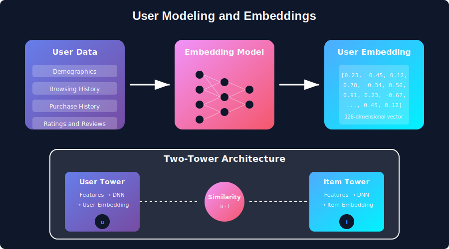
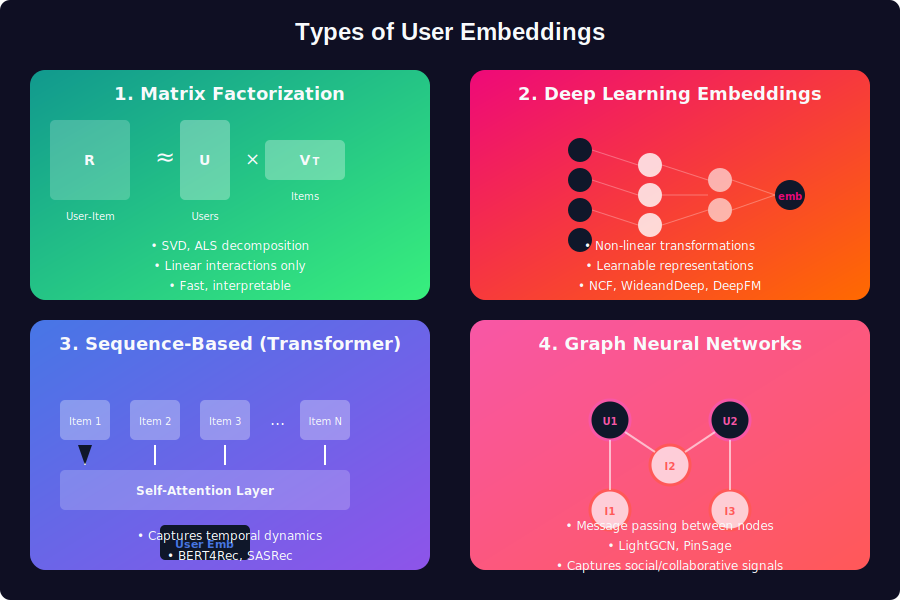
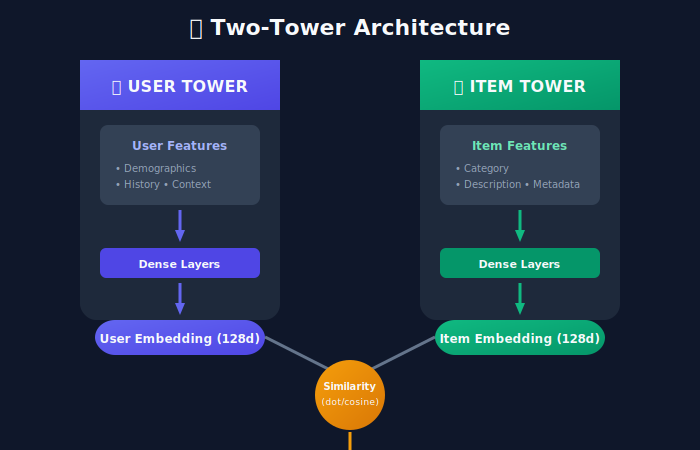

# User Modeling & Embeddings

<div align="center">



*Representing users as mathematical vectors in high-dimensional space*

</div>

---

## Table of Contents
1. [Mathematical Foundation](#mathematical-foundation)
2. [Embedding Theory](#embedding-theory)
3. [Learning Methods](#learning-methods)
4. [Architecture Patterns](#architecture-patterns)
5. [Implementation Considerations](#implementation-considerations)
6. [Interview Questions](#interview-questions)

---

## Mathematical Foundation

### What is User Modeling?

User modeling creates a mathematical representation $\mathbf{u} \in \mathbb{R}^d$ that captures a user's preferences, behaviors, and characteristics in a dense vector space.

**The Core Challenge:**

Given user interactions $\mathcal{H}_u = \{(i_1, t_1), (i_2, t_2), \ldots, (i_n, t_n)\}$, learn a function:

```math
f: \mathcal{H}_u \rightarrow \mathbf{u} \in \mathbb{R}^d
```

Such that similar users have similar representations:

```math
\text{sim}(\mathbf{u}_a, \mathbf{u}_b) \propto \text{behavioral\_similarity}(a, b)
```

### Why Embeddings Work

**The Distributional Hypothesis**: Users who interact with similar items have similar preferences, just as words appearing in similar contexts have similar meanings (Word2Vec intuition).

**Dimensionality Reduction**: Instead of sparse one-hot representations:

```math
\mathbf{u}_{\text{sparse}} \in \{0,1\}^{|\mathcal{I}|} \quad \text{(millions of dimensions)}
```

We learn dense representations:

```math
\mathbf{u}_{\text{dense}} \in \mathbb{R}^{d} \quad \text{(64-512 dimensions)}
```

This compression captures latent semantic structure.

---

## Embedding Theory

### Geometric Interpretation

User embeddings exist in a **learned metric space** where:

1. **Distance = Dissimilarity**: $\|\mathbf{u}_a - \mathbf{u}_b\|$ measures preference divergence
2. **Direction = Preference**: Movement along axes represents change in taste
3. **Clusters = User Segments**: Natural groupings emerge from interaction patterns

### Embedding Similarity Metrics

**Dot Product** — measures alignment:

```math
\text{sim}(\mathbf{u}, \mathbf{v}) = \mathbf{u}^\top \mathbf{v} = \sum_{i=1}^{d} u_i v_i
```

**Cosine Similarity** — normalized alignment (direction only):

```math
\text{cos}(\mathbf{u}, \mathbf{v}) = \frac{\mathbf{u}^\top \mathbf{v}}{\|\mathbf{u}\| \|\mathbf{v}\|}
```

**Euclidean Distance** — geometric distance:

```math
d(\mathbf{u}, \mathbf{v}) = \|\mathbf{u} - \mathbf{v}\|_2 = \sqrt{\sum_{i=1}^{d} (u_i - v_i)^2}
```

### The Embedding Space Property

Well-learned embeddings satisfy the **triangle inequality property**:

```math
d(\mathbf{u}, \mathbf{w}) \leq d(\mathbf{u}, \mathbf{v}) + d(\mathbf{v}, \mathbf{w})
```

This enables efficient approximate nearest neighbor search.

---

## Learning Methods

### 1. Matrix Factorization



**Singular Value Decomposition (SVD):**

Given interaction matrix $\mathbf{R} \in \mathbb{R}^{m \times n}$:

```math
\mathbf{R} = \mathbf{U} \boldsymbol{\Sigma} \mathbf{V}^\top
```

Where:
- $\mathbf{U} \in \mathbb{R}^{m \times k}$: Left singular vectors → **User embeddings**
- $\boldsymbol{\Sigma} \in \mathbb{R}^{k \times k}$: Singular values (importance weights)
- $\mathbf{V} \in \mathbb{R}^{n \times k}$: Right singular vectors → **Item embeddings**

**User embedding extraction:**

```math
\mathbf{p}_u = \mathbf{U}_{u,:} \cdot \boldsymbol{\Sigma}^{1/2}
```

**Prediction:**

```math
\hat{r}_{ui} = \mathbf{p}_u^\top \mathbf{q}_i
```

### 2. Neural Embedding Learning

**Embedding Layer Mathematics:**

An embedding layer is a lookup table parameterized by $\mathbf{E} \in \mathbb{R}^{|V| \times d}$:

```math
\text{Embed}(u) = \mathbf{E}_{u,:} = \mathbf{e}_u \in \mathbb{R}^d
```

**Forward pass:**

```math
\mathbf{h} = \sigma(\mathbf{W} \cdot [\mathbf{e}_u \oplus \mathbf{e}_i] + \mathbf{b})
```

Where $\oplus$ denotes concatenation.

**Loss Functions:**

*Pointwise (Regression):*

```math
\mathcal{L}_{\text{MSE}} = \frac{1}{|\mathcal{D}|} \sum_{(u,i,r) \in \mathcal{D}} (r - \hat{r}_{ui})^2
```

*Pairwise (BPR):*

```math
\mathcal{L}_{\text{BPR}} = -\sum_{(u,i,j) \in \mathcal{D}} \log \sigma(\hat{r}_{ui} - \hat{r}_{uj})
```

*Contrastive (InfoNCE):*

```math
\mathcal{L}_{\text{NCE}} = -\log \frac{\exp(\mathbf{u}^\top \mathbf{i}^+ / \tau)}{\exp(\mathbf{u}^\top \mathbf{i}^+ / \tau) + \sum_{j \in \mathcal{N}} \exp(\mathbf{u}^\top \mathbf{i}_j^- / \tau)}
```

### 3. Sequential Embedding (Transformers)

For time-series user behavior, transformers learn contextual embeddings:



**Self-Attention for User History:**

Given sequence $\mathbf{H} = [\mathbf{h}_1, \mathbf{h}_2, \ldots, \mathbf{h}_T]$:

```math
\text{Attention}(\mathbf{Q}, \mathbf{K}, \mathbf{V}) = \text{softmax}\left(\frac{\mathbf{Q}\mathbf{K}^\top}{\sqrt{d_k}}\right)\mathbf{V}
```

Where:
- $\mathbf{Q} = \mathbf{H}\mathbf{W}_Q$ (queries)
- $\mathbf{K} = \mathbf{H}\mathbf{W}_K$ (keys)
- $\mathbf{V} = \mathbf{H}\mathbf{W}_V$ (values)

**Positional Encoding** captures temporal order:

```math
\text{PE}_{(pos, 2i)} = \sin\left(\frac{pos}{10000^{2i/d}}\right)
\text{PE}_{(pos, 2i+1)} = \cos\left(\frac{pos}{10000^{2i/d}}\right)
```

### 4. Graph-Based Embeddings

**Message Passing** in user-item bipartite graph:

```math
\mathbf{e}_u^{(l+1)} = \text{AGG}\left(\left\{\frac{1}{\sqrt{|\mathcal{N}_u||\mathcal{N}_i|}} \mathbf{e}_i^{(l)} : i \in \mathcal{N}_u\right\}\right)
```

**LightGCN Simplification:**

```math
\mathbf{e}_u^{(\text{final})} = \frac{1}{L+1} \sum_{l=0}^{L} \mathbf{e}_u^{(l)}
```

Average across propagation layers for final embedding.

---

## Architecture Patterns

### Two-Tower Architecture

The industry-standard pattern for large-scale retrieval:

```
+-----------------+     +-----------------+
|   User Tower    |     |   Item Tower    |
|                 |     |                 |
|  User Features  |     |  Item Features  |
|       ↓         |     |       ↓         |
|   Dense Layers  |     |   Dense Layers  |
|       ↓         |     |       ↓         |
|  L2 Normalize   |     |  L2 Normalize   |
|       ↓         |     |       ↓         |
|   User Embed    |     |   Item Embed    |
|      (u)        |     |      (i)        |
+--------+--------+     +--------+--------+
         |                       |
         +-----------+-----------+
                     ↓
              sim(u, i) = u · i
```

**Key Properties:**
- **Decoupled inference**: Item embeddings pre-computed offline
- **Scalable retrieval**: ANN search over item embeddings
- **Late fusion**: Interaction only at similarity computation

**Temperature-Scaled Softmax:**

```math
P(i \mid u) = \frac{\exp(\mathbf{u}^\top \mathbf{i} / \tau)}{\sum_{j \in \mathcal{I}} \exp(\mathbf{u}^\top \mathbf{j} / \tau)}
```

Lower $\tau$ → sharper distributions (more confident)

### Multi-Interest User Modeling

Users have multiple distinct interests. Model with $K$ interest capsules:

```math
\mathbf{U} = \{\mathbf{u}_1, \mathbf{u}_2, \ldots, \mathbf{u}_K\}
```

**Dynamic Routing:**

```math
\mathbf{u}_k = \sum_{i \in \mathcal{H}_u} c_{ki} \cdot \mathbf{v}_i
```

Where $c_{ki}$ are learned routing coefficients.

**Target-Aware Aggregation:**

```math
\mathbf{u}^* = \sum_{k=1}^{K} \alpha_k \mathbf{u}_k, \quad \alpha_k = \text{softmax}(\mathbf{u}_k^\top \mathbf{q}_{\text{target}})
```

---

## Implementation Considerations

### Embedding Dimensionality Selection

**Rule of thumb:**

```math
d \approx \sqrt[4]{|\text{vocabulary}|}
```

| Entity Count | Suggested Dimension |
|--------------|---------------------|
| < 10K | 32-64 |
| 10K - 1M | 64-128 |
| 1M - 100M | 128-256 |
| > 100M | 256-512 |

### Regularization Strategies

**L2 Regularization:**

```math
\mathcal{L}_{\text{reg}} = \lambda \sum_u \|\mathbf{e}_u\|_2^2
```

**Dropout on Embeddings:**

```math
\tilde{\mathbf{e}}_u = \mathbf{e}_u \odot \mathbf{m}, \quad m_i \sim \text{Bernoulli}(1-p)
```

**Embedding Normalization:**

```math
\hat{\mathbf{e}}_u = \frac{\mathbf{e}_u}{\|\mathbf{e}_u\|_2}
```

### Cold Start Handling

For users with $|\mathcal{H}_u| < \tau$ interactions:

1. **Content-based fallback**: Use demographic/profile features
2. **Warm-up period**: Blend learned + content-based embeddings:

```math
\mathbf{u} = \alpha \cdot \mathbf{u}_{\text{learned}} + (1-\alpha) \cdot \mathbf{u}_{\text{content}}
```

   Where $\alpha = \min(1, |\mathcal{H}_u| / \tau)$

3. **Meta-learning**: Learn to adapt quickly from few interactions

---

## Key Concepts Summary

| Concept | Mathematical Form | Purpose |
|---------|-------------------|---------|
| **User Embedding** | $\mathbf{u} \in \mathbb{R}^d$ | Compact preference representation |
| **Similarity** | $\text{sim}(\mathbf{u}, \mathbf{v})$ | Measure user/item affinity |
| **Matrix Factorization** | $\mathbf{R} \approx \mathbf{P}\mathbf{Q}^\top$ | Learn latent factors |
| **Contrastive Loss** | $-\log \frac{e^{s^+}}{e^{s^+} + \sum e^{s^-}}$ | Push negatives apart |
| **Multi-head Attention** | $\text{softmax}(\mathbf{QK}^\top/\sqrt{d})\mathbf{V}$ | Capture sequential patterns |

---

## Interview Questions

### Q1: How do you choose embedding dimension?

**Answer Framework:**
- Start with $d = 128$ as baseline
- Consider: vocabulary size, model capacity, inference constraints
- Validate: Does increasing $d$ improve validation metrics?
- Practical: Power of 2 for SIMD efficiency

### Q2: Dot product vs cosine similarity - when to use which?

| Aspect | Dot Product | Cosine Similarity |
|--------|-------------|-------------------|
| **Magnitude matters** | Yes | No |
| **Popular items** | Naturally boosted | Popularity bias removed |
| **Training** | Faster (no normalization) | More stable gradients |
| **Use case** | When activity level matters | When only direction matters |

### Q3: How do you handle embedding updates in production?

**Strategies:**
1. **Batch updates**: Retrain periodically (daily/weekly)
2. **Online learning**: Incremental SGD on new interactions
3. **Hybrid**: Batch model + real-time feature adjustments
4. **Versioning**: A/B test new embeddings before full rollout

### Q4: Multi-interest vs single embedding?

**Single Embedding:** Simpler, faster, works for focused users

**Multi-Interest:**
- Better for diverse preferences (e.g., listens to both jazz and metal)
- Higher memory cost ($K \times d$ per user)
- Requires target-aware attention for retrieval

---

## Further Reading

1. **Word2Vec** (Mikolov et al., 2013) — Foundational embedding learning
2. **Neural Collaborative Filtering** (He et al., 2017) — Deep learning for recommendations
3. **BERT4Rec** (Sun et al., 2019) — Transformers for sequential recommendation
4. **PinSage** (Ying et al., 2018) — Graph embeddings at Pinterest scale
5. **MIND** (Li et al., 2019) — Multi-interest network for news recommendation

---

<div align="center">

*User embeddings transform the art of understanding preferences into the science of vector geometry.*

</div>

---

<div align="center">

**[⬆ Back to Top](#)** | **[📚 Main Repository](https://github.com/Gaurav14cs17/ml_system_design)**

Made with 💜 by [Gaurav14cs17](https://github.com/Gaurav14cs17)

</div>
