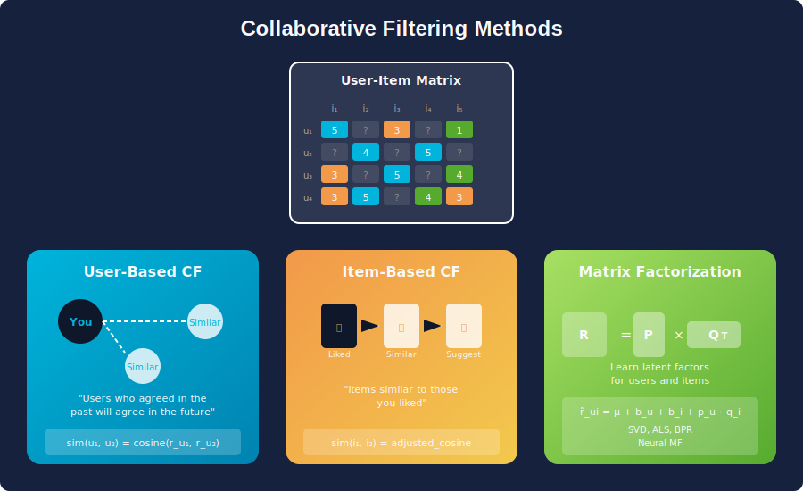
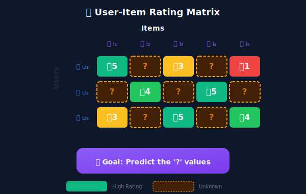
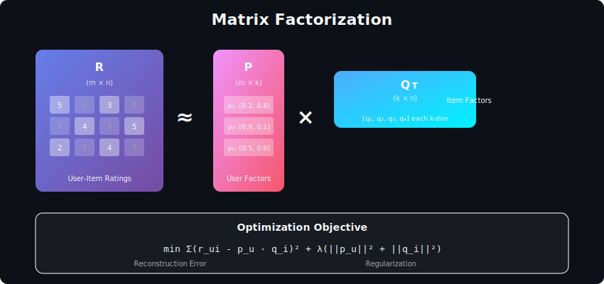

# Collaborative Filtering

<div align="center">



*Learning from the collective wisdom of user behavior patterns*

</div>

---

## Table of Contents
1. [Mathematical Foundation](#mathematical-foundation)
2. [Memory-Based Methods](#memory-based-methods)
3. [Model-Based Methods](#model-based-methods)
4. [Matrix Factorization](#matrix-factorization)
5. [Implicit Feedback](#implicit-feedback)
6. [Scalability](#scalability)
7. [Interview Questions](#interview-questions)

---

## Mathematical Foundation

### The Core Problem

Given a sparse user-item rating matrix \(\mathbf{R} \in \mathbb{R}^{m \times n}\) where most entries are missing, predict the unknown values.



**Sparsity Challenge:**

In practice, \(>99\%\) of \(\mathbf{R}\) is unobserved:

```math
\text{Sparsity} = 1 - \frac{|\{(u,i) : r_{ui} \neq 0\}|}{m \times n}
```

Netflix: ~99.5% sparse | Amazon: ~99.9% sparse

### The CF Hypothesis

> **Users who agreed in the past will agree in the future.**

Mathematically, if users \(u\) and \(v\) have similar rating patterns:

```math
\text{sim}(u, v) > \theta \implies \hat{r}_{ui} \approx r_{vi}
```

### Two Paradigms

| Approach | Key Idea | Computation |
|----------|----------|-------------|
| **Memory-Based** | Directly use \(\mathbf{R}\) | \(O(mn)\) at query time |
| **Model-Based** | Learn compressed representation | \(O(k)\) at query time |

---

## Memory-Based Methods

### User-Based Collaborative Filtering

**Intuition:** Find users similar to target user, aggregate their ratings.

**Prediction Formula:**

```math
\hat{r}_{ui} = \bar{r}_u + \frac{\sum_{v \in \mathcal{N}_k(u)} \text{sim}(u, v) \cdot (r_{vi} - \bar{r}_v)}{\sum_{v \in \mathcal{N}_k(u)} |\text{sim}(u, v)|}
```

Where:
- \(\bar{r}_u\): Mean rating of user \(u\)
- \(\mathcal{N}_k(u)\): \(k\) most similar users to \(u\) who rated item \(i\)
- \(\text{sim}(u, v)\): Similarity between users \(u\) and \(v\)

**Similarity Metrics:**

*Pearson Correlation (adjusts for rating bias):*

```math
\text{sim}(u, v) = \frac{\sum_{i \in \mathcal{I}_{uv}} (r_{ui} - \bar{r}_u)(r_{vi} - \bar{r}_v)}{\sqrt{\sum_{i \in \mathcal{I}_{uv}} (r_{ui} - \bar{r}_u)^2} \cdot \sqrt{\sum_{i \in \mathcal{I}_{uv}} (r_{vi} - \bar{r}_v)^2}}
```

*Cosine Similarity:*

```math
\text{sim}(u, v) = \frac{\mathbf{r}_u \cdot \mathbf{r}_v}{\|\mathbf{r}_u\| \|\mathbf{r}_v\|}
```

### Item-Based Collaborative Filtering

**Intuition:** Find items similar to those the user liked, recommend the most similar.

**Prediction Formula:**

```math
\hat{r}_{ui} = \frac{\sum_{j \in \mathcal{N}_k(i)} \text{sim}(i, j) \cdot r_{uj}}{\sum_{j \in \mathcal{N}_k(i)} |\text{sim}(i, j)|}
```

**Adjusted Cosine Similarity** (for item-item):

```math
\text{sim}(i, j) = \frac{\sum_{u \in \mathcal{U}_{ij}} (r_{ui} - \bar{r}_u)(r_{uj} - \bar{r}_u)}{\sqrt{\sum_{u \in \mathcal{U}_{ij}} (r_{ui} - \bar{r}_u)^2} \cdot \sqrt{\sum_{u \in \mathcal{U}_{ij}} (r_{uj} - \bar{r}_u)^2}}
```

### User-Based vs Item-Based

| Aspect | User-Based | Item-Based |
|--------|------------|------------|
| **Stability** | Users change frequently | Items are static |
| **Scalability** | \(O(m^2)\) user similarities | \(O(n^2)\) item similarities |
| **Cold start** | New users problematic | New items problematic |
| **Explanation** | "Users like you..." | "Because you liked X..." |
| **Typical use** | Small user bases | E-commerce (Amazon) |

---

## Model-Based Methods

### Why Model-Based?

Memory-based limitations:
1. **Scalability**: Computing similarities is expensive at query time
2. **Sparsity**: Few co-rated items → noisy similarity estimates
3. **Coverage**: Can't recommend items with no co-raters

Model-based solution: Learn a **compressed representation** that generalizes beyond observed data.

---

## Matrix Factorization

### The Factorization Model



Approximate \(\mathbf{R}\) as the product of two low-rank matrices:

```math
\mathbf{R} \approx \mathbf{P} \mathbf{Q}^\top
```

Where:
- \(\mathbf{P} \in \mathbb{R}^{m \times k}\): User latent factor matrix
- \(\mathbf{Q} \in \mathbb{R}^{n \times k}\): Item latent factor matrix
- \(k \ll \min(m, n)\): Latent dimension (rank)

**Prediction:**

```math
\hat{r}_{ui} = \mathbf{p}_u^\top \mathbf{q}_i = \sum_{f=1}^{k} p_{uf} \cdot q_{if}
```

### Optimization Objective

**Regularized Least Squares:**

```math
\min_{\mathbf{P}, \mathbf{Q}} \sum_{(u,i) \in \mathcal{O}} \left(r_{ui} - \mathbf{p}_u^\top \mathbf{q}_i\right)^2 + \lambda \left(\|\mathbf{P}\|_F^2 + \|\mathbf{Q}\|_F^2\right)
```

Where \(\mathcal{O}\) is the set of observed ratings.

### Adding Biases

Real ratings have systematic biases:

```math
\hat{r}_{ui} = \mu + b_u + b_i + \mathbf{p}_u^\top \mathbf{q}_i
```

Where:
- \(\mu\): Global average rating
- \(b_u\): User bias (some users rate higher)
- \(b_i\): Item bias (some items are better)

**Extended Objective:**

```math
\min_{\mathbf{P}, \mathbf{Q}, \mathbf{b}} \sum_{(u,i) \in \mathcal{O}} \left(r_{ui} - \mu - b_u - b_i - \mathbf{p}_u^\top \mathbf{q}_i\right)^2 + \lambda \left(\|\mathbf{P}\|_F^2 + \|\mathbf{Q}\|_F^2 + \|\mathbf{b}_u\|^2 + \|\mathbf{b}_i\|^2\right)
```

### Optimization Algorithms

**Stochastic Gradient Descent (SGD):**

For each observed \((u, i, r_{ui})\):

```math
e_{ui} = r_{ui} - \hat{r}_{ui}
\mathbf{p}_u \leftarrow \mathbf{p}_u + \eta (e_{ui} \cdot \mathbf{q}_i - \lambda \mathbf{p}_u)
\mathbf{q}_i \leftarrow \mathbf{q}_i + \eta (e_{ui} \cdot \mathbf{p}_u - \lambda \mathbf{q}_i)
b_u \leftarrow b_u + \eta (e_{ui} - \lambda b_u)
b_i \leftarrow b_i + \eta (e_{ui} - \lambda b_i)
```

**Alternating Least Squares (ALS):**

Fix \(\mathbf{Q}\), solve for \(\mathbf{P}\) (closed-form):

```math
\mathbf{p}_u = \left(\mathbf{Q}_{\mathcal{I}_u}^\top \mathbf{Q}_{\mathcal{I}_u} + \lambda \mathbf{I}\right)^{-1} \mathbf{Q}_{\mathcal{I}_u}^\top \mathbf{r}_u
```

Then fix \(\mathbf{P}\), solve for \(\mathbf{Q}\). Repeat until convergence.

| Algorithm | Pros | Cons |
|-----------|------|------|
| **SGD** | Memory efficient, online updates | Sensitive to learning rate |
| **ALS** | Parallelizable, stable | Requires matrix inversion |

### SVD++ (Incorporating Implicit Feedback)

Enhance user representation with items they've interacted with:

```math
\hat{r}_{ui} = \mu + b_u + b_i + \mathbf{q}_i^\top \left(\mathbf{p}_u + \frac{1}{\sqrt{|\mathcal{N}(u)|}} \sum_{j \in \mathcal{N}(u)} \mathbf{y}_j\right)
```

Where \(\mathbf{y}_j\) captures implicit feedback from item \(j\).

---

## Implicit Feedback

### The Challenge

Implicit feedback (clicks, views, purchases) differs from explicit ratings:
- **No negative signal**: Missing = unknown, not disliked
- **Confidence varies**: More interactions → higher confidence
- **Abundance**: Much more data available

### Weighted Matrix Factorization


**Preference and Confidence:**

```math
p_{ui} = \begin{cases} 1 & \text{if } r_{ui} > 0 \\ 0 & \text{otherwise} \end{cases}
c_{ui} = 1 + \alpha \cdot r_{ui}
```

Where \(\alpha\) controls confidence scaling.

**Objective:**

```math
\min_{\mathbf{P}, \mathbf{Q}} \sum_{u,i} c_{ui} \left(p_{ui} - \mathbf{p}_u^\top \mathbf{q}_i\right)^2 + \lambda \left(\|\mathbf{P}\|_F^2 + \|\mathbf{Q}\|_F^2\right)
```

### Bayesian Personalized Ranking (BPR)

**Pairwise learning:** Optimize the order of items, not absolute values.

For triplet \((u, i, j)\) where user \(u\) prefers \(i\) over \(j\):

```math
\hat{x}_{uij} = \hat{r}_{ui} - \hat{r}_{uj} = \mathbf{p}_u^\top (\mathbf{q}_i - \mathbf{q}_j)
```

**BPR Objective:**

```math
\text{BPR-OPT} = \sum_{(u,i,j) \in D_S} \ln \sigma(\hat{x}_{uij}) - \lambda_\Theta \|\Theta\|^2
```

Where \(\sigma(x) = \frac{1}{1 + e^{-x}}\) is the sigmoid function.

**Sampling Strategy:**
- \(i\): Item user interacted with (positive)
- \(j\): Item user didn't interact with (negative, sampled)

---

## Scalability

### Complexity Analysis

| Operation | Memory-Based | Matrix Factorization |
|-----------|--------------|---------------------|
| **Training** | \(O(1)\) (no training) | \(O(|\mathcal{O}| \cdot k \cdot T)\) |
| **Prediction** | \(O(m \cdot \bar{n})\) | \(O(k)\) |
| **Storage** | \(O(|\mathcal{O}|)\) | \(O((m + n) \cdot k)\) |

Where \(\bar{n}\) is average items per user, \(T\) is iterations.

### Distributed Training (ALS)

ALS is **embarrassingly parallel**:

1. **Fix Q, update P**: Each \(\mathbf{p}_u\) independent
2. **Fix P, update Q**: Each \(\mathbf{q}_i\) independent

```math
\mathbf{p}_u = \left(\mathbf{Q}^\top \mathbf{C}_u \mathbf{Q} + \lambda \mathbf{I}\right)^{-1} \mathbf{Q}^\top \mathbf{C}_u \mathbf{p}_u
```

Where \(\mathbf{C}_u = \text{diag}(c_{u1}, \ldots, c_{un})\).

### Approximate Methods

**Stochastic Neighbor Selection:**
Instead of all neighbors, sample \(k\) neighbors weighted by similarity.

**Locality-Sensitive Hashing (LSH):**
Approximate nearest neighbor search in \(O(\log n)\) instead of \(O(n)\).

**Factorization with Sampling:**
Train on sampled negative examples instead of all \(m \times n\) pairs.

---

## Summary: CF Methods Comparison

| Method | Sparsity Handling | Scalability | Cold Start | Explainability |
|--------|-------------------|-------------|------------|----------------|
| **User-kNN** | Poor | Poor | Users ❌ | High |
| **Item-kNN** | Poor | Moderate | Items ❌ | High |
| **SVD** | Good | Good | Both ❌ | Low |
| **ALS** | Good | Excellent | Both ❌ | Low |
| **BPR** | Excellent | Good | Both ❌ | Low |

---

## Interview Questions

### Q1: When would you use User-Based vs Item-Based CF?

**User-Based:**
- Fewer users than items
- User preferences relatively stable
- Need "users like you" explanations

**Item-Based:**
- Fewer items than users (typical for e-commerce)
- Item similarities more stable over time
- Need "because you liked X" explanations

### Q2: How does matrix factorization handle sparsity?

**Key insight:** MF learns a **compressed representation** that generalizes.

1. **Latent factors** capture underlying patterns
2. **Regularization** prevents overfitting to observed data
3. **All entries predicted**, not just co-rated items
4. **Low-rank assumption** → similar users/items share factors

### Q3: Explain the difference between SGD and ALS for MF.

| Aspect | SGD | ALS |
|--------|-----|-----|
| **Update** | One (u,i) at a time | All users, then all items |
| **Parallelization** | Limited | Highly parallel |
| **Convergence** | Sensitive to learning rate | More stable |
| **Implicit feedback** | Difficult (many zeros) | Natural (closed-form) |
| **Memory** | Low | Higher (matrix inversions) |

### Q4: How do you handle negative samples in implicit feedback?

**Strategies:**

1. **Uniform sampling**: Random unobserved items
2. **Popularity sampling**: \(P(j) \propto |U_j|^{0.75}\)
3. **Hard negatives**: Items similar to positives
4. **In-batch negatives**: Use other users' positives

**Trade-off:** Easy negatives → fast but poor discrimination  
Hard negatives → slower but better boundaries

---

## Further Reading

1. **Koren et al. (2009)** — Matrix Factorization Techniques for Recommender Systems
2. **Hu et al. (2008)** — Collaborative Filtering for Implicit Feedback Datasets
3. **Rendle et al. (2009)** — BPR: Bayesian Personalized Ranking
4. **Koren (2008)** — Factorization Meets the Neighborhood
5. **He et al. (2017)** — Neural Collaborative Filtering

---

<div align="center">

*Collaborative filtering transforms collective behavior into personalized predictions.*

</div>

---

<div align="center">

**[⬆ Back to Top](#)** | **[📚 Main Repository](https://github.com/Gaurav14cs17/ml_system_design)**

Made with 💜 by [Gaurav14cs17](https://github.com/Gaurav14cs17)

</div>
