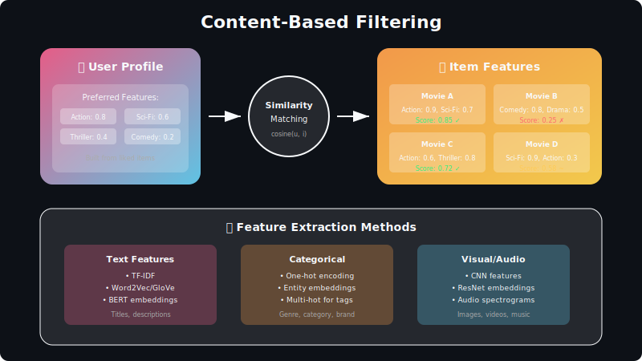

# Content-Based Filtering

<div align="center">



*Recommending based on item attributes and user preference profiles*

</div>

---

## Table of Contents
1. [Mathematical Foundation](#mathematical-foundation)
2. [Feature Extraction](#feature-extraction)
3. [User Profile Construction](#user-profile-construction)
4. [Similarity Methods](#similarity-methods)
5. [Deep Learning Approaches](#deep-learning-approaches)
6. [Advantages and Limitations](#advantages-and-limitations)
7. [Interview Questions](#interview-questions)

---

## Mathematical Foundation

### The Core Idea

Content-based filtering recommends items similar to those a user previously liked, based on item features rather than user interactions.


**Formal Definition:**

Given:
- Item feature vector: \(\mathbf{x}_i \in \mathbb{R}^d\)
- User preference profile: \(\mathbf{u} \in \mathbb{R}^d\)

The relevance score is:
```math
s(u, i) = f(\mathbf{u}, \mathbf{x}_i)
```

Most commonly: \(f = \text{cosine similarity}\) or \(f = \text{dot product}\)

### When Content-Based Excels

| Scenario | Why CBF Works |
|----------|---------------|
| **New Items** | No interaction history needed |
| **Long-tail Items** | Works even with few ratings |
| **Explainability** | "Because this has feature X" |
| **Privacy** | No cross-user data sharing |

---

## Feature Extraction

### Text Features: TF-IDF

**Term Frequency:**
```math
\text{TF}(t, d) = \frac{f_{t,d}}{\sum_{t' \in d} f_{t',d}}
```

**Inverse Document Frequency:**
```math
\text{IDF}(t) = \log \frac{N}{|\{d : t \in d\}|}
```

**TF-IDF Score:**
```math
\text{TF-IDF}(t, d) = \text{TF}(t, d) \times \text{IDF}(t)
```

**Example:** Movie description "An exciting action thriller"

| Term | TF | IDF | TF-IDF |
|------|----|----|--------|
| exciting | 0.25 | 2.3 | 0.575 |
| action | 0.25 | 1.2 | 0.300 |
| thriller | 0.25 | 1.8 | 0.450 |

### Semantic Embeddings

Modern approach using pre-trained language models:

```math
\mathbf{x}_{\text{text}} = \text{Encoder}(\text{description}) \in \mathbb{R}^{768}
```

**Models:** BERT, Sentence-BERT, T5

**Advantage:** Captures semantic meaning, not just word overlap

### Categorical Features

**One-Hot Encoding:**
```math
\mathbf{x}_{\text{genre}} = [0, 1, 0, 0, 1, 0]^T
```

For genres: [Action, Comedy, Drama, Horror, Thriller, Romance]

**Multi-Hot for Multiple Categories:**
```math
\mathbf{x}_{\text{tags}} = \sum_{t \in \text{tags}(i)} \mathbf{e}_t
```

### Image Features

Extract visual features using CNN:
```math
\mathbf{x}_{\text{image}} = \text{CNN}_{\text{pool}}(\text{image}) \in \mathbb{R}^{2048}
```

**Common models:** ResNet, VGG, EfficientNet

### Feature Combination

**Concatenation:**
```math
\mathbf{x}_i = [\mathbf{x}_{\text{text}} \oplus \mathbf{x}_{\text{categorical}} \oplus \mathbf{x}_{\text{image}}]
```

**Weighted Combination:**
```math
\mathbf{x}_i = \alpha \cdot \mathbf{x}_{\text{text}} + \beta \cdot \mathbf{x}_{\text{categorical}} + \gamma \cdot \mathbf{x}_{\text{image}}
```

With learnable weights \(\alpha, \beta, \gamma\)

---

## User Profile Construction

### Aggregating from Interaction History

Given user \(u\)'s interacted items \(\mathcal{H}_u = \{i_1, i_2, \ldots, i_n\}\):

**Simple Mean:**
```math
\mathbf{u} = \frac{1}{|\mathcal{H}_u|} \sum_{i \in \mathcal{H}_u} \mathbf{x}_i
```

**Rating-Weighted Mean:**
```math
\mathbf{u} = \frac{\sum_{i \in \mathcal{H}_u} r_{ui} \cdot \mathbf{x}_i}{\sum_{i \in \mathcal{H}_u} r_{ui}}
```

**Recency-Weighted:**
```math
\mathbf{u} = \frac{\sum_{i \in \mathcal{H}_u} \lambda^{t_{\max} - t_i} \cdot \mathbf{x}_i}{\sum_{i \in \mathcal{H}_u} \lambda^{t_{\max} - t_i}}
```

Where \(\lambda \in (0, 1)\) is decay factor and \(t_i\) is interaction time.

### Positive vs Negative Feedback

**Discriminative Profile:**
```math
\mathbf{u} = \frac{1}{|\mathcal{H}_u^+|} \sum_{i \in \mathcal{H}_u^+} \mathbf{x}_i - \frac{1}{|\mathcal{H}_u^-|} \sum_{j \in \mathcal{H}_u^-} \mathbf{x}_j
```

Subtracting disliked item features from liked ones.

---

## Similarity Methods

### Cosine Similarity

```math
\text{sim}(\mathbf{u}, \mathbf{x}_i) = \frac{\mathbf{u}^\top \mathbf{x}_i}{\|\mathbf{u}\| \|\mathbf{x}_i\|} = \cos(\theta)
```

**Properties:**
- Range: \([-1, 1]\) (or \([0, 1]\) for non-negative features)
- Scale-invariant: Only direction matters
- Most common in practice

### Euclidean Distance

```math
\text{sim}(\mathbf{u}, \mathbf{x}_i) = \frac{1}{1 + \|\mathbf{u} - \mathbf{x}_i\|_2}
```

**Properties:**
- Magnitude-sensitive
- Bounded \((0, 1]\)

### Pearson Correlation

```math
\text{sim}(\mathbf{u}, \mathbf{x}_i) = \frac{\sum_j (u_j - \bar{u})(x_{ij} - \bar{x}_i)}{\sqrt{\sum_j (u_j - \bar{u})^2} \sqrt{\sum_j (x_{ij} - \bar{x}_i)^2}}
```

**Properties:**
- Mean-centered: Adjusts for feature biases
- Range: \([-1, 1]\)

### Jaccard Similarity (Binary Features)

```math
\text{sim}(A, B) = \frac{|A \cap B|}{|A \cup B|}
```

Useful for binary features like genre tags.

---

## Deep Learning Approaches

### Neural Content Model


**Architecture:**
1. Feature-specific encoders (text, image, categorical)
2. Fusion layer
3. Final projection to embedding space

**Forward Pass:**
```math
\mathbf{z}_{\text{text}} = \text{TextEncoder}(\mathbf{x}_{\text{text}})
\mathbf{z}_{\text{image}} = \text{ImageEncoder}(\mathbf{x}_{\text{image}})
\mathbf{z}_{\text{cat}} = \text{CatEncoder}(\mathbf{x}_{\text{cat}})
\mathbf{e}_i = \text{MLP}([\mathbf{z}_{\text{text}} \oplus \mathbf{z}_{\text{image}} \oplus \mathbf{z}_{\text{cat}}])
```

### Contrastive Learning

Learn embeddings where similar items are close:

**InfoNCE Loss:**
```math
\mathcal{L} = -\log \frac{\exp(\mathbf{e}_i^\top \mathbf{e}_{i^+} / \tau)}{\exp(\mathbf{e}_i^\top \mathbf{e}_{i^+} / \tau) + \sum_{j \in \mathcal{N}} \exp(\mathbf{e}_i^\top \mathbf{e}_j / \tau)}
```

Where:
- \(i^+\): Positive (similar) item
- \(\mathcal{N}\): Negative samples
- \(\tau\): Temperature

### Cross-Modal Learning

For items with multiple modalities (text + image):

**CLIP-style:**
```math
\mathcal{L} = -\frac{1}{2}\left(\log \frac{\exp(\mathbf{z}_{\text{text}}^\top \mathbf{z}_{\text{image}} / \tau)}{\sum_j \exp(\mathbf{z}_{\text{text}}^\top \mathbf{z}_{\text{image},j} / \tau)} + \text{symmetric}\right)
```

---

## Advantages and Limitations

### Advantages

| Advantage | Mathematical Reason |
|-----------|---------------------|
| **No cold-start for items** | \(\mathbf{x}_i\) available immediately from features |
| **Transparency** | \(s(u,i) = \mathbf{u}^\top \mathbf{x}_i\) interpretable |
| **User independence** | No cross-user data needed |
| **Domain transfer** | Features transfer across platforms |

### Limitations

| Limitation | Mathematical Reason |
|------------|---------------------|
| **Over-specialization** | Recommendations too similar to history |
| **Cold-start for users** | Need \(\mathcal{H}_u\) to build \(\mathbf{u}\) |
| **Feature engineering** | Quality depends on \(\mathbf{x}_i\) design |
| **Serendipity** | Won't discover items outside \(\text{span}(\mathcal{H}_u)\) |

### The Filter Bubble Problem

Content-based systems can trap users:
```math
\mathbf{u}_{t+1} = f(\mathbf{u}_t, \text{recs}(\mathbf{u}_t))
```

Recommendations reinforce existing preferences → narrowing exposure.

**Solution: Diversity Injection**
```math
\text{recs} = \arg\max \left[\alpha \cdot \text{relevance} + (1-\alpha) \cdot \text{diversity}\right]
```

---

## Comparison with Collaborative Filtering

| Aspect | Content-Based | Collaborative |
|--------|---------------|---------------|
| **Data needed** | Item features | User-item interactions |
| **Cold-start items** | ✓ Works | ✗ Fails |
| **Cold-start users** | Needs history | Also needs history |
| **Serendipity** | Low | High |
| **Scalability** | \(O(nd)\) features | \(O(mn)\) interactions |
| **Explainability** | "Similar content" | "Users like you" |

**Best Practice:** Combine both in hybrid systems.

---

## Interview Questions

### Q1: When would you use content-based over collaborative filtering?

**Use Content-Based:**
- New items with no interactions (cold start)
- Privacy-sensitive (no cross-user data)
- Explainability is critical
- Rich item metadata available

**Use Collaborative:**
- Sufficient interaction history
- Want serendipitous recommendations
- Items lack good features

### Q2: How do you handle the filter bubble problem?

**Strategies:**
1. **Exploration bonus:** \(s'(u,i) = s(u,i) + \epsilon \cdot \text{novelty}(i)\)
2. **Diversity constraint:** MMR (Maximal Marginal Relevance)
3. **Randomization:** Inject random items periodically
4. **Multi-armed bandits:** Systematic exploration

### Q3: Compare TF-IDF vs neural embeddings for text features.

| Aspect | TF-IDF | Neural Embeddings |
|--------|--------|-------------------|
| **Semantic understanding** | Word matching only | Captures meaning |
| **Dimensionality** | Vocabulary size | Fixed (e.g., 768) |
| **Computational cost** | Low | Higher (model inference) |
| **Transfer learning** | None | Pre-trained models |
| **Interpretability** | High (word weights) | Low (dense vectors) |

---

## Further Reading

1. **Lops et al. (2011)** — Content-based Recommender Systems: State of the Art
2. **Pazzani & Billsus (2007)** — Content-Based Recommendation Systems
3. **Devlin et al. (2019)** — BERT: Pre-training of Deep Bidirectional Transformers
4. **Radford et al. (2021)** — CLIP: Learning Transferable Visual Models

---

<div align="center">

*Content-based filtering: When you know what you're looking for, features show the way.*

</div>

---

<div align="center">

**[⬆ Back to Top](#)** | **[📚 Main Repository](https://github.com/Gaurav14cs17/ml_system_design)**

Made with 💜 by [Gaurav14cs17](https://github.com/Gaurav14cs17)

</div>
