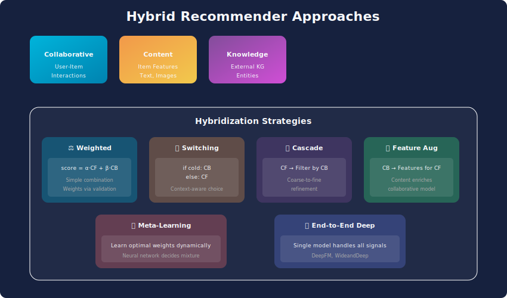
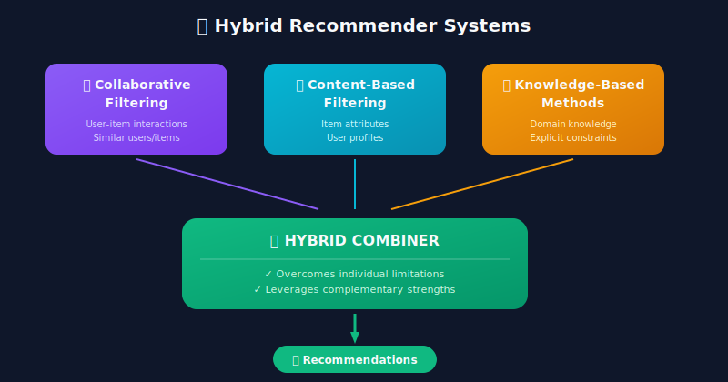

# Hybrid Recommender Systems: Complete Guide



## Table of Contents
1. [Introduction](#introduction)
2. [Hybridization Strategies](#hybridization-strategies)
3. [Weighted Hybrid Systems](#weighted-hybrid-systems)
4. [Switching Hybrid Systems](#switching-hybrid-systems)
5. [Feature Combination Hybrid](#feature-combination-hybrid)
6. [Cascade Hybrid Systems](#cascade-hybrid-systems)
7. [Meta-Level Hybrid](#meta-level-hybrid)
8. [Deep Learning Hybrid Models](#deep-learning-hybrid-models)
9. [Production Implementation](#production-implementation)
10. [Interview Questions](#interview-questions)

---

## Introduction

Hybrid recommender systems combine multiple recommendation techniques to overcome limitations of individual approaches. The key insight: **no single technique is optimal for all scenarios**.

### Why Hybrid?

| Individual Approach | Limitation | Hybrid Solution |
|---------------------|------------|-----------------|
| Collaborative Filtering | Cold start problem | Add content-based for new items |
| Content-Based | Filter bubble | Add CF for serendipity |
| Knowledge-Based | Maintenance overhead | Add learning from data |
| Popularity-Based | No personalization | Blend with user preferences |

### The Hybrid Advantage



---

## Hybridization Strategies

### Overview of Strategies

| Strategy | Description | When to Use |
|----------|-------------|-------------|
| **Weighted** | Combine scores linearly | Multiple reliable signals |
| **Switching** | Select best technique per context | Clear regime differences |
| **Mixed** | Present results side-by-side | Diverse recommendation needs |
| **Feature Combination** | Combine features before model | Rich multimodal data |
| **Cascade** | Refine with successive techniques | Need for precision |
| **Feature Augmentation** | Output of one feeds another | Complementary information |
| **Meta-Level** | Model learns from model outputs | Learning optimal combination |

---

## Weighted Hybrid Systems

```python
import numpy as np
from typing import Dict, List, Tuple

class WeightedHybridRecommender:
    """
    Combine multiple recommenders with learned or fixed weights

    Score = Σ(weight_i × score_i)
    """

    def __init__(self, recommenders: Dict[str, object], weights: Dict[str, float] = None):
        self.recommenders = recommenders
        self.weights = weights or {name: 1.0 / len(recommenders) for name in recommenders}

        # Normalize weights
        total = sum(self.weights.values())
        self.weights = {k: v / total for k, v in self.weights.items()}

    def recommend(self, user_id: int, n_items: int = 10, context: dict = None) -> List[Tuple[int, float]]:
        """
        Generate hybrid recommendations
        """
        all_scores = {}

        for name, recommender in self.recommenders.items():

            # Get recommendations from each system
            recs = recommender.recommend(user_id, n_items * 3, context)

            for item_id, score in recs:
                if item_id not in all_scores:
                    all_scores[item_id] = {}
                all_scores[item_id][name] = score

        # Combine scores
        combined_scores = []
        for item_id, scores in all_scores.items():
            weighted_score = sum(
                self.weights[name] * scores.get(name, 0)
                for name in self.recommenders
            )
            combined_scores.append((item_id, weighted_score))

        # Sort and return top-N
        combined_scores.sort(key=lambda x: x[1], reverse=True)
        return combined_scores[:n_items]

    def set_weights(self, weights: Dict[str, float]):
        """Update combination weights"""
        total = sum(weights.values())
        self.weights = {k: v / total for k, v in weights.items()}

class AdaptiveWeightedHybrid:
    """
    Learn optimal weights through online optimization
    """

    def __init__(self, recommenders: Dict[str, object], learning_rate: float = 0.01):
        self.recommenders = recommenders
        self.lr = learning_rate

        # Initialize uniform weights
        n = len(recommenders)
        self.weights = {name: 1.0 / n for name in recommenders}

        # Track performance per recommender
        self.performance_history = {name: [] for name in recommenders}

    def recommend(self, user_id: int, n_items: int = 10) -> Tuple[List, Dict[str, float]]:
        """Generate recommendations with current weights"""
        all_scores = {}
        individual_recs = {}

        for name, recommender in self.recommenders.items():
            recs = recommender.recommend(user_id, n_items * 2)
            individual_recs[name] = recs

            for item_id, score in recs:
                if item_id not in all_scores:
                    all_scores[item_id] = {}
                all_scores[item_id][name] = score

        # Weighted combination
        combined = []
        for item_id, scores in all_scores.items():
            weighted_score = sum(
                self.weights[name] * scores.get(name, 0)
                for name in self.recommenders
            )
            combined.append((item_id, weighted_score))

        combined.sort(key=lambda x: x[1], reverse=True)

        return combined[:n_items], individual_recs

    def update_weights(self, feedback: Dict[str, float]):
        """
        Update weights based on user feedback

        feedback: Dict mapping recommender name to reward signal
        """

        # Softmax update with multiplicative weights
        for name in self.recommenders:
            reward = feedback.get(name, 0)
            self.performance_history[name].append(reward)

            # Exponential moving average of performance
            if len(self.performance_history[name]) > 1:
                avg_reward = np.mean(self.performance_history[name][-100:])
                self.weights[name] *= np.exp(self.lr * avg_reward)

        # Renormalize
        total = sum(self.weights.values())
        self.weights = {k: v / total for k, v in self.weights.items()}
```

### Score Normalization

```python
class ScoreNormalizer:
    """
    Normalize scores from different recommenders to comparable scales
    """

    @staticmethod
    def min_max_normalize(scores: List[float]) -> List[float]:
        """Scale to [0, 1]"""
        if not scores:
            return []
        min_s, max_s = min(scores), max(scores)
        if max_s == min_s:
            return [0.5] * len(scores)
        return [(s - min_s) / (max_s - min_s) for s in scores]

    @staticmethod
    def z_score_normalize(scores: List[float]) -> List[float]:
        """Standardize to mean=0, std=1"""
        if not scores:
            return []
        mean = np.mean(scores)
        std = np.std(scores)
        if std == 0:
            return [0] * len(scores)
        return [(s - mean) / std for s in scores]

    @staticmethod
    def rank_normalize(scores: List[float]) -> List[float]:
        """Convert to percentile ranks"""
        if not scores:
            return []
        n = len(scores)
        ranked = np.argsort(np.argsort(scores))
        return [r / (n - 1) if n > 1 else 0.5 for r in ranked]
```

---

## Switching Hybrid Systems

```python
class SwitchingHybridRecommender:
    """
    Dynamically select the best recommender based on context
    """

    def __init__(self, recommenders: Dict[str, object], selector):
        self.recommenders = recommenders
        self.selector = selector  # Function that chooses which recommender to use

    def recommend(self, user_id: int, n_items: int, context: dict) -> List[Tuple[int, float]]:
        """
        Select appropriate recommender based on context
        """
        selected_name = self.selector(user_id, context)
        selected_recommender = self.recommenders[selected_name]

        return selected_recommender.recommend(user_id, n_items, context)

class ColdStartSwitchingHybrid:
    """
    Switch between CF and content-based based on user history
    """

    def __init__(
        self,
        cf_recommender,
        content_recommender,
        popularity_recommender,
        cold_threshold: int = 5,
        warm_threshold: int = 20
    ):
        self.cf = cf_recommender
        self.content = content_recommender
        self.popularity = popularity_recommender
        self.cold_threshold = cold_threshold
        self.warm_threshold = warm_threshold

    def recommend(self, user_id: int, user_history: list, n_items: int = 10):
        """
        Route to appropriate recommender based on user maturity
        """
        n_interactions = len(user_history)

        if n_interactions == 0:

            # Pure cold start - use popularity
            return self.popularity.recommend(n_items), 'popularity'

        elif n_interactions < self.cold_threshold:

            # Light user - use content-based
            return self.content.recommend(user_id, n_items), 'content'

        elif n_interactions < self.warm_threshold:

            # Warming up - blend CF and content
            cf_recs = self.cf.recommend(user_id, n_items)
            content_recs = self.content.recommend(user_id, n_items)

            # Interpolate
            alpha = (n_interactions - self.cold_threshold) / (self.warm_threshold - self.cold_threshold)
            blended = self._blend_recommendations(cf_recs, content_recs, alpha)

            return blended, 'blended'

        else:

            # Mature user - use CF
            return self.cf.recommend(user_id, n_items), 'collaborative'

    def _blend_recommendations(self, cf_recs, content_recs, alpha):
        """Blend two recommendation lists"""
        all_items = {}

        for rank, (item, score) in enumerate(cf_recs):
            all_items[item] = {'cf_rank': rank, 'cf_score': score}

        for rank, (item, score) in enumerate(content_recs):
            if item in all_items:
                all_items[item]['content_rank'] = rank
                all_items[item]['content_score'] = score
            else:
                all_items[item] = {'content_rank': rank, 'content_score': score}

        # Compute blended score
        blended = []
        for item, data in all_items.items():
            cf_score = 1 - data.get('cf_rank', len(cf_recs)) / len(cf_recs)
            content_score = 1 - data.get('content_rank', len(content_recs)) / len(content_recs)

            final_score = alpha * cf_score + (1 - alpha) * content_score
            blended.append((item, final_score))

        blended.sort(key=lambda x: x[1], reverse=True)
        return blended
```

---

## Feature Combination Hybrid

```python
import torch
import torch.nn as nn

class FeatureCombinationHybrid(nn.Module):
    """
    Combine collaborative and content features in a unified model
    """

    def __init__(
        self,
        n_users: int,
        n_items: int,
        cf_embedding_dim: int = 64,
        content_feature_dim: int = 256,
        hidden_dims: List[int] = [128, 64]
    ):
        super().__init__()

        # Collaborative filtering components
        self.user_embedding = nn.Embedding(n_users, cf_embedding_dim)
        self.item_embedding = nn.Embedding(n_items, cf_embedding_dim)

        # Content feature processor
        self.content_processor = nn.Sequential(
            nn.Linear(content_feature_dim, 128),
            nn.ReLU(),
            nn.Linear(128, cf_embedding_dim)
        )

        # Combined feature processor
        combined_dim = cf_embedding_dim * 3  # user + item_cf + item_content

        layers = []
        prev_dim = combined_dim
        for hidden_dim in hidden_dims:
            layers.extend([
                nn.Linear(prev_dim, hidden_dim),
                nn.ReLU(),
                nn.BatchNorm1d(hidden_dim),
                nn.Dropout(0.2)
            ])
            prev_dim = hidden_dim

        layers.append(nn.Linear(prev_dim, 1))
        self.predictor = nn.Sequential(*layers)

    def forward(self, user_ids, item_ids, content_features):
        """
        Predict using combined features
        """

        # CF embeddings
        user_emb = self.user_embedding(user_ids)
        item_cf_emb = self.item_embedding(item_ids)

        # Content embeddings
        item_content_emb = self.content_processor(content_features)

        # Concatenate all features
        combined = torch.cat([user_emb, item_cf_emb, item_content_emb], dim=-1)

        # Predict
        output = self.predictor(combined)

        return output.squeeze()

class DeepHybridRecommender(nn.Module):
    """
    Deep hybrid model with attention-based feature fusion
    """

    def __init__(
        self,
        n_users: int,
        n_items: int,
        embedding_dim: int = 64,
        content_dim: int = 256,
        context_dim: int = 32
    ):
        super().__init__()

        # Embeddings
        self.user_embedding = nn.Embedding(n_users, embedding_dim)
        self.item_embedding = nn.Embedding(n_items, embedding_dim)

        # Feature processors
        self.content_encoder = nn.Linear(content_dim, embedding_dim)
        self.context_encoder = nn.Linear(context_dim, embedding_dim)

        # Cross-attention for feature fusion
        self.cross_attention = nn.MultiheadAttention(
            embed_dim=embedding_dim,
            num_heads=4,
            batch_first=True
        )

        # Final prediction
        self.predictor = nn.Sequential(
            nn.Linear(embedding_dim * 2, 128),
            nn.ReLU(),
            nn.Linear(128, 1),
            nn.Sigmoid()
        )

    def forward(self, user_ids, item_ids, content_features, context_features):
        """
        Forward pass with attention-based fusion
        """

        # Get base embeddings
        user_emb = self.user_embedding(user_ids)
        item_emb = self.item_embedding(item_ids)

        # Encode additional features
        content_emb = self.content_encoder(content_features)
        context_emb = self.context_encoder(context_features)

        # Stack item features for attention
        item_features = torch.stack([item_emb, content_emb, context_emb], dim=1)

        # User attends to item features
        fused_item, attention_weights = self.cross_attention(
            user_emb.unsqueeze(1),
            item_features,
            item_features
        )
        fused_item = fused_item.squeeze(1)

        # Combine for prediction
        combined = torch.cat([user_emb, fused_item], dim=-1)
        prediction = self.predictor(combined)

        return prediction.squeeze(), attention_weights
```

---

## Cascade Hybrid Systems

```python
class CascadeHybridRecommender:
    """
    Multi-stage recommendation with successive refinement

    Stage 1: Broad candidate generation (fast, high recall)
    Stage 2: Ranking (accurate, on smaller set)
    Stage 3: Re-ranking (business rules, diversity)
    """

    def __init__(
        self,
        candidate_generators: List[object],
        ranker,
        reranker=None
    ):
        self.generators = candidate_generators
        self.ranker = ranker
        self.reranker = reranker

    def recommend(self, user_id: int, n_items: int = 10, context: dict = None):
        """
        Multi-stage recommendation pipeline
        """

        # Stage 1: Candidate Generation
        candidates = self._generate_candidates(user_id, n_items * 10, context)

        # Stage 2: Ranking
        ranked = self._rank_candidates(user_id, candidates, context)

        # Stage 3: Re-ranking (optional)
        if self.reranker:
            final = self._rerank(user_id, ranked[:n_items * 2], context)
        else:
            final = ranked

        return final[:n_items]

    def _generate_candidates(self, user_id, n_candidates, context):
        """
        Combine candidates from multiple generators
        """
        all_candidates = set()

        per_generator = n_candidates // len(self.generators)

        for generator in self.generators:
            candidates = generator.generate(user_id, per_generator, context)
            all_candidates.update(candidates)

        return list(all_candidates)

    def _rank_candidates(self, user_id, candidates, context):
        """
        Score and rank candidates
        """
        scored = []

        for item_id in candidates:
            score = self.ranker.score(user_id, item_id, context)
            scored.append((item_id, score))

        scored.sort(key=lambda x: x[1], reverse=True)
        return scored

    def _rerank(self, user_id, ranked_items, context):
        """
        Apply re-ranking for diversity, business rules, etc.
        """
        return self.reranker.rerank(user_id, ranked_items, context)

class DiversityReranker:
    """
    Re-rank to ensure diverse recommendations
    """

    def __init__(self, item_features, diversity_weight=0.3):
        self.item_features = item_features
        self.diversity_weight = diversity_weight

    def rerank(self, user_id, ranked_items, context=None):
        """
        MMR-style re-ranking for diversity

        Score = (1-λ) * relevance - λ * max_similarity_to_selected
        """
        if not ranked_items:
            return []

        selected = []
        remaining = list(ranked_items)

        # Select first item (highest relevance)
        selected.append(remaining.pop(0))

        while remaining and len(selected) < len(ranked_items):
            best_score = float('-inf')
            best_idx = 0

            for i, (item_id, relevance) in enumerate(remaining):

                # Compute max similarity to already selected items
                max_sim = max(
                    self._similarity(item_id, sel_item)
                    for sel_item, _ in selected
                )

                # MMR score
                mmr_score = (1 - self.diversity_weight) * relevance - \
                           self.diversity_weight * max_sim

                if mmr_score > best_score:
                    best_score = mmr_score
                    best_idx = i

            selected.append(remaining.pop(best_idx))

        return selected

    def _similarity(self, item1, item2):
        """Compute content similarity between items"""
        if item1 not in self.item_features or item2 not in self.item_features:
            return 0

        vec1 = self.item_features[item1]
        vec2 = self.item_features[item2]

        return np.dot(vec1, vec2) / (np.linalg.norm(vec1) * np.linalg.norm(vec2) + 1e-8)
```

---

## Meta-Level Hybrid

```python
class MetaLevelHybrid:
    """
    Use one recommender's output as input features for another
    """

    def __init__(self, base_recommender, meta_model):
        self.base = base_recommender
        self.meta = meta_model

    def train(self, training_data):
        """
        Train meta-model on base recommender outputs
        """

        # Get base predictions for training data
        meta_features = []
        labels = []

        for user_id, item_id, rating in training_data:

            # Base recommender features
            base_score = self.base.predict(user_id, item_id)
            base_embedding = self.base.get_user_embedding(user_id)

            feature = np.concatenate([[base_score], base_embedding])
            meta_features.append(feature)
            labels.append(rating)

        # Train meta-model
        self.meta.fit(np.array(meta_features), np.array(labels))

    def predict(self, user_id, item_id):
        """
        Predict using meta-model
        """
        base_score = self.base.predict(user_id, item_id)
        base_embedding = self.base.get_user_embedding(user_id)

        feature = np.concatenate([[base_score], base_embedding])

        return self.meta.predict([feature])[0]

class StackingHybridRecommender:
    """
    Stacking ensemble: meta-learner combines base recommender predictions
    """

    def __init__(self, base_recommenders: Dict[str, object], meta_learner):
        self.base_recommenders = base_recommenders
        self.meta_learner = meta_learner
        self.is_trained = False

    def train(self, train_data, val_data):
        """
        Two-stage training:
        1. Train base recommenders on training data
        2. Generate predictions on validation data
        3. Train meta-learner on base predictions
        """

        # Train base recommenders
        for name, recommender in self.base_recommenders.items():
            recommender.train(train_data)

        # Generate meta-features on validation data
        meta_X = []
        meta_y = []

        for user_id, item_id, rating in val_data:
            base_predictions = []
            for name, recommender in self.base_recommenders.items():
                pred = recommender.predict(user_id, item_id)
                base_predictions.append(pred)

            meta_X.append(base_predictions)
            meta_y.append(rating)

        # Train meta-learner
        self.meta_learner.fit(np.array(meta_X), np.array(meta_y))
        self.is_trained = True

    def predict(self, user_id, item_id):
        """
        Get predictions from all base recommenders, combine with meta-learner
        """
        base_predictions = []
        for name, recommender in self.base_recommenders.items():
            pred = recommender.predict(user_id, item_id)
            base_predictions.append(pred)

        return self.meta_learner.predict([base_predictions])[0]

    def recommend(self, user_id, candidate_items, n_items=10):
        """
        Recommend from candidate set
        """
        scores = []
        for item_id in candidate_items:
            score = self.predict(user_id, item_id)
            scores.append((item_id, score))

        scores.sort(key=lambda x: x[1], reverse=True)
        return scores[:n_items]
```

---

## Deep Learning Hybrid Models

### Wide & Deep Model

```python
class WideAndDeepHybrid(nn.Module):
    """
    Wide & Deep Learning for Recommender Systems

    - Wide: Memorization of specific feature combinations
    - Deep: Generalization through deep neural network

    Reference: Google (2016)
    """

    def __init__(
        self,
        wide_dim: int,  # Dimension of wide features (cross-product)
        n_users: int,
        n_items: int,
        deep_embedding_dim: int = 32,
        deep_hidden_dims: List[int] = [256, 128, 64]
    ):
        super().__init__()

        # Wide component (linear model)
        self.wide = nn.Linear(wide_dim, 1, bias=False)

        # Deep component
        self.user_embedding = nn.Embedding(n_users, deep_embedding_dim)
        self.item_embedding = nn.Embedding(n_items, deep_embedding_dim)

        deep_input_dim = deep_embedding_dim * 2
        deep_layers = []
        prev_dim = deep_input_dim

        for hidden_dim in deep_hidden_dims:
            deep_layers.extend([
                nn.Linear(prev_dim, hidden_dim),
                nn.ReLU(),
                nn.BatchNorm1d(hidden_dim),
                nn.Dropout(0.2)
            ])
            prev_dim = hidden_dim

        deep_layers.append(nn.Linear(prev_dim, 1))
        self.deep = nn.Sequential(*deep_layers)

        # Final combination
        self.output_bias = nn.Parameter(torch.zeros(1))

    def forward(self, wide_features, user_ids, item_ids):
        """
        Combined forward pass
        """

        # Wide output
        wide_out = self.wide(wide_features)

        # Deep output
        user_emb = self.user_embedding(user_ids)
        item_emb = self.item_embedding(item_ids)
        deep_input = torch.cat([user_emb, item_emb], dim=-1)
        deep_out = self.deep(deep_input)

        # Combine
        output = wide_out + deep_out + self.output_bias

        return torch.sigmoid(output).squeeze()
```

### DeepFM

```python
class DeepFM(nn.Module):
    """
    DeepFM: Combining FM and Deep Learning

    - FM component: Captures second-order feature interactions
    - Deep component: Captures higher-order interactions

    Reference: Huawei (2017)
    """

    def __init__(
        self,
        field_dims: List[int],  # Dimensions of each categorical field
        embedding_dim: int = 16,
        mlp_dims: List[int] = [256, 128, 64]
    ):
        super().__init__()

        self.n_fields = len(field_dims)
        total_features = sum(field_dims)

        # Feature embeddings (shared by FM and Deep)
        self.embeddings = nn.ModuleList([
            nn.Embedding(dim, embedding_dim) for dim in field_dims
        ])

        # First-order weights (linear term)
        self.linear = nn.Embedding(total_features, 1)
        self.bias = nn.Parameter(torch.zeros(1))

        # DNN
        dnn_input_dim = self.n_fields * embedding_dim
        dnn_layers = []
        prev_dim = dnn_input_dim

        for mlp_dim in mlp_dims:
            dnn_layers.extend([
                nn.Linear(prev_dim, mlp_dim),
                nn.ReLU(),
                nn.BatchNorm1d(mlp_dim),
                nn.Dropout(0.2)
            ])
            prev_dim = mlp_dim

        dnn_layers.append(nn.Linear(prev_dim, 1))
        self.dnn = nn.Sequential(*dnn_layers)

    def forward(self, x):
        """
        x: (batch_size, n_fields) - field indices
        """

        # Get embeddings for each field
        emb_list = []
        for i, embedding in enumerate(self.embeddings):
            emb_list.append(embedding(x[:, i]))

        embeddings = torch.stack(emb_list, dim=1)  # (batch, n_fields, emb_dim)

        # FM second-order interaction
        # (Σ v_i)² - Σ v_i²
        sum_of_emb = embeddings.sum(dim=1)  # (batch, emb_dim)
        square_of_sum = sum_of_emb ** 2

        sum_of_square = (embeddings ** 2).sum(dim=1)

        fm_interaction = 0.5 * (square_of_sum - sum_of_square).sum(dim=1, keepdim=True)

        # First-order (linear)
        # Need to offset indices for linear embedding
        offsets = torch.tensor([0] + [d for d in [sum(field_dims[:i]) for i in range(len(field_dims)-1)]],
                              device=x.device)
        x_offset = x + offsets
        linear_out = self.linear(x_offset).sum(dim=1)

        # Deep component
        dnn_input = embeddings.view(x.size(0), -1)  # Flatten
        dnn_out = self.dnn(dnn_input)

        # Combine
        output = self.bias + linear_out + fm_interaction + dnn_out

        return torch.sigmoid(output).squeeze()
```

---

## Production Implementation

```python
class ProductionHybridRecommender:
    """
    Production-ready hybrid recommendation system
    """

    def __init__(self, config):
        self.config = config

        # Initialize components
        self.candidate_generators = self._init_generators()
        self.ranker = self._init_ranker()
        self.reranker = self._init_reranker()

        # Caching
        self.cache = TTLCache(maxsize=10000, ttl=300)  # 5 min cache

    def recommend(self, user_id: int, context: dict, n_items: int = 10):
        """
        Full recommendation pipeline with caching and monitoring
        """
        cache_key = f"{user_id}:{hash(frozenset(context.items()))}"

        if cache_key in self.cache:
            return self.cache[cache_key]

        # Stage 1: Candidate Generation
        with self._timer('candidate_generation'):
            candidates = self._generate_candidates(user_id, context)

        # Stage 2: Ranking
        with self._timer('ranking'):
            ranked = self._rank(user_id, candidates, context)

        # Stage 3: Re-ranking
        with self._timer('reranking'):
            final = self._rerank(user_id, ranked, context, n_items)

        # Cache result
        self.cache[cache_key] = final

        return final

    def _generate_candidates(self, user_id, context, target_size=500):
        """
        Multi-source candidate generation
        """
        all_candidates = {}

        # Allocate budget across generators
        budgets = self.config['candidate_budgets']

        for name, generator in self.candidate_generators.items():
            budget = budgets.get(name, 100)

            try:
                candidates = generator.generate(user_id, budget, context)

                for item_id, score in candidates:
                    if item_id not in all_candidates:
                        all_candidates[item_id] = {'sources': [], 'scores': []}
                    all_candidates[item_id]['sources'].append(name)
                    all_candidates[item_id]['scores'].append(score)

            except Exception as e:

                # Log error but continue with other generators
                logger.error(f"Generator {name} failed: {e}")

        return all_candidates

    def _rank(self, user_id, candidates, context):
        """
        Score candidates with ML ranker
        """
        if not candidates:
            return []

        item_ids = list(candidates.keys())

        # Prepare features
        features = self._prepare_ranking_features(
            user_id, item_ids, candidates, context
        )

        # Score with model
        scores = self.ranker.predict(features)

        # Combine with candidate generation scores
        ranked = []
        for item_id, score in zip(item_ids, scores):

            # Boost items from multiple sources
            source_boost = len(candidates[item_id]['sources']) * 0.1
            final_score = score + source_boost
            ranked.append((item_id, final_score))

        ranked.sort(key=lambda x: x[1], reverse=True)
        return ranked

    def _rerank(self, user_id, ranked, context, n_items):
        """
        Apply business rules and diversity
        """

        # Filter items
        filtered = self._apply_business_rules(ranked, context)

        # Diversity re-ranking
        diverse = self.reranker.rerank(filtered, n_items * 2)

        return diverse[:n_items]
```

---

## Interview Questions

### Q1: Design a hybrid recommender for an e-commerce platform

**Key Points**:
1. **Candidate Generation**:
   - Collaborative filtering for personalization
   - Content-based for new products
   - Search-based for query intent
   - Popularity for cold users

2. **Ranking**:
   - Deep learning model combining CF embeddings + content + context
   - Features: user history, item attributes, price, availability

3. **Re-ranking**:
   - Diversity (avoid showing all same-category items)
   - Business rules (inventory, promotions)
   - Freshness (prefer newer items)

### Q2: How do you handle conflicting recommendations from different models?

**Solutions**:
1. **Learned Weights**: Train combination weights on held-out data
2. **Contextual Selection**: Different models for different scenarios
3. **User-Specific**: Learn per-user model preferences
4. **Uncertainty-Based**: Trust models with higher confidence

### Q3: Trade-offs between hybrid strategies?

| Strategy | Pros | Cons |
|----------|------|------|
| **Weighted** | Simple, smooth | Needs weight tuning |
| **Switching** | Optimal per context | Abrupt transitions |
| **Cascade** | High precision | Latency, error propagation |
| **Feature Combination** | Learns interactions | Training complexity |

---

## Conclusion

Hybrid systems are the standard in production because no single approach dominates. Key principles:

1. **Start simple**: Weighted/switching hybrids before complex fusion
2. **Match technique to data regime**: CF for rich data, content for sparse
3. **Multi-stage pipeline**: Generate broadly, rank precisely
4. **Measure component contribution**: A/B test individual pieces
5. **Handle failures gracefully**: Fallback strategies are essential

---

<div align="center">

**[⬆ Back to Top](#)** | **[📚 Main Repository](https://github.com/Gaurav14cs17/ml_system_design)**

Made with 💜 by [Gaurav14cs17](https://github.com/Gaurav14cs17)

</div>
