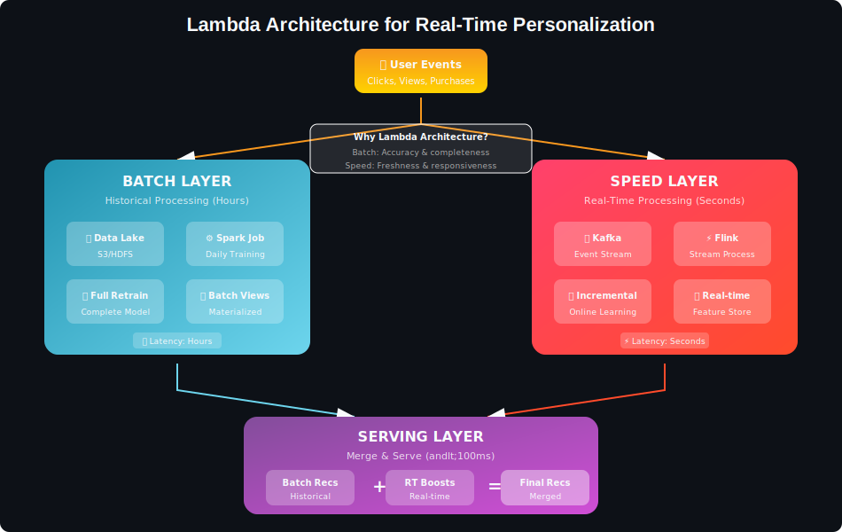
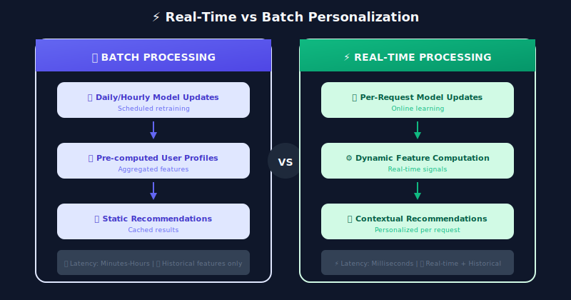
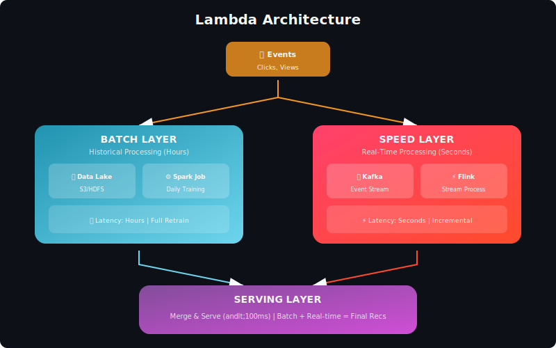

# Real-Time Personalization: Complete Guide



## Table of Contents
1. [Introduction](#introduction)
2. [Architecture Patterns](#architecture-patterns)
3. [Real-Time Feature Engineering](#real-time-feature-engineering)
4. [Session-Based Recommendations](#session-based-recommendations)
5. [Online Learning](#online-learning)
6. [Stream Processing](#stream-processing)
7. [Low-Latency Model Serving](#low-latency-model-serving)
9. [Case Studies](#case-studies)
10. [Interview Questions](#interview-questions)

---

## Introduction

Real-time personalization adapts recommendations instantly based on a user's current behavior, rather than relying solely on historical patterns. The goal: **respond to user intent within milliseconds**.

### Why Real-Time Matters

| Scenario | Batch Personalization | Real-Time Personalization |
|----------|----------------------|---------------------------|
| User searches "birthday gifts" | Shows based on past purchases | Immediately shows gift items |
| User views 3 hiking boots | No change until next batch | Boosts outdoor gear instantly |
| User adds item to cart | Same recommendations | Shows complementary items |
| Trending topic emerges | Hours to detect | Minutes to surface |

### Real-Time vs Batch



---

## Architecture Patterns

### Lambda Architecture for Personalization



### Implementation

```python
import asyncio
from dataclasses import dataclass
from typing import List, Dict, Optional
import time

@dataclass
class RecommendationRequest:
    user_id: str
    session_events: List[dict]
    context: dict
    n_items: int = 10

class LambdaPersonalizationSystem:
    """
    Lambda architecture for real-time personalization
    """

    def __init__(self, batch_layer, speed_layer, serving_config):
        self.batch_layer = batch_layer  # Pre-computed recommendations
        self.speed_layer = speed_layer  # Real-time adjustments
        self.config = serving_config

    async def recommend(self, request: RecommendationRequest) -> List[dict]:
        """
        Merge batch and real-time recommendations
        """
        start_time = time.time()

        # Fetch batch and speed layer results in parallel
        batch_task = asyncio.create_task(
            self.batch_layer.get_recommendations(request.user_id)
        )
        speed_task = asyncio.create_task(
            self.speed_layer.get_real_time_adjustments(
                request.user_id,
                request.session_events,
                request.context
            )
        )

        batch_recs, speed_adjustments = await asyncio.gather(batch_task, speed_task)

        # Merge results
        final_recs = self._merge_recommendations(
            batch_recs,
            speed_adjustments,
            request.n_items
        )

        latency = (time.time() - start_time) * 1000
        self._log_metrics(request.user_id, latency, len(final_recs))

        return final_recs

    def _merge_recommendations(self, batch_recs, speed_adjustments, n_items):
        """
        Combine batch recommendations with real-time signals
        """
        merged = {}

        # Start with batch recommendations
        for item_id, score in batch_recs:
            merged[item_id] = {
                'base_score': score,
                'boost': 0,
                'source': 'batch'
            }

        # Apply real-time adjustments
        for item_id, adjustment in speed_adjustments.items():
            if item_id in merged:
                merged[item_id]['boost'] = adjustment['boost']
                merged[item_id]['source'] = 'merged'
            else:
                # New item from speed layer
                merged[item_id] = {
                    'base_score': adjustment.get('score', 0.5),
                    'boost': adjustment['boost'],
                    'source': 'speed'
                }

        # Compute final scores
        results = []
        for item_id, data in merged.items():
            final_score = data['base_score'] * (1 + data['boost'])
            results.append({
                'item_id': item_id,
                'score': final_score,
                'source': data['source']
            })

        # Sort and return top-N
        results.sort(key=lambda x: x['score'], reverse=True)
        return results[:n_items]

```

---

## Real-Time Feature Engineering

```python
import redis
import json
from collections import defaultdict
import numpy as np

class RealTimeFeatureStore:
    """
    Real-time feature computation and storage
    """

    def __init__(self, redis_client: redis.Redis):
        self.redis = redis_client
        self.feature_ttl = 3600  # 1 hour default TTL

    def record_event(self, user_id: str, event: dict):
        """
        Process incoming event and update features
        """
        event_type = event['type']
        item_id = event.get('item_id')
        timestamp = event.get('timestamp', time.time())

        # Update various feature groups
        self._update_session_features(user_id, event, timestamp)
        self._update_interaction_counts(user_id, item_id, event_type)
        self._update_category_affinities(user_id, event)
        self._update_recency_features(user_id, item_id, timestamp)

    def _update_session_features(self, user_id: str, event: dict, timestamp: float):
        """
        Track current session behavior
        """
        session_key = f"session:{user_id}"

        # Get or create session
        session = self.redis.hgetall(session_key)

        if not session or float(session.get(b'last_activity', 0)) < timestamp - 1800:
            # New session (30 min timeout)
            session = {
                'start_time': timestamp,
                'event_count': 0,
                'items_viewed': json.dumps([]),
                'categories_viewed': json.dumps([]),
                'searches': json.dumps([])
            }

        # Update session
        session['last_activity'] = timestamp
        session['event_count'] = int(session.get('event_count', 0)) + 1

        if event['type'] == 'view' and event.get('item_id'):
            items = json.loads(session.get('items_viewed', '[]'))
            items.append(event['item_id'])
            session['items_viewed'] = json.dumps(items[-50:])  # Keep last 50

        if event['type'] == 'search':
            searches = json.loads(session.get('searches', '[]'))
            searches.append(event.get('query', ''))
            session['searches'] = json.dumps(searches[-10:])

        self.redis.hset(session_key, mapping=session)
        self.redis.expire(session_key, 3600)  # 1 hour session TTL

    def _update_interaction_counts(self, user_id: str, item_id: str, event_type: str):
        """
        Maintain real-time interaction counters
        """
        # User-level counts
        user_counts_key = f"counts:{user_id}"
        self.redis.hincrby(user_counts_key, f"{event_type}_count", 1)
        self.redis.hincrby(user_counts_key, "total_events", 1)
        self.redis.expire(user_counts_key, 86400)  # 24 hour TTL

        # Item-level counts (global)
        if item_id:
            item_counts_key = f"item_counts:{item_id}"
            self.redis.hincrby(item_counts_key, f"{event_type}_count", 1)
            self.redis.expire(item_counts_key, 86400)

    def _update_category_affinities(self, user_id: str, event: dict):
        """
        Track real-time category preferences
        """
        if 'category' not in event:
            return

        category = event['category']
        event_weight = {'view': 1, 'click': 2, 'add_to_cart': 5, 'purchase': 10}
        weight = event_weight.get(event['type'], 1)

        affinity_key = f"category_affinity:{user_id}"
        self.redis.zincrby(affinity_key, weight, category)
        self.redis.expire(affinity_key, 86400)

    def get_real_time_features(self, user_id: str) -> dict:
        """
        Retrieve all real-time features for user
        """
        features = {}

        # Session features
        session = self.redis.hgetall(f"session:{user_id}")
        if session:
            features['session_duration'] = time.time() - float(session.get(b'start_time', time.time()))
            features['session_event_count'] = int(session.get(b'event_count', 0))
            features['items_viewed_count'] = len(json.loads(session.get(b'items_viewed', b'[]')))

        # Interaction counts
        counts = self.redis.hgetall(f"counts:{user_id}")
        if counts:
            features['view_count'] = int(counts.get(b'view_count', 0))
            features['click_count'] = int(counts.get(b'click_count', 0))
            features['purchase_count'] = int(counts.get(b'purchase_count', 0))

        # Top categories
        top_categories = self.redis.zrevrange(f"category_affinity:{user_id}", 0, 4, withscores=True)
        features['top_categories'] = [(cat.decode(), score) for cat, score in top_categories]

        return features

class SessionFeatureAggregator:
    """
    Aggregate session events into ML-ready features
    """

    def __init__(self, item_embeddings: dict, category_encoder):
        self.item_embeddings = item_embeddings
        self.category_encoder = category_encoder

    def aggregate(self, session_events: List[dict]) -> np.ndarray:
        """
        Convert session events to feature vector
        """
        if not session_events:
            return self._empty_features()

        features = []

        # Temporal features
        features.extend(self._temporal_features(session_events))

        # Behavioral features
        features.extend(self._behavioral_features(session_events))

        # Content features (aggregated item embeddings)
        features.extend(self._content_features(session_events))

        # Sequential features
        features.extend(self._sequential_features(session_events))

        return np.array(features, dtype=np.float32)

    def _temporal_features(self, events):
        """
        Time-based session features
        """
        timestamps = [e['timestamp'] for e in events]

        session_duration = max(timestamps) - min(timestamps)
        avg_time_between_events = session_duration / len(events) if len(events) > 1 else 0

        # Time of day (cyclical encoding)
        hour = time.localtime(timestamps[-1]).tm_hour
        hour_sin = np.sin(2 * np.pi * hour / 24)
        hour_cos = np.cos(2 * np.pi * hour / 24)

        return [
            session_duration / 3600,  # Normalize to hours
            avg_time_between_events / 60,  # Normalize to minutes
            hour_sin,
            hour_cos,
            len(events)  # Event count
        ]

    def _behavioral_features(self, events):
        """
        Action-based features
        """
        action_counts = defaultdict(int)
        for e in events:
            action_counts[e['type']] += 1

        total = len(events)

        return [
            action_counts['view'] / total,
            action_counts['click'] / total,
            action_counts['add_to_cart'] / total,
            action_counts['search'] / total,
            action_counts.get('purchase', 0) / total
        ]

    def _content_features(self, events):
        """
        Aggregate item embeddings from session
        """
        item_ids = [e.get('item_id') for e in events if e.get('item_id')]

        if not item_ids:
            return [0] * 64  # Embedding dimension

        embeddings = [
            self.item_embeddings.get(item_id, np.zeros(64))
            for item_id in item_ids
        ]

        # Mean pooling with recency weighting
        weights = np.exp(np.linspace(-1, 0, len(embeddings)))
        weights = weights / weights.sum()

        aggregated = np.average(embeddings, axis=0, weights=weights)

        return aggregated.tolist()

    def _sequential_features(self, events):
        """
        Capture sequential patterns
        """
        # Transition patterns
        types = [e['type'] for e in events]

        # View to click rate
        view_to_click = sum(
            1 for i in range(len(types) - 1)
            if types[i] == 'view' and types[i + 1] == 'click'
        ) / max(1, types.count('view'))

        # Dwell time (if available)
        avg_dwell = np.mean([e.get('dwell_time', 0) for e in events])

        return [view_to_click, avg_dwell / 60]

```

---

## Session-Based Recommendations

```python
import torch
import torch.nn as nn

class GRU4Rec(nn.Module):
    """
    GRU-based session recommendation model

    Reference: "Session-based Recommendations with RNNs" (Hidasi et al., 2015)
    """

    def __init__(
        self,
        n_items: int,
        embedding_dim: int = 64,
        hidden_dim: int = 128,
        n_layers: int = 1,
        dropout: float = 0.2
    ):
        super().__init__()

        self.item_embedding = nn.Embedding(n_items + 1, embedding_dim, padding_idx=0)

        self.gru = nn.GRU(
            input_size=embedding_dim,
            hidden_size=hidden_dim,
            num_layers=n_layers,
            batch_first=True,
            dropout=dropout if n_layers > 1 else 0
        )

        self.output_layer = nn.Linear(hidden_dim, n_items)
        self.dropout = nn.Dropout(dropout)

    def forward(self, session_items, lengths=None):
        """
        session_items: (batch, seq_len) - item IDs in session
        """
        # Get embeddings
        x = self.item_embedding(session_items)
        x = self.dropout(x)

        # Pack if variable length
        if lengths is not None:
            x = nn.utils.rnn.pack_padded_sequence(
                x, lengths, batch_first=True, enforce_sorted=False
            )

        # GRU forward
        output, hidden = self.gru(x)

        if lengths is not None:
            output, _ = nn.utils.rnn.pad_packed_sequence(output, batch_first=True)

        # Use last hidden state for prediction
        last_hidden = hidden[-1]  # (batch, hidden_dim)

        # Predict scores for all items
        scores = self.output_layer(self.dropout(last_hidden))

        return scores

    def recommend(self, session_items: List[int], n_items: int = 10):
        """
        Get recommendations for current session
        """
        self.eval()
        with torch.no_grad():
            items_tensor = torch.tensor([session_items])
            scores = self.forward(items_tensor)

            # Mask items already in session
            for item_id in session_items:
                if item_id < scores.shape[1]:
                    scores[0, item_id] = float('-inf')

            # Get top items
            top_scores, top_items = torch.topk(scores[0], n_items)

            return list(zip(top_items.tolist(), top_scores.tolist()))

class SASRec(nn.Module):
    """
    Self-Attention based Sequential Recommendation

    Reference: "Self-Attentive Sequential Recommendation" (Kang et al., 2018)
    """

    def __init__(
        self,
        n_items: int,
        max_seq_length: int = 50,
        embedding_dim: int = 64,
        num_heads: int = 2,
        num_layers: int = 2,
        dropout: float = 0.2
    ):
        super().__init__()

        self.n_items = n_items
        self.max_seq_length = max_seq_length

        # Embeddings
        self.item_embedding = nn.Embedding(n_items + 1, embedding_dim, padding_idx=0)
        self.position_embedding = nn.Embedding(max_seq_length, embedding_dim)

        # Transformer encoder
        encoder_layer = nn.TransformerEncoderLayer(
            d_model=embedding_dim,
            nhead=num_heads,
            dim_feedforward=embedding_dim * 4,
            dropout=dropout,
            batch_first=True
        )
        self.transformer = nn.TransformerEncoder(encoder_layer, num_layers=num_layers)

        self.dropout = nn.Dropout(dropout)
        self.layer_norm = nn.LayerNorm(embedding_dim)

    def forward(self, session_items, attention_mask=None):
        """
        session_items: (batch, seq_len)
        """
        batch_size, seq_len = session_items.shape

        # Item embeddings
        item_emb = self.item_embedding(session_items)

        # Position embeddings
        positions = torch.arange(seq_len, device=session_items.device)
        pos_emb = self.position_embedding(positions)

        # Combine
        x = self.dropout(item_emb + pos_emb)
        x = self.layer_norm(x)

        # Causal mask (can't look at future items)
        causal_mask = torch.triu(
            torch.ones(seq_len, seq_len, device=session_items.device),
            diagonal=1
        ).bool()

        # Transform
        output = self.transformer(x, mask=causal_mask, src_key_padding_mask=attention_mask)

        return output

    def predict(self, session_items):
        """
        Predict next item given session
        """
        output = self.forward(session_items)

        # Use last position output
        last_output = output[:, -1, :]  # (batch, embedding_dim)

        # Score all items via dot product with item embeddings
        item_embeddings = self.item_embedding.weight[1:]  # Exclude padding
        scores = torch.matmul(last_output, item_embeddings.T)

        return scores

class RealTimeSessionRecommender:
    """
    Production session-based recommender with real-time updates
    """

    def __init__(self, model, item_index, feature_store):
        self.model = model
        self.item_index = item_index  # For ANN search
        self.feature_store = feature_store

        # Session cache
        self.session_cache = {}

    def on_event(self, session_id: str, event: dict):
        """
        Process new event and update session state
        """
        if session_id not in self.session_cache:
            self.session_cache[session_id] = {
                'items': [],
                'embeddings': None,
                'last_update': time.time()
            }

        session = self.session_cache[session_id]

        # Add item to session
        if event.get('item_id'):
            session['items'].append(event['item_id'])
            session['items'] = session['items'][-50:]  # Keep last 50

        # Update session embedding
        session['embeddings'] = self._compute_session_embedding(session['items'])
        session['last_update'] = time.time()

    def _compute_session_embedding(self, items):
        """
        Compute real-time session embedding
        """
        if not items:
            return None

        with torch.no_grad():
            items_tensor = torch.tensor([items])
            output = self.model.forward(items_tensor)
            return output[0, -1, :].numpy()

    def recommend(self, session_id: str, n_items: int = 10):
        """
        Get real-time recommendations for session
        """
        if session_id not in self.session_cache:
            return self._cold_start_recommendations(n_items)

        session = self.session_cache[session_id]

        if session['embeddings'] is None:
            return self._cold_start_recommendations(n_items)

        # ANN search for similar items
        candidates, distances = self.item_index.search(
            session['embeddings'].reshape(1, -1),
            n_items + len(session['items'])
        )

        # Filter already viewed items
        viewed = set(session['items'])
        results = []

        for item_id, distance in zip(candidates[0], distances[0]):
            if item_id not in viewed:
                score = 1 / (1 + distance)  # Convert distance to score
                results.append((item_id, score))
                if len(results) >= n_items:
                    break

        return results

```

---

## Online Learning

```python
class OnlineRecommenderUpdate:
    """
    Online/incremental model updates based on real-time feedback
    """

    def __init__(self, model, learning_rate=0.001, buffer_size=1000):
        self.model = model
        self.lr = learning_rate
        self.buffer_size = buffer_size

        # Experience buffer for mini-batch updates
        self.experience_buffer = []

        # Online optimizer
        self.optimizer = torch.optim.Adam(model.parameters(), lr=learning_rate)

    def record_feedback(self, user_id, item_id, feedback, context=None):
        """
        Record user feedback for online learning
        """
        experience = {
            'user_id': user_id,
            'item_id': item_id,
            'feedback': feedback,  # 1 for positive, 0 for negative
            'context': context,
            'timestamp': time.time()
        }

        self.experience_buffer.append(experience)

        # Trigger update if buffer is full
        if len(self.experience_buffer) >= self.buffer_size:
            self._perform_update()

    def _perform_update(self):
        """
        Perform mini-batch SGD update
        """
        if not self.experience_buffer:
            return

        # Sample mini-batch
        batch_size = min(64, len(self.experience_buffer))
        batch = np.random.choice(
            self.experience_buffer,
            size=batch_size,
            replace=False
        )

        # Prepare batch data
        user_ids = torch.tensor([e['user_id'] for e in batch])
        item_ids = torch.tensor([e['item_id'] for e in batch])
        labels = torch.tensor([e['feedback'] for e in batch], dtype=torch.float)

        # Forward pass
        self.model.train()
        predictions = self.model(user_ids, item_ids)

        # Compute loss
        loss = nn.BCEWithLogitsLoss()(predictions, labels)

        # Backward pass
        self.optimizer.zero_grad()
        loss.backward()
        self.optimizer.step()

        # Clear old experiences
        cutoff_time = time.time() - 3600  # Keep last hour
        self.experience_buffer = [
            e for e in self.experience_buffer
            if e['timestamp'] > cutoff_time
        ]

class BanditRecommender:
    """
    Multi-armed bandit for exploration-exploitation in real-time
    """

    def __init__(self, n_items, epsilon=0.1, decay=0.999):
        self.n_items = n_items
        self.epsilon = epsilon
        self.decay = decay

        # Track item statistics
        self.item_counts = np.zeros(n_items)
        self.item_rewards = np.zeros(n_items)

    def recommend(self, candidate_items, user_context=None, n_items=10):
        """
        Select items using epsilon-greedy strategy
        """
        results = []
        remaining = list(candidate_items)

        for _ in range(min(n_items, len(remaining))):
            if np.random.random() < self.epsilon:
                # Explore: random selection
                idx = np.random.randint(len(remaining))
            else:
                # Exploit: select highest UCB score
                ucb_scores = []
                for item in remaining:
                    score = self._compute_ucb(item)
                    ucb_scores.append(score)

                idx = np.argmax(ucb_scores)

            selected_item = remaining.pop(idx)
            results.append(selected_item)

        # Decay epsilon
        self.epsilon *= self.decay

        return results

    def _compute_ucb(self, item_id):
        """
        Upper Confidence Bound score
        """
        if self.item_counts[item_id] == 0:
            return float('inf')  # Prioritize unexplored items

        # UCB1 formula
        mean_reward = self.item_rewards[item_id] / self.item_counts[item_id]
        exploration_bonus = np.sqrt(
            2 * np.log(self.item_counts.sum()) / self.item_counts[item_id]
        )

        return mean_reward + exploration_bonus

    def update(self, item_id, reward):
        """
        Update statistics based on feedback
        """
        self.item_counts[item_id] += 1
        self.item_rewards[item_id] += reward

class ThompsonSamplingRecommender:
    """
    Thompson Sampling for personalized exploration
    """

    def __init__(self, n_items):
        self.n_items = n_items

        # Beta distribution parameters (successes, failures)
        self.alpha = np.ones(n_items)  # Successes + 1
        self.beta = np.ones(n_items)   # Failures + 1

    def recommend(self, candidate_items, n_items=10):
        """
        Sample from posterior and recommend top items
        """
        # Sample CTR from Beta posterior for each candidate
        samples = {}
        for item in candidate_items:
            samples[item] = np.random.beta(self.alpha[item], self.beta[item])

        # Sort by sampled values
        sorted_items = sorted(samples.keys(), key=lambda x: samples[x], reverse=True)

        return sorted_items[:n_items]

    def update(self, item_id, clicked):
        """
        Update posterior based on feedback
        """
        if clicked:
            self.alpha[item_id] += 1
        else:
            self.beta[item_id] += 1

```

---

## Stream Processing

```python
from kafka import KafkaConsumer, KafkaProducer
import json

class StreamingPersonalizationPipeline:
    """
    Real-time event processing for personalization
    """

    def __init__(self, kafka_config, feature_store, model_server):
        self.feature_store = feature_store
        self.model_server = model_server

        # Kafka consumer for events
        self.consumer = KafkaConsumer(
            'user-events',
            bootstrap_servers=kafka_config['brokers'],
            value_deserializer=lambda m: json.loads(m.decode('utf-8')),
            group_id='personalization-processor',
            auto_offset_reset='latest'
        )

        # Producer for recommendations
        self.producer = KafkaProducer(
            bootstrap_servers=kafka_config['brokers'],
            value_serializer=lambda m: json.dumps(m).encode('utf-8')
        )

    def run(self):
        """
        Main processing loop
        """
        for message in self.consumer:
            try:
                event = message.value
                self._process_event(event)
            except Exception as e:
                logger.error(f"Error processing event: {e}")

    def _process_event(self, event):
        """
        Process single event
        """
        user_id = event['user_id']
        event_type = event['type']

        # Update real-time features
        self.feature_store.record_event(user_id, event)

        # Trigger recommendation refresh if needed
        if self._should_refresh_recs(event):
            self._generate_and_publish_recs(user_id, event)

        # Update model if feedback event
        if event_type in ['click', 'purchase', 'skip']:
            self._update_model(user_id, event)

    def _should_refresh_recs(self, event):
        """
        Decide if recommendations should be refreshed
        """
        high_signal_events = ['search', 'category_browse', 'add_to_cart']
        return event['type'] in high_signal_events

    def _generate_and_publish_recs(self, user_id, trigger_event):
        """
        Generate new recommendations and publish to channel
        """
        # Get real-time features
        features = self.feature_store.get_real_time_features(user_id)

        # Generate recommendations
        recs = self.model_server.recommend(user_id, features)

        # Publish to user's recommendation channel
        message = {
            'user_id': user_id,
            'recommendations': recs,
            'trigger': trigger_event['type'],
            'timestamp': time.time()
        }

        self.producer.send(f'user-recommendations', value=message)

```

---

## Low-Latency Model Serving

```python
import asyncio
from concurrent.futures import ThreadPoolExecutor
import numpy as np

class LowLatencyModelServer:
    """
    Optimized model serving for real-time recommendations
    """

    def __init__(self, model, config):
        self.model = model
        self.config = config

        # Pre-load model to GPU if available
        self.device = torch.device('cuda' if torch.cuda.is_available() else 'cpu')
        self.model.to(self.device)
        self.model.eval()

        # Batch processing
        self.batch_queue = asyncio.Queue()
        self.executor = ThreadPoolExecutor(max_workers=4)

        # Caching
        self.embedding_cache = LRUCache(maxsize=100000)

    async def predict(self, user_id, item_ids, features):
        """
        Low-latency prediction with caching
        """
        # Check cache for user embedding
        user_embedding = self.embedding_cache.get(f"user:{user_id}")

        if user_embedding is None:
            user_embedding = await self._compute_user_embedding(user_id, features)
            self.embedding_cache.set(f"user:{user_id}", user_embedding, ttl=300)

        # Get item embeddings (batch lookup from cache or compute)
        item_embeddings = await self._get_item_embeddings(item_ids)

        # Fast scoring via dot product
        scores = np.dot(item_embeddings, user_embedding)

        return scores

    async def _compute_user_embedding(self, user_id, features):
        """
        Compute user embedding from features
        """
        loop = asyncio.get_event_loop()

        def _compute():
            with torch.no_grad():
                features_tensor = torch.tensor(features, device=self.device)
                embedding = self.model.encode_user(features_tensor)
                return embedding.cpu().numpy()

        return await loop.run_in_executor(self.executor, _compute)

    async def _get_item_embeddings(self, item_ids):
        """
        Batch retrieve item embeddings with caching
        """
        embeddings = []
        missing_ids = []
        missing_indices = []

        # Check cache
        for i, item_id in enumerate(item_ids):
            cached = self.embedding_cache.get(f"item:{item_id}")
            if cached is not None:
                embeddings.append(cached)
            else:
                embeddings.append(None)
                missing_ids.append(item_id)
                missing_indices.append(i)

        # Compute missing embeddings
        if missing_ids:
            computed = await self._batch_compute_item_embeddings(missing_ids)
            for idx, item_id, emb in zip(missing_indices, missing_ids, computed):
                embeddings[idx] = emb
                self.embedding_cache.set(f"item:{item_id}", emb, ttl=3600)

        return np.array(embeddings)

    async def recommend_batch(self, requests):
        """
        Process multiple recommendation requests in batch
        """
        # Batch for efficiency
        all_user_features = []
        all_candidate_items = []

        for req in requests:
            all_user_features.append(req['features'])
            all_candidate_items.append(req['candidates'])

        # Batch inference
        with torch.no_grad():
            features_tensor = torch.tensor(all_user_features, device=self.device)
            user_embeddings = self.model.encode_user(features_tensor).cpu().numpy()

        # Score candidates for each request
        results = []
        for i, (user_emb, candidates) in enumerate(zip(user_embeddings, all_candidate_items)):
            item_embs = await self._get_item_embeddings(candidates)
            scores = np.dot(item_embs, user_emb)

            # Get top items
            top_indices = np.argsort(scores)[::-1][:requests[i]['n_items']]
            results.append([
                (candidates[idx], scores[idx]) for idx in top_indices
            ])

        return results

```

---

## Case Studies

### Case Study 1: TikTok's Real-Time Feed

**Key Features**:

- Updates recommendations after **every scroll**
- Dwell time measured to milliseconds

- Model updates in real-time based on engagement

**Architecture**:

- Edge inference for initial candidates

- Centralized ranking with real-time features

- Continuous A/B testing

### Case Study 2: Amazon's Real-Time Recommendations

**"Customers who viewed this also viewed"**:

- Updated within seconds of viewing

- Session-based signals heavily weighted

- Cart composition triggers complementary items

### Case Study 3: Netflix's Row Optimization

**Real-time row selection**:

- Different rows shown based on session behavior

- Thumbnail selection personalized per user

- Time-of-day and device context

---

## Interview Questions

### Q1: Design a real-time recommendation system for a news app

**Key Points**:
1. **Freshness is critical**: News items expire quickly
2. **Real-time signals**: Current reading session, breaking news
3. **Low latency**: < 100ms response time
4. **Exploration**: Surface new topics user might like

### Q2: How do you handle the latency-accuracy trade-off?

**Solutions**:
1. **Precompute candidates**: Batch compute top-1000, real-time re-rank
2. **Caching**: Cache embeddings, update periodically
3. **Approximate methods**: Use ANN instead of exact search
4. **Tiered architecture**: Fast simple model first, slower accurate model refines

### Q3: How do you evaluate real-time personalization systems?

**Metrics**:
1. **Online metrics**: CTR, conversion, session duration
2. **Latency metrics**: P50, P95, P99 response times
3. **Freshness metrics**: Time to incorporate new signals
4. **A/B tests**: Compare against batch baseline

---

## Conclusion

Real-time personalization is essential for modern recommendation systems. Key principles:

1. **Session matters**: Current behavior is highly predictive
2. **Speed is a feature**: Lower latency = better engagement
3. **Combine batch + real-time**: Lambda architecture wins
4. **Continuous learning**: Models should adapt to feedback
5. **Monitor everything**: Latency, accuracy, freshness

---

<div align="center">

**[⬆ Back to Top](#)** | **[📚 Main Repository](https://github.com/Gaurav14cs17/ml_system_design)**

Made with 💜 by [Gaurav14cs17](https://github.com/Gaurav14cs17)

</div>
