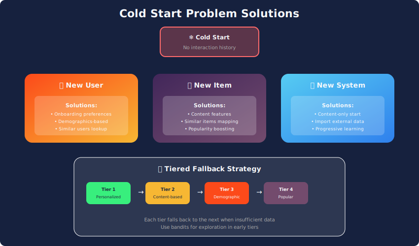
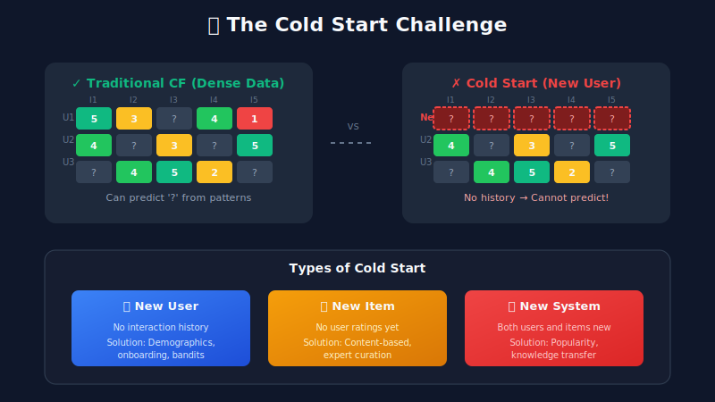

# The Cold Start Problem

<div align="center">



*Handling new users and items with limited or no interaction history*

</div>

---

## Table of Contents

1. [Problem Definition](#problem-definition)

2. [Mathematical Framework](#mathematical-framework)

3. [Solutions for New Users](#solutions-for-new-users)

4. [Solutions for New Items](#solutions-for-new-items)

5. [Exploration-Exploitation](#exploration-exploitation)

6. [Meta-Learning Approaches](#meta-learning-approaches)

7. [Interview Questions](#interview-questions)

---

## Problem Definition



### The Core Challenge

Collaborative filtering requires historical interactions:

$$\hat{r}_{ui} = f(\{(u', i', r_{u'i'}) : (u', i') \in \mathcal{O}\})$$

For **new users**: No \((u, \cdot)\) pairs in \(\mathcal{O}\)  
For **new items**: No \((\cdot, i)\) pairs in \(\mathcal{O}\)

### Types of Cold Start

| Type | Definition | Impact |
|------|------------|--------|
| **New User** | \(\mathcal{H}_u = \emptyset\) | Cannot build user profile |
| **New Item** | \(\mathcal{U}_i = \emptyset\) | Cannot compute item similarity |
| **New System** | Both sparse | Bootstrapping challenge |

### Business Impact

- **Netflix:** ~40% of views are recent releases (cold items)

- **E-commerce:** 25%+ daily users are new or returning after long absence

- **Consequence:** Poor first impression → user churn

---

## Mathematical Framework

### The Cold Start as Missing Data

In matrix factorization \(\mathbf{R} \approx \mathbf{PQ}^\top\):

**New user \(u\):** \(\mathbf{p}_u\) cannot be learned (no observed \(r_{ui}\))

**New item \(i\):** \(\mathbf{q}_i\) cannot be learned (no observed \(r_{ui}\))

### Information Sources

| Source | Available For | Example |
|--------|---------------|---------|
| **Content features** | Items (always) | Genre, description |
| **Demographics** | Users (often) | Age, location |
| **Side information** | Both | Social connections |
| **Active exploration** | Both | Onboarding questions |

---

## Solutions for New Users

### 1. Demographic-Based Initialization

Map user demographics to embedding space:

$$\mathbf{p}_u^{(0)} = f_\theta(\mathbf{x}_u^{\text{demo}})$$

Where \(\mathbf{x}_u^{\text{demo}}\) includes age, gender, location, etc.

**Training:** Learn \(f_\theta\) from users with both demographics and history.

### 2. Popularity-Based Fallback

For users with no signal, recommend popular items:

$$\text{score}(i) = \frac{|\mathcal{U}_i|}{\text{time_since_release}^\alpha}$$

Weighted by recency (fresh popular items).

### 3. Onboarding Questions

Explicitly ask preferences during signup:

$$\mathbf{p}_u = \sum_{i \in \text{liked}} \mathbf{q}_i - \sum_{j \in \text{disliked}} \mathbf{q}_j$$

Initialize user embedding from stated preferences.

### 4. Warm-Start Blending

Gradually transition from cold to warm recommendations:

$$\hat{r}_{ui} = \alpha(n) \cdot \hat{r}_{ui}^{\text{CF}} + (1 - \alpha(n)) \cdot \hat{r}_{ui}^{\text{cold}}$$

Where:

$$\alpha(n) = \min\left(1, \frac{|\mathcal{H}_u|}{\tau}\right)$$

\(\tau\) is the warm-up threshold (e.g., 10 interactions).

---

## Solutions for New Items

### 1. Content-Based Embedding

Map item features to collaborative embedding space:

$$\mathbf{q}_i^{(0)} = g_\phi(\mathbf{x}_i^{\text{content}})$$

**Training objective:**

$$\min_\phi \sum_{i : |\mathcal{U}_i| > k} \|\mathbf{q}_i - g_\phi(\mathbf{x}_i^{\text{content}})\|_2^2$$

Learn to predict learned embeddings from features.

### 2. Similar Item Initialization

Find similar items by content, borrow their embeddings:

$$\mathbf{q}_i^{(0)} = \frac{\sum_{j \in \mathcal{N}_k(i)} \text{sim}_{\text{content}}(i, j) \cdot \mathbf{q}_j}{\sum_{j \in \mathcal{N}_k(i)} \text{sim}_{\text{content}}(i, j)}$$

Weighted average of k-nearest neighbors by content similarity.

### 3. Expert Curation

Manual placement by domain experts:

- Assign initial categories/tags

- Place in curated collections

- Seed with editorial ratings

### 4. Exploration Boost

Give new items extra exposure:

$$\text{score}(i) = \hat{r}_{ui} + \beta \cdot \text{novelty}(i)$$

Where:

$$\text{novelty}(i) = \log\left(1 + \frac{T_{\text{now}} - T_{\text{release}}}{\text{impressions}(i) + 1}\right)$$

---

## Exploration-Exploitation

### The Multi-Armed Bandit Framework

**Setting:** \(K\) items (arms), each with unknown reward distribution.

**Goal:** Maximize cumulative reward while learning.

**Trade-off:**

- **Exploitation:** Recommend items with highest expected reward

- **Exploration:** Try uncertain items to learn more

### Epsilon-Greedy

$$a_t = \begin{cases} \arg\max_i \hat{\mu}_i & \text{with probability } 1-\epsilon \\ \text{random } i & \text{with probability } \epsilon \end{cases}$$

Simple but doesn't adapt exploration rate.

### Upper Confidence Bound (UCB)

$$a_t = \arg\max_i \left(\hat{\mu}_i + c \sqrt{\frac{\ln t}{n_i}}\right)$$

Where:

- \(\hat{\mu}_i\): Estimated mean reward for item \(i\)

- \(n_i\): Number of times item \(i\) was shown

- \(c\): Exploration constant

**Properties:**

- Explores uncertain items (high variance bonus)

- Bonus decreases as item gets more impressions

- Theoretical regret bounds

### Thompson Sampling

Maintain posterior over reward parameters:

1. Sample \(\theta_i \sim P(\theta_i \mid \mathcal{D})\) for each item

2. Select \(a_t = \arg\max_i \mathbb{E}[r \mid \theta_i]\)

3. Update posterior with observed reward

For binary rewards (click/no-click):

$$\theta_i \sim \text{Beta}(\alpha_i + \text{clicks}_i, \beta_i + \text{no_clicks}_i)$$

**Advantages:**

- Principled uncertainty quantification

- Often better empirical performance

- Natural handling of context

### Contextual Bandits

Reward depends on context (user features):

$$r = f(\mathbf{x}_u, a) + \epsilon$$

**LinUCB:**

$$a_t = \arg\max_i \left(\mathbf{x}_u^\top \hat{\boldsymbol{\theta}}_i + \alpha \sqrt{\mathbf{x}_u^\top \mathbf{A}_i^{-1} \mathbf{x}_u}\right)$$

Where \(\mathbf{A}_i\) is the covariance of features for item \(i\).

---

## Meta-Learning Approaches

### Problem Formulation

Learn to learn from few examples:

$$\phi^* = \arg\min_\phi \mathbb{E}_{\mathcal{T} \sim p(\mathcal{T})} \left[\mathcal{L}(\mathcal{D}_{\mathcal{T}}^{\text{test}}; f_{\theta_\mathcal{T}^*})\right]$$

Where \(\theta_\mathcal{T}^* = \text{Adapt}(\phi, \mathcal{D}_\mathcal{T}^{\text{train}})\)

### MAML for Recommendations

**Meta-training:**

1. Sample user \(u\) with history split into support/query

2. Inner loop: Adapt to support set

$$\theta_u' = \theta - \alpha \nabla_\theta \mathcal{L}_{\text{support}}(\theta)$$math

3. Outer loop: Update on query set

```

\phi \leftarrow \phi - \beta \nabla_\phi \mathcal{L}_{\text{query}}(\theta_u')

```

**Meta-testing (new user):**

- Few interactions → one/few gradient steps

- Quick adaptation from good initialization

### DropoutNet

Simulate cold start during training:

1. Randomly drop user interactions

2. Train model to be robust to missing data

3. At test time: handles cold users naturally

**Training objective:**

$$\mathcal{L} = \mathbb{E}_{m \sim \text{Bernoulli}(p)} \left[\mathcal{L}_{\text{rec}}(\mathbf{m} \odot \mathbf{h}_u)\right]$$

---

## Practical Strategies Summary

### New User Workflow

```
1. No history → Popular items + Exploration

2. 1-5 interactions → Content-based + Demographic priors

3. 5-20 interactions → Hybrid (blend CF with content)

4. 20+ interactions → Full collaborative filtering

```

### New Item Workflow

```
1. Pre-launch → Content embedding + Expert curation

2. Launch → Exploration boost + Targeted exposure

3. 100+ impressions → Reduce exploration bonus

4. 1000+ impressions → Standard ranking

```

---

## Interview Questions

### Q1: How would you handle cold start for a new music streaming service?

**New Users:**

1. Onboarding: Genre/artist preferences

2. Demographics: Location-based popular music

3. Social: Import from existing platforms (if available)

4. Bandits: Explore diverse genres initially

**New Songs:**

1. Audio features (tempo, energy, mood)

2. Artist similarity

3. Playlist co-occurrence from similar services

4. Exploration bonus for fresh releases

### Q2: Compare bandit approaches for cold start

| Approach | Pros | Cons |
|----------|------|------|
| **ε-Greedy** | Simple | Fixed exploration rate |
| **UCB** | Theoretical guarantees | Assumes stationary |
| **Thompson** | Adapts to uncertainty | Posterior computation |
| **LinUCB** | Uses context | Linear assumption |

### Q3: When would meta-learning help cold start?

**Use meta-learning when:**

- Users have diverse preferences (no universal cold start solution)

- A few interactions are available (1-5)

- Model can be quickly adapted per-user

- Sufficient meta-training users exist

**Avoid when:**

- Zero-shot required (true cold start)

- Computational constraints (meta-learning is expensive)

- User preferences are homogeneous

### Q4: How do you evaluate cold start solutions?

**Metrics:**

1. **NDCG@K for cold users:** Ranking quality in first sessions

2. **Time to first engagement:** How fast users find value

3. **Retention at day 1/7:** Do cold users return?

4. **Exploration efficiency:** Regret in bandit formulation

**A/B Testing:**

- Stratify by user tenure

- Compare cold start strategies

- Monitor long-term effects (not just first session)

---

## Further Reading

1. **Schein et al. (2002)** — Methods for Collaborative Filtering

2. **Li et al. (2010)** — A Contextual-Bandit Approach to Personalized News

3. **Finn et al. (2017)** — MAML: Model-Agnostic Meta-Learning

4. **Volkovs et al. (2017)** — DropoutNet for Cold Start

5. **Vartak et al. (2017)** — Meta-Prod2Vec for Cold Start

---

<div align="center">

*The cold start problem is not about lack of data—it's about intelligent use of available signals.*

</div>

---

<div align="center">

**[⬆ Back to Top](#)** | **[📚 Main Repository](https://github.com/Gaurav14cs17/ml_system_design)**

Made with 💜 by [Gaurav14cs17](https://github.com/Gaurav14cs17)

</div>
