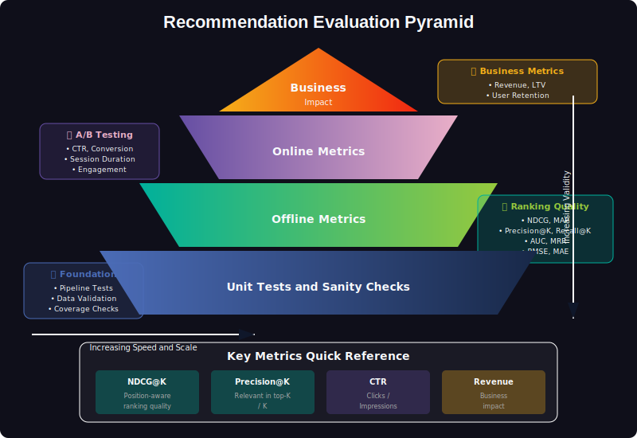
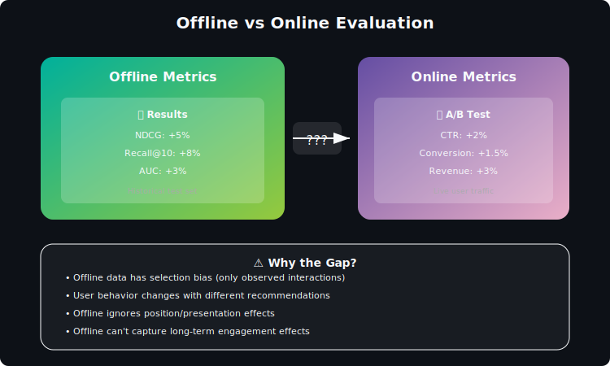
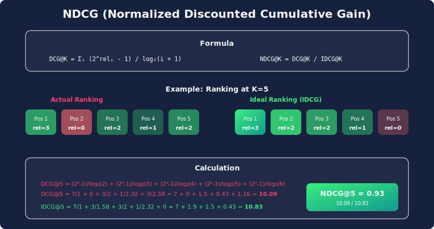

# Evaluation Metrics for Recommendation Systems

*Measuring what matters: from prediction accuracy to business impact*

---

## Table of Contents
1. [Evaluation Framework](#evaluation-framework)
2. [Prediction Accuracy Metrics](#prediction-accuracy-metrics)
3. [Ranking Metrics](#ranking-metrics)
4. [Beyond Accuracy](#beyond-accuracy)
5. [Online Evaluation](#online-evaluation)
6. [Statistical Testing](#statistical-testing)
7. [Interview Questions](#interview-questions)

---

## Evaluation Framework

### The Evaluation Hierarchy

Recommendation evaluation operates at multiple levels:

| Level | Metrics | Feedback Loop |
|-------|---------|---------------|
| **Unit Tests** | Coverage, latency | Immediate |
| **Offline** | NDCG, Precision, RMSE | Hours/Days |
| **Online** | CTR, Conversion | Days/Weeks |
| **Business** | Revenue, Retention | Weeks/Months |

**Key Insight:** Offline metrics don't always correlate with online success. A model with 5% better NDCG may show 0% CTR improvement.

### Train/Validation/Test Splits

**Random Split:**

$$
\mathcal{D} = \mathcal{D}_{\text{train}} \cup \mathcal{D}_{\text{val}} \cup \mathcal{D}_{\text{test}}
$$

**Temporal Split** (more realistic):

$$
\mathcal{D}_{\text{train}} = \{(u, i, t) : t < T_1\}
\mathcal{D}_{\text{test}} = \{(u, i, t) : t \geq T_1\}
$$

**Leave-One-Out:**
For each user, hold out the last interaction for testing.

---

## Prediction Accuracy Metrics

### Mean Absolute Error (MAE)

$$
\text{MAE} = \frac{1}{|\mathcal{T}|} \sum_{(u,i) \in \mathcal{T}} |r_{ui} - \hat{r}_{ui}|
$$

**Properties:**
- Linear penalty for errors
- More robust to outliers than RMSE
- Range: $[0, r_{\max} - r_{\min}]$

### Root Mean Squared Error (RMSE)

$$
\text{RMSE} = \sqrt{\frac{1}{|\mathcal{T}|} \sum_{(u,i) \in \mathcal{T}} (r_{ui} - \hat{r}_{ui})^2}
$$

**Properties:**
- Quadratic penalty → large errors matter more
- Same scale as ratings
- Netflix Prize metric (RMSE < 0.8563 goal)

### Normalized RMSE

$$
\text{NRMSE} = \frac{\text{RMSE}}{r_{\max} - r_{\min}}
$$

Allows comparison across different rating scales.

---

## Ranking Metrics

### Precision@K

$$
\text{Precision@K} = \frac{|\text{Recommended@K} \cap \text{Relevant}|}{K}
$$

**Example:** If K=10 and 3 relevant items in top-10:

$$
\text{Precision@10} = \frac{3}{10} = 0.3
$$

### Recall@K

$$
\text{Recall@K} = \frac{|\text{Recommended@K} \cap \text{Relevant}|}{|\text{Relevant}|}
$$

**Example:** If 3 of 20 relevant items in top-10:

$$
\text{Recall@10} = \frac{3}{20} = 0.15
$$

### F1@K

Harmonic mean of Precision and Recall:

$$
\text{F1@K} = 2 \cdot \frac{\text{Precision@K} \cdot \text{Recall@K}}{\text{Precision@K} + \text{Recall@K}}
$$

### Hit Rate@K

$$
\text{HR@K} = \frac{|\{u : |\text{Rec}_u@K \cap \text{Rel}_u| > 0\}|}{|U|}
$$

Fraction of users who got at least one relevant item in top-K.

### Mean Reciprocal Rank (MRR)

$$
\text{MRR} = \frac{1}{|U|} \sum_{u \in U} \frac{1}{\text{rank}_u}
$$

Where $\text{rank}_u$ is the position of the first relevant item for user $u$.

**Example:**
- User A: First relevant at position 3 → RR = 1/3
- User B: First relevant at position 1 → RR = 1
- User C: First relevant at position 5 → RR = 1/5
- MRR = (1/3 + 1 + 1/5) / 3 ≈ 0.51

### Average Precision (AP)

$$
\text{AP} = \frac{1}{|\text{Rel}|} \sum_{k=1}^{n} \text{Precision@k} \cdot \text{rel}(k)
$$

Where $\text{rel}(k) = 1$ if item at rank $k$ is relevant.

**Mean Average Precision (MAP):**

$$
\text{MAP} = \frac{1}{|U|} \sum_{u \in U} \text{AP}_u
$$

### NDCG (Normalized Discounted Cumulative Gain)

The gold standard for ranking evaluation.

**Discounted Cumulative Gain:**

$$
\text{DCG@K} = \sum_{i=1}^{K} \frac{2^{rel_i} - 1}{\log_2(i + 1)}
$$

**Ideal DCG** (best possible ranking):

$$
\text{IDCG@K} = \sum_{i=1}^{K} \frac{2^{rel_i^*} - 1}{\log_2(i + 1)}
$$

Where $rel_i^*$ is the $i$-th highest relevance score.

**Normalized DCG:**

$$
\text{NDCG@K} = \frac{\text{DCG@K}}{\text{IDCG@K}}
$$

**Properties:**
- Range: $[0, 1]$, higher is better
- Position-aware: earlier positions weighted more
- Handles graded relevance (not just binary)
- Logarithmic discount: position 1 is ~2x more valuable than position 3

**Example Calculation:**

| Position | Relevance | Gain | Discount | DCG contribution |
|----------|-----------|------|----------|------------------|
| 1 | 3 | $2^3-1=7$ | $\log_2(2)=1$ | 7.00 |
| 2 | 1 | $2^1-1=1$ | $\log_2(3)=1.58$ | 0.63 |
| 3 | 2 | $2^2-1=3$ | $\log_2(4)=2$ | 1.50 |
| 4 | 0 | $2^0-1=0$ | $\log_2(5)=2.32$ | 0.00 |
| 5 | 2 | $2^2-1=3$ | $\log_2(6)=2.58$ | 1.16 |

DCG@5 = 7.00 + 0.63 + 1.50 + 0.00 + 1.16 = **10.29**

---

## Beyond Accuracy

### Coverage

**Catalog Coverage:**

$$
\text{Coverage} = \frac{|\bigcup_u \text{Rec}_u|}{|\mathcal{I}|}
$$

Fraction of catalog ever recommended.

**User Coverage:**
Fraction of users who receive recommendations.

### Diversity

**Intra-List Diversity (ILD):**

$$
\text{ILD} = \frac{1}{\binom{K}{2}} \sum_{i < j} (1 - \text{sim}(i, j))
$$

Average dissimilarity among recommended items.

### Novelty

$$
\text{Novelty} = \frac{1}{|L|} \sum_{i \in L} -\log_2 P(i)
$$

Where $P(i)$ is the popularity of item $i$. Recommending rare items → higher novelty.

### Serendipity

$$
\text{Serendipity} = \frac{|\text{Relevant} \cap \text{Unexpected}|}{K}
$$

Items that are both relevant AND surprising (not predicted by simple baseline).

### Calibration

Does the recommendation distribution match user preferences?

$$
\text{KL}(p \| q) = \sum_c p(c) \log \frac{p(c)}{q(c)}
$$

Where $p(c)$ is user's historical genre distribution and $q(c)$ is recommendation genre distribution.

---

## Online Evaluation

### Click-Through Rate (CTR)

$$
\text{CTR} = \frac{\text{Clicks}}{\text{Impressions}}
$$

### Conversion Rate

$$
\text{CVR} = \frac{\text{Conversions}}{\text{Clicks}}
$$

### Engagement Metrics

| Metric | Formula | Use Case |
|--------|---------|----------|
| **Session Duration** | Total time per session | Streaming |
| **Items Viewed** | Count per session | E-commerce |
| **Return Rate** | Users returning in N days | Retention |
| **Revenue per User** | Total spend / Users | Business |

### User Satisfaction

**Explicit:**
- Thumbs up/down ratios
- Star ratings
- Survey responses

**Implicit:**
- Completion rate (videos, articles)
- Time-to-first-interaction
- Bounce rate

---

## Statistical Testing

### A/B Testing Framework

**Null Hypothesis:** $H_0: \mu_A = \mu_B$ (no difference)

**Alternative:** $H_1: \mu_A \neq \mu_B$ (treatment has effect)

**Sample Size Calculation:**

$$
n = 2 \cdot \left(\frac{z_{1-\alpha/2} + z_{1-\beta}}{\text{MDE} / \sigma}\right)^2
$$

Where:
- $\alpha$: Significance level (typically 0.05)
- $\beta$: Type II error rate (1 - power, typically 0.2)
- MDE: Minimum Detectable Effect
- $\sigma$: Standard deviation

### Two-Sample t-Test

$$
t = \frac{\bar{X}_A - \bar{X}_B}{\sqrt{s_A^2/n_A + s_B^2/n_B}}
$$

**p-value:** Probability of observing result if $H_0$ true.

**Confidence Interval:**

$$
(\bar{X}_A - \bar{X}_B) \pm t_{\alpha/2} \cdot \sqrt{s_A^2/n_A + s_B^2/n_B}
$$

### Multiple Comparisons Correction

When testing multiple metrics, apply correction:

**Bonferroni:**

$$
\alpha_{\text{adj}} = \frac{\alpha}{m}
$$

Where $m$ is number of tests.

**False Discovery Rate (BH):**

$$
\alpha_{\text{adj}}^{(i)} = \frac{i \cdot \alpha}{m}
$$

For ordered p-values $p_{(1)} \leq p_{(2)} \leq \ldots \leq p_{(m)}$.

### Bootstrap Confidence Intervals

For complex metrics without closed-form variance:

1. Resample data with replacement $B$ times
2. Compute metric on each sample
3. Use percentiles for CI

$$
\text{CI}_{95\%} = [\hat{\theta}_{0.025}, \hat{\theta}_{0.975}]
$$

---

## Metrics Trade-offs

### Accuracy vs Diversity

Optimizing pure accuracy leads to:
- Recommending only popular items
- Filter bubbles
- Poor long-tail coverage

**Solution:** Multi-objective optimization:

$$
\mathcal{L} = \mathcal{L}_{\text{accuracy}} + \lambda \cdot \mathcal{L}_{\text{diversity}}
$$

### Precision vs Recall

| Scenario | Priority | Reason |
|----------|----------|--------|
| Limited screen space | Precision | Every slot matters |
| Search results | Recall | Don't miss relevant |
| Notification | High precision | Don't annoy users |
| Discovery page | Balanced | Exploration vs relevance |

### Offline vs Online Metrics

| Offline Says | Online Shows | Possible Cause |
|--------------|--------------|----------------|
| ↑ Better | ↓ Worse | Position bias in training |
| ↑ Better | → No change | Metric doesn't capture value |
| → Same | ↑ Better | Online effects (freshness) |

---

## Metrics Quick Reference

| Metric | Formula | Best For |
|--------|---------|----------|
| **RMSE** | $\sqrt{\frac{1}{n}\sum(r - \hat{r})^2}$ | Rating prediction |
| **Precision@K** | $\frac{\text{Hits@K}}{K}$ | Top-K relevance |
| **Recall@K** | $\frac{\text{Hits@K}}{\text{Total Rel}}$ | Coverage of relevant |
| **NDCG@K** | $\frac{\text{DCG}}{\text{IDCG}}$ | Ranked relevance |
| **MRR** | $\frac{1}{\text{rank of first hit}}$ | First result matters |
| **CTR** | $\frac{\text{Clicks}}{\text{Impressions}}$ | Online engagement |
| **Coverage** | $\frac{\text{Unique recs}}{\text{Catalog}}$ | Catalog utilization |

---

## Interview Questions

### Q1: NDCG vs MAP - when to use which?

**NDCG:**
- Handles graded relevance (ratings 1-5)
- Better for explicit feedback systems
- Most common in academic papers

**MAP:**
- Binary relevance only
- Emphasizes all relevant items equally
- Common in information retrieval

### Q2: Your offline NDCG improved 10% but online CTR stayed flat. Why?

**Possible causes:**

1. **Position bias:** Model trained on biased click data
2. **Exploration gap:** Users only see old recommendations
3. **Metric mismatch:** NDCG optimizes ranking, CTR measures engagement
4. **Temporal shift:** Test data from past, users changed
5. **Sample size:** Online change within noise

### Q3: How do you measure diversity without hurting relevance?

**Approaches:**

1. **Maximal Marginal Relevance (MMR):**

$$
\text{MMR} = \arg\max_{i \in R \setminus S} \left[\lambda \cdot \text{Rel}(i) - (1-\lambda) \max_{j \in S} \text{sim}(i,j)\right]
$$

2. **Calibration:** Match genre distribution to user history

3. **Multi-objective:** Pareto frontier of relevance vs diversity

4. **Determinantal Point Processes:** Probabilistic diversity model

### Q4: Design metrics for a music streaming service.

**Short-term:**
- Skip rate (lower is better)
- Completion rate
- Playlist add rate

**Medium-term:**
- Daily active users
- Session duration
- Artist discovery rate

**Long-term:**
- Subscription retention
- User lifetime value
- Artist/genre diversity over time

---

## Further Reading

1. **Järvelin & Kekäläinen (2002)** — Cumulated Gain-Based Evaluation
2. **Herlocker et al. (2004)** — Evaluating Collaborative Filtering Recommender Systems
3. **McNee et al. (2006)** — Being Accurate is Not Enough
4. **Kohavi et al. (2013)** — Online Controlled Experiments at Large Scale

---

*What gets measured gets optimized. Choose your metrics wisely.*

---

**[⬆ Back to Top](#)** | **[📚 Main Repository](https://github.com/Gaurav14cs17/ml_system_design)**

Made with 💜 by [Gaurav14cs17](https://github.com/Gaurav14cs17)

