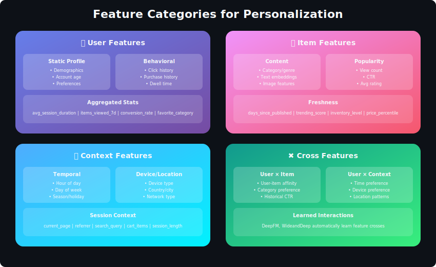

# Feature Engineering for Personalization Systems



## Table of Contents
1. [Introduction](#introduction)
2. [User Features](#user-features)
3. [Item Features](#item-features)
4. [Interaction Features](#interaction-features)
5. [Contextual Features](#contextual-features)
6. [Feature Transformations](#feature-transformations)
7. [Feature Store Architecture](#feature-store-architecture)
8. [Real-Time vs Batch Features](#real-time-vs-batch-features)
9. [Best Practices](#best-practices)
10. [Interview Questions](#interview-questions)

---

## Introduction

Feature engineering is the art and science of transforming raw data into signals that ML models can effectively learn from. In personalization, features must capture user preferences, item characteristics, and contextual signals.

### Feature Categories


---

## User Features

### Static User Features

```python
import numpy as np
from datetime import datetime
from typing import Dict, List, Any

class UserFeatureExtractor:
    """
    Extract and compute user features
    """

    def extract_demographic_features(self, user_data: Dict) -> Dict[str, Any]:
        """
        Static demographic features
        """
        features = {}

        # Age (with binning)
        if 'birth_date' in user_data:
            age = self._calculate_age(user_data['birth_date'])
            features['age'] = age
            features['age_group'] = self._age_to_group(age)

        # Gender (one-hot encoded)
        if 'gender' in user_data:
            features['is_male'] = 1 if user_data['gender'] == 'male' else 0
            features['is_female'] = 1 if user_data['gender'] == 'female' else 0

        # Location features
        if 'country' in user_data:
            features['country'] = user_data['country']
            features['region'] = self._country_to_region(user_data['country'])

        # Account features
        if 'signup_date' in user_data:
            features['account_age_days'] = (
                datetime.now() - user_data['signup_date']
            ).days
            features['is_new_user'] = features['account_age_days'] < 30

        # Subscription/tier
        if 'subscription_tier' in user_data:
            features['is_premium'] = user_data['subscription_tier'] == 'premium'

        return features

    def _calculate_age(self, birth_date) -> int:
        today = datetime.now()
        return today.year - birth_date.year

    def _age_to_group(self, age: int) -> str:
        if age < 18:
            return 'teen'
        elif age < 25:
            return 'young_adult'
        elif age < 35:
            return 'adult'
        elif age < 50:
            return 'middle_age'
        else:
            return 'senior'

```

### Behavioral User Features

```python
class BehavioralFeatureExtractor:
    """
    Features derived from user behavior history
    """

    def extract_activity_features(self, interactions: List[Dict]) -> Dict[str, float]:
        """
        Activity-based features from interaction history
        """
        if not interactions:
            return self._default_activity_features()

        features = {}

        # Activity frequency
        features['total_interactions'] = len(interactions)

        # Activity recency
        last_interaction = max(i['timestamp'] for i in interactions)
        features['days_since_last_activity'] = (
            datetime.now() - last_interaction
        ).days

        # Activity patterns
        timestamps = [i['timestamp'] for i in interactions]
        features['avg_daily_interactions'] = len(interactions) / max(
            (max(timestamps) - min(timestamps)).days, 1
        )

        # Engagement depth
        features['avg_items_per_session'] = self._compute_items_per_session(
            interactions
        )

        return features

    def extract_preference_features(self, interactions: List[Dict]) -> Dict:
        """
        Aggregate preference features from history
        """
        if not interactions:
            return {}

        features = {}

        # Category preferences
        category_counts = {}
        for interaction in interactions:
            cat = interaction.get('item_category')
            if cat:
                category_counts[cat] = category_counts.get(cat, 0) + 1

        total = sum(category_counts.values())
        features['top_category'] = max(category_counts, key=category_counts.get) if category_counts else None
        features['category_concentration'] = max(category_counts.values()) / total if total else 0

        # Price preferences (for e-commerce)
        prices = [i.get('item_price', 0) for i in interactions if i.get('item_price')]
        if prices:
            features['avg_price'] = np.mean(prices)
            features['price_std'] = np.std(prices)
            features['max_price'] = max(prices)

        # Rating behavior (if available)
        ratings = [i.get('rating') for i in interactions if i.get('rating')]
        if ratings:
            features['avg_rating_given'] = np.mean(ratings)
            features['rating_count'] = len(ratings)
            features['is_generous_rater'] = np.mean(ratings) > 3.5

        return features

    def extract_engagement_features(self, interactions: List[Dict]) -> Dict:
        """
        Engagement quality features
        """
        features = {}

        # Click-through behavior
        views = sum(1 for i in interactions if i['type'] == 'view')
        clicks = sum(1 for i in interactions if i['type'] == 'click')
        purchases = sum(1 for i in interactions if i['type'] == 'purchase')

        features['click_rate'] = clicks / views if views > 0 else 0
        features['conversion_rate'] = purchases / clicks if clicks > 0 else 0

        # Dwell time features
        dwell_times = [i.get('dwell_time', 0) for i in interactions]
        if dwell_times:
            features['avg_dwell_time'] = np.mean(dwell_times)
            features['dwell_time_std'] = np.std(dwell_times)

        # Completion features (for content)
        completion_rates = [i.get('completion_rate', 0) for i in interactions]
        if completion_rates:
            features['avg_completion'] = np.mean(completion_rates)

        return features

```

### User Embedding Features

```python
import torch

class UserEmbeddingFeatures:
    """
    Dense embedding-based user features
    """

    def __init__(self, embedding_model, item_embeddings):
        self.model = embedding_model
        self.item_embeddings = item_embeddings

    def compute_user_embedding(self, user_history: List[int]) -> np.ndarray:
        """
        Compute user embedding from interaction history
        """
        if not user_history:
            return np.zeros(128)

        # Method 1: Average of item embeddings
        item_embs = [
            self.item_embeddings[item_id]
            for item_id in user_history
            if item_id in self.item_embeddings
        ]

        if not item_embs:
            return np.zeros(128)

        # Weighted average (recent items weighted more)
        weights = np.exp(np.linspace(-1, 0, len(item_embs)))
        weights = weights / weights.sum()

        user_embedding = np.average(item_embs, axis=0, weights=weights)

        return user_embedding

    def compute_interest_diversity(self, user_embedding: np.ndarray,
                                    user_history: List[int]) -> float:
        """
        How diverse are user's interests?
        """
        if len(user_history) < 2:
            return 0.0

        item_embs = [
            self.item_embeddings[item_id]
            for item_id in user_history
            if item_id in self.item_embeddings
        ]

        # Compute pairwise similarities
        similarities = []
        for i in range(len(item_embs)):
            for j in range(i + 1, len(item_embs)):
                sim = np.dot(item_embs[i], item_embs[j]) / (
                    np.linalg.norm(item_embs[i]) * np.linalg.norm(item_embs[j])
                )
                similarities.append(sim)

        # Diversity = 1 - avg similarity
        return 1 - np.mean(similarities) if similarities else 0.0

```

---

## Item Features

### Content Features

```python
from sklearn.feature_extraction.text import TfidfVectorizer
from transformers import AutoTokenizer, AutoModel

class ItemContentFeatures:
    """
    Extract features from item content
    """

    def __init__(self):
        self.text_vectorizer = TfidfVectorizer(max_features=500)

    def extract_text_features(self, item_data: Dict) -> Dict:
        """
        Features from text content (title, description)
        """
        features = {}

        # Title features
        if 'title' in item_data:
            title = item_data['title']
            features['title_length'] = len(title)
            features['title_word_count'] = len(title.split())
            features['has_numbers_in_title'] = any(c.isdigit() for c in title)

        # Description features
        if 'description' in item_data:
            desc = item_data['description']
            features['desc_length'] = len(desc)
            features['desc_word_count'] = len(desc.split())
            features['desc_sentence_count'] = desc.count('.') + desc.count('!') + desc.count('?')

        return features

    def extract_semantic_embedding(self, text: str) -> np.ndarray:
        """
        Dense semantic embedding from pre-trained model
        """
        from sentence_transformers import SentenceTransformer

        model = SentenceTransformer('all-MiniLM-L6-v2')
        embedding = model.encode(text)

        return embedding

    def extract_categorical_features(self, item_data: Dict) -> Dict:
        """
        Categorical attribute features
        """
        features = {}

        # Category hierarchy
        if 'category' in item_data:
            features['category'] = item_data['category']
            features['category_depth'] = len(item_data['category'].split('/'))

        # Tags
        if 'tags' in item_data:
            features['tag_count'] = len(item_data['tags'])
            # Multi-hot encoding would be done separately

        # Brand/creator
        if 'brand' in item_data:
            features['brand'] = item_data['brand']

        return features

class ItemPopularityFeatures:
    """
    Popularity and engagement features for items
    """

    def __init__(self, interaction_store):
        self.store = interaction_store

    def compute_popularity_features(self, item_id: str,
                                     time_windows: List[str] = ['7d', '30d', 'all']) -> Dict:
        """
        Time-windowed popularity features
        """
        features = {}

        for window in time_windows:
            interactions = self.store.get_item_interactions(item_id, window)

            features[f'view_count_{window}'] = sum(
                1 for i in interactions if i['type'] == 'view'
            )
            features[f'click_count_{window}'] = sum(
                1 for i in interactions if i['type'] == 'click'
            )
            features[f'purchase_count_{window}'] = sum(
                1 for i in interactions if i['type'] == 'purchase'
            )

            # Derived metrics
            views = features[f'view_count_{window}']
            clicks = features[f'click_count_{window}']
            features[f'ctr_{window}'] = clicks / views if views > 0 else 0

        return features

    def compute_trend_features(self, item_id: str) -> Dict:
        """
        Features capturing item's trending status
        """
        features = {}

        # Compare recent vs older popularity
        recent = self.store.get_item_interactions(item_id, '7d')
        older = self.store.get_item_interactions(item_id, '30d')

        recent_count = len(recent)
        older_count = len(older) - recent_count

        if older_count > 0:
            features['trend_ratio'] = (recent_count * 30/7) / older_count
            features['is_trending'] = features['trend_ratio'] > 1.5
        else:
            features['trend_ratio'] = 0
            features['is_trending'] = recent_count > 0

        return features

```

### Item Quality Features

```python
class ItemQualityFeatures:
    """
    Quality signals from reviews, ratings, etc.
    """

    def compute_rating_features(self, ratings: List[float]) -> Dict:
        """
        Rating distribution features
        """
        if not ratings:
            return {
                'avg_rating': 0,
                'rating_count': 0,
                'rating_std': 0,
                'has_ratings': False
            }

        return {
            'avg_rating': np.mean(ratings),
            'rating_count': len(ratings),
            'rating_std': np.std(ratings),
            'has_ratings': True,
            'high_rating_pct': sum(1 for r in ratings if r >= 4) / len(ratings),
            'low_rating_pct': sum(1 for r in ratings if r <= 2) / len(ratings),
            'rating_confidence': min(len(ratings) / 100, 1.0)  # Confidence based on count
        }

    def compute_review_features(self, reviews: List[Dict]) -> Dict:
        """
        Features from user reviews
        """
        if not reviews:
            return {'review_count': 0, 'has_reviews': False}

        features = {
            'review_count': len(reviews),
            'has_reviews': True,
            'avg_review_length': np.mean([len(r['text']) for r in reviews]),
        }

        # Sentiment (simplified)
        sentiments = [r.get('sentiment', 0) for r in reviews]
        if sentiments:
            features['avg_sentiment'] = np.mean(sentiments)
            features['sentiment_std'] = np.std(sentiments)

        return features

```

---

## Interaction Features

### User-Item Cross Features

```python
class CrossFeatureExtractor:
    """
    Features from user-item combinations
    """

    def __init__(self, user_features, item_features):
        self.user_features = user_features
        self.item_features = item_features

    def compute_cross_features(self, user_id: str, item_id: str) -> Dict:
        """
        Compute user-item interaction features
        """
        user = self.user_features.get(user_id, {})
        item = self.item_features.get(item_id, {})

        features = {}

        # Category match
        user_top_cat = user.get('top_category')
        item_cat = item.get('category')
        if user_top_cat and item_cat:
            features['category_match'] = 1 if user_top_cat == item_cat else 0

        # Price alignment
        user_avg_price = user.get('avg_price', 0)
        item_price = item.get('price', 0)
        if user_avg_price > 0 and item_price > 0:
            features['price_ratio'] = item_price / user_avg_price
            features['price_above_avg'] = 1 if item_price > user_avg_price else 0

        # Brand affinity
        user_brand_counts = user.get('brand_counts', {})
        item_brand = item.get('brand')
        if item_brand and user_brand_counts:
            features['brand_affinity'] = user_brand_counts.get(item_brand, 0)
            features['is_familiar_brand'] = item_brand in user_brand_counts

        # Embedding similarity
        if 'embedding' in user and 'embedding' in item:
            user_emb = user['embedding']
            item_emb = item['embedding']
            features['embedding_similarity'] = np.dot(user_emb, item_emb) / (
                np.linalg.norm(user_emb) * np.linalg.norm(item_emb) + 1e-8
            )

        return features

    def compute_historical_features(self, user_id: str, item_id: str,
                                     history: List[Dict]) -> Dict:
        """
        Features from user's historical interactions with this item
        """
        features = {}

        # Previous interactions with this item
        item_interactions = [h for h in history if h['item_id'] == item_id]

        features['previous_views'] = sum(
            1 for i in item_interactions if i['type'] == 'view'
        )
        features['previous_clicks'] = sum(
            1 for i in item_interactions if i['type'] == 'click'
        )
        features['has_purchased'] = any(
            i['type'] == 'purchase' for i in item_interactions
        )

        # Time since last interaction
        if item_interactions:
            last_time = max(i['timestamp'] for i in item_interactions)
            features['days_since_last_view'] = (
                datetime.now() - last_time
            ).days
        else:
            features['days_since_last_view'] = -1  # Never seen

        return features

```

### Sequence Features

```python
class SequenceFeatureExtractor:
    """
    Features from interaction sequences
    """

    def extract_session_features(self, session_events: List[Dict]) -> Dict:
        """
        Features from current session
        """
        if not session_events:
            return self._default_session_features()

        features = {}

        # Session basic stats
        features['session_length'] = len(session_events)
        features['session_duration'] = (
            session_events[-1]['timestamp'] - session_events[0]['timestamp']
        ).total_seconds()

        # Action distribution
        action_counts = {}
        for event in session_events:
            action = event['type']
            action_counts[action] = action_counts.get(action, 0) + 1

        total = len(session_events)
        features['view_ratio'] = action_counts.get('view', 0) / total
        features['click_ratio'] = action_counts.get('click', 0) / total
        features['search_ratio'] = action_counts.get('search', 0) / total

        # Unique items
        unique_items = len(set(e.get('item_id') for e in session_events if e.get('item_id')))
        features['unique_items_viewed'] = unique_items
        features['repeat_view_ratio'] = 1 - unique_items / max(
            action_counts.get('view', 1), 1
        )

        # Category exploration
        categories = [e.get('category') for e in session_events if e.get('category')]
        features['unique_categories'] = len(set(categories))

        return features

    def extract_transition_features(self, session_events: List[Dict]) -> Dict:
        """
        Features from transitions between events
        """
        if len(session_events) < 2:
            return {}

        features = {}

        # Time between events
        intervals = []
        for i in range(1, len(session_events)):
            delta = (
                session_events[i]['timestamp'] -
                session_events[i-1]['timestamp']
            ).total_seconds()
            intervals.append(delta)

        features['avg_interval'] = np.mean(intervals)
        features['interval_std'] = np.std(intervals)
        features['has_long_gap'] = max(intervals) > 300  # 5 minute gap

        # Action transitions
        transitions = {}
        for i in range(1, len(session_events)):
            prev_action = session_events[i-1]['type']
            curr_action = session_events[i]['type']
            key = f"{prev_action}_to_{curr_action}"
            transitions[key] = transitions.get(key, 0) + 1

        total_trans = sum(transitions.values())
        features['view_to_click_rate'] = transitions.get('view_to_click', 0) / max(
            transitions.get('view_to_view', 0) + transitions.get('view_to_click', 0), 1
        )

        return features

```

---

## Contextual Features

```python
import math
from datetime import datetime

class ContextFeatureExtractor:
    """
    Extract contextual features
    """

    def extract_temporal_features(self, timestamp: datetime) -> Dict:
        """
        Time-based features
        """
        features = {}

        # Hour of day (cyclical encoding)
        hour = timestamp.hour
        features['hour'] = hour
        features['hour_sin'] = math.sin(2 * math.pi * hour / 24)
        features['hour_cos'] = math.cos(2 * math.pi * hour / 24)

        # Day of week (cyclical)
        dow = timestamp.weekday()
        features['day_of_week'] = dow
        features['dow_sin'] = math.sin(2 * math.pi * dow / 7)
        features['dow_cos'] = math.cos(2 * math.pi * dow / 7)

        # Binary time features
        features['is_weekend'] = dow >= 5
        features['is_morning'] = 6 <= hour < 12
        features['is_afternoon'] = 12 <= hour < 18
        features['is_evening'] = 18 <= hour < 22
        features['is_night'] = hour >= 22 or hour < 6

        # Month/season
        month = timestamp.month
        features['month'] = month
        features['is_holiday_season'] = month in [11, 12]

        return features

    def extract_device_features(self, device_info: Dict) -> Dict:
        """
        Device and platform features
        """
        features = {}

        # Device type
        device_type = device_info.get('type', 'unknown')
        features['is_mobile'] = device_type == 'mobile'
        features['is_tablet'] = device_type == 'tablet'
        features['is_desktop'] = device_type == 'desktop'

        # Operating system
        os = device_info.get('os', 'unknown')
        features['is_ios'] = 'ios' in os.lower()
        features['is_android'] = 'android' in os.lower()

        # Screen size (affects what can be shown)
        if 'screen_width' in device_info:
            features['screen_width'] = device_info['screen_width']
            features['is_small_screen'] = device_info['screen_width'] < 768

        # App vs web
        features['is_app'] = device_info.get('is_app', False)

        return features

    def extract_location_features(self, location_info: Dict) -> Dict:
        """
        Location-based features
        """
        features = {}

        if 'country' in location_info:
            features['country'] = location_info['country']

        if 'city' in location_info:
            features['city'] = location_info['city']
            features['is_major_city'] = location_info.get('is_major_city', False)

        # Time zone for local time adjustments
        if 'timezone' in location_info:
            features['timezone_offset'] = location_info.get('timezone_offset', 0)

        return features

```

---

## Feature Transformations

```python
import numpy as np
from sklearn.preprocessing import StandardScaler, MinMaxScaler, LabelEncoder

class FeatureTransformer:
    """
    Common feature transformations
    """

    def __init__(self):
        self.scalers = {}
        self.encoders = {}

    def log_transform(self, values: np.ndarray) -> np.ndarray:
        """
        Log transform for heavy-tailed distributions
        """
        return np.log1p(values)  # log(1 + x) handles zeros

    def bin_numeric(self, values: np.ndarray, n_bins: int = 10,
                    strategy: str = 'quantile') -> np.ndarray:
        """
        Bin continuous values
        """
        if strategy == 'quantile':
            # Equal-sized bins
            percentiles = np.linspace(0, 100, n_bins + 1)
            bins = np.percentile(values, percentiles)
        elif strategy == 'uniform':
            # Equal-width bins
            bins = np.linspace(values.min(), values.max(), n_bins + 1)

        return np.digitize(values, bins[1:-1])

    def cyclical_encode(self, values: np.ndarray, period: float) -> tuple:
        """
        Encode cyclical features (hour, day of week, etc.)
        """
        sin_values = np.sin(2 * np.pi * values / period)
        cos_values = np.cos(2 * np.pi * values / period)
        return sin_values, cos_values

    def target_encode(self, categorical: np.ndarray, target: np.ndarray,
                      smoothing: float = 10) -> np.ndarray:
        """
        Target encoding for high-cardinality categoricals

        Replace category with smoothed average of target
        """
        global_mean = target.mean()
        encoded = np.zeros(len(categorical))

        for cat in np.unique(categorical):
            mask = categorical == cat
            n = mask.sum()
            cat_mean = target[mask].mean()

            # Smoothing: blend category mean with global mean
            smoothed = (cat_mean * n + global_mean * smoothing) / (n + smoothing)
            encoded[mask] = smoothed

        return encoded

    def hash_encode(self, categorical: np.ndarray, n_buckets: int = 100) -> np.ndarray:
        """
        Feature hashing for very high cardinality
        """
        return np.array([hash(str(v)) % n_buckets for v in categorical])

class FeatureNormalizer:
    """
    Normalize features for model input
    """

    def __init__(self):
        self.scalers = {}

    def fit_transform(self, features: Dict[str, np.ndarray],
                      numeric_cols: List[str],
                      method: str = 'standard') -> Dict[str, np.ndarray]:
        """
        Fit and transform numeric features
        """
        result = features.copy()

        for col in numeric_cols:
            if col in features:
                if method == 'standard':
                    scaler = StandardScaler()
                elif method == 'minmax':
                    scaler = MinMaxScaler()

                result[col] = scaler.fit_transform(
                    features[col].reshape(-1, 1)
                ).flatten()
                self.scalers[col] = scaler

        return result

    def transform(self, features: Dict[str, np.ndarray],
                  numeric_cols: List[str]) -> Dict[str, np.ndarray]:
        """
        Transform using fitted scalers
        """
        result = features.copy()

        for col in numeric_cols:
            if col in features and col in self.scalers:
                result[col] = self.scalers[col].transform(
                    features[col].reshape(-1, 1)
                ).flatten()

        return result

```

---

## Feature Store Architecture

```python
from abc import ABC, abstractmethod
import redis
import json

class FeatureStore(ABC):
    """
    Abstract feature store interface
    """

    @abstractmethod
    def get_features(self, entity_id: str, feature_names: List[str]) -> Dict:
        pass

    @abstractmethod
    def set_features(self, entity_id: str, features: Dict):
        pass

class RedisFeatureStore(FeatureStore):
    """
    Redis-based feature store for real-time features
    """

    def __init__(self, redis_client: redis.Redis, prefix: str = 'features'):
        self.redis = redis_client
        self.prefix = prefix

    def get_features(self, entity_id: str, feature_names: List[str] = None) -> Dict:
        """
        Get features for entity
        """
        key = f"{self.prefix}:{entity_id}"

        if feature_names:
            # Get specific features
            values = self.redis.hmget(key, feature_names)
            features = {
                name: json.loads(val) if val else None
                for name, val in zip(feature_names, values)
            }
        else:
            # Get all features
            raw_features = self.redis.hgetall(key)
            features = {
                k.decode(): json.loads(v)
                for k, v in raw_features.items()
            }

        return features

    def set_features(self, entity_id: str, features: Dict, ttl: int = None):
        """
        Set features for entity
        """
        key = f"{self.prefix}:{entity_id}"

        encoded = {k: json.dumps(v) for k, v in features.items()}
        self.redis.hset(key, mapping=encoded)

        if ttl:
            self.redis.expire(key, ttl)

    def get_batch_features(self, entity_ids: List[str],
                           feature_names: List[str] = None) -> Dict[str, Dict]:
        """
        Batch feature retrieval
        """
        pipe = self.redis.pipeline()

        for entity_id in entity_ids:
            key = f"{self.prefix}:{entity_id}"
            if feature_names:
                pipe.hmget(key, feature_names)
            else:
                pipe.hgetall(key)

        results = pipe.execute()

        batch_features = {}
        for entity_id, result in zip(entity_ids, results):
            if feature_names:
                batch_features[entity_id] = {
                    name: json.loads(val) if val else None
                    for name, val in zip(feature_names, result)
                }
            else:
                batch_features[entity_id] = {
                    k.decode(): json.loads(v)
                    for k, v in result.items()
                } if result else {}

        return batch_features

class HybridFeatureStore:
    """
    Combine batch and real-time feature stores
    """

    def __init__(self, batch_store, realtime_store):
        self.batch = batch_store      # e.g., BigQuery, Hive
        self.realtime = realtime_store  # e.g., Redis

    def get_features(self, entity_id: str, feature_names: List[str]) -> Dict:
        """
        Get features from appropriate store based on feature type
        """
        # Classify features
        batch_features = [f for f in feature_names if self._is_batch_feature(f)]
        realtime_features = [f for f in feature_names if not self._is_batch_feature(f)]

        # Fetch in parallel
        features = {}

        if batch_features:
            features.update(self.batch.get_features(entity_id, batch_features))

        if realtime_features:
            features.update(self.realtime.get_features(entity_id, realtime_features))

        return features

    def _is_batch_feature(self, feature_name: str) -> bool:
        """
        Determine if feature comes from batch or real-time
        """
        realtime_prefixes = ['session_', 'current_', 'last_', 'today_']
        return not any(feature_name.startswith(p) for p in realtime_prefixes)

```

---

## Real-Time vs Batch Features

```python
class FeaturePipeline:
    """
    Unified pipeline for batch and real-time features
    """

    def __init__(self, config):
        self.config = config
        self.batch_features = {}
        self.realtime_features = {}

    def define_batch_feature(self, name: str, computation_func,
                             refresh_interval: str = 'daily'):
        """
        Define a batch-computed feature
        """
        self.batch_features[name] = {
            'compute': computation_func,
            'refresh': refresh_interval,
            'last_computed': None
        }

    def define_realtime_feature(self, name: str, computation_func,
                                 dependencies: List[str] = None):
        """
        Define a real-time computed feature
        """
        self.realtime_features[name] = {
            'compute': computation_func,
            'dependencies': dependencies or []
        }

    def compute_features(self, entity_id: str, context: Dict) -> Dict:
        """
        Compute all features for an entity
        """
        features = {}

        # Get batch features (pre-computed)
        for name in self.batch_features:
            features[name] = self.get_batch_feature(entity_id, name)

        # Compute real-time features
        for name, spec in self.realtime_features.items():
            # Check dependencies
            deps = {d: features.get(d) for d in spec['dependencies']}
            features[name] = spec['compute'](entity_id, context, deps)

        return features

# Example usage
pipeline = FeaturePipeline(config={})

# Batch feature: computed daily
pipeline.define_batch_feature(
    'user_30d_purchase_count',
    lambda user_id: count_purchases(user_id, days=30),
    refresh_interval='daily'
)

# Real-time feature: computed on request
pipeline.define_realtime_feature(
    'session_view_count',
    lambda user_id, ctx, deps: len(ctx.get('session_views', [])),
    dependencies=[]
)

# Real-time with dependency on batch
pipeline.define_realtime_feature(
    'session_above_avg_spending',
    lambda user_id, ctx, deps: ctx.get('session_total', 0) > deps.get('user_avg_order_value', 0),
    dependencies=['user_avg_order_value']
)

```

---

## Best Practices

### Feature Naming Convention

```python
"""
Feature Naming Convention:

{entity}_{window}_{aggregation}_{metric}

Examples:

- user_7d_sum_purchases

- item_30d_avg_rating

- session_current_count_views

- pair_historical_max_interaction_count

Entity: user, item, session, pair (user-item)
Window: 1d, 7d, 30d, all, current
Aggregation: sum, avg, max, min, count, ratio
Metric: what's being measured
"""

def validate_feature_name(name: str) -> bool:
    """
    Validate feature follows naming convention
    """
    parts = name.split('_')

    valid_entities = ['user', 'item', 'session', 'pair', 'context']
    valid_windows = ['1d', '7d', '30d', '90d', 'all', 'current', 'historical']
    valid_aggs = ['sum', 'avg', 'max', 'min', 'count', 'ratio', 'std', 'pct']

    if len(parts) < 3:
        return False

    entity = parts[0]
    if entity not in valid_entities:
        return False

    # Check if valid window is present
    has_valid_window = any(w in parts for w in valid_windows)

    return has_valid_window

```

### Feature Documentation

```python
class FeatureRegistry:
    """
    Central registry for feature documentation
    """

    def __init__(self):
        self.features = {}

    def register(self, name: str, description: str, dtype: str,
                 computation: str, dependencies: List[str] = None,
                 owner: str = None):
        """
        Register a feature with documentation
        """
        self.features[name] = {
            'name': name,
            'description': description,
            'dtype': dtype,
            'computation': computation,
            'dependencies': dependencies or [],
            'owner': owner,
            'created_at': datetime.now(),
            'version': 1
        }

    def get_feature_info(self, name: str) -> Dict:
        return self.features.get(name)

    def list_features(self, entity_type: str = None) -> List[str]:
        if entity_type:
            return [
                name for name in self.features
                if name.startswith(entity_type + '_')
            ]
        return list(self.features.keys())

# Example registration
registry = FeatureRegistry()
registry.register(
    name='user_7d_sum_purchases',
    description='Total number of purchases by user in last 7 days',
    dtype='int',
    computation='COUNT(*) WHERE event_type = "purchase" AND timestamp > NOW() - 7 days',
    dependencies=['user_events'],
    owner='recommendations-team'
)

```

---

## Interview Questions

### Q1: Design features for a YouTube-like video recommendation system

**User Features**:

- Watch history embeddings (weighted by recency)

- Category preferences (watch time distribution)

- Engagement patterns (avg watch %, like/dislike ratio)

- Active hours, device preferences

**Video Features**:

- Content embeddings (title, description, transcript)

- Visual embeddings (thumbnail, video frames)

- Quality metrics (watch completion rate, engagement)

- Freshness, trending score

**Context Features**:

- Time of day, day of week

- Device type, connection quality

- Current session state

### Q2: How do you handle missing features?

**Strategies**:
1. **Default values**: Use global mean/median
2. **Indicator features**: Add `is_missing` flag
3. **Model-based imputation**: Predict missing values
4. **Category for missing**: Treat as separate category
5. **Zero imputation**: For count-based features

### Q3: How do you detect and handle feature drift?

**Detection**:

- Monitor feature distributions over time

- Statistical tests (KS test, chi-squared)

- Track model performance vs feature drift

**Handling**:

- Retrain models regularly

- Use time-windowed features

- Weight recent data more heavily

---

## Conclusion

Effective feature engineering requires:

1. **Domain knowledge**: Understand what signals matter
2. **Temporal awareness**: Features change over time
3. **Scale considerations**: Real-time vs batch trade-offs
4. **Documentation**: Features must be discoverable
5. **Monitoring**: Track feature health in production

---

<div align="center">

**[⬆ Back to Top](#)** | **[📚 Main Repository](https://github.com/Gaurav14cs17/ml_system_design)**

Made with 💜 by [Gaurav14cs17](https://github.com/Gaurav14cs17)

</div>
