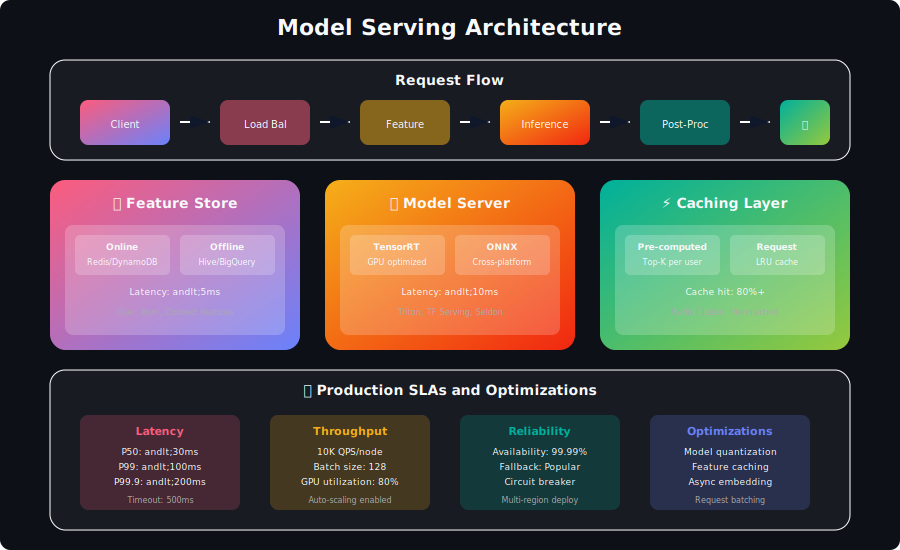
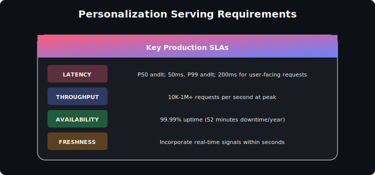
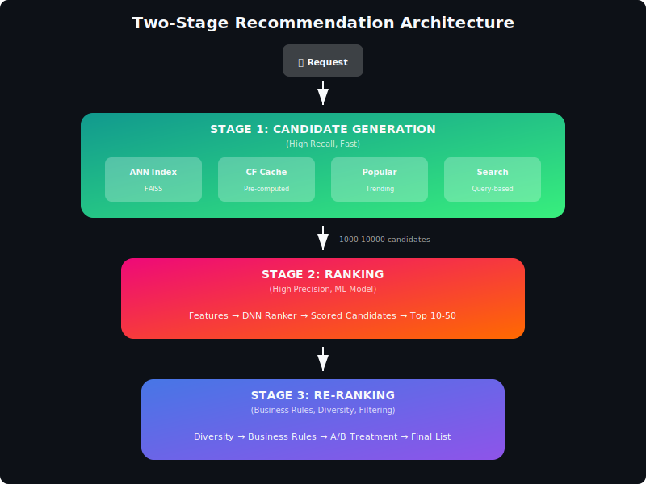

# Model Serving Infrastructure for Personalization



## Table of Contents
1. [Introduction](#introduction)
2. [Serving Architecture Patterns](#serving-architecture-patterns)
3. [Low-Latency Inference](#low-latency-inference)
4. [Candidate Generation & Ranking](#candidate-generation-ranking)
5. [Caching Strategies](#caching-strategies)
6. [Vector Search Systems](#vector-search-systems)
7. [A/B Testing Infrastructure](#ab-testing-infrastructure)
8. [Monitoring & Observability](#monitoring-observability)
9. [Scaling Considerations](#scaling-considerations)
10. [Interview Questions](#interview-questions)

---

## Introduction

Model serving for personalization systems has unique requirements: low latency, high throughput, and the ability to combine multiple models in real-time.

### Key Requirements



---

## Serving Architecture Patterns

### Two-Stage Retrieval & Ranking



### Implementation

```python
from typing import List, Dict, Tuple
import asyncio
import time

class RecommendationServer:
    """
    Production recommendation serving system
    """

    def __init__(self, config):
        # Candidate generators
        self.ann_index = ANNIndex(config['ann'])
        self.cf_cache = CFCache(config['cf'])
        self.popularity_service = PopularityService(config['popularity'])

        # Ranker
        self.ranker = NeuralRanker(config['ranker'])

        # Re-ranker
        self.reranker = BusinessRulesReranker(config['reranker'])

        # Feature store
        self.feature_store = FeatureStore(config['features'])

        # Caching
        self.result_cache = ResultCache(config['cache'])

    async def recommend(self, request: Dict) -> List[Dict]:
        """
        Main recommendation endpoint
        """
        start_time = time.time()

        user_id = request['user_id']
        context = request.get('context', {})
        n_items = request.get('n_items', 10)

        # Check cache first
        cache_key = self._make_cache_key(user_id, context)
        cached_result = await self.result_cache.get(cache_key)
        if cached_result:
            self._log_metrics('cache_hit', time.time() - start_time)
            return cached_result

        # Stage 1: Candidate Generation (parallel)
        candidates = await self._generate_candidates(user_id, context)

        # Stage 2: Ranking
        ranked = await self._rank_candidates(user_id, candidates, context)

        # Stage 3: Re-ranking
        final = await self._rerank(user_id, ranked, context, n_items)

        # Cache result
        await self.result_cache.set(cache_key, final, ttl=300)

        self._log_metrics('full_request', time.time() - start_time)

        return final

    async def _generate_candidates(self, user_id: str, context: Dict) -> List[str]:
        """
        Parallel candidate generation from multiple sources
        """
        # Get user embedding
        user_embedding = await self.feature_store.get_user_embedding(user_id)

        # Launch parallel candidate generation
        tasks = [
            self.ann_index.search(user_embedding, k=500),
            self.cf_cache.get_candidates(user_id, k=300),
            self.popularity_service.get_trending(k=100),
        ]

        # Add context-specific generators
        if context.get('query'):
            tasks.append(self.search_service.search(context['query'], k=200))

        results = await asyncio.gather(*tasks, return_exceptions=True)

        # Merge and deduplicate
        all_candidates = set()
        for result in results:
            if isinstance(result, list):
                all_candidates.update([c['item_id'] for c in result])

        return list(all_candidates)

    async def _rank_candidates(self, user_id: str,
                               candidates: List[str],
                               context: Dict) -> List[Tuple[str, float]]:
        """
        Score candidates with ML ranker
        """
        if not candidates:
            return []

        # Fetch features
        user_features = await self.feature_store.get_user_features(user_id)
        item_features = await self.feature_store.get_batch_item_features(candidates)
        context_features = self._extract_context_features(context)

        # Prepare batch input
        batch_features = []
        for item_id in candidates:
            features = self._combine_features(
                user_features,
                item_features.get(item_id, {}),
                context_features
            )
            batch_features.append(features)

        # Batch inference
        scores = await self.ranker.predict_batch(batch_features)

        # Sort by score
        ranked = sorted(
            zip(candidates, scores),
            key=lambda x: x[1],
            reverse=True
        )

        return ranked

    async def _rerank(self, user_id: str,
                      ranked: List[Tuple[str, float]],
                      context: Dict,
                      n_items: int) -> List[Dict]:
        """
        Apply business rules and diversity
        """
        # Filter already seen items
        seen_items = await self.feature_store.get_user_seen_items(user_id)
        filtered = [(item, score) for item, score in ranked if item not in seen_items]

        # Apply diversity
        diverse = self.reranker.apply_diversity(filtered, n_items * 2)

        # Apply business rules
        final = self.reranker.apply_business_rules(diverse, context)

        # Format response
        result = [
            {
                'item_id': item,
                'score': score,
                'rank': i + 1
            }
            for i, (item, score) in enumerate(final[:n_items])
        ]

        return result
```

---

## Low-Latency Inference

### Model Optimization

```python
import torch
import onnxruntime as ort
import numpy as np

class OptimizedRanker:
    """
    Optimized model serving with ONNX
    """

    def __init__(self, model_path: str, device: str = 'cpu'):
        # Load ONNX model
        sess_options = ort.SessionOptions()
        sess_options.graph_optimization_level = ort.GraphOptimizationLevel.ORT_ENABLE_ALL
        sess_options.intra_op_num_threads = 4

        providers = ['CUDAExecutionProvider', 'CPUExecutionProvider']
        self.session = ort.InferenceSession(model_path, sess_options, providers=providers)

        # Warm up
        self._warmup()

    def _warmup(self, n_warmup: int = 10):
        """
        Warm up model to avoid cold start latency
        """
        dummy_input = np.random.randn(1, 128).astype(np.float32)
        for _ in range(n_warmup):
            self.session.run(None, {'input': dummy_input})

    def predict_batch(self, features: np.ndarray) -> np.ndarray:
        """
        Batch inference
        """
        # Ensure correct dtype
        features = features.astype(np.float32)

        # Run inference
        outputs = self.session.run(None, {'input': features})

        return outputs[0]

class TorchScriptRanker:
    """
    TorchScript optimized serving
    """

    def __init__(self, model_path: str, device: str = 'cuda'):
        self.device = torch.device(device if torch.cuda.is_available() else 'cpu')

        # Load TorchScript model
        self.model = torch.jit.load(model_path)
        self.model = self.model.to(self.device)
        self.model.eval()

        # Enable inference mode optimizations
        torch.set_num_threads(4)

    @torch.inference_mode()
    def predict_batch(self, features: np.ndarray) -> np.ndarray:
        """
        Batch inference with PyTorch
        """
        # Move to device
        inputs = torch.from_numpy(features).float().to(self.device)

        # Forward pass
        outputs = self.model(inputs)

        return outputs.cpu().numpy()

def export_to_onnx(pytorch_model, sample_input, output_path):
    """
    Export PyTorch model to ONNX format
    """
    torch.onnx.export(
        pytorch_model,
        sample_input,
        output_path,
        export_params=True,
        opset_version=14,
        do_constant_folding=True,
        input_names=['input'],
        output_names=['output'],
        dynamic_axes={
            'input': {0: 'batch_size'},
            'output': {0: 'batch_size'}
        }
    )
```

### Batching Strategies

```python
import asyncio
from collections import deque
from typing import List, Callable
import time

class DynamicBatcher:
    """
    Collect requests and batch for efficient GPU inference
    """

    def __init__(
        self,
        model: Callable,
        max_batch_size: int = 64,
        max_wait_ms: float = 10
    ):
        self.model = model
        self.max_batch_size = max_batch_size
        self.max_wait_ms = max_wait_ms

        self.pending_requests = deque()
        self.lock = asyncio.Lock()
        self.batch_event = asyncio.Event()

        # Start background batcher
        asyncio.create_task(self._batch_processor())

    async def predict(self, features: np.ndarray) -> np.ndarray:
        """
        Submit request and wait for result
        """
        future = asyncio.Future()

        async with self.lock:
            self.pending_requests.append({
                'features': features,
                'future': future,
                'submit_time': time.time()
            })
            self.batch_event.set()

        return await future

    async def _batch_processor(self):
        """
        Background process that collects and executes batches
        """
        while True:
            await self.batch_event.wait()

            # Wait a bit for more requests
            await asyncio.sleep(self.max_wait_ms / 1000)

            async with self.lock:
                if not self.pending_requests:
                    self.batch_event.clear()
                    continue

                # Collect batch
                batch = []
                while self.pending_requests and len(batch) < self.max_batch_size:
                    batch.append(self.pending_requests.popleft())

                if not self.pending_requests:
                    self.batch_event.clear()

            # Process batch
            if batch:
                await self._process_batch(batch)

    async def _process_batch(self, batch: List[Dict]):
        """
        Run inference on batch and distribute results
        """
        # Stack features
        features = np.stack([r['features'] for r in batch])

        # Run model
        try:
            predictions = self.model.predict_batch(features)

            # Distribute results
            for request, prediction in zip(batch, predictions):
                request['future'].set_result(prediction)

        except Exception as e:
            for request in batch:
                request['future'].set_exception(e)
```

---

## Candidate Generation & Ranking

### Approximate Nearest Neighbor (ANN) Index

```python
import faiss
import numpy as np

class ANNIndex:
    """
    FAISS-based ANN index for fast similarity search
    """

    def __init__(self, dimension: int, index_type: str = 'IVF'):
        self.dimension = dimension
        self.index = None
        self.id_map = {}

        self._build_index(index_type)

    def _build_index(self, index_type: str):
        """
        Build FAISS index
        """
        if index_type == 'IVF':
            # IVF with flat quantizer
            quantizer = faiss.IndexFlatIP(self.dimension)
            self.index = faiss.IndexIVFFlat(
                quantizer,
                self.dimension,
                100,  # nlist
                faiss.METRIC_INNER_PRODUCT
            )
        elif index_type == 'HNSW':
            # HNSW for better recall
            self.index = faiss.IndexHNSWFlat(
                self.dimension,
                32,  # M parameter
                faiss.METRIC_INNER_PRODUCT
            )
        elif index_type == 'IVF_PQ':
            # Product quantization for memory efficiency
            quantizer = faiss.IndexFlatIP(self.dimension)
            self.index = faiss.IndexIVFPQ(
                quantizer,
                self.dimension,
                100,  # nlist
                16,   # n_subquantizers
                8     # bits per subquantizer
            )

    def add(self, ids: List[str], embeddings: np.ndarray):
        """
        Add items to index
        """
        # Normalize for cosine similarity
        faiss.normalize_L2(embeddings)

        # Map string IDs to int
        int_ids = np.arange(len(ids))
        for int_id, str_id in zip(int_ids, ids):
            self.id_map[int_id] = str_id

        # Train if IVF
        if hasattr(self.index, 'train'):
            self.index.train(embeddings)

        self.index.add(embeddings)

    async def search(self, query: np.ndarray, k: int = 100) -> List[Dict]:
        """
        Search for similar items
        """
        # Normalize query
        query = query.reshape(1, -1).astype('float32')
        faiss.normalize_L2(query)

        # Search
        distances, indices = self.index.search(query, k)

        # Map back to string IDs
        results = []
        for idx, dist in zip(indices[0], distances[0]):
            if idx >= 0:
                results.append({
                    'item_id': self.id_map[idx],
                    'score': float(dist)
                })

        return results

    def save(self, path: str):
        faiss.write_index(self.index, path)

    def load(self, path: str):
        self.index = faiss.read_index(path)
```

### Multi-Model Ensemble

```python
class EnsembleRanker:
    """
    Ensemble multiple ranking models
    """

    def __init__(self, models: Dict[str, object], weights: Dict[str, float] = None):
        self.models = models
        self.weights = weights or {name: 1.0 / len(models) for name in models}

    async def predict(self, features: Dict) -> float:
        """
        Ensemble prediction
        """
        predictions = {}

        # Get predictions from all models
        for name, model in self.models.items():
            predictions[name] = await model.predict(features)

        # Weighted average
        weighted_sum = sum(
            predictions[name] * self.weights[name]
            for name in self.models
        )

        return weighted_sum

    async def predict_batch(self, batch_features: List[Dict]) -> List[float]:
        """
        Batch ensemble prediction
        """
        all_predictions = {}

        # Batch predict from each model
        for name, model in self.models.items():
            all_predictions[name] = await model.predict_batch(batch_features)

        # Combine
        ensemble_predictions = []
        for i in range(len(batch_features)):
            weighted = sum(
                all_predictions[name][i] * self.weights[name]
                for name in self.models
            )
            ensemble_predictions.append(weighted)

        return ensemble_predictions
```

---

## Caching Strategies

```python
import redis
import json
import hashlib
from typing import Optional
import asyncio

class MultiLevelCache:
    """
    Multi-level caching for recommendations
    """

    def __init__(self, config):
        # L1: In-memory LRU cache
        self.l1_cache = LRUCache(maxsize=config['l1_size'])

        # L2: Redis
        self.redis = redis.Redis(
            host=config['redis_host'],
            port=config['redis_port'],
            decode_responses=True
        )

        self.default_ttl = config.get('default_ttl', 300)

    async def get(self, key: str) -> Optional[Dict]:
        """
        Get from cache (L1 -> L2)
        """
        # Check L1
        result = self.l1_cache.get(key)
        if result is not None:
            return result

        # Check L2
        result = await asyncio.get_event_loop().run_in_executor(
            None, self.redis.get, key
        )

        if result:
            result = json.loads(result)
            # Populate L1
            self.l1_cache.set(key, result)
            return result

        return None

    async def set(self, key: str, value: Dict, ttl: int = None):
        """
        Set in cache (L1 + L2)
        """
        ttl = ttl or self.default_ttl

        # Set L1
        self.l1_cache.set(key, value)

        # Set L2
        await asyncio.get_event_loop().run_in_executor(
            None,
            lambda: self.redis.setex(key, ttl, json.dumps(value))
        )

    def make_key(self, user_id: str, context: Dict) -> str:
        """
        Create cache key from user and context
        """
        # Hash context for consistent key
        context_str = json.dumps(context, sort_keys=True)
        context_hash = hashlib.md5(context_str.encode()).hexdigest()[:8]

        return f"recs:{user_id}:{context_hash}"

class EmbeddingCache:
    """
    Cache for user/item embeddings
    """

    def __init__(self, redis_client: redis.Redis, ttl: int = 3600):
        self.redis = redis_client
        self.ttl = ttl

    async def get_embedding(self, entity_type: str, entity_id: str) -> Optional[np.ndarray]:
        """
        Get cached embedding
        """
        key = f"emb:{entity_type}:{entity_id}"

        result = await asyncio.get_event_loop().run_in_executor(
            None, self.redis.get, key
        )

        if result:
            return np.frombuffer(result, dtype=np.float32)
        return None

    async def set_embedding(self, entity_type: str, entity_id: str, embedding: np.ndarray):
        """
        Cache embedding
        """
        key = f"emb:{entity_type}:{entity_id}"
        value = embedding.astype(np.float32).tobytes()

        await asyncio.get_event_loop().run_in_executor(
            None,
            lambda: self.redis.setex(key, self.ttl, value)
        )

    async def get_batch_embeddings(self, entity_type: str,
                                    entity_ids: List[str]) -> Dict[str, np.ndarray]:
        """
        Batch retrieve embeddings
        """
        pipe = self.redis.pipeline()

        for entity_id in entity_ids:
            key = f"emb:{entity_type}:{entity_id}"
            pipe.get(key)

        results = await asyncio.get_event_loop().run_in_executor(
            None, pipe.execute
        )

        embeddings = {}
        for entity_id, result in zip(entity_ids, results):
            if result:
                embeddings[entity_id] = np.frombuffer(result, dtype=np.float32)

        return embeddings
```

---

## Vector Search Systems

### Production Vector Store

```python
class ProductionVectorStore:
    """
    Production-ready vector store with sharding and replication
    """

    def __init__(self, config):
        self.n_shards = config['n_shards']
        self.shards = []

        # Initialize shards
        for i in range(self.n_shards):
            shard = ANNIndex(
                dimension=config['dimension'],
                index_type=config['index_type']
            )
            self.shards.append(shard)

    def _get_shard(self, item_id: str) -> int:
        """
        Consistent hashing for shard assignment
        """
        return hash(item_id) % self.n_shards

    def add(self, item_id: str, embedding: np.ndarray):
        """
        Add item to appropriate shard
        """
        shard_id = self._get_shard(item_id)
        self.shards[shard_id].add([item_id], embedding.reshape(1, -1))

    async def search(self, query: np.ndarray, k: int = 100) -> List[Dict]:
        """
        Search all shards in parallel
        """
        # Search all shards
        tasks = [
            shard.search(query, k=k)
            for shard in self.shards
        ]

        shard_results = await asyncio.gather(*tasks)

        # Merge results
        all_results = []
        for results in shard_results:
            all_results.extend(results)

        # Sort and take top-k
        all_results.sort(key=lambda x: x['score'], reverse=True)

        return all_results[:k]

    def rebalance(self):
        """
        Rebalance items across shards
        """
        # Collect all items
        all_items = []
        for shard in self.shards:
            all_items.extend(shard.get_all_items())

        # Clear and redistribute
        for shard in self.shards:
            shard.clear()

        for item_id, embedding in all_items:
            self.add(item_id, embedding)
```

---

## A/B Testing Infrastructure

```python
import hashlib
from typing import Dict, Optional
import random

class ABTestingService:
    """
    A/B testing for recommendation models
    """

    def __init__(self, experiments_config: Dict):
        self.experiments = experiments_config

    def get_variant(self, user_id: str, experiment_name: str) -> str:
        """
        Deterministically assign user to variant
        """
        experiment = self.experiments.get(experiment_name)
        if not experiment or not experiment.get('active'):
            return 'control'

        # Deterministic hash-based assignment
        hash_input = f"{user_id}:{experiment_name}"
        hash_value = int(hashlib.md5(hash_input.encode()).hexdigest(), 16)
        bucket = hash_value % 100

        # Assign based on traffic allocation
        cumulative = 0
        for variant, allocation in experiment['variants'].items():
            cumulative += allocation
            if bucket < cumulative:
                return variant

        return 'control'

    def get_model_for_variant(self, variant: str,
                              experiment: Dict) -> Optional[object]:
        """
        Get the model/config for a variant
        """
        return experiment['variant_models'].get(variant)

    def log_exposure(self, user_id: str, experiment_name: str, variant: str):
        """
        Log experiment exposure for analysis
        """
        exposure = {
            'user_id': user_id,
            'experiment': experiment_name,
            'variant': variant,
            'timestamp': time.time()
        }
        # Send to analytics pipeline
        self.analytics.log_exposure(exposure)

    def log_outcome(self, user_id: str, experiment_name: str,
                    outcome: str, value: float = 1.0):
        """
        Log experiment outcome
        """
        outcome_event = {
            'user_id': user_id,
            'experiment': experiment_name,
            'outcome': outcome,
            'value': value,
            'timestamp': time.time()
        }
        self.analytics.log_outcome(outcome_event)

class ModelRouter:
    """
    Route requests to appropriate model based on A/B test
    """

    def __init__(self, models: Dict[str, object], ab_service: ABTestingService):
        self.models = models
        self.ab_service = ab_service

    async def route_request(self, user_id: str,
                            experiment_name: str,
                            request: Dict) -> Dict:
        """
        Route request to appropriate model variant
        """
        # Get variant assignment
        variant = self.ab_service.get_variant(user_id, experiment_name)

        # Log exposure
        self.ab_service.log_exposure(user_id, experiment_name, variant)

        # Get model for variant
        model = self.models.get(variant, self.models['control'])

        # Process request
        response = await model.recommend(request)

        # Annotate response with variant for tracking
        response['_experiment'] = experiment_name
        response['_variant'] = variant

        return response
```

---

## Monitoring & Observability

```python
import prometheus_client as prom
from dataclasses import dataclass
from typing import Dict
import time

class RecommendationMetrics:
    """
    Metrics collection for recommendation service
    """

    def __init__(self):
        # Latency metrics
        self.request_latency = prom.Histogram(
            'recommendation_request_latency_seconds',
            'Request latency',
            ['endpoint', 'status'],
            buckets=[0.01, 0.025, 0.05, 0.1, 0.25, 0.5, 1.0]
        )

        self.stage_latency = prom.Histogram(
            'recommendation_stage_latency_seconds',
            'Per-stage latency',
            ['stage'],
            buckets=[0.005, 0.01, 0.025, 0.05, 0.1]
        )

        # Throughput metrics
        self.request_count = prom.Counter(
            'recommendation_requests_total',
            'Total requests',
            ['endpoint', 'status']
        )

        # Business metrics
        self.recommendations_served = prom.Counter(
            'recommendations_served_total',
            'Total recommendations served',
            ['source']
        )

        self.cache_hits = prom.Counter(
            'recommendation_cache_hits_total',
            'Cache hits',
            ['cache_level']
        )

        # Model metrics
        self.model_inference_latency = prom.Histogram(
            'model_inference_latency_seconds',
            'Model inference latency',
            ['model_name']
        )

        self.candidates_generated = prom.Histogram(
            'candidates_generated',
            'Number of candidates generated',
            ['source'],
            buckets=[10, 50, 100, 500, 1000, 5000]
        )

    def record_request(self, endpoint: str, status: str, latency: float):
        self.request_latency.labels(endpoint=endpoint, status=status).observe(latency)
        self.request_count.labels(endpoint=endpoint, status=status).inc()

    def record_stage_latency(self, stage: str, latency: float):
        self.stage_latency.labels(stage=stage).observe(latency)

    def record_cache_hit(self, level: str):
        self.cache_hits.labels(cache_level=level).inc()

class AlertManager:
    """
    Alerting for recommendation service
    """

    def __init__(self, config: Dict):
        self.thresholds = config['thresholds']
        self.alert_channels = config['channels']

    def check_latency_alert(self, p99_latency: float, endpoint: str):
        threshold = self.thresholds.get(f'{endpoint}_p99_latency', 0.2)
        if p99_latency > threshold:
            self.send_alert(
                severity='warning',
                title=f'High latency on {endpoint}',
                message=f'P99 latency {p99_latency:.3f}s exceeds threshold {threshold}s'
            )

    def check_error_rate_alert(self, error_rate: float, endpoint: str):
        threshold = self.thresholds.get('error_rate', 0.01)
        if error_rate > threshold:
            self.send_alert(
                severity='critical',
                title=f'High error rate on {endpoint}',
                message=f'Error rate {error_rate:.2%} exceeds threshold {threshold:.2%}'
            )

    def send_alert(self, severity: str, title: str, message: str):
        for channel in self.alert_channels:
            channel.send(severity=severity, title=title, message=message)
```

---

## Scaling Considerations

```python
class AutoScaler:
    """
    Auto-scaling logic for recommendation service
    """

    def __init__(self, config: Dict):
        self.min_replicas = config['min_replicas']
        self.max_replicas = config['max_replicas']
        self.target_cpu = config['target_cpu_utilization']
        self.target_latency = config['target_p99_latency']

        self.current_replicas = self.min_replicas

    def calculate_desired_replicas(self, metrics: Dict) -> int:
        """
        Calculate desired replica count based on metrics
        """
        # CPU-based scaling
        cpu_ratio = metrics['cpu_utilization'] / self.target_cpu
        cpu_replicas = int(self.current_replicas * cpu_ratio)

        # Latency-based scaling
        latency_ratio = metrics['p99_latency'] / self.target_latency
        latency_replicas = int(self.current_replicas * latency_ratio)

        # Take max of both
        desired = max(cpu_replicas, latency_replicas)

        # Apply bounds
        desired = max(self.min_replicas, min(self.max_replicas, desired))

        return desired

    def should_scale(self, desired: int) -> bool:
        """
        Determine if scaling action should be taken
        """
        # Avoid thrashing with hysteresis
        if desired > self.current_replicas:
            return desired > self.current_replicas * 1.1
        elif desired < self.current_replicas:
            return desired < self.current_replicas * 0.9
        return False
```

---

## Interview Questions

### Q1: Design a recommendation serving system for 1M RPS

**Key Points**:
1. **Horizontal scaling**: Stateless servers behind load balancer
2. **Caching layers**: CDN → Application cache → Redis
3. **Precomputation**: Pre-generate for top users
4. **Async processing**: Non-blocking I/O
5. **Efficient models**: ONNX, TensorRT optimization

### Q2: How do you handle model updates without downtime?

**Strategies**:
1. **Blue-green deployment**: Run two versions, switch traffic
2. **Canary release**: Gradually shift traffic to new model
3. **Shadow mode**: New model runs alongside, compare outputs
4. **Feature flags**: Toggle between models per user

### Q3: How do you debug latency issues?

**Approach**:
1. **Distributed tracing**: Follow request through all services
2. **Stage timing**: Break down latency by pipeline stage
3. **Profiling**: CPU/memory profiling on hot paths
4. **Cache analysis**: Check hit rates at each level
5. **Model analysis**: Profile inference time

---

## Conclusion

Production serving requires:

1. **Multi-stage architecture**: Candidate generation → Ranking → Re-ranking
2. **Optimization**: Model quantization, batching, caching
3. **Resilience**: Fallbacks, circuit breakers, graceful degradation
4. **Observability**: Metrics, logging, tracing at every stage
5. **Experimentation**: A/B testing infrastructure built-in

---

<div align="center">

**[⬆ Back to Top](#)** | **[📚 Main Repository](https://github.com/Gaurav14cs17/ml_system_design)**

Made with 💜 by [Gaurav14cs17](https://github.com/Gaurav14cs17)

</div>
