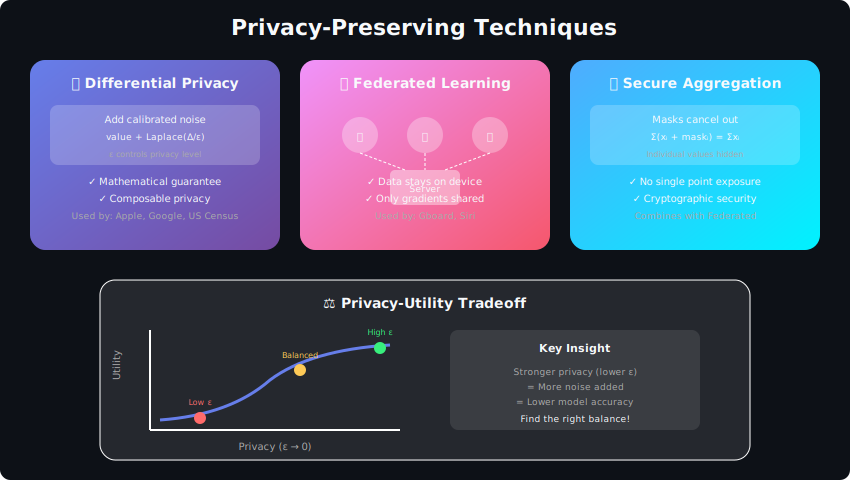
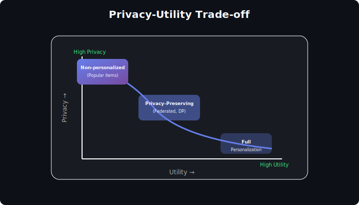

# Privacy & Ethics in Personalization Systems



## Table of Contents
1. [Introduction](#introduction)
2. [Privacy Challenges](#privacy-challenges)
3. [Privacy-Preserving Techniques](#privacy-preserving-techniques)
4. [Differential Privacy](#differential-privacy)
5. [Federated Learning](#federated-learning)
6. [Ethical Considerations](#ethical-considerations)
7. [Bias in Recommendations](#bias-in-recommendations)
8. [Transparency & Explainability](#transparency-explainability)
9. [Regulatory Compliance](#regulatory-compliance)
10. [Interview Questions](#interview-questions)

---

## Introduction

Personalization systems are inherently privacy-sensitive—they collect, process, and act on personal data. Building ethical systems requires balancing personalization quality with user privacy and societal impact.

### The Privacy-Utility Trade-off



---

## Privacy Challenges

### Types of Privacy Risks

```python
from enum import Enum
from dataclasses import dataclass
from typing import List

class PrivacyRiskType(Enum):
    INFERENCE_ATTACK = "inference_attack"
    MEMBERSHIP_INFERENCE = "membership_inference"
    MODEL_INVERSION = "model_inversion"
    DATA_LEAKAGE = "data_leakage"
    RE_IDENTIFICATION = "re_identification"
    ATTRIBUTE_INFERENCE = "attribute_inference"

@dataclass
class PrivacyRisk:
    risk_type: PrivacyRiskType
    description: str
    severity: str  # 'low', 'medium', 'high', 'critical'
    mitigation: str

COMMON_PRIVACY_RISKS = [
    PrivacyRisk(
        risk_type=PrivacyRiskType.MEMBERSHIP_INFERENCE,
        description="Attacker can determine if a user's data was in training set",
        severity="high",
        mitigation="Differential privacy, model regularization"
    ),
    PrivacyRisk(
        risk_type=PrivacyRiskType.MODEL_INVERSION,
        description="Reconstruct user features from model outputs",
        severity="high",
        mitigation="Output perturbation, access controls"
    ),
    PrivacyRisk(
        risk_type=PrivacyRiskType.ATTRIBUTE_INFERENCE,
        description="Infer sensitive attributes from recommendations",
        severity="medium",
        mitigation="Attribute suppression, privacy-aware training"
    ),
    PrivacyRisk(
        risk_type=PrivacyRiskType.RE_IDENTIFICATION,
        description="Link anonymous data to real identity",
        severity="critical",
        mitigation="k-anonymity, data minimization"
    )
]
```

### Privacy Threat Model

```python
class PrivacyThreatAnalyzer:
    """
    Analyze privacy threats in recommendation system
    """

    def __init__(self, system_config: dict):
        self.config = system_config

    def analyze_data_collection(self) -> List[dict]:
        """
        Assess privacy risks in data collection
        """
        risks = []

        data_types = self.config.get('collected_data', [])

        sensitive_types = ['location', 'health', 'financial', 'political', 'sexual_orientation']

        for data_type in data_types:
            if data_type in sensitive_types:
                risks.append({
                    'data_type': data_type,
                    'risk': 'Sensitive data collection',
                    'recommendation': f'Consider if {data_type} is necessary, implement strict access controls'
                })

        # Check retention policies
        if not self.config.get('data_retention_policy'):
            risks.append({
                'issue': 'No data retention policy',
                'risk': 'Indefinite data storage increases breach impact',
                'recommendation': 'Implement data retention limits'
            })

        return risks

    def analyze_model_exposure(self) -> List[dict]:
        """
        Assess risks from model access
        """
        risks = []

        if self.config.get('api_public'):
            risks.append({
                'issue': 'Public API access',
                'risk': 'Model extraction, membership inference attacks',
                'recommendation': 'Rate limiting, query monitoring, output perturbation'
            })

        if self.config.get('embeddings_exposed'):
            risks.append({
                'issue': 'User embeddings accessible',
                'risk': 'Embeddings can reveal sensitive attributes',
                'recommendation': 'Apply differential privacy to embeddings'
            })

        return risks
```

---

## Privacy-Preserving Techniques

### Data Minimization

```python
class DataMinimizer:
    """
    Minimize data collection and retention
    """

    def __init__(self, config):
        self.required_fields = config['required_fields']
        self.retention_days = config['retention_days']

    def filter_collected_data(self, raw_data: dict) -> dict:
        """
        Only keep necessary fields
        """
        return {
            key: value
            for key, value in raw_data.items()
            if key in self.required_fields
        }

    def anonymize_identifiers(self, data: dict) -> dict:
        """
        Replace direct identifiers with hashed versions
        """
        anonymized = data.copy()

        identifiers = ['user_id', 'email', 'ip_address', 'device_id']

        for field in identifiers:
            if field in anonymized:

                # One-way hash
                anonymized[field] = self._hash_identifier(anonymized[field])

        return anonymized

    def _hash_identifier(self, value: str) -> str:
        import hashlib

        # Use salted hash
        salt = self.config.get('hash_salt', '')
        return hashlib.sha256(f"{salt}{value}".encode()).hexdigest()

    def apply_k_anonymity(self, dataset: List[dict],
                          quasi_identifiers: List[str],
                          k: int = 5) -> List[dict]:
        """
        Ensure each combination of quasi-identifiers appears at least k times
        """
        from collections import Counter

        # Count combinations
        qi_combinations = Counter(
            tuple(record.get(qi) for qi in quasi_identifiers)
            for record in dataset
        )

        # Filter records that don't meet k-anonymity
        anonymized = [
            record for record in dataset
            if qi_combinations[tuple(record.get(qi) for qi in quasi_identifiers)] >= k
        ]

        return anonymized
```

### Secure Aggregation

```python
import numpy as np
from typing import List

class SecureAggregator:
    """
    Aggregate user data without exposing individual contributions
    """

    def __init__(self, n_users: int, threshold: int = 100):
        self.n_users = n_users
        self.threshold = threshold  # Min users for aggregation

    def aggregate_with_threshold(self,
                                  user_contributions: List[np.ndarray]) -> np.ndarray:
        """
        Only release aggregate if enough users contributed
        """
        if len(user_contributions) < self.threshold:
            raise ValueError(f"Need at least {self.threshold} users")

        # Simple sum aggregation
        return np.sum(user_contributions, axis=0)

    def masked_aggregation(self,
                           contributions: List[np.ndarray],
                           masks: List[np.ndarray]) -> np.ndarray:
        """
        Aggregation with random masks that cancel out

        Each user adds random mask; masks sum to zero
        """

        # Verify masks sum to zero
        mask_sum = np.sum(masks, axis=0)
        assert np.allclose(mask_sum, 0), "Masks must sum to zero"

        # Each user sends contribution + mask
        masked_contributions = [
            contrib + mask
            for contrib, mask in zip(contributions, masks)
        ]

        # Sum cancels masks
        aggregate = np.sum(masked_contributions, axis=0)

        return aggregate

    def generate_canceling_masks(self, n_users: int,
                                  shape: tuple) -> List[np.ndarray]:
        """
        Generate random masks that sum to zero
        """
        masks = [np.random.randn(*shape) for _ in range(n_users - 1)]

        # Last mask is negative sum of others
        masks.append(-np.sum(masks, axis=0))

        return masks
```

---

## Differential Privacy

### Core Concepts

```python
import numpy as np
from typing import Callable

class DifferentialPrivacy:
    """
    Differential privacy mechanisms for recommendation systems
    """

    @staticmethod
    def laplace_mechanism(value: float, sensitivity: float, epsilon: float) -> float:
        """
        Add Laplace noise for ε-differential privacy

        noise ~ Laplace(0, sensitivity/epsilon)
        """
        scale = sensitivity / epsilon
        noise = np.random.laplace(0, scale)
        return value + noise

    @staticmethod
    def gaussian_mechanism(value: float, sensitivity: float,
                           epsilon: float, delta: float) -> float:
        """
        Add Gaussian noise for (ε,δ)-differential privacy

        noise ~ N(0, σ²) where σ = sensitivity * sqrt(2*ln(1.25/δ)) / epsilon
        """
        sigma = sensitivity * np.sqrt(2 * np.log(1.25 / delta)) / epsilon
        noise = np.random.normal(0, sigma)
        return value + noise

    @staticmethod
    def randomized_response(true_value: bool, epsilon: float) -> bool:
        """
        Randomized response for binary attributes

        With probability p, report true value
        With probability 1-p, report random value

        p = e^ε / (1 + e^ε)
        """
        p = np.exp(epsilon) / (1 + np.exp(epsilon))

        if np.random.random() < p:
            return true_value
        else:
            return np.random.choice([True, False])

class DPRecommendationTrainer:
    """
    Train recommendation model with differential privacy
    """

    def __init__(self, model, epsilon: float, delta: float,
                 max_grad_norm: float = 1.0):
        self.model = model
        self.epsilon = epsilon
        self.delta = delta
        self.max_grad_norm = max_grad_norm

        # Privacy accountant
        self.privacy_spent = 0

    def train_step(self, batch_data, batch_size: int) -> float:
        """
        DP-SGD training step
        """

        # Compute per-example gradients
        per_example_grads = self._compute_per_example_gradients(batch_data)

        # Clip gradients
        clipped_grads = self._clip_gradients(per_example_grads)

        # Average clipped gradients
        avg_grad = np.mean(clipped_grads, axis=0)

        # Add noise
        noise_scale = self.max_grad_norm * np.sqrt(2 * np.log(1.25 / self.delta)) / self.epsilon
        noisy_grad = avg_grad + np.random.normal(0, noise_scale / batch_size, avg_grad.shape)

        # Update model
        self._apply_gradients(noisy_grad)

        # Track privacy budget
        self._update_privacy_budget(batch_size)

        return self.privacy_spent

    def _clip_gradients(self, gradients: np.ndarray) -> np.ndarray:
        """
        Clip per-example gradients to bounded sensitivity
        """
        clipped = []
        for grad in gradients:
            norm = np.linalg.norm(grad)
            if norm > self.max_grad_norm:
                grad = grad * self.max_grad_norm / norm
            clipped.append(grad)
        return np.array(clipped)

    def _update_privacy_budget(self, batch_size: int):
        """
        Track cumulative privacy loss using moments accountant
        """

        # Simplified - in practice use more sophisticated accounting
        sampling_rate = batch_size / self.dataset_size
        self.privacy_spent += sampling_rate * self.epsilon

class DPEmbeddings:
    """
    Generate differentially private user/item embeddings
    """

    def __init__(self, epsilon: float, sensitivity: float = 1.0):
        self.epsilon = epsilon
        self.sensitivity = sensitivity

    def privatize_embedding(self, embedding: np.ndarray) -> np.ndarray:
        """
        Add noise to make embedding differentially private
        """

        # Normalize embedding to bound sensitivity
        norm = np.linalg.norm(embedding)
        if norm > self.sensitivity:
            embedding = embedding * self.sensitivity / norm

        # Add Laplace noise per dimension
        noise = np.random.laplace(0, self.sensitivity / self.epsilon, embedding.shape)

        return embedding + noise

    def privatize_user_history_embedding(self,
                                          item_embeddings: List[np.ndarray],
                                          epsilon: float) -> np.ndarray:
        """
        Create private user embedding from interaction history
        """
        if not item_embeddings:
            return np.zeros(128)

        # Average embeddings (bounded by 1/n_items)
        avg_embedding = np.mean(item_embeddings, axis=0)

        # Sensitivity is bounded by max_item_norm / n_items
        sensitivity = 1.0 / len(item_embeddings)

        noise = np.random.laplace(0, sensitivity / epsilon, avg_embedding.shape)

        return avg_embedding + noise
```

---

## Federated Learning

```python
import numpy as np
from typing import List, Dict

class FederatedRecommender:
    """
    Federated learning for recommendations

    User data stays on device, only model updates are shared
    """

    def __init__(self, global_model, n_clients: int):
        self.global_model = global_model
        self.n_clients = n_clients

    def federated_round(self, client_data: Dict[str, any]) -> Dict:
        """
        Execute one round of federated averaging
        """

        # Distribute global model to clients
        global_weights = self.global_model.get_weights()

        # Collect client updates
        client_updates = []
        client_sizes = []

        for client_id, data in client_data.items():

            # Client trains locally
            update, n_samples = self._client_update(
                client_id,
                data,
                global_weights
            )
            client_updates.append(update)
            client_sizes.append(n_samples)

        # Aggregate updates (weighted by data size)
        new_weights = self._federated_averaging(client_updates, client_sizes)

        # Update global model
        self.global_model.set_weights(new_weights)

        return {'round_completed': True, 'n_clients': len(client_updates)}

    def _client_update(self, client_id: str,
                       local_data: any,
                       global_weights: List[np.ndarray]) -> tuple:
        """
        Train on client's local data
        """

        # Create local model copy
        local_model = self._create_local_model()
        local_model.set_weights(global_weights)

        # Local training
        for epoch in range(self.local_epochs):
            local_model.train_on_batch(local_data)

        # Return weight update
        local_weights = local_model.get_weights()
        update = [
            local - global_w
            for local, global_w in zip(local_weights, global_weights)
        ]

        return update, len(local_data)

    def _federated_averaging(self, updates: List[List[np.ndarray]],
                              sizes: List[int]) -> List[np.ndarray]:
        """
        Weighted average of client updates
        """
        total_size = sum(sizes)

        # Get global weights
        global_weights = self.global_model.get_weights()

        # Weighted sum of updates
        averaged_update = [np.zeros_like(w) for w in global_weights]

        for update, size in zip(updates, sizes):
            weight = size / total_size
            for i, u in enumerate(update):
                averaged_update[i] += weight * u

        # Apply update to global weights
        new_weights = [
            global_w + update
            for global_w, update in zip(global_weights, averaged_update)
        ]

        return new_weights

class SecureFederatedAggregator:
    """
    Federated aggregation with additional privacy guarantees
    """

    def __init__(self, dp_epsilon: float = 1.0, min_clients: int = 100):
        self.dp_epsilon = dp_epsilon
        self.min_clients = min_clients

    def secure_aggregate(self, client_updates: List[np.ndarray]) -> np.ndarray:
        """
        Aggregate with differential privacy
        """
        if len(client_updates) < self.min_clients:
            raise ValueError(f"Need at least {self.min_clients} clients")

        # Clip updates
        clipped = self._clip_updates(client_updates)

        # Sum
        aggregate = np.sum(clipped, axis=0)

        # Add noise
        sensitivity = self.clip_norm
        noise_scale = sensitivity * len(client_updates) / self.dp_epsilon
        noise = np.random.laplace(0, noise_scale, aggregate.shape)

        noisy_aggregate = aggregate + noise

        # Average
        return noisy_aggregate / len(client_updates)

    def _clip_updates(self, updates: List[np.ndarray],
                      clip_norm: float = 1.0) -> List[np.ndarray]:
        """
        Clip each update to bounded norm
        """
        self.clip_norm = clip_norm
        clipped = []
        for update in updates:
            norm = np.linalg.norm(update)
            if norm > clip_norm:
                update = update * clip_norm / norm
            clipped.append(update)
        return clipped
```

---

## Ethical Considerations

### Fairness in Recommendations

```python
from typing import Dict, List
import numpy as np

class FairnessMetrics:
    """
    Measure fairness in recommendation outcomes
    """

    @staticmethod
    def demographic_parity(recommendations: Dict[str, List],
                           user_groups: Dict[str, str],
                           item_attribute: str,
                           item_data: Dict) -> Dict:
        """
        Check if different user groups receive similar recommendations

        Demographic parity: P(positive | group A) = P(positive | group B)
        """
        group_distributions = {}

        for user_id, recs in recommendations.items():
            group = user_groups.get(user_id, 'unknown')

            if group not in group_distributions:
                group_distributions[group] = []

            # Track attribute distribution in recommendations
            attributes = [item_data[item].get(item_attribute) for item in recs]
            group_distributions[group].extend(attributes)

        # Compare distributions across groups
        results = {}
        for group, attrs in group_distributions.items():
            results[group] = {
                'distribution': np.bincount(attrs) / len(attrs),
                'count': len(attrs)
            }

        return results

    @staticmethod
    def equal_opportunity(recommendations: Dict[str, List],
                          user_groups: Dict[str, str],
                          relevance_labels: Dict[str, Dict[str, bool]]) -> Dict:
        """
        Equal opportunity: True positive rate should be equal across groups
        """
        group_tpr = {}

        for user_id, recs in recommendations.items():
            group = user_groups.get(user_id, 'unknown')

            if group not in group_tpr:
                group_tpr[group] = {'tp': 0, 'fn': 0}

            user_relevance = relevance_labels.get(user_id, {})

            for item in recs:
                if user_relevance.get(item, False):
                    group_tpr[group]['tp'] += 1

            # Count relevant items not recommended
            for item, relevant in user_relevance.items():
                if relevant and item not in recs:
                    group_tpr[group]['fn'] += 1

        # Calculate TPR per group
        results = {}
        for group, counts in group_tpr.items():
            total_positive = counts['tp'] + counts['fn']
            results[group] = counts['tp'] / total_positive if total_positive > 0 else 0

        return results

class FairnessConstrainedRecommender:
    """
    Recommendation with fairness constraints
    """

    def __init__(self, base_recommender, fairness_config: Dict):
        self.recommender = base_recommender
        self.config = fairness_config

    def recommend(self, user_id: str, n_items: int = 10) -> List[str]:
        """
        Generate fair recommendations
        """

        # Get more candidates than needed
        candidates = self.recommender.get_candidates(user_id, n_items * 5)

        # Apply fairness constraints
        fair_recommendations = self._apply_fairness_constraints(
            candidates, n_items
        )

        return fair_recommendations

    def _apply_fairness_constraints(self, candidates: List[tuple],
                                     n_items: int) -> List[str]:
        """
        Re-rank to satisfy fairness constraints
        """

        # Exposure fairness: ensure diversity of item providers/categories
        if 'exposure_parity' in self.config:
            candidates = self._apply_exposure_parity(candidates)

        # Supplier fairness: fair allocation across content creators
        if 'supplier_fairness' in self.config:
            candidates = self._apply_supplier_fairness(candidates, n_items)

        return [item_id for item_id, score in candidates[:n_items]]

    def _apply_exposure_parity(self, candidates: List[tuple]) -> List[tuple]:
        """
        Ensure balanced exposure across protected attributes
        """
        protected_attribute = self.config['exposure_parity']['attribute']
        target_distribution = self.config['exposure_parity']['target_distribution']

        # Group candidates by attribute
        grouped = {}
        for item_id, score in candidates:
            attr = self._get_item_attribute(item_id, protected_attribute)
            if attr not in grouped:
                grouped[attr] = []
            grouped[attr].append((item_id, score))

        # Sample according to target distribution
        reranked = []
        for attr, target_prop in target_distribution.items():
            n_from_group = int(len(candidates) * target_prop)
            group_items = grouped.get(attr, [])[:n_from_group]
            reranked.extend(group_items)

        # Sort by original score
        reranked.sort(key=lambda x: x[1], reverse=True)

        return reranked
```

---

## Bias in Recommendations

### Detecting Bias

```python
class BiasDetector:
    """
    Detect various types of bias in recommendations
    """

    def detect_popularity_bias(self, recommendations: Dict[str, List],
                                item_popularity: Dict[str, int]) -> Dict:
        """
        Measure if system over-recommends popular items
        """
        rec_popularity = []

        for user_recs in recommendations.values():
            for item in user_recs:
                rec_popularity.append(item_popularity.get(item, 0))

        # Compare to catalog distribution
        catalog_popularity = list(item_popularity.values())

        rec_mean = np.mean(rec_popularity)
        catalog_mean = np.mean(catalog_popularity)

        bias_ratio = rec_mean / catalog_mean

        return {
            'rec_avg_popularity': rec_mean,
            'catalog_avg_popularity': catalog_mean,
            'bias_ratio': bias_ratio,
            'has_popularity_bias': bias_ratio > 1.5
        }

    def detect_position_bias(self, click_data: List[Dict]) -> Dict:
        """
        Detect bias toward higher-ranked positions
        """
        position_ctr = {}

        for click_event in click_data:
            position = click_event['position']
            clicked = click_event['clicked']

            if position not in position_ctr:
                position_ctr[position] = {'impressions': 0, 'clicks': 0}

            position_ctr[position]['impressions'] += 1
            if clicked:
                position_ctr[position]['clicks'] += 1

        # Calculate CTR per position
        results = {}
        for pos, counts in position_ctr.items():
            results[pos] = counts['clicks'] / counts['impressions']

        return {
            'position_ctr': results,
            'position_bias_detected': results.get(1, 0) > 2 * results.get(10, 0.01)
        }

    def detect_filter_bubble(self, user_history: Dict[str, List],
                             recommendations: Dict[str, List],
                             item_categories: Dict[str, str]) -> Dict:
        """
        Detect if users are being trapped in filter bubbles
        """
        bubble_scores = {}

        for user_id in user_history:

            # Get category distribution in history
            history_cats = [item_categories.get(item) for item in user_history[user_id]]
            history_dist = self._category_distribution(history_cats)

            # Get category distribution in recommendations
            rec_cats = [item_categories.get(item) for item in recommendations.get(user_id, [])]
            rec_dist = self._category_distribution(rec_cats)

            # KL divergence (how different are recs from history)
            kl_div = self._kl_divergence(rec_dist, history_dist)

            bubble_scores[user_id] = {
                'kl_divergence': kl_div,
                'in_bubble': kl_div < 0.1  # Very similar to history
            }

        return {
            'user_bubble_scores': bubble_scores,
            'users_in_bubble_pct': np.mean([s['in_bubble'] for s in bubble_scores.values()])
        }

class BiasAwareMitigation:
    """
    Techniques to mitigate bias in recommendations
    """

    @staticmethod
    def inverse_propensity_scoring(recommendations: List[tuple],
                                   propensity_scores: Dict[str, float]) -> List[tuple]:
        """
        Adjust scores by inverse propensity to counter popularity bias
        """
        adjusted = []
        for item_id, score in recommendations:
            propensity = propensity_scores.get(item_id, 1.0)
            adjusted_score = score / propensity
            adjusted.append((item_id, adjusted_score))

        adjusted.sort(key=lambda x: x[1], reverse=True)
        return adjusted

    @staticmethod
    def calibrated_recommendations(recommendations: List[str],
                                   user_category_distribution: Dict[str, float],
                                   item_categories: Dict[str, str],
                                   n_items: int) -> List[str]:
        """
        Calibrate recommendations to match user's historical category distribution
        """

        # Group items by category
        by_category = {}
        for item in recommendations:
            cat = item_categories.get(item, 'unknown')
            if cat not in by_category:
                by_category[cat] = []
            by_category[cat].append(item)

        # Sample according to user's distribution
        calibrated = []
        for cat, target_prop in user_category_distribution.items():
            n_from_cat = max(1, int(n_items * target_prop))
            cat_items = by_category.get(cat, [])[:n_from_cat]
            calibrated.extend(cat_items)

        return calibrated[:n_items]
```

---

## Transparency & Explainability

```python
class ExplainableRecommender:
    """
    Generate explanations for recommendations
    """

    def __init__(self, model, explanation_config: Dict):
        self.model = model
        self.config = explanation_config

    def explain_recommendation(self, user_id: str, item_id: str) -> Dict:
        """
        Generate explanation for why item was recommended
        """
        explanation = {
            'item_id': item_id,
            'reasons': []
        }

        # Feature-based explanation
        if self.config.get('feature_importance'):
            feature_explanation = self._explain_by_features(user_id, item_id)
            explanation['reasons'].extend(feature_explanation)

        # Similar items explanation
        if self.config.get('similar_items'):
            similar_explanation = self._explain_by_similar_items(user_id, item_id)
            explanation['reasons'].extend(similar_explanation)

        # Social explanation
        if self.config.get('social'):
            social_explanation = self._explain_by_social(user_id, item_id)
            explanation['reasons'].extend(social_explanation)

        return explanation

    def _explain_by_features(self, user_id: str, item_id: str) -> List[str]:
        """
        Explain based on matching user-item features
        """
        reasons = []

        user_prefs = self.model.get_user_preferences(user_id)
        item_attrs = self.model.get_item_attributes(item_id)

        # Category match
        if item_attrs.get('category') in user_prefs.get('top_categories', []):
            reasons.append(f"Matches your interest in {item_attrs['category']}")

        # Price range match
        if self._price_matches(user_prefs, item_attrs):
            reasons.append("Within your typical price range")

        return reasons

    def _explain_by_similar_items(self, user_id: str, item_id: str) -> List[str]:
        """
        Explain based on items user previously liked
        """
        reasons = []

        user_history = self.model.get_user_history(user_id)
        item_embedding = self.model.get_item_embedding(item_id)

        # Find most similar item in history
        best_match = None
        best_sim = 0

        for hist_item in user_history:
            hist_emb = self.model.get_item_embedding(hist_item['item_id'])
            sim = self._cosine_similarity(item_embedding, hist_emb)
            if sim > best_sim:
                best_sim = sim
                best_match = hist_item

        if best_match and best_sim > 0.7:
            reasons.append(f"Similar to {best_match['item_name']} that you liked")

        return reasons

class UserDataPortal:
    """
    Allow users to view and control their data
    """

    def __init__(self, data_store):
        self.store = data_store

    def get_user_data(self, user_id: str) -> Dict:
        """
        Get all data stored about user
        """
        return {
            'profile': self.store.get_profile(user_id),
            'interactions': self.store.get_interactions(user_id),
            'inferred_preferences': self.store.get_preferences(user_id),
            'recommendations_history': self.store.get_rec_history(user_id)
        }

    def export_user_data(self, user_id: str, format: str = 'json') -> str:
        """
        Export user data for data portability (GDPR right)
        """
        data = self.get_user_data(user_id)

        if format == 'json':
            return json.dumps(data, indent=2, default=str)
        elif format == 'csv':
            return self._to_csv(data)

        return data

    def delete_user_data(self, user_id: str, data_types: List[str] = None):
        """
        Delete user data (GDPR right to erasure)
        """
        if data_types is None:
            data_types = ['all']

        if 'all' in data_types or 'interactions' in data_types:
            self.store.delete_interactions(user_id)

        if 'all' in data_types or 'profile' in data_types:
            self.store.delete_profile(user_id)

        if 'all' in data_types or 'preferences' in data_types:
            self.store.delete_preferences(user_id)

        return {'deleted': data_types, 'user_id': user_id}
```

---

## Regulatory Compliance

### GDPR Compliance

```python
class GDPRCompliance:
    """
    GDPR compliance for recommendation systems
    """

    def __init__(self, data_processor):
        self.processor = data_processor

    def get_consent_status(self, user_id: str) -> Dict:
        """
        Check user's consent for data processing
        """
        return self.processor.get_consent(user_id)

    def update_consent(self, user_id: str, consent_options: Dict):
        """
        Update user's consent preferences
        """
        self.processor.update_consent(user_id, consent_options)

        # Adjust processing accordingly
        if not consent_options.get('personalization'):
            self._disable_personalization(user_id)

    def handle_data_subject_request(self, request_type: str,
                                     user_id: str) -> Dict:
        """
        Handle GDPR data subject requests
        """
        if request_type == 'access':
            return self._handle_access_request(user_id)
        elif request_type == 'erasure':
            return self._handle_erasure_request(user_id)
        elif request_type == 'portability':
            return self._handle_portability_request(user_id)
        elif request_type == 'rectification':
            return self._handle_rectification_request(user_id)

    def _handle_erasure_request(self, user_id: str) -> Dict:
        """
        Right to erasure (right to be forgotten)
        """

        # Delete all user data
        deleted_data = []

        # Personal data
        self.processor.delete_user_profile(user_id)
        deleted_data.append('profile')

        # Interaction history
        self.processor.delete_interactions(user_id)
        deleted_data.append('interactions')

        # Derived data (embeddings, preferences)
        self.processor.delete_derived_data(user_id)
        deleted_data.append('derived_data')

        # Model contributions (may need to retrain)
        self._handle_model_erasure(user_id)
        deleted_data.append('model_contributions')

        return {
            'request_type': 'erasure',
            'user_id': user_id,
            'deleted': deleted_data,
            'timestamp': datetime.now().isoformat()
        }
```

---

## Interview Questions

### Q1: How would you build a privacy-preserving recommendation system?

**Key Approaches**:
1. **Data minimization**: Only collect necessary data
2. **Federated learning**: Train on-device, share only gradients
3. **Differential privacy**: Add noise to protect individuals
4. **Secure aggregation**: Combine data without exposing individual records
5. **Anonymization**: Remove/hash identifiers

### Q2: How do you detect and mitigate bias in recommendations?

**Detection**:
- Demographic parity analysis
- Popularity distribution analysis
- Filter bubble detection
- A/B testing across user segments

**Mitigation**:
- Inverse propensity scoring
- Fairness constraints in optimization
- Diversity injection
- Calibration to user preferences

### Q3: What are the ethical implications of recommendation systems?

**Key Considerations**:
- **Autonomy**: Are we manipulating user choices?
- **Transparency**: Can users understand why they see certain recommendations?
- **Fairness**: Equal treatment across user groups
- **Societal impact**: Filter bubbles, radicalization
- **Data rights**: User control over their data

---

## Conclusion

Building ethical personalization systems requires:

1. **Privacy by design**: Build privacy in from the start
2. **Fairness awareness**: Measure and mitigate bias
3. **Transparency**: Explain recommendations to users
4. **User control**: Give users power over their data
5. **Regulatory compliance**: Meet legal requirements (GDPR, etc.)

---

<div align="center">

**[⬆ Back to Top](#)** | **[📚 Main Repository](https://github.com/Gaurav14cs17/ml_system_design)**

Made with 💜 by [Gaurav14cs17](https://github.com/Gaurav14cs17)

</div>
