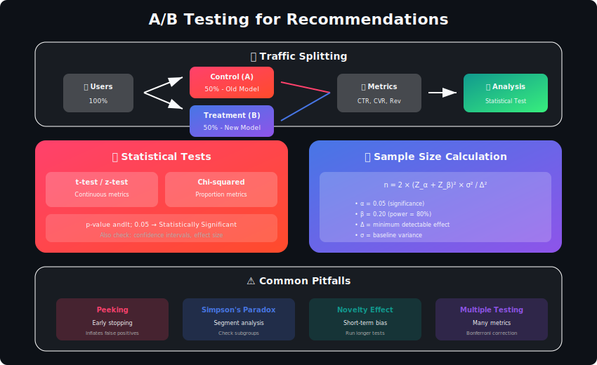
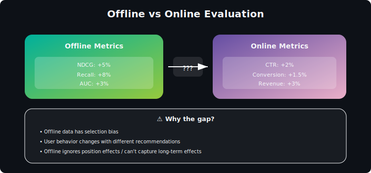

# A/B Testing & Experimentation for Personalization



## Table of Contents
1. [Introduction](#introduction)
2. [Experimentation Framework](#experimentation-framework)
3. [Statistical Foundations](#statistical-foundations)
4. [Multi-Armed Bandits](#multi-armed-bandits)
5. [Interleaving Experiments](#interleaving-experiments)
6. [Metrics & Guardrails](#metrics-guardrails)
7. [Common Pitfalls](#common-pitfalls)
8. [Advanced Topics](#advanced-topics)
9. [Production Systems](#production-systems)
10. [Interview Questions](#interview-questions)

---

## Introduction

Experimentation is the gold standard for measuring recommendation system improvements. Offline metrics can be misleading—only real user behavior reveals true impact.

### Why A/B Test Recommendations?



---

## Experimentation Framework

### Basic A/B Test Architecture

```python
import hashlib
from typing import Dict, Optional
import time

class ExperimentationPlatform:
    """
    Core experimentation platform for recommendation A/B tests
    """

    def __init__(self, config_store, metrics_collector):
        self.config_store = config_store
        self.metrics = metrics_collector
        self.active_experiments = {}

    def create_experiment(self, experiment_config: Dict) -> str:
        """
        Create a new experiment
        """
        experiment_id = self._generate_experiment_id()

        experiment = {
            'id': experiment_id,
            'name': experiment_config['name'],
            'hypothesis': experiment_config['hypothesis'],
            'variants': experiment_config['variants'],
            'traffic_allocation': experiment_config['traffic_allocation'],
            'metrics': {
                'primary': experiment_config['primary_metric'],
                'secondary': experiment_config.get('secondary_metrics', []),
                'guardrails': experiment_config.get('guardrail_metrics', [])
            },
            'status': 'draft',
            'created_at': time.time()
        }

        self.config_store.save(experiment_id, experiment)
        return experiment_id

    def assign_variant(self, user_id: str, experiment_id: str) -> Optional[str]:
        """
        Deterministically assign user to experiment variant
        """
        experiment = self.config_store.get(experiment_id)

        if not experiment or experiment['status'] != 'running':
            return None

        # Check if user is eligible
        if not self._user_eligible(user_id, experiment):
            return None

        # Deterministic assignment via hashing
        hash_input = f"{user_id}:{experiment_id}"
        hash_value = int(hashlib.md5(hash_input.encode()).hexdigest(), 16)
        bucket = hash_value % 100

        # Assign based on traffic allocation
        cumulative = 0
        for variant_name, allocation in experiment['traffic_allocation'].items():
            cumulative += allocation
            if bucket < cumulative:
                # Log exposure
                self._log_exposure(user_id, experiment_id, variant_name)
                return variant_name

        return 'control'

    def _user_eligible(self, user_id: str, experiment: Dict) -> bool:
        """
        Check if user meets experiment targeting criteria
        """
        targeting = experiment.get('targeting', {})

        # Example: Only target users from specific countries
        if 'countries' in targeting:
            user_country = self._get_user_country(user_id)
            if user_country not in targeting['countries']:
                return False

        # Example: Only target users with account age > N days
        if 'min_account_age' in targeting:
            account_age = self._get_account_age(user_id)
            if account_age < targeting['min_account_age']:
                return False

        return True

    def _log_exposure(self, user_id: str, experiment_id: str, variant: str):
        """
        Log that user was exposed to experiment
        """
        self.metrics.log({
            'event_type': 'experiment_exposure',
            'user_id': user_id,
            'experiment_id': experiment_id,
            'variant': variant,
            'timestamp': time.time()
        })

class ExperimentAnalyzer:
    """
    Analyze experiment results
    """

    def __init__(self, metrics_store):
        self.metrics = metrics_store

    def analyze(self, experiment_id: str) -> Dict:
        """
        Compute experiment results with statistical analysis
        """
        # Get exposures and outcomes
        exposures = self.metrics.get_exposures(experiment_id)
        outcomes = self.metrics.get_outcomes(experiment_id)

        # Group by variant
        variant_data = self._group_by_variant(exposures, outcomes)

        results = {
            'experiment_id': experiment_id,
            'variants': {},
            'comparisons': []
        }

        # Compute metrics per variant
        for variant, data in variant_data.items():
            results['variants'][variant] = self._compute_variant_metrics(data)

        # Statistical comparisons
        control_data = variant_data.get('control', {})
        for variant, data in variant_data.items():
            if variant != 'control':
                comparison = self._compare_variants(control_data, data)
                results['comparisons'].append({
                    'treatment': variant,
                    'control': 'control',
                    **comparison
                })

        return results

    def _compare_variants(self, control_data: Dict, treatment_data: Dict) -> Dict:
        """
        Statistical comparison between control and treatment
        """
        from scipy import stats

        control_metric = control_data['primary_metric_values']
        treatment_metric = treatment_data['primary_metric_values']

        # Compute means
        control_mean = np.mean(control_metric)
        treatment_mean = np.mean(treatment_metric)

        # T-test
        t_stat, p_value = stats.ttest_ind(control_metric, treatment_metric)

        # Confidence interval
        se = np.sqrt(
            np.var(control_metric)/len(control_metric) +
            np.var(treatment_metric)/len(treatment_metric)
        )
        lift = (treatment_mean - control_mean) / control_mean if control_mean > 0 else 0
        ci_lower = lift - 1.96 * se / control_mean
        ci_upper = lift + 1.96 * se / control_mean

        return {
            'control_mean': control_mean,
            'treatment_mean': treatment_mean,
            'lift': lift,
            'p_value': p_value,
            'confidence_interval': (ci_lower, ci_upper),
            'is_significant': p_value < 0.05,
            'sample_size_control': len(control_metric),
            'sample_size_treatment': len(treatment_metric)
        }

```

---

## Statistical Foundations

### Power Analysis

```python
from scipy import stats
import numpy as np

class PowerAnalysis:
    """
    Determine required sample size for experiments
    """

    @staticmethod
    def sample_size_proportion(baseline_rate: float,
                                mde: float,
                                alpha: float = 0.05,
                                power: float = 0.8) -> int:
        """
        Sample size for proportion metrics (CTR, conversion rate)

        baseline_rate: Current metric value (e.g., 0.05 for 5% CTR)
        mde: Minimum Detectable Effect (relative, e.g., 0.1 for 10% lift)
        alpha: Significance level
        power: Statistical power
        """
        # Effect size
        p1 = baseline_rate
        p2 = baseline_rate * (1 + mde)

        # Pooled standard error
        p_pooled = (p1 + p2) / 2
        se = np.sqrt(2 * p_pooled * (1 - p_pooled))

        # Z-scores
        z_alpha = stats.norm.ppf(1 - alpha / 2)
        z_beta = stats.norm.ppf(power)

        # Sample size per group
        n = ((z_alpha + z_beta) * se / (p2 - p1)) ** 2

        return int(np.ceil(n))

    @staticmethod
    def sample_size_continuous(baseline_mean: float,
                                baseline_std: float,
                                mde: float,
                                alpha: float = 0.05,
                                power: float = 0.8) -> int:
        """
        Sample size for continuous metrics (revenue, time spent)
        """
        # Absolute effect size
        delta = baseline_mean * mde

        # Standardized effect size (Cohen's d)
        d = delta / baseline_std

        # Z-scores
        z_alpha = stats.norm.ppf(1 - alpha / 2)
        z_beta = stats.norm.ppf(power)

        # Sample size per group
        n = 2 * ((z_alpha + z_beta) / d) ** 2

        return int(np.ceil(n))

    @staticmethod
    def experiment_duration(sample_size_per_variant: int,
                            daily_traffic: int,
                            n_variants: int,
                            traffic_fraction: float = 1.0) -> int:
        """
        Estimate experiment duration in days
        """
        total_sample_needed = sample_size_per_variant * n_variants
        daily_experiment_traffic = daily_traffic * traffic_fraction

        days = total_sample_needed / daily_experiment_traffic

        return int(np.ceil(days))

# Example usage
power = PowerAnalysis()

# For a 5% CTR baseline, 10% MDE
sample_size = power.sample_size_proportion(
    baseline_rate=0.05,
    mde=0.10,
    alpha=0.05,
    power=0.8
)
print(f"Required sample size per variant: {sample_size:,}")

# Estimate duration
duration = power.experiment_duration(
    sample_size_per_variant=sample_size,
    daily_traffic=100_000,
    n_variants=2,
    traffic_fraction=0.5
)
print(f"Estimated duration: {duration} days")

```

### Sequential Testing

```python
class SequentialTesting:
    """
    Sequential analysis for early stopping
    """

    def __init__(self, alpha: float = 0.05, beta: float = 0.2):
        self.alpha = alpha
        self.beta = beta

        # Spending function boundaries
        self.alpha_spent = 0

    def obrien_fleming_boundary(self, n_looks: int, current_look: int) -> float:
        """
        O'Brien-Fleming spending function for sequential testing

        Conservative: Harder to stop early, preserves alpha
        """
        info_fraction = current_look / n_looks

        # O'Brien-Fleming boundary
        z_boundary = stats.norm.ppf(1 - self.alpha / 2) / np.sqrt(info_fraction)

        return z_boundary

    def pocock_boundary(self, n_looks: int) -> float:
        """
        Pocock boundary: constant boundary across looks

        More aggressive: Easier to stop early
        """
        # Adjust alpha for multiple looks
        adjusted_alpha = 1 - (1 - self.alpha) ** (1 / n_looks)
        z_boundary = stats.norm.ppf(1 - adjusted_alpha / 2)

        return z_boundary

    def check_stopping(self,
                       control_data: np.ndarray,
                       treatment_data: np.ndarray,
                       n_looks: int,
                       current_look: int) -> Dict:
        """
        Check if experiment should stop based on sequential analysis
        """
        # Compute test statistic
        n1, n2 = len(control_data), len(treatment_data)
        mean_diff = np.mean(treatment_data) - np.mean(control_data)
        se = np.sqrt(np.var(control_data)/n1 + np.var(treatment_data)/n2)
        z_stat = mean_diff / se if se > 0 else 0

        # Get boundary
        boundary = self.obrien_fleming_boundary(n_looks, current_look)

        # Decision
        if abs(z_stat) > boundary:
            decision = 'stop_significant' if z_stat > 0 else 'stop_significant_negative'
        else:
            decision = 'continue'

        return {
            'z_statistic': z_stat,
            'boundary': boundary,
            'decision': decision,
            'current_look': current_look,
            'total_looks': n_looks
        }

```

---

## Multi-Armed Bandits

```python
import numpy as np
from typing import List, Dict

class ThompsonSamplingBandit:
    """
    Thompson Sampling for recommendation experiments

    Balances exploration and exploitation automatically
    """

    def __init__(self, n_arms: int):
        self.n_arms = n_arms

        # Beta distribution parameters for each arm
        self.alpha = np.ones(n_arms)  # Successes + 1
        self.beta = np.ones(n_arms)   # Failures + 1

    def select_arm(self) -> int:
        """
        Select arm by sampling from posterior
        """
        # Sample from Beta posterior for each arm
        samples = np.random.beta(self.alpha, self.beta)

        # Select arm with highest sample
        return int(np.argmax(samples))

    def update(self, arm: int, reward: float):
        """
        Update posterior based on observed reward

        reward: 1 for success (click/conversion), 0 for failure
        """
        if reward > 0:
            self.alpha[arm] += reward
        else:
            self.beta[arm] += 1

    def get_arm_statistics(self) -> List[Dict]:
        """
        Get current statistics for each arm
        """
        stats = []
        for arm in range(self.n_arms):
            expected_reward = self.alpha[arm] / (self.alpha[arm] + self.beta[arm])
            stats.append({
                'arm': arm,
                'alpha': self.alpha[arm],
                'beta': self.beta[arm],
                'expected_reward': expected_reward,
                'n_trials': self.alpha[arm] + self.beta[arm] - 2
            })
        return stats

class ContextualBandit:
    """
    LinUCB: Contextual bandit for personalized experiments
    """

    def __init__(self, n_arms: int, context_dim: int, alpha: float = 1.0):
        self.n_arms = n_arms
        self.context_dim = context_dim
        self.alpha = alpha

        # Per-arm parameters
        self.A = {i: np.eye(context_dim) for i in range(n_arms)}
        self.b = {i: np.zeros(context_dim) for i in range(n_arms)}

    def select_arm(self, context: np.ndarray) -> int:
        """
        Select arm based on user context
        """
        ucb_values = []

        for arm in range(self.n_arms):
            A_inv = np.linalg.inv(self.A[arm])
            theta = A_inv @ self.b[arm]

            # UCB = expected reward + exploration bonus
            expected = context @ theta
            exploration = self.alpha * np.sqrt(context @ A_inv @ context)

            ucb_values.append(expected + exploration)

        return int(np.argmax(ucb_values))

    def update(self, arm: int, context: np.ndarray, reward: float):
        """
        Update arm parameters based on observed reward
        """
        self.A[arm] += np.outer(context, context)
        self.b[arm] += reward * context

class BanditExperiment:
    """
    Use bandits for adaptive experimentation
    """

    def __init__(self, variants: List[str], exploration_fraction: float = 0.1):
        self.variants = variants
        self.exploration_fraction = exploration_fraction
        self.bandit = ThompsonSamplingBandit(len(variants))

        # Track for final analysis
        self.assignments = {v: [] for v in variants}
        self.outcomes = {v: [] for v in variants}

    def assign_variant(self, user_id: str) -> str:
        """
        Assign user to variant using bandit
        """
        # Forced exploration for sufficient data
        if np.random.random() < self.exploration_fraction:
            arm = np.random.randint(len(self.variants))
        else:
            arm = self.bandit.select_arm()

        variant = self.variants[arm]
        self.assignments[variant].append(user_id)

        return variant

    def record_outcome(self, user_id: str, variant: str, reward: float):
        """
        Record outcome and update bandit
        """
        arm = self.variants.index(variant)
        self.bandit.update(arm, reward)
        self.outcomes[variant].append(reward)

    def get_results(self) -> Dict:
        """
        Get current experiment results
        """
        return {
            'bandit_stats': self.bandit.get_arm_statistics(),
            'variant_outcomes': {
                v: {
                    'n_assigned': len(self.assignments[v]),
                    'n_outcomes': len(self.outcomes[v]),
                    'mean_reward': np.mean(self.outcomes[v]) if self.outcomes[v] else 0
                }
                for v in self.variants
            }
        }

```

---

## Interleaving Experiments

```python
class InterleavingExperiment:
    """
    Interleaving: Compare rankers more efficiently than A/B testing

    Users see interleaved results from both rankers in single session
    """

    def __init__(self, ranker_a, ranker_b):
        self.ranker_a = ranker_a
        self.ranker_b = ranker_b
        self.results = {'a_wins': 0, 'b_wins': 0, 'ties': 0}

    def create_interleaved_ranking(self, query: str,
                                    n_results: int = 10) -> tuple:
        """
        Team Draft Interleaving
        """
        # Get rankings from both systems
        ranking_a = self.ranker_a.rank(query)
        ranking_b = self.ranker_b.rank(query)

        interleaved = []
        team_a = []  # Items credited to A
        team_b = []  # Items credited to B

        idx_a, idx_b = 0, 0
        current_team = 'a' if np.random.random() < 0.5 else 'b'

        while len(interleaved) < n_results:
            if current_team == 'a':
                # A picks
                while idx_a < len(ranking_a) and ranking_a[idx_a] in interleaved:
                    idx_a += 1
                if idx_a < len(ranking_a):
                    item = ranking_a[idx_a]
                    interleaved.append(item)
                    team_a.append(item)
                    idx_a += 1
                current_team = 'b'
            else:
                # B picks
                while idx_b < len(ranking_b) and ranking_b[idx_b] in interleaved:
                    idx_b += 1
                if idx_b < len(ranking_b):
                    item = ranking_b[idx_b]
                    interleaved.append(item)
                    team_b.append(item)
                    idx_b += 1
                current_team = 'a'

        return interleaved, team_a, team_b

    def evaluate_session(self, clicks: List[str],
                         team_a: List[str],
                         team_b: List[str]):
        """
        Determine winner based on clicks
        """
        clicks_a = sum(1 for item in clicks if item in team_a)
        clicks_b = sum(1 for item in clicks if item in team_b)

        if clicks_a > clicks_b:
            self.results['a_wins'] += 1
            return 'a'
        elif clicks_b > clicks_a:
            self.results['b_wins'] += 1
            return 'b'
        else:
            self.results['ties'] += 1
            return 'tie'

    def get_significance(self) -> Dict:
        """
        Compute statistical significance of interleaving results
        """
        n_a = self.results['a_wins']
        n_b = self.results['b_wins']
        n_total = n_a + n_b

        if n_total == 0:
            return {'insufficient_data': True}

        # Binomial test
        p_value = stats.binom_test(n_a, n_total, 0.5)

        # Win rate
        win_rate_a = n_a / n_total

        return {
            'a_wins': n_a,
            'b_wins': n_b,
            'ties': self.results['ties'],
            'win_rate_a': win_rate_a,
            'p_value': p_value,
            'is_significant': p_value < 0.05,
            'winner': 'a' if win_rate_a > 0.5 and p_value < 0.05 else
                     ('b' if win_rate_a < 0.5 and p_value < 0.05 else 'no_winner')
        }

```

---

## Metrics & Guardrails

```python
class MetricDefinitions:
    """
    Define and compute experiment metrics
    """

    def __init__(self):
        self.metrics = {}

    def register_metric(self, name: str, computation_func,
                        metric_type: str, higher_is_better: bool = True):
        """
        Register a metric for experiments
        """
        self.metrics[name] = {
            'compute': computation_func,
            'type': metric_type,  # 'rate', 'mean', 'count'
            'higher_is_better': higher_is_better
        }

    def compute_metric(self, name: str, data: Dict) -> float:
        """
        Compute metric value from experiment data
        """
        if name not in self.metrics:
            raise ValueError(f"Unknown metric: {name}")

        return self.metrics[name]['compute'](data)

class GuardrailMetrics:
    """
    Guardrail metrics that must not degrade
    """

    def __init__(self, guardrails: List[Dict]):
        self.guardrails = guardrails

    def check_guardrails(self, experiment_results: Dict) -> Dict:
        """
        Check if any guardrails are violated
        """
        violations = []

        for guardrail in self.guardrails:
            metric_name = guardrail['metric']
            threshold = guardrail['threshold']
            direction = guardrail['direction']  # 'no_decrease' or 'no_increase'

            control_value = experiment_results['control'][metric_name]
            treatment_value = experiment_results['treatment'][metric_name]

            relative_change = (treatment_value - control_value) / control_value

            violated = False
            if direction == 'no_decrease' and relative_change < -threshold:
                violated = True
            elif direction == 'no_increase' and relative_change > threshold:
                violated = True

            if violated:
                violations.append({
                    'metric': metric_name,
                    'control': control_value,
                    'treatment': treatment_value,
                    'change': relative_change,
                    'threshold': threshold
                })

        return {
            'all_passed': len(violations) == 0,
            'violations': violations
        }

# Example guardrail configuration
guardrails = [
    {'metric': 'page_load_time', 'threshold': 0.05, 'direction': 'no_increase'},
    {'metric': 'error_rate', 'threshold': 0.01, 'direction': 'no_increase'},
    {'metric': 'user_satisfaction', 'threshold': 0.02, 'direction': 'no_decrease'},
    {'metric': 'revenue', 'threshold': 0.01, 'direction': 'no_decrease'}
]

```

---

## Common Pitfalls

### Avoiding Experimentation Mistakes

```python
class ExperimentValidator:
    """
    Validate experiment design to avoid common pitfalls
    """

    def validate_experiment(self, experiment: Dict) -> List[str]:
        """
        Check for common experiment design issues
        """
        issues = []

        # Check sample size
        if not self._adequate_sample_size(experiment):
            issues.append("Insufficient sample size for desired MDE")

        # Check randomization
        if not self._proper_randomization(experiment):
            issues.append("Randomization unit may cause spillover effects")

        # Check metric quality
        metric_issues = self._check_metrics(experiment)
        issues.extend(metric_issues)

        # Check for novelty effects
        if experiment.get('duration_days', 0) < 14:
            issues.append("Short duration may capture novelty effects")

        # Check for day-of-week effects
        if experiment.get('duration_days', 0) % 7 != 0:
            issues.append("Duration should be multiple of 7 for day-of-week balance")

        return issues

    def _check_metrics(self, experiment: Dict) -> List[str]:
        """
        Validate metric choices
        """
        issues = []

        primary_metric = experiment.get('primary_metric')

        # Check for proxy metrics
        if primary_metric in ['clicks', 'page_views']:
            issues.append("Primary metric may be proxy; consider business outcome")

        # Check for guardrails
        if not experiment.get('guardrail_metrics'):
            issues.append("No guardrail metrics defined")

        return issues

class BiasDetector:
    """
    Detect bias in experiment results
    """

    @staticmethod
    def check_sample_ratio_mismatch(control_size: int,
                                     treatment_size: int,
                                     expected_ratio: float = 0.5) -> Dict:
        """
        Check if actual split matches expected ratio

        SRM is a red flag for randomization issues
        """
        total = control_size + treatment_size
        expected_control = total * expected_ratio

        # Chi-squared test
        chi2 = ((control_size - expected_control) ** 2 / expected_control +
                (treatment_size - (total - expected_control)) ** 2 / (total - expected_control))

        p_value = 1 - stats.chi2.cdf(chi2, df=1)

        return {
            'control_size': control_size,
            'treatment_size': treatment_size,
            'actual_ratio': control_size / total,
            'expected_ratio': expected_ratio,
            'chi2': chi2,
            'p_value': p_value,
            'has_srm': p_value < 0.001  # Very conservative threshold
        }

    @staticmethod
    def check_aa_test(control_a: np.ndarray,
                      control_b: np.ndarray) -> Dict:
        """
        A/A test: Both groups should have same metrics

        Run before A/B test to validate infrastructure
        """
        t_stat, p_value = stats.ttest_ind(control_a, control_b)

        return {
            'mean_a': np.mean(control_a),
            'mean_b': np.mean(control_b),
            't_statistic': t_stat,
            'p_value': p_value,
            'passes_aa': p_value > 0.05  # Should NOT be significant
        }

```

---

## Advanced Topics

### Multi-Variate Testing

```python
class MultivariateTest:
    """
    Test multiple factors simultaneously
    """

    def __init__(self, factors: Dict[str, List]):
        """
        factors: Dict mapping factor name to list of levels
        Example: {'algorithm': ['v1', 'v2'], 'ui': ['old', 'new']}
        """
        self.factors = factors
        self.combinations = self._generate_combinations()

    def _generate_combinations(self) -> List[Dict]:
        """
        Generate all factor combinations
        """
        from itertools import product

        factor_names = list(self.factors.keys())
        factor_levels = [self.factors[f] for f in factor_names]

        combinations = []
        for combo in product(*factor_levels):
            combinations.append(dict(zip(factor_names, combo)))

        return combinations

    def assign_combination(self, user_id: str) -> Dict:
        """
        Assign user to factor combination
        """
        hash_value = hash(user_id) % len(self.combinations)
        return self.combinations[hash_value]

    def analyze_main_effects(self, results: Dict) -> Dict:
        """
        Analyze main effect of each factor
        """
        import pandas as pd
        from scipy.stats import f_oneway

        df = pd.DataFrame(results)

        main_effects = {}
        for factor in self.factors:
            groups = [
                df[df[factor] == level]['metric'].values
                for level in self.factors[factor]
            ]
            f_stat, p_value = f_oneway(*groups)

            main_effects[factor] = {
                'f_statistic': f_stat,
                'p_value': p_value,
                'is_significant': p_value < 0.05
            }

        return main_effects

```

---

## Production Systems

### Experiment Configuration

```python
experiment_config = {
    "name": "new_ranking_algorithm_v2",
    "description": "Test new neural ranking model",
    "hypothesis": "New model will increase CTR by 5% without hurting conversion",

    "variants": {
        "control": {
            "description": "Current production ranker",
            "model": "ranker_v1"
        },
        "treatment": {
            "description": "New neural ranker",
            "model": "ranker_v2"
        }
    },

    "traffic_allocation": {
        "control": 50,
        "treatment": 50
    },

    "targeting": {
        "countries": ["US", "UK", "CA"],
        "platforms": ["web", "ios", "android"],
        "min_account_age_days": 7
    },

    "metrics": {
        "primary": "ctr",
        "secondary": ["conversion_rate", "revenue_per_user", "items_viewed"],
        "guardrails": ["page_load_time", "error_rate", "bounce_rate"]
    },

    "duration": {
        "min_days": 14,
        "max_days": 28
    },

    "analysis": {
        "significance_level": 0.05,
        "power": 0.8,
        "mde": 0.05,
        "sequential_testing": True,
        "n_looks": 4
    }
}

```

---

## Interview Questions

### Q1: How do you decide between A/B testing and bandits?

**A/B Testing**:
- Need clean causal inference
- Have time for full experiment
- Testing significant changes
- Want to measure long-term effects

**Bandits**:
- Minimizing regret is priority
- Testing many variants
- Short-lived changes (promotions)
- Personalized treatment selection

### Q2: How do you handle network effects in experiments?

**Problem**: Users influence each other (social networks)

**Solutions**:
1. **Cluster randomization**: Randomize at network cluster level
2. **Geo-based experiments**: Different regions get different treatments
3. **Time-based switching**: Alternate treatments over time
4. **Ego-network randomization**: Randomize user + their connections

### Q3: What do you do if guardrails are violated?

**Steps**:
1. Stop or reduce experiment traffic
2. Investigate root cause
3. Check for bugs vs real effect
4. Consider trade-offs with leadership
5. Document decision and learnings

---

## Conclusion

Effective experimentation requires:

1. **Proper design**: Power analysis, randomization, metrics
2. **Statistical rigor**: Correct tests, multiple comparison correction
3. **Guardrails**: Protect against regressions
4. **Automation**: Scale experimentation infrastructure
5. **Culture**: Learn from all experiments, including failures

---

<div align="center">

**[⬆ Back to Top](#)** | **[📚 Main Repository](https://github.com/Gaurav14cs17/ml_system_design)**

Made with 💜 by [Gaurav14cs17](https://github.com/Gaurav14cs17)

</div>
