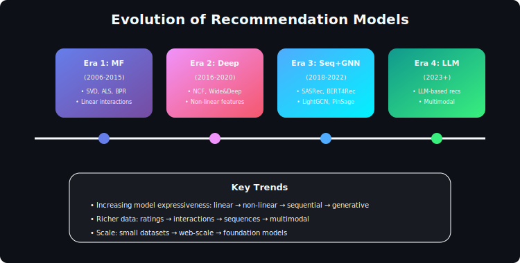
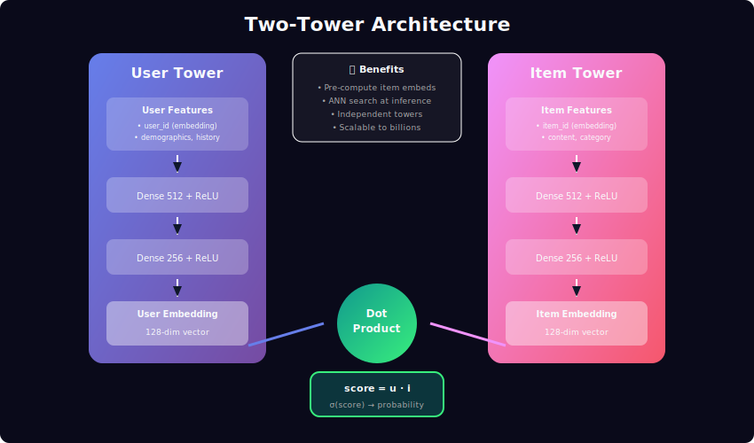

# Deep Learning for Recommendation Systems

<div align="center">


*Neural architectures that learn complex patterns from user behavior*

</div>

---

## Table of Contents
1. [Why Deep Learning?](#why-deep-learning)
2. [Neural Collaborative Filtering](#neural-collaborative-filtering)
3. [Sequential Recommenders](#sequential-recommenders)
4. [Graph Neural Networks](#graph-neural-networks)
5. [Attention Mechanisms](#attention-mechanisms)
6. [Multi-Task Learning](#multi-task-learning)
7. [Training at Scale](#training-at-scale)
8. [Interview Questions](#interview-questions)

---

## Why Deep Learning?



Traditional methods (matrix factorization) model linear interactions:

```math
\hat{r}_{ui} = \mathbf{p}_u^\top \mathbf{q}_i

```

Deep learning captures **non-linear patterns**:

```math
\hat{r}_{ui} = f_\theta(\mathbf{p}_u, \mathbf{q}_i)

```

Where \(f_\theta\) is a neural network.

### Capabilities of Deep Learning

| Capability | Traditional MF | Deep Learning |
|------------|----------------|---------------|
| Linear interactions | ✓ | ✓ |
| Non-linear patterns | ✗ | ✓ |
| Sequential modeling | ✗ | ✓ |
| Multi-modal fusion | Limited | ✓ |
| Automatic feature learning | ✗ | ✓ |

---

## Neural Collaborative Filtering



### NCF Architecture

Combines linear (GMF) and non-linear (MLP) pathways:

**Generalized Matrix Factorization (GMF):**

```math
\mathbf{h}_{\text{GMF}} = \mathbf{p}_u \odot \mathbf{q}_i

```

Element-wise product preserves the MF formulation.

**Multi-Layer Perceptron (MLP):**

```math
\mathbf{h}_{\text{MLP}} = \text{MLP}([\mathbf{p}_u \oplus \mathbf{q}_i])

```

Learns arbitrary non-linear interactions.

**Final Prediction:**

```math
\hat{r}_{ui} = \sigma\left(\mathbf{w}^\top [\mathbf{h}_{\text{GMF}} \oplus \mathbf{h}_{\text{MLP}}]\right)

```

### Two-Tower Architecture

Industry-standard for large-scale retrieval:

**User Tower:**

```math
\mathbf{e}_u = f_\theta(\mathbf{x}_u) \in \mathbb{R}^d

```

**Item Tower:**

```math
\mathbf{e}_i = g_\phi(\mathbf{y}_i) \in \mathbb{R}^d

```

**Similarity:**

```math
s(u, i) = \mathbf{e}_u^\top \mathbf{e}_i

```

**Advantages:**

- Item embeddings pre-computed offline

- ANN index for sub-linear retrieval

- Decoupled training and serving

### DeepFM: Feature Interactions

Captures low-order (FM) and high-order (DNN) feature interactions:

**Factorization Machine Component:**

```math
y_{\text{FM}} = w_0 + \sum_i w_i x_i + \sum_i \sum_{j>i} \langle \mathbf{v}_i, \mathbf{v}_j \rangle x_i x_j

```

**Deep Component:**

```math
y_{\text{DNN}} = \text{DNN}(\mathbf{x})

```

**Final:**

```math
\hat{y} = \sigma(y_{\text{FM}} + y_{\text{DNN}})

```

---

## Sequential Recommenders

### The Sequential Prediction Task

Given user interaction sequence \(\mathcal{S} = (s_1, s_2, \ldots, s_t)\), predict next item:

```math
P(s_{t+1} \mid s_1, \ldots, s_t)

```

### Self-Attention (SASRec)

**Architecture:**

```math
\mathbf{E} = [\mathbf{e}_{s_1}, \mathbf{e}_{s_2}, \ldots, \mathbf{e}_{s_t}] + \mathbf{PE}

```

Where \(\mathbf{PE}\) is positional encoding.

**Self-Attention:**

```math
\text{Attention}(\mathbf{Q}, \mathbf{K}, \mathbf{V}) = \text{softmax}\left(\frac{\mathbf{QK}^\top}{\sqrt{d_k}}\right)\mathbf{V}

```

**Causal Mask:** Prevent attending to future positions

```math
M_{ij} = \begin{cases} 0 & \text{if } i \geq j \\ -\infty & \text{if } i < j \end{cases}

```

**Output:** User embedding is the last position's output

```math
\mathbf{u} = \text{Output}[:, -1, :]

```

### BERT4Rec

Uses **bidirectional** attention with masked item prediction:

**Training:** Randomly mask items in sequence, predict masked items

```math
\mathcal{L} = -\sum_{m \in \mathcal{M}} \log P(s_m \mid \mathbf{s}_{\setminus m})

```

**Inference:** Append [MASK] token, predict next item

```math
P(s_{t+1}) = \text{softmax}(\mathbf{h}_{[\text{MASK}]} \mathbf{E}^\top)

```

### Key Differences

| Model | Attention | Training | Inference |
|-------|-----------|----------|-----------|
| **SASRec** | Causal (left-to-right) | Next-item prediction | Efficient |
| **BERT4Rec** | Bidirectional | Masked item prediction | Requires [MASK] |

---

## Graph Neural Networks

### User-Item Bipartite Graph

Users and items as nodes, interactions as edges:

```math
\mathcal{G} = (\mathcal{V}, \mathcal{E}), \quad \mathcal{V} = \mathcal{U} \cup \mathcal{I}

```

### Message Passing

**Aggregate neighbor information:**

```math
\mathbf{h}_u^{(l+1)} = \text{AGG}\left(\left\{\mathbf{h}_i^{(l)} : i \in \mathcal{N}(u)\right\}\right)

```

### LightGCN

Simplified GCN without feature transformation and non-linearity:

**Propagation Rule:**

```math
\mathbf{e}_u^{(l+1)} = \sum_{i \in \mathcal{N}(u)} \frac{1}{\sqrt{|\mathcal{N}(u)|}\sqrt{|\mathcal{N}(i)|}} \mathbf{e}_i^{(l)}

```

**Final Embedding (Layer Aggregation):**

```math
\mathbf{e}_u = \frac{1}{L+1} \sum_{l=0}^{L} \mathbf{e}_u^{(l)}

```

**Prediction:**

```math
\hat{y}_{ui} = \mathbf{e}_u^\top \mathbf{e}_i

```

### Why Remove Non-linearity?

Empirical finding: For bipartite graphs in recommendations:

- Activation functions hurt performance

- Linear propagation + layer combination works best

- Simpler models generalize better

### PinSage (Web-Scale GNN)

Pinterest's production GNN with innovations for scale:

1. **Importance Sampling:** Sample neighbors by personalized PageRank
2. **Curriculum Learning:** Harder negatives over training
3. **Producer-Consumer:** Separate embedding generation from serving

---

## Attention Mechanisms

### Target-Aware Attention (DIN)

For candidate-aware user modeling:

**Attention Weight:**

```math
\alpha_j = \frac{\exp(f(\mathbf{e}_j, \mathbf{e}_{\text{target}}))}{\sum_k \exp(f(\mathbf{e}_k, \mathbf{e}_{\text{target}}))}

```

**User Representation:**

```math
\mathbf{u} = \sum_j \alpha_j \mathbf{e}_j

```

Different target items → different user representations.

### Multi-Head Attention

```math
\text{MultiHead}(\mathbf{Q}, \mathbf{K}, \mathbf{V}) = [\text{head}_1 \oplus \ldots \oplus \text{head}_h]\mathbf{W}^O

```

Where:

```math
\text{head}_i = \text{Attention}(\mathbf{Q}\mathbf{W}_i^Q, \mathbf{K}\mathbf{W}_i^K, \mathbf{V}\mathbf{W}_i^V)

```

**Benefit:** Captures different relationship types in parallel.

---

## Multi-Task Learning

### Why Multi-Task?

Multiple objectives in recommendations:

- Click prediction

- Conversion prediction  

- Watch time regression

- User satisfaction

### Shared-Bottom Architecture

```math
\mathbf{h}_{\text{shared}} = f_{\text{shared}}(\mathbf{x})
\hat{y}_k = f_k(\mathbf{h}_{\text{shared}})

```

**Problem:** Negative transfer when tasks conflict.

### Mixture of Experts (MMoE)

**Expert Networks:**

```math
\mathbf{h}_i = f_i(\mathbf{x}), \quad i = 1, \ldots, K

```

**Task-Specific Gating:**

```math
\mathbf{g}^{(t)} = \text{softmax}(\mathbf{W}_g^{(t)} \mathbf{x})

```

**Task Output:**

```math
\mathbf{h}^{(t)} = \sum_i g_i^{(t)} \mathbf{h}_i

```

**Benefit:** Each task learns its own combination of experts.

### Loss Weighting

**Simple Weighted:**

```math
\mathcal{L} = \sum_t \lambda_t \mathcal{L}_t

```

**Uncertainty Weighting:**

```math
\mathcal{L} = \sum_t \frac{1}{2\sigma_t^2} \mathcal{L}_t + \log \sigma_t

```

Learns task weights automatically.

---

## Training at Scale

### Negative Sampling

**Challenge:** Can't compute softmax over millions of items.

**Sampled Softmax:**

```math
\mathcal{L} = -\log \frac{\exp(s(u, i^+))}{\exp(s(u, i^+)) + \sum_{j \in \mathcal{N}} \exp(s(u, j))}

```

**Sampling Strategies:**

| Strategy | Formula | Effect |
|----------|---------|--------|
| **Uniform** | \(P(j) = 1/|\mathcal{I}|\) | Simple baseline |
| **Popularity** | \(P(j) \propto |U_j|^{0.75}\) | Focuses on hard negatives |
| **In-batch** | Other users' positives | Efficient, diverse |
| **Hard** | High-scoring negatives | Better discrimination |

### Mixed Precision Training

Use FP16 for forward/backward, FP32 for updates:

- 2x memory reduction

- Faster computation

- Minimal accuracy loss

### Embedding Compression

**Product Quantization:**

```math
\mathbf{e} \approx [\mathbf{c}_1^{k_1}, \mathbf{c}_2^{k_2}, \ldots, \mathbf{c}_M^{k_M}]

```

Split embedding into subspaces, quantize each.

**Hash Embeddings:**

```math
\text{Embed}(x) = \sum_{h} \mathbf{E}_h[h(x)]

```

Multiple hash functions with smaller tables.

---

## Model Comparison

| Model | Strengths | Weaknesses | Best For |
|-------|-----------|------------|----------|
| **NCF** | Simple, interpretable | Limited capacity | Baseline |
| **DeepFM** | Feature interactions | Needs rich features | CTR |
| **SASRec** | Captures sequence | Requires history | Session-based |
| **BERT4Rec** | Bidirectional context | Training complexity | Long sequences |
| **LightGCN** | Graph structure | Memory for large graphs | Social |
| **MMoE** | Multi-objective | Hyperparameter tuning | Production |

---

## Interview Questions

### Q1: Why does LightGCN remove non-linearity?

**Answer:**
1. User-item bipartite graphs lack node features
2. Non-linearity adds unnecessary complexity
3. Empirically: linear propagation + layer combination works better
4. Simpler model → better generalization

### Q2: Compare SASRec vs BERT4Rec

| Aspect | SASRec | BERT4Rec |
|--------|--------|----------|
| **Attention** | Causal | Bidirectional |
| **Training** | Next-item | Masked item |
| **Context** | Only past | Past and future |
| **Inference** | Efficient | Needs [MASK] |
| **Performance** | Good for streaming | Better for planning |

### Q3: How do you handle billion-scale item embeddings?

**Strategies:**
1. **Hash embeddings:** Multiple hash functions
2. **Product quantization:** Sub-vector codebooks
3. **Compositional embeddings:** Build from sub-ID components
4. **Pruning:** Remove inactive items
5. **Mixed precision:** FP16 storage

### Q4: When would you use GNNs for recommendations?

**Use GNNs when:**

- Rich graph structure (social, knowledge)

- Multi-hop relationships matter

- Cold-start needs neighbor propagation

- Heterogeneous interactions

**Avoid GNNs when:**

- Simple user-item matrix

- Latency constraints (GNN inference slow)

- Graph is too sparse

---

## Further Reading

1. **He et al. (2017)** — Neural Collaborative Filtering
2. **Kang & McAuley (2018)** — Self-Attentive Sequential Recommendation
3. **Sun et al. (2019)** — BERT4Rec
4. **He et al. (2020)** — LightGCN
5. **Ma et al. (2018)** — MMoE: Modeling Task Relationships

---

<div align="center">

*Deep learning transforms recommendation from pattern matching to pattern learning.*

</div>

---

<div align="center">

**[⬆ Back to Top](#)** | **[📚 Main Repository](https://github.com/Gaurav14cs17/ml_system_design)**

Made with 💜 by [Gaurav14cs17](https://github.com/Gaurav14cs17)

</div>
