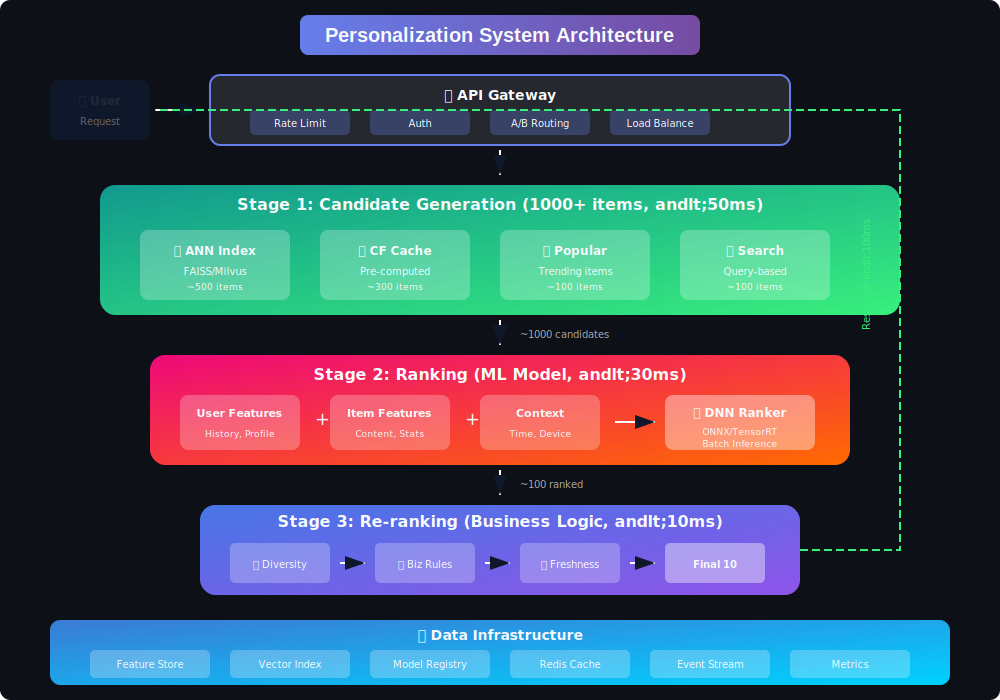
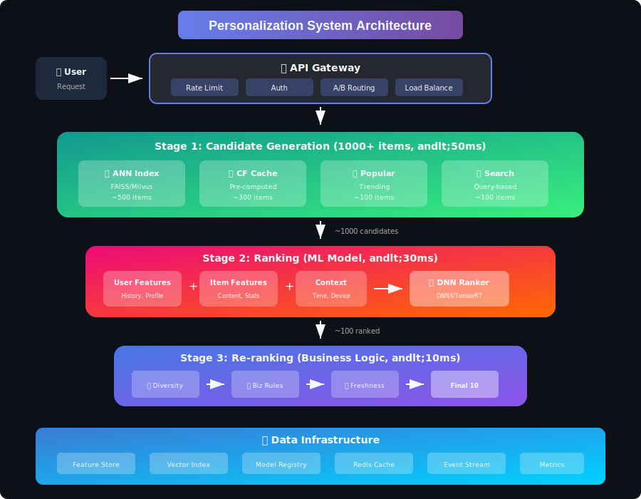

# Personalization & Recommendation Systems

## Mathematical Foundations of Modern Recommender Systems

<div align="center">



*A comprehensive guide to the mathematics, algorithms, and system design behind production recommendation systems*

</div>

---

## 📐 Core Mathematical Framework

At its heart, a recommendation system solves the **matrix completion problem**: given a sparse user-item interaction matrix $R \in \mathbb{R}^{m \times n}$, predict the missing entries.

### The Fundamental Prediction Task

For user $u$ and item $i$, we seek to estimate:

```math
\hat{r}_{ui} = f(u, i; \Theta)
```

Where $f$ is our model parameterized by $\Theta$. The goal is to learn $\Theta$ such that $\hat{r}_{ui}$ accurately predicts user preferences.

### Key Mathematical Paradigms

| Paradigm | Mathematical Formulation | Key Insight |
|----------|--------------------------|-------------|
| **Matrix Factorization** | $\mathbf{R} \approx \mathbf{P}\mathbf{Q}^\top$ | Users and items exist in shared latent space |
| **Similarity-Based** | \(\hat{r}_{ui} = \sum_{j \in \mathcal{N}_k(i)} w_{ij} \cdot r_{uj}\) | Similar items receive similar ratings |
| **Deep Learning** | \(\hat{r}_{ui} = \sigma(\mathbf{h}^\top \cdot [\mathbf{p}_u \oplus \mathbf{q}_i])\) | Non-linear feature interactions matter |
| **Probabilistic** | \(p(r_{ui} \mid \Theta) = \mathcal{N}(\mu_{ui}, \sigma^2)\) | Uncertainty quantification |

---

## 📚 Topics Covered

### Core Foundations

| # | Topic | Mathematical Focus |
|---|-------|---------------------|
| 01 | [User Modeling & Embeddings](./01_user_modeling_embeddings) | Embedding geometry, similarity metrics, neural encoding |
| 02 | [Collaborative Filtering](./02_collaborative_filtering) | Matrix factorization, SVD, neighborhood methods |
| 03 | [Content-Based Filtering](./03_content_based_filtering) | TF-IDF, cosine similarity, feature engineering |

### Advanced Techniques

| # | Topic | Mathematical Focus |
|---|-------|---------------------|
| 04 | [Hybrid Systems](./04_hybrid_recommender_systems) | Ensemble methods, weighted combinations |
| 05 | [Real-Time Personalization](./05_real_time_personalization) | Online learning, incremental updates |
| 06 | [Cold Start Problem](./06_cold_start_problem) | Bandit algorithms, exploration-exploitation |

### Evaluation & Infrastructure

| # | Topic | Mathematical Focus |
|---|-------|---------------------|
| 07 | [Evaluation Metrics](./07_evaluation_metrics) | NDCG, precision/recall, statistical testing |
| 08 | [Feature Engineering](./08_feature_engineering) | Feature transformations, normalization |
| 09 | [Model Serving](./09_model_serving_infrastructure) | Latency optimization, caching strategies |

### Specialized Topics

| # | Topic | Mathematical Focus |
|---|-------|---------------------|
| 10 | [Privacy & Ethics](./10_privacy_ethics) | Differential privacy, fairness constraints |
| 11 | [A/B Testing](./11_ab_testing_experimentation) | Statistical significance, power analysis |
| 12 | [Deep Learning](./12_deep_learning_recommenders) | Neural architectures, transformers, GNNs |

---

## 🧮 Mathematical Foundations

### 1. Matrix Factorization

The classic approach decomposes the interaction matrix into latent factors:

```math
\mathbf{R} \approx \mathbf{P}\mathbf{Q}^\top
```

Where:
- $\mathbf{R} \in \mathbb{R}^{m \times n}$: User-item interaction matrix
- $\mathbf{P} \in \mathbb{R}^{m \times k}$: User latent factors
- $\mathbf{Q} \in \mathbb{R}^{n \times k}$: Item latent factors
- $k$: Embedding dimension (typically 32-256)

**Optimization Objective:**

```math
\min_{\mathbf{P}, \mathbf{Q}} \sum_{(u,i) \in \mathcal{O}} \left(r_{ui} - \mathbf{p}_u^\top \mathbf{q}_i\right)^2 + \lambda\left(\|\mathbf{P}\|_F^2 + \|\mathbf{Q}\|_F^2\right)
```

### 2. Similarity Metrics

**Cosine Similarity** — measures angular distance:

```math
\text{sim}(\mathbf{u}, \mathbf{v}) = \frac{\mathbf{u} \cdot \mathbf{v}}{\|\mathbf{u}\| \|\mathbf{v}\|} = \frac{\sum_i u_i v_i}{\sqrt{\sum_i u_i^2} \sqrt{\sum_i v_i^2}}
```

**Pearson Correlation** — adjusts for rating bias:

```math
\text{corr}(\mathbf{u}, \mathbf{v}) = \frac{\sum_i (u_i - \bar{u})(v_i - \bar{v})}{\sqrt{\sum_i (u_i - \bar{u})^2} \sqrt{\sum_i (v_i - \bar{v})^2}}
```

### 3. Probabilistic Framework (BPR)

Bayesian Personalized Ranking optimizes pairwise preferences:

```math
\text{BPR-OPT} = \sum_{(u,i,j) \in D_S} \ln \sigma(\hat{x}_{uij}) - \lambda_\Theta \|\Theta\|^2
```

Where $\hat{x}_{uij} = \hat{r}_{ui} - \hat{r}_{uj}$ represents the preference of item $i$ over item $j$ for user $u$.

### 4. Deep Learning Formulations

**Two-Tower Architecture:**

```math
\hat{r}_{ui} = \text{sim}(f_\theta(\mathbf{x}_u), g_\phi(\mathbf{y}_i))
```

Where:
- $f_\theta$: User encoder network
- $g_\phi$: Item encoder network
- $\text{sim}$: Dot product or cosine similarity

**Attention Mechanism (Transformers):**

```math
\text{Attention}(\mathbf{Q}, \mathbf{K}, \mathbf{V}) = \text{softmax}\left(\frac{\mathbf{Q}\mathbf{K}^\top}{\sqrt{d_k}}\right)\mathbf{V}
```

---

## 📊 Evaluation Metrics

### Ranking Quality

**NDCG@K (Normalized Discounted Cumulative Gain):**

```math
\text{DCG@K} = \sum_{i=1}^{K} \frac{2^{rel_i} - 1}{\log_2(i + 1)}
\text{NDCG@K} = \frac{\text{DCG@K}}{\text{IDCG@K}}
```

**Mean Average Precision:**

```math
\text{MAP} = \frac{1}{|U|} \sum_{u \in U} \text{AP}(u) = \frac{1}{|U|} \sum_{u \in U} \frac{1}{|R_u|} \sum_{k=1}^{n} P(k) \cdot \text{rel}(k)
```

### Prediction Accuracy

**RMSE (Root Mean Squared Error):**

```math
\text{RMSE} = \sqrt{\frac{1}{|\mathcal{T}|} \sum_{(u,i) \in \mathcal{T}} (r_{ui} - \hat{r}_{ui})^2}
```

---

## 🏗️ System Architecture



### Three-Stage Pipeline

Modern recommendation systems follow a **candidate generation → ranking → re-ranking** pipeline:

| Stage | Complexity | Items | Latency |
|-------|------------|-------|---------|
| **Candidate Generation** | \(O(\log n)\) with ANN | 1000+ → 100-500 | < 50ms |
| **Ranking** | \(O(k \cdot d)\) per item | 100-500 → 50-100 | < 30ms |
| **Re-ranking** | \(O(k^2)\) for diversity | 50-100 → 10-20 | < 10ms |

### Approximate Nearest Neighbor (ANN)

For large-scale retrieval, exact nearest neighbor search is infeasible. ANN algorithms trade accuracy for speed:

```math
\text{Recall@k} = \frac{|\text{ANN}(q, k) \cap \text{Exact}(q, k)|}{k}
```

Common approaches:
- **HNSW** (Hierarchical Navigable Small World): \(O(\log n)\) search
- **IVF** (Inverted File Index): Cluster-based partitioning
- **PQ** (Product Quantization): Compressed representations

---

## 📈 Algorithm Comparison

| Algorithm | Pros | Cons | Complexity | Best For |
|-----------|------|------|------------|----------|
| **User-kNN** | Explainable, simple | \(O(mn)\) at query | \(O(m^2n)\) build | Small user bases |
| **Item-kNN** | Stable, cacheable | Cold start for items | \(O(n^2m)\) build | E-commerce |
| **SVD/ALS** | Handles sparsity | Cold start | \(O(mn k^2)\) | Netflix-style |
| **Neural CF** | Captures non-linearity | Data hungry | \(O(\text{epochs} \cdot mn)\) | Large datasets |
| **GNN** | Graph structure | Memory intensive | \(O(|E| \cdot k)\) | Social networks |

---

## 🎓 Learning Path

### Week 1-2: Foundations
1. **[User Modeling & Embeddings](./01_user_modeling_embeddings)** — Understanding representation learning
2. **[Collaborative Filtering](./02_collaborative_filtering)** — Matrix factorization and neighborhood methods
3. **[Content-Based Filtering](./03_content_based_filtering)** — Feature extraction and similarity

### Week 3-4: Advanced Methods
4. **[Hybrid Systems](./04_hybrid_recommender_systems)** — Combining approaches
5. **[Cold Start Problem](./06_cold_start_problem)** — Handling new users/items
6. **[Evaluation Metrics](./07_evaluation_metrics)** — Measuring success

### Week 5-6: Production Systems
7. **[Real-Time Personalization](./05_real_time_personalization)** — Online learning
8. **[Model Serving](./09_model_serving_infrastructure)** — Deployment at scale
9. **[A/B Testing](./11_ab_testing_experimentation)** — Experimentation
10. **[Deep Learning](./12_deep_learning_recommenders)** — Neural approaches

---

## 📖 Key Papers & Resources

### Foundational Papers

1. **Koren et al. (2009)** — *Matrix Factorization Techniques for Recommender Systems*
   - The Netflix Prize winning approach
   
2. **Rendle et al. (2009)** — *BPR: Bayesian Personalized Ranking from Implicit Feedback*
   - Pairwise learning for implicit data

3. **He et al. (2017)** — *Neural Collaborative Filtering*
   - Deep learning meets collaborative filtering

4. **Kang & McAuley (2018)** — *Self-Attentive Sequential Recommendation*
   - Transformers for sequential recommendations

5. **He et al. (2020)** — *LightGCN: Simplifying and Powering Graph Convolution Network*
   - Efficient graph neural networks for recommendations

### Industry Blogs

- **Netflix Tech Blog** — Large-scale recommendation architecture
- **Spotify Engineering** — Music personalization at scale
- **Pinterest Engineering** — Visual recommendations with PinSage
- **YouTube/Google** — Deep learning for video recommendations

---

## 🎯 Interview Preparation

### Top System Design Questions

1. **Design a recommendation system for Netflix/YouTube**
   - Two-tower architecture, real-time features, cold start handling

2. **How would you measure recommendation quality?**
   - Offline (NDCG, precision) vs online (CTR, engagement) metrics

3. **How do you handle the cold start problem?**
   - Content-based fallback, bandits, meta-learning

4. **Design real-time personalization at scale**
   - Feature stores, model serving, caching strategies

5. **How do you ensure diversity in recommendations?**
   - MMR, DPP, calibration, business rules

---

## 🔑 Key Takeaways

1. **Mathematics First**: Understanding the underlying optimization objectives is crucial
2. **Trade-offs Everywhere**: Accuracy vs latency, exploration vs exploitation, diversity vs relevance
3. **Hybrid Wins**: Production systems combine multiple approaches
4. **Evaluation is Hard**: Offline metrics don't always correlate with online success
5. **Scale Changes Everything**: Algorithms that work at 1M items may fail at 1B

---

<div align="center">

*Build recommendation systems that understand users, respect their privacy, and deliver genuine value.*

**Happy Learning! 🎉**

</div>

---

<div align="center">

**[⬆ Back to Top](#)** | **[📚 Main Repository](https://github.com/Gaurav14cs17/ml_system_design)**

Made with 💜 by [Gaurav14cs17](https://github.com/Gaurav14cs17)

</div>
