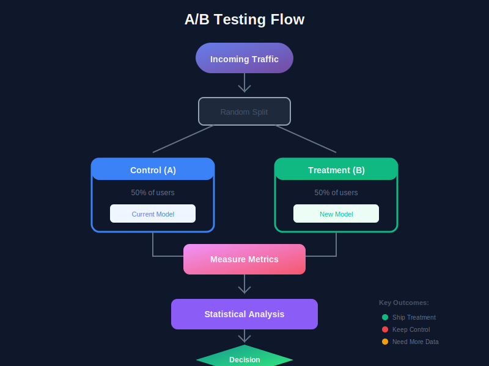
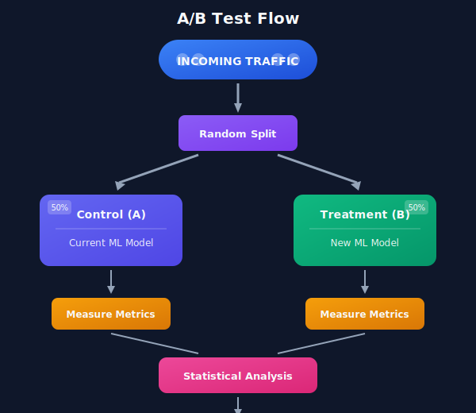
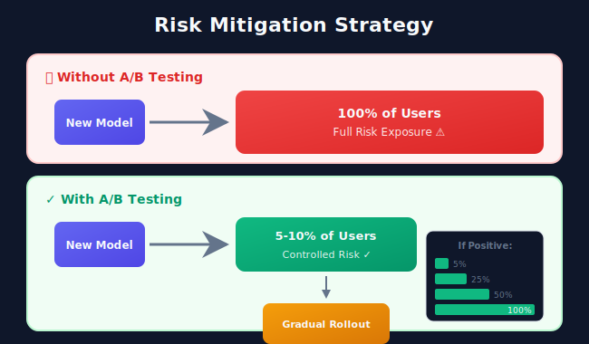
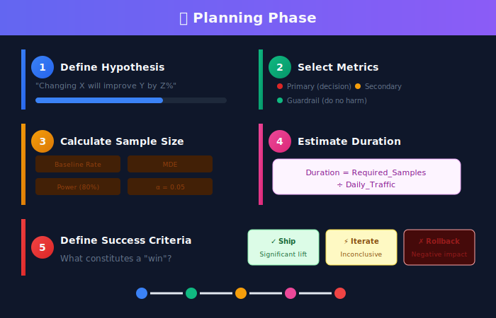
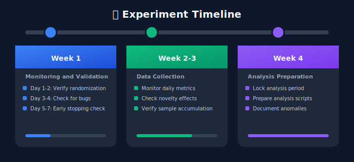
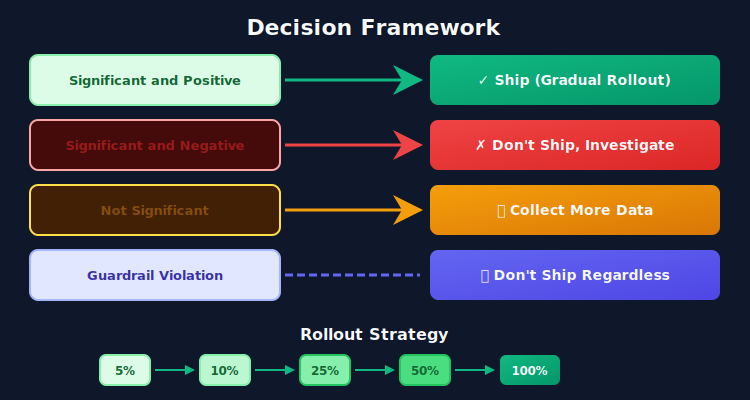
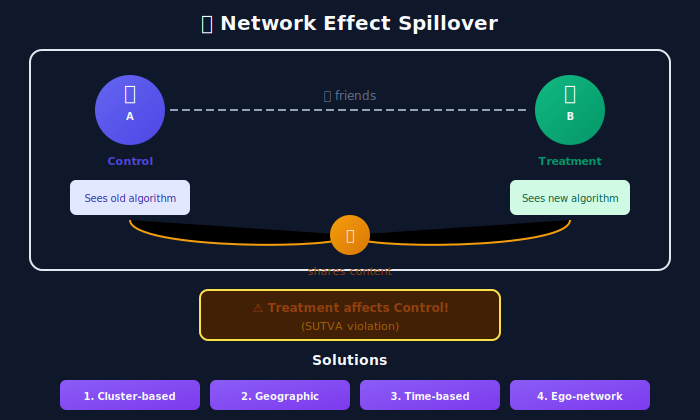
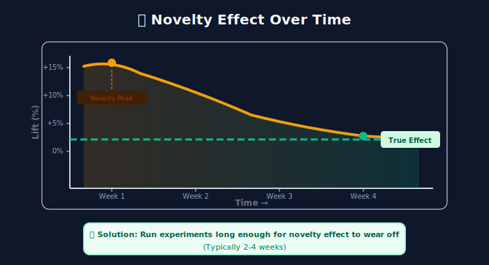

# Introduction to A/B Testing in Machine Learning Systems

## Table of Contents

1. [What is A/B Testing?](#what-is-ab-testing)

2. [Why A/B Testing Matters for ML Systems](#why-ab-testing-matters-for-ml-systems)

3. [A/B Testing vs Other Experimentation Methods](#ab-testing-vs-other-experimentation-methods)

4. [The A/B Testing Lifecycle](#the-ab-testing-lifecycle)

5. [Key Terminology](#key-terminology)

6. [When to Use A/B Testing](#when-to-use-ab-testing)

7. [Challenges in ML A/B Testing](#challenges-in-ml-ab-testing)

---

## What is A/B Testing?

A/B testing, also known as **split testing** or **controlled experimentation**, is a statistical methodology used to compare two or more versions of a product, feature, or system to determine which performs better against a predefined metric.

### The Core Concept





### Historical Context

A/B testing has roots in **randomized controlled trials (RCTs)** dating back to the 18th century. James Lind's 1747 scurvy experiment is often cited as the first controlled clinical trial. The methodology was formalized in the 20th century by statisticians like Ronald Fisher.

In the tech industry, A/B testing became mainstream in the early 2000s:

- **2000**: Google ran its first A/B test on the number of search results per page

- **2007**: Amazon reported that every 100ms of latency cost them 1% in sales (discovered via A/B testing)

- **2008**: Obama's presidential campaign used A/B testing extensively

- **2012**: Facebook was running over 1,000 concurrent experiments

---

## Why A/B Testing Matters for ML Systems

### 1. Offline Metrics Don't Tell the Full Story

**The Problem**: ML models are typically evaluated using offline metrics like accuracy, AUC, or RMSE. However, these metrics often don't correlate with real business outcomes.

```python
# Example: A recommendation model might have better offline metrics
# but perform worse in production

# Model A (Current)
offline_metrics_a = {
    'precision@10': 0.42,
    'recall@10': 0.38,
    'ndcg@10': 0.45
}

# Model B (New)
offline_metrics_b = {
    'precision@10': 0.48,  # +14% improvement
    'recall@10': 0.44,     # +16% improvement
    'ndcg@10': 0.52        # +15% improvement
}

# BUT in A/B test...
ab_test_results = {
    'model_a': {
        'click_through_rate': 0.058,
        'conversion_rate': 0.023,
        'revenue_per_user': 12.45
    },
    'model_b': {
        'click_through_rate': 0.052,  # -10% (worse!)
        'conversion_rate': 0.019,     # -17% (worse!)
        'revenue_per_user': 10.89     # -12.5% (worse!)
    }
}

```

### 2. Understanding Causal Impact

A/B testing allows us to establish **causality**, not just correlation:

| Method | Establishes Causality? | Why |
|--------|------------------------|-----|
| Correlation Analysis | ❌ No | Confounding variables |
| Before/After Analysis | ❌ No | Time-based confounds (seasonality, trends) |
| Observational Studies | ⚠️ Limited | Selection bias |
| A/B Testing | ✅ Yes | Random assignment eliminates confounds |

### 3. Risk Mitigation

A/B testing provides a safety net for ML deployments:



### 4. Continuous Learning and Iteration

ML systems benefit from continuous improvement cycles:

```python
class MLExperimentationCycle:
    """
    The continuous improvement cycle for ML systems
    """

    def __init__(self):
        self.iteration = 0
        self.baseline_model = None
        self.learnings = []

    def run_cycle(self):
        while True:
            # Step 1: Hypothesis Generation
            hypothesis = self.generate_hypothesis()

            # Step 2: Design Experiment
            experiment = self.design_experiment(hypothesis)

            # Step 3: Run A/B Test
            results = self.run_ab_test(experiment)

            # Step 4: Analyze Results
            analysis = self.analyze_results(results)

            # Step 5: Make Decision
            if analysis.is_significant and analysis.is_positive:
                self.baseline_model = experiment.treatment_model
                self.learnings.append(analysis.insights)
            else:
                self.learnings.append(analysis.negative_insights)

            self.iteration += 1

```

---

## A/B Testing vs Other Experimentation Methods

### Comparison Matrix

| Method | Randomization | Control Group | Sample Size | Duration | Complexity |
|--------|---------------|---------------|-------------|----------|------------|
| **A/B Testing** | ✅ Full | ✅ Yes | Large | Medium | Medium |
| **Multi-Armed Bandits** | ✅ Adaptive | ⚠️ Partial | Variable | Ongoing | High |
| **Interleaving** | ✅ Yes | N/A | Small | Short | Medium |
| **Synthetic Control** | ❌ No | ✅ Synthetic | N/A | Long | High |
| **Pre/Post Analysis** | ❌ No | ❌ No | N/A | Variable | Low |
| **Quasi-Experiments** | ⚠️ Partial | ⚠️ Partial | Variable | Variable | High |

### When to Use Each Method

#### A/B Testing
Best for:

- Feature launches

- Model comparisons

- UI/UX changes

- Pricing experiments

```python
# A/B Test Example: Comparing two ranking models
experiment_config = {
    'type': 'ab_test',
    'control': 'model_v2.1',
    'treatment': 'model_v2.2',
    'traffic_split': 50/50,
    'primary_metric': 'conversion_rate',
    'duration_days': 14,
    'minimum_detectable_effect': 0.02  # 2% relative lift
}

```

#### Multi-Armed Bandits
Best for:

- Personalization at scale

- Continuous optimization

- When regret minimization matters

```python
# MAB Example: Dynamic content optimization
mab_config = {
    'type': 'epsilon_greedy',
    'epsilon': 0.1,
    'arms': ['headline_a', 'headline_b', 'headline_c'],
    'reward_metric': 'click_through_rate',
    'exploration_phase': 1000  # samples
}

```

#### Interleaving
Best for:

- Ranking/search systems

- Quick directional insights

- Sensitive detection of preferences

```python
# Interleaving Example: Search ranking comparison
interleaving_config = {
    'type': 'team_draft_interleaving',
    'ranker_a': 'bm25_baseline',
    'ranker_b': 'neural_ranker_v1',
    'metric': 'preference_score',
    'clicks_needed': 10000
}

```

---

## The A/B Testing Lifecycle


### Phase 1: Planning (1-2 weeks)



### Phase 2: Implementation (1-2 weeks)

```python
class ABTestImplementation:
    """
    Key implementation components
    """

    def setup_randomization(self, user_id: str, experiment_id: str) -> str:
        """
        Consistent hashing for stable assignment
        """
        hash_input = f"{user_id}:{experiment_id}"
        hash_value = hashlib.md5(hash_input.encode()).hexdigest()
        bucket = int(hash_value[:8], 16) % 100

        if bucket < 50:
            return 'control'
        else:
            return 'treatment'

    def log_exposure(self, user_id: str, variant: str, timestamp: datetime):
        """
        Track who was exposed to which variant
        """
        exposure_event = {
            'user_id': user_id,
            'experiment_id': self.experiment_id,
            'variant': variant,
            'timestamp': timestamp,
            'context': self.get_context()
        }
        self.event_logger.log(exposure_event)

    def log_conversion(self, user_id: str, metric_name: str, value: float):
        """
        Track metric values for analysis
        """
        conversion_event = {
            'user_id': user_id,
            'experiment_id': self.experiment_id,
            'metric': metric_name,
            'value': value,
            'timestamp': datetime.now()
        }
        self.event_logger.log(conversion_event)

```

### Phase 3: Running (1-4 weeks)



### Phase 4: Analysis (3-5 days)

```python
def analyze_ab_test(control_data, treatment_data, alpha=0.05):
    """
    Comprehensive A/B test analysis
    """
    # 1. Sanity Checks
    assert len(control_data) > 100, "Insufficient control sample"
    assert len(treatment_data) > 100, "Insufficient treatment sample"

    # 2. Sample Ratio Mismatch Check
    expected_ratio = 1.0  # 50/50 split
    actual_ratio = len(treatment_data) / len(control_data)
    if abs(actual_ratio - expected_ratio) > 0.02:
        raise Warning("Sample Ratio Mismatch detected!")

    # 3. Calculate Statistics
    control_mean = np.mean(control_data)
    treatment_mean = np.mean(treatment_data)
    relative_lift = (treatment_mean - control_mean) / control_mean

    # 4. Statistical Test
    t_stat, p_value = stats.ttest_ind(control_data, treatment_data)

    # 5. Confidence Interval
    pooled_se = np.sqrt(
        np.var(control_data)/len(control_data) +
        np.var(treatment_data)/len(treatment_data)
    )
    ci_lower = (treatment_mean - control_mean) - 1.96 * pooled_se
    ci_upper = (treatment_mean - control_mean) + 1.96 * pooled_se

    return {
        'control_mean': control_mean,
        'treatment_mean': treatment_mean,
        'relative_lift': relative_lift,
        'p_value': p_value,
        'is_significant': p_value < alpha,
        'confidence_interval': (ci_lower, ci_upper)
    }

```

### Phase 5: Decision & Rollout



---

## Key Terminology

### Statistical Terms

| Term | Definition | Example |
|------|------------|---------|
| **Null Hypothesis (H₀)** | The assumption that there's no difference between variants | "The new model has no effect on conversion rate" |
| **Alternative Hypothesis (H₁)** | The assumption that there IS a difference | "The new model improves conversion rate" |
| **p-value** | Probability of observing results at least as extreme as the data, assuming H₀ is true | p = 0.03 means 3% chance of seeing this result if there's no real difference |
| **Statistical Significance** | When p-value < α (typically 0.05) | p = 0.02 < 0.05, so result is significant |
| **Statistical Power** | Probability of detecting a true effect when it exists | 80% power means 80% chance of detecting a real 5% lift |
| **Type I Error (α)** | False positive - detecting an effect that doesn't exist | Shipping a model that's actually not better |
| **Type II Error (β)** | False negative - missing an effect that exists | Not shipping a model that's actually better |
| **Confidence Interval** | Range of plausible values for the true effect | 95% CI: [1.2%, 4.8%] lift |

### Business Terms

| Term | Definition |
|------|------------|
| **Minimum Detectable Effect (MDE)** | Smallest effect size you want to be able to detect |
| **Practical Significance** | Whether the detected effect is large enough to matter business-wise |
| **Guardrail Metric** | A metric you don't want to harm, even if primary metric improves |
| **Overall Evaluation Criterion (OEC)** | A composite metric that captures overall success |

---

## When to Use A/B Testing

### ✅ Good Candidates for A/B Testing

1. **ML Model Updates**
   - New model versions
   - Feature additions to models
   - Hyperparameter changes with production impact

2. **User-Facing Changes**
   - Recommendation algorithms
   - Search ranking
   - Personalization systems

3. **Business Logic Changes**
   - Pricing algorithms
   - Fraud detection thresholds
   - Content moderation policies

### ❌ When NOT to Use A/B Testing

1. **Backend Infrastructure**
   - Database migrations
   - System architecture changes
   - Most performance optimizations

2. **When Speed is Critical**
   - Security patches
   - Critical bug fixes
   - Legal compliance changes

3. **When Randomization is Impossible**
   - Network effects (social features)
   - Two-sided marketplace changes
   - Changes affecting all users equally

---

## Challenges in ML A/B Testing

### Challenge 1: Delayed Feedback

```python
# Problem: Many ML metrics have delayed outcomes
feedback_delays = {
    'click': 'immediate',
    'add_to_cart': 'minutes',
    'purchase': 'hours to days',
    'subscription_renewal': 'months',
    'lifetime_value': 'years'
}

# Solution: Use proxy metrics with established correlation
proxy_metric_mapping = {
    'lifetime_value': 'first_month_engagement',
    'subscription_renewal': 'feature_usage_frequency',
    'long_term_retention': 'day_7_retention'
}

```

### Challenge 2: Network Effects



### Challenge 3: Multiple Hypothesis Testing

```python
# Problem: Running many experiments increases false positive rate

def bonferroni_correction(p_values, alpha=0.05):
    """
    Adjust for multiple comparisons
    """
    n_tests = len(p_values)
    adjusted_alpha = alpha / n_tests

    results = []
    for p in p_values:
        results.append({
            'original_p': p,
            'adjusted_threshold': adjusted_alpha,
            'is_significant': p < adjusted_alpha
        })
    return results

# Example: 20 metrics tested
# Original α = 0.05
# Adjusted α = 0.05/20 = 0.0025

```

### Challenge 4: Novelty and Primacy Effects



---

## Summary

A/B testing is the gold standard for making data-driven decisions in ML systems. It provides:

- **Causal evidence** for the impact of changes

- **Risk mitigation** through controlled exposure

- **Quantifiable results** for business decisions

- **Learning opportunities** even from failed experiments

In the following chapters, we'll dive deeper into each aspect of A/B testing, from statistical foundations to practical implementation.

---

## Further Reading

1. Kohavi, R., Tang, D., & Xu, Y. (2020). *Trustworthy Online Controlled Experiments: A Practical Guide to A/B Testing*

2. [Google's A/B Testing Blog](https://www.exp-platform.com/resources)

3. [Netflix Tech Blog - Experimentation](https://netflixtechblog.com/tagged/experimentation)

4. [Microsoft's ExP Platform Papers](https://www.microsoft.com/en-us/research/group/experimentation-platform-exp/)

---

[Next Chapter: Statistical Foundations →](../02_statistical_foundations/README.md)

---

<div align="center">

**[⬆ Back to Top](#)** | **[📚 Main Repository](https://github.com/Gaurav14cs17/ml_system_design)**

Made with 💜 by [Gaurav14cs17](https://github.com/Gaurav14cs17)

</div>
