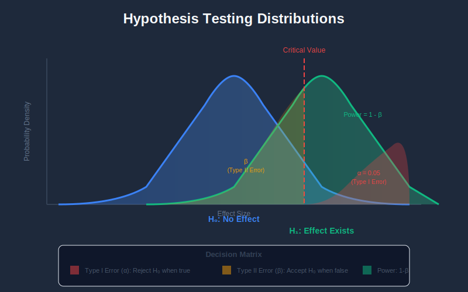
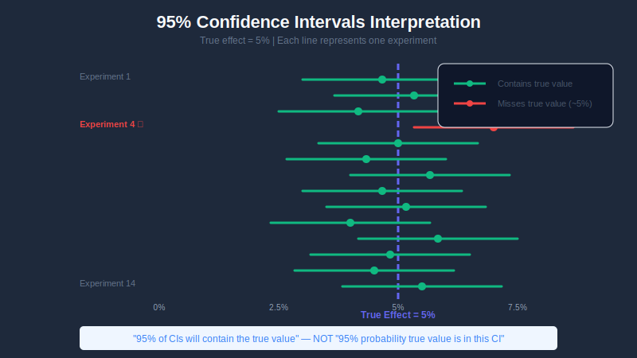
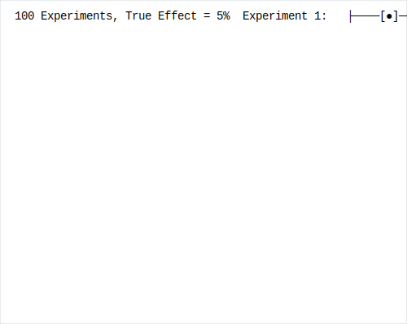
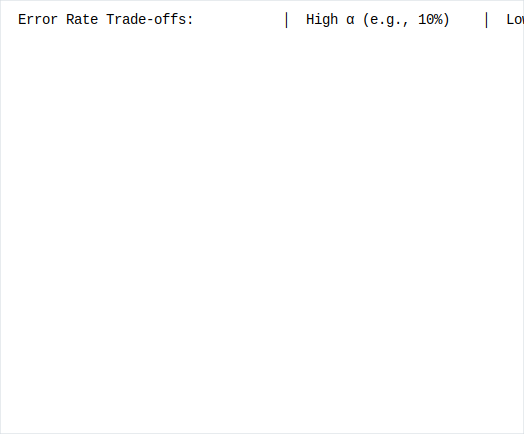
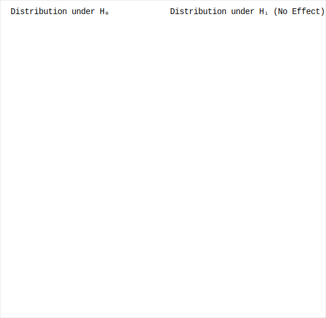
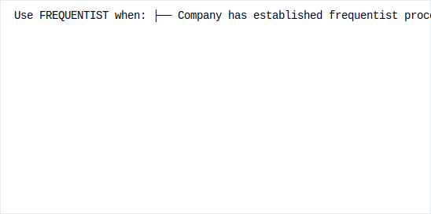

# Statistical Foundations of A/B Testing

## Table of Contents

1. [Hypothesis Testing Framework](#hypothesis-testing-framework)

2. [Understanding P-Values](#understanding-p-values)

3. [Confidence Intervals](#confidence-intervals)

4. [Type I and Type II Errors](#type-i-and-type-ii-errors)

5. [Statistical Power](#statistical-power)

6. [Effect Size](#effect-size)

7. [Common Statistical Tests for A/B Testing](#common-statistical-tests-for-ab-testing)

8. [Bayesian vs Frequentist Approaches](#bayesian-vs-frequentist-approaches)

---

## Hypothesis Testing Framework



### The Scientific Method Applied to Experimentation

A/B testing is essentially the scientific method applied to product decisions:


### Null and Alternative Hypotheses


### Types of Hypothesis Tests

```python
class HypothesisTest:
    """
    Different types of hypothesis tests used in A/B testing
    """

    @staticmethod
    def two_sided_test(control, treatment, alpha=0.05):
        """
        H₀: μ_treatment = μ_control
        H₁: μ_treatment ≠ μ_control

        Use when: You want to detect any difference (positive or negative)
        """
        t_stat, p_value = stats.ttest_ind(control, treatment)
        return {
            'test_type': 'two-sided',
            'p_value': p_value,
            'reject_null': p_value < alpha,
            'critical_region': f'|t| > {stats.t.ppf(1-alpha/2, len(control)+len(treatment)-2):.3f}'
        }

    @staticmethod
    def one_sided_superiority_test(control, treatment, alpha=0.05):
        """
        H₀: μ_treatment ≤ μ_control
        H₁: μ_treatment > μ_control

        Use when: You only care if treatment is BETTER
        """
        t_stat, p_value_two_sided = stats.ttest_ind(control, treatment)
        p_value = p_value_two_sided / 2 if t_stat > 0 else 1 - p_value_two_sided / 2
        return {
            'test_type': 'one-sided (superiority)',
            'p_value': p_value,
            'reject_null': p_value < alpha and np.mean(treatment) > np.mean(control)
        }

    @staticmethod
    def non_inferiority_test(control, treatment, margin, alpha=0.05):
        """
        H₀: μ_treatment ≤ μ_control - margin
        H₁: μ_treatment > μ_control - margin

        Use when: You want to show treatment is not much worse than control
        """
        diff = np.mean(treatment) - np.mean(control)
        se = np.sqrt(np.var(control)/len(control) + np.var(treatment)/len(treatment))
        t_stat = (diff + margin) / se
        p_value = 1 - stats.t.cdf(t_stat, len(control)+len(treatment)-2)
        return {
            'test_type': 'non-inferiority',
            'margin': margin,
            'p_value': p_value,
            'reject_null': p_value < alpha
        }

```

---

## Understanding P-Values

### What a P-Value Actually Means


### Visual Representation


### P-Value Calculation Example

```python
import numpy as np
from scipy import stats

def calculate_p_value_from_scratch(control, treatment):
    """
    Step-by-step p-value calculation for two-sample t-test
    """
    # Step 1: Calculate sample statistics
    n1, n2 = len(control), len(treatment)
    mean1, mean2 = np.mean(control), np.mean(treatment)
    var1, var2 = np.var(control, ddof=1), np.var(treatment, ddof=1)

    print(f"Control: n={n1}, mean={mean1:.4f}, var={var1:.4f}")
    print(f"Treatment: n={n2}, mean={mean2:.4f}, var={var2:.4f}")

    # Step 2: Calculate pooled standard error
    se = np.sqrt(var1/n1 + var2/n2)
    print(f"\nPooled Standard Error: {se:.4f}")

    # Step 3: Calculate t-statistic
    t_stat = (mean2 - mean1) / se
    print(f"T-statistic: {t_stat:.4f}")

    # Step 4: Calculate degrees of freedom (Welch's approximation)
    df = ((var1/n1 + var2/n2)**2) / \
         ((var1/n1)**2/(n1-1) + (var2/n2)**2/(n2-1))
    print(f"Degrees of Freedom: {df:.2f}")

    # Step 5: Calculate p-value (two-tailed)
    p_value = 2 * (1 - stats.t.cdf(abs(t_stat), df))
    print(f"\nP-value (two-tailed): {p_value:.4f}")

    return {
        't_statistic': t_stat,
        'degrees_of_freedom': df,
        'p_value': p_value,
        'significant_at_05': p_value < 0.05
    }

# Example usage
np.random.seed(42)
control = np.random.normal(0.10, 0.05, 1000)  # 10% conversion rate
treatment = np.random.normal(0.11, 0.05, 1000)  # 11% conversion rate

result = calculate_p_value_from_scratch(control, treatment)

```

### Common P-Value Misconceptions

| Misconception ❌ | Reality ✅ |
|-----------------|-----------|
| "p = 0.03 means 3% chance the null is true" | P-value is P(data\|H₀), not P(H₀\|data) |
| "p = 0.06 means no effect" | Non-significant ≠ no effect |
| "p = 0.01 is stronger effect than p = 0.04" | P-value doesn't measure effect size |
| "Significant result means practically important" | Statistical ≠ practical significance |
| "p-value depends only on effect size" | Also depends on sample size |

---

## Confidence Intervals



### Understanding Confidence Intervals


### Visual: What 95% CI Really Means



### Calculating Confidence Intervals

```python
def calculate_confidence_interval(control, treatment, confidence=0.95):
    """
    Calculate confidence interval for the difference in means
    """
    # Calculate statistics
    n1, n2 = len(control), len(treatment)
    mean1, mean2 = np.mean(control), np.mean(treatment)
    var1, var2 = np.var(control, ddof=1), np.var(treatment, ddof=1)

    # Point estimate (difference in means)
    diff = mean2 - mean1

    # Standard error of the difference
    se_diff = np.sqrt(var1/n1 + var2/n2)

    # Critical value for two-tailed test
    alpha = 1 - confidence
    z_critical = stats.norm.ppf(1 - alpha/2)

    # Confidence interval
    ci_lower = diff - z_critical * se_diff
    ci_upper = diff + z_critical * se_diff

    # Relative lift CI (percentage)
    relative_lift = diff / mean1
    relative_ci_lower = ci_lower / mean1
    relative_ci_upper = ci_upper / mean1

    return {
        'absolute_difference': diff,
        'absolute_ci': (ci_lower, ci_upper),
        'relative_lift': relative_lift,
        'relative_ci': (relative_ci_lower, relative_ci_upper),
        'standard_error': se_diff
    }

# Example
result = calculate_confidence_interval(control, treatment)
print(f"Absolute Difference: {result['absolute_difference']:.4f}")
print(f"95% CI: [{result['absolute_ci'][0]:.4f}, {result['absolute_ci'][1]:.4f}]")
print(f"Relative Lift: {result['relative_lift']*100:.2f}%")
print(f"95% CI: [{result['relative_ci'][0]*100:.2f}%, {result['relative_ci'][1]*100:.2f}%]")

```

### Interpreting Confidence Intervals for Decisions


---

## Type I and Type II Errors

### Error Types Explained


### Real-World Examples

```python
class ABTestErrors:
    """
    Examples of Type I and Type II errors in A/B testing
    """

    TYPE_I_ERROR_EXAMPLES = """
    Type I Error (False Positive) - Shipping a bad change:

    Scenario: You A/B test a new ML ranking model
    Reality: The new model is actually NO BETTER than the old one
    Decision: p-value comes out as 0.03 (significant!)
    Action: You ship the new model

    Cost:
    - Engineering time wasted on false improvement
    - Potential degradation that's within noise
    - Loss of credibility in experimentation program

    Probability: α (typically 5%)
    """

    TYPE_II_ERROR_EXAMPLES = """
    Type II Error (False Negative) - Missing a good change:

    Scenario: You A/B test a new recommendation algorithm
    Reality: The new algorithm IS 3% better
    Decision: p-value comes out as 0.12 (not significant)
    Action: You don't ship the improvement

    Cost:
    - Lost opportunity (3% lift × revenue)
    - Wasted development effort
    - Slower innovation pace

    Probability: β (depends on power, typically 20%)
    """

```

### Controlling Error Rates



---

## Statistical Power

### What is Statistical Power?


### Visual: Power Analysis



### Power Calculation

```python
from scipy import stats
import numpy as np

def calculate_power(baseline_rate, mde, sample_size_per_group, alpha=0.05):
    """
    Calculate statistical power for a two-proportion test

    Parameters:
    -----------
    baseline_rate : float
        Control group conversion rate (e.g., 0.10 for 10%)
    mde : float
        Minimum detectable effect as relative change (e.g., 0.05 for 5% lift)
    sample_size_per_group : int
        Number of samples in each group
    alpha : float
        Significance level (default 0.05)

    Returns:
    --------
    float : Statistical power
    """
    # Treatment rate
    treatment_rate = baseline_rate * (1 + mde)

    # Pooled proportion
    p_pooled = (baseline_rate + treatment_rate) / 2

    # Standard error under H₀
    se_null = np.sqrt(2 * p_pooled * (1 - p_pooled) / sample_size_per_group)

    # Standard error under H₁
    se_alt = np.sqrt(
        baseline_rate * (1 - baseline_rate) / sample_size_per_group +
        treatment_rate * (1 - treatment_rate) / sample_size_per_group
    )

    # Critical value
    z_alpha = stats.norm.ppf(1 - alpha/2)

    # Effect size
    effect = treatment_rate - baseline_rate

    # Z-score for power calculation
    z_beta = (effect - z_alpha * se_null) / se_alt

    # Power
    power = stats.norm.cdf(z_beta)

    return power

# Example: What's the power with 10,000 users per group?
power = calculate_power(
    baseline_rate=0.10,      # 10% conversion
    mde=0.05,                # Want to detect 5% relative lift
    sample_size_per_group=10000,
    alpha=0.05
)
print(f"Power: {power:.1%}")  # Output: Power: 47.6%

```

### Factors Affecting Power

```python
def power_sensitivity_analysis():
    """
    Show how different factors affect statistical power
    """

    results = []

    # Factor 1: Sample Size
    for n in [1000, 5000, 10000, 25000, 50000, 100000]:
        power = calculate_power(0.10, 0.05, n)
        results.append({'factor': 'sample_size', 'value': n, 'power': power})

    # Factor 2: Baseline Rate
    for rate in [0.01, 0.05, 0.10, 0.20, 0.50]:
        power = calculate_power(rate, 0.05, 20000)
        results.append({'factor': 'baseline_rate', 'value': rate, 'power': power})

    # Factor 3: MDE (Effect Size)
    for mde in [0.01, 0.02, 0.05, 0.10, 0.20]:
        power = calculate_power(0.10, mde, 20000)
        results.append({'factor': 'mde', 'value': mde, 'power': power})

    # Factor 4: Alpha Level
    for alpha in [0.01, 0.05, 0.10, 0.20]:
        # Using n that gives ~80% power at alpha=0.05
        power = calculate_power(0.10, 0.05, 25000, alpha)
        results.append({'factor': 'alpha', 'value': alpha, 'power': power})

    return results

"""
Power Sensitivity Results:

Sample Size Impact (baseline=10%, MDE=5%):
+------------+---------+

|   N/group  |  Power  |
+------------+---------+

|    1,000   |  10.5%  |
|    5,000   |  26.8%  |
|   10,000   |  47.6%  |
|   25,000   |  80.2%  |  ← Target!

|   50,000   |  95.4%  |
|  100,000   |  99.7%  |
+------------+---------+

Effect Size Impact (baseline=10%, N=20,000):
+------------+---------+

|    MDE     |  Power  |
+------------+---------+

|    1%      |   9.5%  |  Need 500K+ samples

|    2%      |  20.2%  |
|    5%      |  66.8%  |
|   10%      |  97.5%  |  Easy to detect

|   20%      |  99.9%  |  Very easy
+------------+---------+
"""

```

---

## Effect Size

### Absolute vs Relative Effect Size

```python
class EffectSize:
    """
    Understanding different ways to measure effect size
    """

    @staticmethod
    def absolute_difference(control_rate, treatment_rate):
        """
        Simple difference in rates

        Example: Control = 10%, Treatment = 11%
        Absolute Difference = 11% - 10% = 1 percentage point
        """
        return treatment_rate - control_rate

    @staticmethod
    def relative_lift(control_rate, treatment_rate):
        """
        Percentage change from baseline

        Example: Control = 10%, Treatment = 11%
        Relative Lift = (11% - 10%) / 10% = 10%
        """
        return (treatment_rate - control_rate) / control_rate

    @staticmethod
    def cohens_h(control_rate, treatment_rate):
        """
        Standardized effect size for proportions
        Cohen's h = 2 * (arcsin(√p₂) - arcsin(√p₁))

        Interpretation:
        h = 0.2: Small effect
        h = 0.5: Medium effect
        h = 0.8: Large effect
        """
        import numpy as np
        phi1 = 2 * np.arcsin(np.sqrt(control_rate))
        phi2 = 2 * np.arcsin(np.sqrt(treatment_rate))
        return phi2 - phi1

    @staticmethod
    def cohens_d(control_data, treatment_data):
        """
        Standardized effect size for continuous metrics
        Cohen's d = (μ₂ - μ₁) / pooled_std

        Interpretation:
        d = 0.2: Small effect
        d = 0.5: Medium effect
        d = 0.8: Large effect
        """
        n1, n2 = len(control_data), len(treatment_data)
        var1, var2 = np.var(control_data, ddof=1), np.var(treatment_data, ddof=1)

        # Pooled standard deviation
        pooled_std = np.sqrt(((n1-1)*var1 + (n2-1)*var2) / (n1+n2-2))

        # Cohen's d
        d = (np.mean(treatment_data) - np.mean(control_data)) / pooled_std
        return d

# Example calculations
print("Effect Size Examples:")
print(f"Absolute: {EffectSize.absolute_difference(0.10, 0.11):.3f}")  # 0.010
print(f"Relative: {EffectSize.relative_lift(0.10, 0.11):.1%}")        # 10.0%
print(f"Cohen's h: {EffectSize.cohens_h(0.10, 0.11):.3f}")            # 0.033

```

### Practical vs Statistical Significance


---

## Common Statistical Tests for A/B Testing

### Decision Tree for Choosing a Test


### Test Implementations

```python
from scipy import stats
import numpy as np

class ABTestStatistics:
    """
    Common statistical tests for A/B testing
    """

    @staticmethod
    def two_proportion_z_test(control_conversions, control_total,
                               treatment_conversions, treatment_total,
                               alpha=0.05):
        """
        For binary outcomes (conversion rates)

        Use when: Comparing conversion rates, click-through rates, etc.
        """
        # Sample proportions
        p1 = control_conversions / control_total
        p2 = treatment_conversions / treatment_total

        # Pooled proportion
        p_pooled = (control_conversions + treatment_conversions) / \
                   (control_total + treatment_total)

        # Standard error
        se = np.sqrt(p_pooled * (1 - p_pooled) *
                     (1/control_total + 1/treatment_total))

        # Z-statistic
        z = (p2 - p1) / se

        # P-value (two-tailed)
        p_value = 2 * (1 - stats.norm.cdf(abs(z)))

        # Confidence interval for difference
        se_diff = np.sqrt(p1*(1-p1)/control_total + p2*(1-p2)/treatment_total)
        ci_lower = (p2 - p1) - 1.96 * se_diff
        ci_upper = (p2 - p1) + 1.96 * se_diff

        return {
            'control_rate': p1,
            'treatment_rate': p2,
            'absolute_difference': p2 - p1,
            'relative_lift': (p2 - p1) / p1,
            'z_statistic': z,
            'p_value': p_value,
            'confidence_interval': (ci_lower, ci_upper),
            'significant': p_value < alpha
        }

    @staticmethod
    def welch_t_test(control_data, treatment_data, alpha=0.05):
        """
        For continuous outcomes (revenue, time on site)

        Use when: Comparing means of continuous metrics
        Welch's t-test doesn't assume equal variances
        """
        # Perform Welch's t-test
        t_stat, p_value = stats.ttest_ind(
            control_data, treatment_data,
            equal_var=False  # Welch's t-test
        )

        # Calculate effect size
        mean_diff = np.mean(treatment_data) - np.mean(control_data)

        # Confidence interval
        n1, n2 = len(control_data), len(treatment_data)
        se = np.sqrt(np.var(control_data, ddof=1)/n1 +
                     np.var(treatment_data, ddof=1)/n2)

        # Degrees of freedom (Welch-Satterthwaite)
        v1, v2 = np.var(control_data, ddof=1), np.var(treatment_data, ddof=1)
        df = ((v1/n1 + v2/n2)**2) / ((v1/n1)**2/(n1-1) + (v2/n2)**2/(n2-1))

        t_crit = stats.t.ppf(1 - alpha/2, df)
        ci_lower = mean_diff - t_crit * se
        ci_upper = mean_diff + t_crit * se

        return {
            'control_mean': np.mean(control_data),
            'treatment_mean': np.mean(treatment_data),
            'mean_difference': mean_diff,
            'relative_lift': mean_diff / np.mean(control_data),
            't_statistic': t_stat,
            'p_value': p_value,
            'degrees_of_freedom': df,
            'confidence_interval': (ci_lower, ci_upper),
            'significant': p_value < alpha
        }

    @staticmethod
    def mann_whitney_u_test(control_data, treatment_data, alpha=0.05):
        """
        Non-parametric test for ordinal or skewed data

        Use when: Data is highly skewed, ordinal, or violates normality
        """
        stat, p_value = stats.mannwhitneyu(
            control_data, treatment_data,
            alternative='two-sided'
        )

        # Effect size (rank-biserial correlation)
        n1, n2 = len(control_data), len(treatment_data)
        r = 1 - (2*stat) / (n1 * n2)

        return {
            'control_median': np.median(control_data),
            'treatment_median': np.median(treatment_data),
            'u_statistic': stat,
            'p_value': p_value,
            'effect_size_r': r,
            'significant': p_value < alpha
        }

    @staticmethod
    def chi_square_test(control_conversions, control_total,
                        treatment_conversions, treatment_total,
                        alpha=0.05):
        """
        Chi-square test for independence

        Use when: Comparing categorical outcomes across groups
        """
        # Create contingency table
        table = np.array([
            [control_conversions, control_total - control_conversions],
            [treatment_conversions, treatment_total - treatment_conversions]
        ])

        chi2, p_value, dof, expected = stats.chi2_contingency(table)

        return {
            'chi2_statistic': chi2,
            'p_value': p_value,
            'degrees_of_freedom': dof,
            'significant': p_value < alpha
        }

    @staticmethod
    def bootstrap_test(control_data, treatment_data,
                       n_bootstrap=10000, alpha=0.05):
        """
        Bootstrap test for any metric

        Use when: Distribution is unknown or complex
        """
        observed_diff = np.mean(treatment_data) - np.mean(control_data)

        # Combine data for permutation
        combined = np.concatenate([control_data, treatment_data])
        n_control = len(control_data)

        # Bootstrap
        bootstrap_diffs = []
        for _ in range(n_bootstrap):
            # Resample
            np.random.shuffle(combined)
            boot_control = combined[:n_control]
            boot_treatment = combined[n_control:]
            bootstrap_diffs.append(np.mean(boot_treatment) - np.mean(boot_control))

        # P-value (two-tailed)
        p_value = np.mean(np.abs(bootstrap_diffs) >= np.abs(observed_diff))

        # Confidence interval (BCa method would be better, but this is simpler)
        ci_lower = np.percentile(bootstrap_diffs, (alpha/2) * 100)
        ci_upper = np.percentile(bootstrap_diffs, (1 - alpha/2) * 100)

        return {
            'observed_difference': observed_diff,
            'p_value': p_value,
            'confidence_interval': (ci_lower, ci_upper),
            'significant': p_value < alpha
        }

```

---

## Bayesian vs Frequentist Approaches

### Comparison Overview


### Bayesian A/B Testing Implementation

```python
import numpy as np
from scipy import stats

class BayesianABTest:
    """
    Bayesian approach to A/B testing
    """

    def __init__(self, prior_alpha=1, prior_beta=1):
        """
        Initialize with Beta prior

        Parameters:
        -----------
        prior_alpha : float
            Alpha parameter of Beta prior (default: 1 for uniform)
        prior_beta : float
            Beta parameter of Beta prior (default: 1 for uniform)
        """
        self.prior_alpha = prior_alpha
        self.prior_beta = prior_beta

    def update_posterior(self, successes, trials):
        """
        Update Beta posterior with observed data

        Returns:
        --------
        tuple: (posterior_alpha, posterior_beta)
        """
        posterior_alpha = self.prior_alpha + successes
        posterior_beta = self.prior_beta + (trials - successes)
        return posterior_alpha, posterior_beta

    def probability_b_beats_a(self, a_successes, a_trials,
                               b_successes, b_trials,
                               n_samples=100000):
        """
        Calculate P(B > A) using Monte Carlo simulation
        """
        # Posterior parameters
        a_alpha, a_beta = self.update_posterior(a_successes, a_trials)
        b_alpha, b_beta = self.update_posterior(b_successes, b_trials)

        # Sample from posteriors
        a_samples = np.random.beta(a_alpha, a_beta, n_samples)
        b_samples = np.random.beta(b_alpha, b_beta, n_samples)

        # P(B > A)
        prob_b_better = np.mean(b_samples > a_samples)

        return prob_b_better

    def expected_loss(self, a_successes, a_trials,
                      b_successes, b_trials,
                      n_samples=100000):
        """
        Calculate expected loss for choosing B over A

        Expected loss = E[max(A - B, 0)]
        """
        # Posterior parameters
        a_alpha, a_beta = self.update_posterior(a_successes, a_trials)
        b_alpha, b_beta = self.update_posterior(b_successes, b_trials)

        # Sample from posteriors
        a_samples = np.random.beta(a_alpha, a_beta, n_samples)
        b_samples = np.random.beta(b_alpha, b_beta, n_samples)

        # Expected loss if we choose B
        loss_if_choose_b = np.mean(np.maximum(a_samples - b_samples, 0))

        # Expected loss if we choose A
        loss_if_choose_a = np.mean(np.maximum(b_samples - a_samples, 0))

        return {
            'expected_loss_choose_b': loss_if_choose_b,
            'expected_loss_choose_a': loss_if_choose_a,
            'recommended': 'B' if loss_if_choose_b < loss_if_choose_a else 'A'
        }

    def credible_interval(self, successes, trials, credibility=0.95):
        """
        Calculate Bayesian credible interval
        """
        alpha, beta = self.update_posterior(successes, trials)

        lower = stats.beta.ppf((1 - credibility) / 2, alpha, beta)
        upper = stats.beta.ppf((1 + credibility) / 2, alpha, beta)

        return (lower, upper)

    def full_analysis(self, control_successes, control_trials,
                      treatment_successes, treatment_trials):
        """
        Complete Bayesian analysis
        """
        # Point estimates (posterior means)
        a_alpha, a_beta = self.update_posterior(control_successes, control_trials)
        b_alpha, b_beta = self.update_posterior(treatment_successes, treatment_trials)

        control_mean = a_alpha / (a_alpha + a_beta)
        treatment_mean = b_alpha / (b_alpha + b_beta)

        return {
            'control_posterior_mean': control_mean,
            'treatment_posterior_mean': treatment_mean,
            'relative_lift': (treatment_mean - control_mean) / control_mean,
            'prob_treatment_better': self.probability_b_beats_a(
                control_successes, control_trials,
                treatment_successes, treatment_trials
            ),
            'control_95_credible_interval': self.credible_interval(
                control_successes, control_trials
            ),
            'treatment_95_credible_interval': self.credible_interval(
                treatment_successes, treatment_trials
            ),
            'expected_loss': self.expected_loss(
                control_successes, control_trials,
                treatment_successes, treatment_trials
            )
        }

# Example usage
bayesian = BayesianABTest()

results = bayesian.full_analysis(
    control_successes=500, control_trials=5000,      # 10% conversion
    treatment_successes=550, treatment_trials=5000   # 11% conversion
)

print(f"P(Treatment > Control): {results['prob_treatment_better']:.1%}")
print(f"Expected Loss (choosing Treatment): {results['expected_loss']['expected_loss_choose_b']:.4f}")

```

### When to Use Each Approach



---

## Summary

Understanding statistical foundations is crucial for running valid A/B tests:

1. **Hypothesis Testing** provides the framework for making decisions

2. **P-values** measure evidence against the null, not probability of truth

3. **Confidence Intervals** provide range of plausible effect sizes

4. **Type I & II Errors** are the risks we balance

5. **Statistical Power** determines ability to detect real effects

6. **Effect Size** matters more than statistical significance

7. **Choose the right test** based on your metric type

8. **Bayesian methods** offer intuitive alternatives

---

## Key Formulas Reference

```
Sample Size (two-proportion):
n = 2 × [(z_α/2 + z_β)² × p̄(1-p̄)] / (p₁ - p₂)²

Z-statistic (proportion):
z = (p₂ - p₁) / √[p̄(1-p̄)(1/n₁ + 1/n₂)]

Confidence Interval:
CI = (p₂ - p₁) ± z_α/2 × SE

Power:
1 - β = Φ((|μ₁ - μ₂| / SE) - z_α/2)

Cohen's h:
h = 2 × [arcsin(√p₂) - arcsin(√p₁)]

```

---

[← Previous: Introduction](../01_introduction/README.md) | [Next: Sample Size Calculation →](../03_sample_size/README.md)

---

<div align="center">

**[⬆ Back to Top](#)** | **[📚 Main Repository](https://github.com/Gaurav14cs17/ml_system_design)**

Made with 💜 by [Gaurav14cs17](https://github.com/Gaurav14cs17)

</div>
