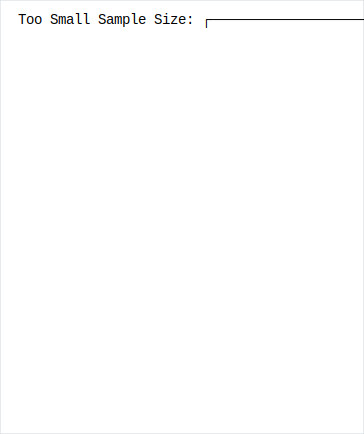
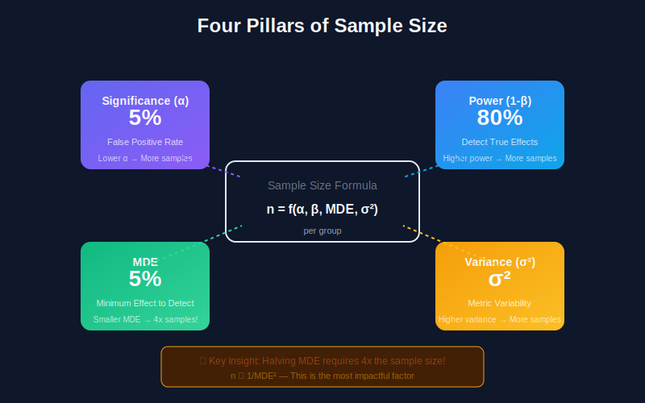
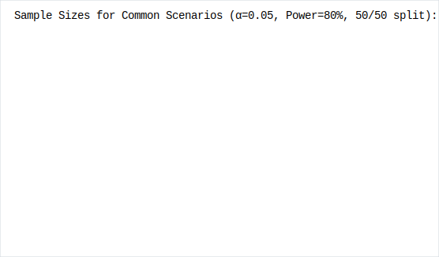
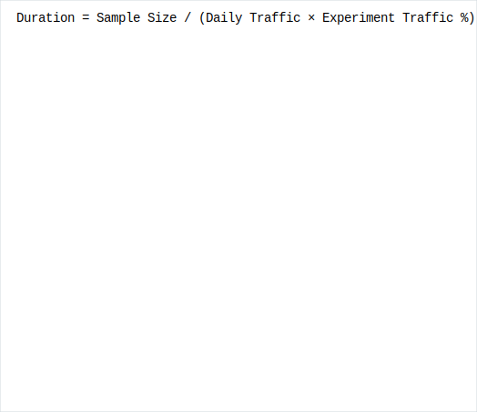
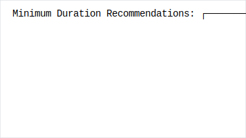

# Sample Size Calculation for A/B Testing

## Table of Contents
1. [Why Sample Size Matters](#why-sample-size-matters)
2. [Key Components](#key-components)
3. [Sample Size Formulas](#sample-size-formulas)
4. [Practical Calculators](#practical-calculators)
5. [Duration Estimation](#duration-estimation)
6. [Variance Reduction Techniques](#variance-reduction-techniques)
7. [Common Mistakes](#common-mistakes)

---

## Why Sample Size Matters

### The Goldilocks Problem



---

## Key Components



### The Four Pillars of Sample Size


### Relationships

```python
"""
Sample Size Relationships:

n ∝ 1/MDE²        (Smaller effects need exponentially more samples)
n ∝ variance      (More variable metrics need more samples)
n ∝ (z_α + z_β)²  (Higher confidence/power need more samples)

Example Impact:
- Halving MDE → 4x sample size needed
- Doubling variance → 2x sample size needed
- 90% power vs 80% → ~30% more samples
"""

def sample_size_relationships():
    """Demonstrate how factors affect sample size"""

    base_n = 10000  # baseline sample size

    effects = {
        'Halve MDE (2% → 1%)': base_n * 4,
        'Double variance': base_n * 2,
        'Power 90% vs 80%': base_n * 1.3,
        'Alpha 0.01 vs 0.05': base_n * 1.5,
        'All above combined': base_n * 4 * 2 * 1.3 * 1.5
    }

    for effect, n in effects.items():
        print(f"{effect}: {n:,.0f} samples needed")
```

---

## Sample Size Formulas

### For Proportions (Conversion Rates)

```python
import numpy as np
from scipy import stats

def sample_size_proportions(baseline_rate, mde, alpha=0.05, power=0.80,
                            two_sided=True, ratio=1):
    """
    Calculate sample size for comparing two proportions

    Parameters:
    -----------
    baseline_rate : float
        Control group conversion rate (e.g., 0.10 for 10%)
    mde : float
        Minimum detectable effect (relative, e.g., 0.10 for 10% lift)
    alpha : float
        Significance level
    power : float
        Statistical power (1-β)
    two_sided : bool
        Whether to use two-sided test
    ratio : float
        Treatment/control sample size ratio

    Returns:
    --------
    dict : Sample sizes for control and treatment
    """

    # Treatment rate
    treatment_rate = baseline_rate * (1 + mde)

    # Z-scores
    if two_sided:
        z_alpha = stats.norm.ppf(1 - alpha/2)
    else:
        z_alpha = stats.norm.ppf(1 - alpha)
    z_beta = stats.norm.ppf(power)

    # Pooled proportion
    p_pooled = (baseline_rate + ratio * treatment_rate) / (1 + ratio)

    # Effect size (absolute)
    delta = treatment_rate - baseline_rate

    # Sample size formula
    # n = [(z_α√(2p̄q̄) + z_β√(p₁q₁ + p₂q₂))² ] / δ²

    numerator = (
        z_alpha * np.sqrt((1 + 1/ratio) * p_pooled * (1 - p_pooled)) +
        z_beta * np.sqrt(baseline_rate * (1 - baseline_rate) +
                         treatment_rate * (1 - treatment_rate) / ratio)
    ) ** 2

    n_control = numerator / (delta ** 2)
    n_treatment = n_control * ratio

    return {
        'control_size': int(np.ceil(n_control)),
        'treatment_size': int(np.ceil(n_treatment)),
        'total_size': int(np.ceil(n_control + n_treatment)),
        'parameters': {
            'baseline_rate': baseline_rate,
            'treatment_rate': treatment_rate,
            'mde_relative': mde,
            'mde_absolute': delta,
            'alpha': alpha,
            'power': power
        }
    }

# Example
result = sample_size_proportions(
    baseline_rate=0.10,  # 10% conversion
    mde=0.05,            # 5% relative lift (0.5% absolute)
    alpha=0.05,
    power=0.80
)

print(f"Control size: {result['control_size']:,}")
print(f"Treatment size: {result['treatment_size']:,}")
print(f"Total size: {result['total_size']:,}")
```

### For Continuous Metrics (Revenue, Time)

```python
def sample_size_continuous(mean, std, mde_relative, alpha=0.05, power=0.80,
                           two_sided=True, ratio=1):
    """
    Calculate sample size for comparing two means

    Parameters:
    -----------
    mean : float
        Baseline mean value
    std : float
        Standard deviation (estimated from historical data)
    mde_relative : float
        Minimum detectable effect (relative change)
    alpha, power, two_sided, ratio : same as proportions

    Returns:
    --------
    dict : Sample sizes needed
    """

    # Z-scores
    if two_sided:
        z_alpha = stats.norm.ppf(1 - alpha/2)
    else:
        z_alpha = stats.norm.ppf(1 - alpha)
    z_beta = stats.norm.ppf(power)

    # Effect size (Cohen's d)
    delta = mean * mde_relative
    cohens_d = delta / std

    # Sample size formula
    # n = 2 × [(z_α + z_β) / d]² × (1 + 1/ratio)
    n_control = 2 * ((z_alpha + z_beta) / cohens_d) ** 2 * (1 + 1/ratio) / (1 + ratio)
    n_treatment = n_control * ratio

    return {
        'control_size': int(np.ceil(n_control)),
        'treatment_size': int(np.ceil(n_treatment)),
        'total_size': int(np.ceil(n_control + n_treatment)),
        'cohens_d': cohens_d,
        'parameters': {
            'baseline_mean': mean,
            'std': std,
            'expected_treatment_mean': mean * (1 + mde_relative),
            'mde_absolute': delta,
            'mde_relative': mde_relative
        }
    }

# Example: Revenue per user
result = sample_size_continuous(
    mean=50.0,           # $50 average
    std=75.0,            # High variance (common for revenue)
    mde_relative=0.05,   # 5% lift
    alpha=0.05,
    power=0.80
)

print(f"Sample size needed: {result['total_size']:,}")
print(f"Cohen's d: {result['cohens_d']:.3f}")
```

### Quick Reference Table



---

## Practical Calculators

### Interactive Sample Size Calculator

```python
class SampleSizeCalculator:
    """
    Comprehensive sample size calculator for A/B testing
    """

    def __init__(self, alpha=0.05, power=0.80, two_sided=True):
        self.alpha = alpha
        self.power = power
        self.two_sided = two_sided

    def for_conversion_rate(self, baseline_rate, mde_relative):
        """Calculate for binary metrics"""
        return sample_size_proportions(
            baseline_rate, mde_relative,
            self.alpha, self.power, self.two_sided
        )

    def for_revenue(self, baseline_mean, baseline_std, mde_relative):
        """Calculate for revenue/continuous metrics"""
        return sample_size_continuous(
            baseline_mean, baseline_std, mde_relative,
            self.alpha, self.power, self.two_sided
        )

    def for_ratio_metric(self, num_mean, num_std, denom_mean, mde_relative):
        """
        Calculate for ratio metrics (e.g., revenue per session)
        Uses delta method for variance estimation
        """

        # Approximate variance using delta method
        ratio_mean = num_mean / denom_mean

        # Simplified: assume numerator variance dominates
        ratio_std = num_std / denom_mean

        return sample_size_continuous(
            ratio_mean, ratio_std, mde_relative,
            self.alpha, self.power, self.two_sided
        )

    def sensitivity_analysis(self, baseline_rate, mde_range):
        """
        Show how sample size varies with MDE
        """
        results = []
        for mde in mde_range:
            result = self.for_conversion_rate(baseline_rate, mde)
            results.append({
                'mde': mde,
                'sample_size': result['total_size']
            })
        return results

    def estimate_duration(self, sample_size, daily_traffic, traffic_split=0.5):
        """
        Estimate experiment duration

        Parameters:
        -----------
        sample_size : int
            Required total sample size
        daily_traffic : int
            Daily eligible users
        traffic_split : float
            Fraction of traffic in experiment
        """
        users_per_day = daily_traffic * traffic_split
        days_needed = np.ceil(sample_size / users_per_day)

        return {
            'days_needed': int(days_needed),
            'weeks_needed': round(days_needed / 7, 1),
            'users_per_day': int(users_per_day),
            'total_sample_size': sample_size
        }

# Usage example
calc = SampleSizeCalculator(alpha=0.05, power=0.80)

# For a 10% baseline conversion rate, wanting to detect 5% lift
conv_result = calc.for_conversion_rate(0.10, 0.05)
print(f"Conversion test: {conv_result['total_size']:,} users needed")

# Duration estimation
duration = calc.estimate_duration(
    sample_size=conv_result['total_size'],
    daily_traffic=50000,
    traffic_split=1.0  # 100% of traffic
)
print(f"Duration: {duration['days_needed']} days ({duration['weeks_needed']} weeks)")
```

---

## Duration Estimation

### Factors Affecting Duration



### Duration Calculator

```python
def calculate_experiment_duration(
    baseline_rate,
    mde,
    daily_traffic,
    experiment_traffic_pct=1.0,
    control_pct=0.5,
    alpha=0.05,
    power=0.80,
    min_days=7,
    max_days=90
):
    """
    Calculate experiment duration with practical constraints
    """

    # Calculate required sample size
    result = sample_size_proportions(baseline_rate, mde, alpha, power)
    total_sample_size = result['total_size']

    # Effective daily samples
    daily_samples = daily_traffic * experiment_traffic_pct

    # Raw duration
    raw_days = total_sample_size / daily_samples

    # Apply constraints
    recommended_days = max(min_days, min(max_days, np.ceil(raw_days)))

    # Add buffer for:
    # - Day-of-week effects (round to full weeks)
    buffered_days = int(np.ceil(recommended_days / 7) * 7)

    # Calculate actual power with constrained duration
    actual_samples = buffered_days * daily_samples
    actual_power = calculate_power_from_samples(
        baseline_rate, mde, actual_samples, alpha
    )

    return {
        'required_sample_size': total_sample_size,
        'raw_duration_days': raw_days,
        'recommended_duration_days': buffered_days,
        'actual_power': actual_power,
        'daily_samples': daily_samples,
        'warnings': generate_warnings(raw_days, baseline_rate, mde)
    }

def generate_warnings(duration_days, baseline_rate, mde):
    """Generate practical warnings"""
    warnings = []

    if duration_days > 30:
        warnings.append("⚠️ Long duration may be affected by external factors")

    if duration_days > 60:
        warnings.append("⚠️ Consider variance reduction techniques")

    if baseline_rate < 0.01:
        warnings.append("⚠️ Low baseline rate - results may be noisy")

    if mde < 0.02:
        warnings.append("⚠️ Very small MDE - ensure it's practically meaningful")

    return warnings
```

---

## Variance Reduction Techniques

### CUPED (Controlled-experiment Using Pre-Experiment Data)

```python
class CUPED:
    """
    CUPED: Controlled-experiment Using Pre-Experiment Data

    Reduces variance by adjusting for pre-experiment behavior
    """

    def __init__(self, pre_experiment_col, metric_col):
        self.pre_experiment_col = pre_experiment_col
        self.metric_col = metric_col
        self.theta = None

    def fit(self, data):
        """
        Calculate optimal theta coefficient

        θ = Cov(Y, X) / Var(X)
        where Y is the metric, X is pre-experiment covariate
        """
        self.theta = np.cov(
            data[self.metric_col],
            data[self.pre_experiment_col]
        )[0, 1] / np.var(data[self.pre_experiment_col])

        return self

    def transform(self, data):
        """
        Create CUPED-adjusted metric

        Y_adjusted = Y - θ(X - E[X])
        """
        X_mean = data[self.pre_experiment_col].mean()

        adjusted_metric = (
            data[self.metric_col] -
            self.theta * (data[self.pre_experiment_col] - X_mean)
        )

        return adjusted_metric

    def variance_reduction(self, data):
        """
        Calculate variance reduction achieved
        """
        original_var = np.var(data[self.metric_col])
        adjusted_var = np.var(self.transform(data))

        reduction = 1 - (adjusted_var / original_var)

        return {
            'original_variance': original_var,
            'adjusted_variance': adjusted_var,
            'variance_reduction': reduction,
            'sample_size_reduction': reduction,  # Approximately equal
            'theta': self.theta
        }

# Example usage
"""

# Prepare data with pre-experiment metric
data = pd.DataFrame({
    'user_id': user_ids,
    'variant': variants,
    'revenue_post': post_experiment_revenue,  # During experiment
    'revenue_pre': pre_experiment_revenue      # 2 weeks before experiment
})

# Apply CUPED
cuped = CUPED('revenue_pre', 'revenue_post')
cuped.fit(data)

# Get adjusted metric
data['revenue_adjusted'] = cuped.transform(data)

# Check variance reduction
reduction = cuped.variance_reduction(data)
print(f"Variance reduced by {reduction['variance_reduction']:.1%}")

# Typical reduction: 20-50%
"""
```

### Stratified Sampling

```python
def stratified_sample_size(strata_proportions, strata_variances,
                           overall_mde, alpha=0.05, power=0.80):
    """
    Calculate sample size with stratification for variance reduction

    Stratification reduces variance when strata have different means
    """

    # Calculate overall variance without stratification
    overall_variance = sum(
        p * v for p, v in zip(strata_proportions, strata_variances)
    )

    # Calculate stratified variance (weighted average of within-strata variances)
    # Stratification removes between-strata variance
    within_strata_variance = sum(
        p * v for p, v in zip(strata_proportions, strata_variances)
    )

    # Sample size with stratification
    z_alpha = stats.norm.ppf(1 - alpha/2)
    z_beta = stats.norm.ppf(power)

    n_stratified = (2 * (z_alpha + z_beta)**2 * within_strata_variance) / (overall_mde**2)

    return {
        'stratified_sample_size': int(np.ceil(n_stratified)),
        'variance_reduction': 1 - (within_strata_variance / overall_variance)
    }
```

### Variance Reduction Summary


---

## Common Mistakes

### Mistake 1: Using Point Estimates for Baseline

```python

# ❌ WRONG: Using recent point estimate
baseline_rate = last_week_conversion_rate  # 10.2%

# ✅ BETTER: Use confidence interval or historical range
baseline_rates = [0.095, 0.102, 0.098, 0.105, 0.099]  # Last 5 weeks
baseline_rate = np.mean(baseline_rates)  # Use average
baseline_std = np.std(baseline_rates)    # Account for uncertainty

# Even better: Use lower bound to be conservative
baseline_rate_conservative = np.percentile(baseline_rates, 25)
```

### Mistake 2: Ignoring Metric Variance

```python

# Revenue is highly variable - need more samples than conversion rate

# Conversion rate (binary: 0 or 1)
# Variance = p(1-p) ≤ 0.25

# Revenue (continuous, often zero-inflated)
# Variance can be very high (e.g., std = 2x mean)

def compare_metric_requirements():
    """Show sample size differences between metrics"""

    # Same 5% relative lift
    conversion = sample_size_proportions(0.10, 0.05)
    revenue = sample_size_continuous(50, 100, 0.05)  # High std

    print(f"Conversion (10% baseline): {conversion['total_size']:,}")
    print(f"Revenue ($50 baseline, $100 std): {revenue['total_size']:,}")

# Output:
# Conversion (10% baseline): ~126,000
# Revenue ($50 baseline, $100 std): ~250,000
```

### Mistake 3: Not Accounting for Multiple Variants

```python
def sample_size_multiple_variants(baseline_rate, mde, num_variants,
                                   alpha=0.05, power=0.80):
    """
    Adjust sample size for multiple treatment variants

    With K variants, you need more samples due to multiple comparisons
    """

    # Bonferroni correction
    adjusted_alpha = alpha / num_variants

    # Or use Dunnett's correction (less conservative)
    # adjusted_alpha = 1 - (1 - alpha)**(1/num_variants)

    # Calculate with adjusted alpha
    return sample_size_proportions(
        baseline_rate, mde,
        alpha=adjusted_alpha,
        power=power
    )

# Example: Testing 3 variants vs control
single = sample_size_proportions(0.10, 0.05)
multiple = sample_size_multiple_variants(0.10, 0.05, num_variants=3)

print(f"Single variant: {single['total_size']:,}")
print(f"3 variants (Bonferroni): {multiple['total_size']:,}")

# Approximately 30-50% more samples needed
```

### Mistake 4: Forgetting About Novelty Effects



---

## Summary Checklist

```
Sample Size Planning Checklist:

□ Define MDE based on business impact
□ Get accurate baseline rate estimate
□ Estimate metric variance from historical data
□ Choose appropriate α and power
□ Account for multiple variants/metrics
□ Estimate duration with traffic projections
□ Consider variance reduction techniques
□ Add buffer for novelty effects
□ Plan for minimum duration (1-2 weeks)
□ Document assumptions and decisions
```

---

[← Previous: Statistical Foundations](../02_statistical_foundations/README.md) | [Next: Experiment Design →](../04_experiment_design/README.md)

---

<div align="center">

**[⬆ Back to Top](#)** | **[📚 Main Repository](https://github.com/Gaurav14cs17/ml_system_design)**

Made with 💜 by [Gaurav14cs17](https://github.com/Gaurav14cs17)

</div>
