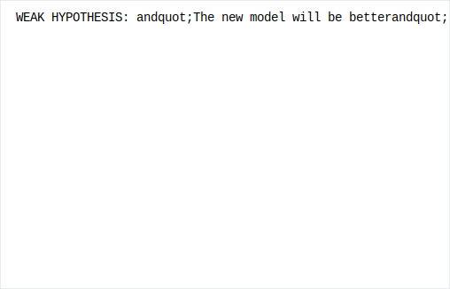
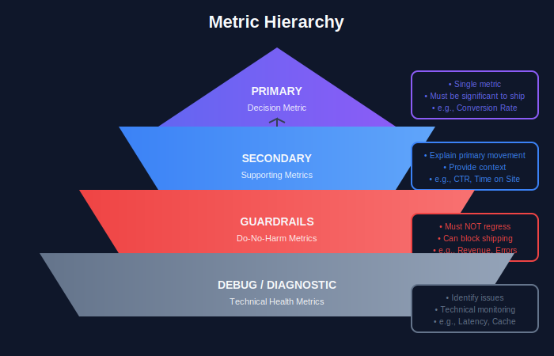

# Experiment Design for A/B Testing

## Table of Contents
1. [Experiment Design Framework](#experiment-design-framework)
2. [Hypothesis Formulation](#hypothesis-formulation)
3. [Control and Treatment Design](#control-and-treatment-design)
4. [Traffic Allocation Strategies](#traffic-allocation-strategies)
5. [Experiment Types](#experiment-types)
6. [Guardrails and Safety](#guardrails-and-safety)
7. [Documentation Template](#documentation-template)

---

## Experiment Design Framework

### The PICOT Framework


### Design Checklist

```python
class ExperimentDesign:
    """
    Comprehensive experiment design structure
    """

    def __init__(self):
        self.design = {
            # Core elements
            'hypothesis': None,
            'population': {},
            'variants': [],
            'metrics': {},
            'timeline': {},

            # Technical elements
            'randomization': {},
            'logging': {},
            'analysis_plan': {},

            # Governance
            'owner': None,
            'reviewers': [],
            'approval_status': 'draft'
        }

    def set_hypothesis(self, primary, secondary=None, null=None):
        """Define clear hypotheses"""
        self.design['hypothesis'] = {
            'primary': primary,
            'secondary': secondary or [],
            'null': null or f"No difference between control and treatment"
        }

    def set_population(self, eligible_users, exclusions, segments):
        """Define target population"""
        self.design['population'] = {
            'eligible': eligible_users,
            'exclusions': exclusions,
            'segments': segments,
            'estimated_daily_traffic': None
        }

    def add_variant(self, name, description, allocation_pct, config):
        """Add experiment variant"""
        self.design['variants'].append({
            'name': name,
            'description': description,
            'allocation_pct': allocation_pct,
            'config': config,
            'is_control': name.lower() == 'control'
        })

    def set_metrics(self, primary, secondary, guardrails):
        """Define metric hierarchy"""
        self.design['metrics'] = {
            'primary': primary,           # Decision metric
            'secondary': secondary,       # Supporting metrics
            'guardrails': guardrails,     # Do-no-harm metrics
            'debug': []                   # Technical health metrics
        }

```

---

## Hypothesis Formulation

### Writing Good Hypotheses



### Hypothesis Template

```python
def create_hypothesis(
    intervention: str,
    mechanism: str,
    primary_metric: str,
    expected_lift: float,
    population: str,
    timeframe: str,
    guardrails: list
) -> str:
    """
    Generate well-structured hypothesis statement
    """
    hypothesis = f"""
    HYPOTHESIS STATEMENT
    ====================

    Intervention: {intervention}

    Theory of Change:
    We believe that {intervention} will {mechanism}.

    Primary Expectation:
    {primary_metric} will increase by at least {expected_lift*100:.0f}%
    for {population} within {timeframe}.

    Guardrails (must not violate):
    {chr(10).join(f'- {g}' for g in guardrails)}

    Null Hypothesis:
    {primary_metric} will not change significantly between
    control and treatment groups.

    Alternative Hypothesis:
    {primary_metric} for treatment > {primary_metric} for control
    """
    return hypothesis

# Example
hypothesis = create_hypothesis(
    intervention="New transformer-based recommendation model",
    mechanism="better capture user preferences through attention mechanisms, \
               leading to more relevant product recommendations",
    primary_metric="Click-through rate on recommendations",
    expected_lift=0.10,
    population="logged-in users on web platform",
    timeframe="14 days",
    guardrails=[
        "Revenue per session must not decrease by more than 1%",
        "Page load time must not increase by more than 100ms",
        "Model inference latency p99 must stay under 50ms"
    ]
)

```

---

## Control and Treatment Design

### Variant Design Principles


### Multi-Variant Design

```python
class MultiVariantExperiment:
    """
    Design experiments with multiple treatment arms
    """

    def __init__(self, name, description):
        self.name = name
        self.description = description
        self.variants = {}
        self.total_allocation = 0

    def add_control(self, allocation_pct=50):
        """Add control group"""
        self.variants['control'] = {
            'type': 'control',
            'allocation': allocation_pct,
            'config': {'use_existing': True}
        }
        self.total_allocation += allocation_pct

    def add_treatment(self, name, config, allocation_pct):
        """Add treatment variant"""
        if self.total_allocation + allocation_pct > 100:
            raise ValueError("Total allocation exceeds 100%")

        self.variants[name] = {
            'type': 'treatment',
            'allocation': allocation_pct,
            'config': config
        }
        self.total_allocation += allocation_pct

    def validate_design(self):
        """Validate experiment design"""
        validations = []

        # Check total allocation
        if self.total_allocation != 100:
            validations.append(f"⚠️ Allocation is {self.total_allocation}%, not 100%")

        # Check for control
        if 'control' not in self.variants:
            validations.append("⚠️ No control group defined")

        # Check variant count
        if len(self.variants) < 2:
            validations.append("⚠️ Need at least 2 variants")

        # Check balanced allocation for statistical power
        allocations = [v['allocation'] for v in self.variants.values()]
        if max(allocations) / min(allocations) > 3:
            validations.append("⚠️ Highly unbalanced allocation reduces power")

        return validations

# Example: Testing multiple model versions
exp = MultiVariantExperiment(
    name="model_comparison_q4",
    description="Compare baseline with two new model architectures"
)

exp.add_control(allocation_pct=40)
exp.add_treatment(
    name="transformer_v1",
    config={'model_path': 'models/transformer_v1.pt'},
    allocation_pct=30
)
exp.add_treatment(
    name="hybrid_v1",
    config={'model_path': 'models/hybrid_v1.pt'},
    allocation_pct=30
)

print(exp.validate_design())

```

---

## Traffic Allocation Strategies

### Allocation Methods


### Ramp-Up Strategies

```python
class TrafficRampUp:
    """
    Safe traffic ramp-up for experiments
    """

    # Standard ramp-up schedule
    CONSERVATIVE_SCHEDULE = [
        {'day': 0, 'treatment_pct': 1, 'check': 'sanity'},
        {'day': 1, 'treatment_pct': 5, 'check': 'metrics'},
        {'day': 3, 'treatment_pct': 10, 'check': 'guardrails'},
        {'day': 7, 'treatment_pct': 25, 'check': 'significance'},
        {'day': 10, 'treatment_pct': 50, 'check': 'final'}
    ]

    AGGRESSIVE_SCHEDULE = [
        {'day': 0, 'treatment_pct': 5, 'check': 'sanity'},
        {'day': 1, 'treatment_pct': 25, 'check': 'metrics'},
        {'day': 2, 'treatment_pct': 50, 'check': 'final'}
    ]

    @staticmethod
    def get_schedule(risk_level: str) -> list:
        """Get appropriate ramp-up schedule based on risk"""
        schedules = {
            'low': TrafficRampUp.AGGRESSIVE_SCHEDULE,
            'medium': TrafficRampUp.CONSERVATIVE_SCHEDULE,
            'high': [
                {'day': 0, 'treatment_pct': 0.5, 'check': 'sanity'},
                {'day': 2, 'treatment_pct': 1, 'check': 'metrics'},
                {'day': 5, 'treatment_pct': 5, 'check': 'guardrails'},
                {'day': 10, 'treatment_pct': 10, 'check': 'deep_dive'},
                {'day': 14, 'treatment_pct': 25, 'check': 'significance'},
                {'day': 21, 'treatment_pct': 50, 'check': 'final'}
            ]
        }
        return schedules.get(risk_level, schedules['medium'])

    @staticmethod
    def should_proceed(current_metrics: dict, guardrails: dict) -> tuple:
        """
        Check if safe to proceed to next ramp stage
        """
        violations = []
        warnings = []

        for metric, threshold in guardrails.items():
            current_value = current_metrics.get(metric)
            if current_value is None:
                warnings.append(f"Missing metric: {metric}")
                continue

            if threshold['type'] == 'min':
                if current_value < threshold['value']:
                    violations.append(f"{metric}: {current_value} < {threshold['value']}")
            elif threshold['type'] == 'max':
                if current_value > threshold['value']:
                    violations.append(f"{metric}: {current_value} > {threshold['value']}")

        can_proceed = len(violations) == 0
        return can_proceed, violations, warnings

```

---

## Experiment Types

### Classification of Experiments


### Specialized Experiment Types

```python
# 1. INTERLEAVING (for ranking systems)
class InterleavingExperiment:
    """
    Interleave results from two rankers
    More sensitive than A/B testing for ranking
    """

    def team_draft_interleave(self, ranker_a_results, ranker_b_results, k=10):
        """
        Team draft interleaving algorithm
        """
        interleaved = []
        a_team, b_team = [], []
        a_idx, b_idx = 0, 0

        for i in range(k):
            # Alternate who picks first
            if len(a_team) <= len(b_team):
                # A picks
                while ranker_a_results[a_idx] in interleaved:
                    a_idx += 1
                interleaved.append(ranker_a_results[a_idx])
                a_team.append(ranker_a_results[a_idx])
            else:
                # B picks
                while ranker_b_results[b_idx] in interleaved:
                    b_idx += 1
                interleaved.append(ranker_b_results[b_idx])
                b_team.append(ranker_b_results[b_idx])

        return interleaved, a_team, b_team

# 2. SWITCHBACK (for marketplace/network effects)
class SwitchbackExperiment:
    """
    Alternate between treatments over time
    Use when user-level randomization causes spillover
    """

    def __init__(self, time_period_hours=1):
        self.time_period = time_period_hours
        self.schedule = self.create_schedule()

    def create_schedule(self, days=14):
        """Create randomized switchback schedule"""
        periods_per_day = 24 // self.time_period
        total_periods = days * periods_per_day

        schedule = ['control', 'treatment'] * (total_periods // 2)
        np.random.shuffle(schedule)
        return schedule

# 3. CLUSTER RANDOMIZED (for social/network features)
class ClusterRandomizedExperiment:
    """
    Randomize at cluster level (e.g., geographic regions)
    Prevents spillover between connected users
    """

    def __init__(self, clusters: list):
        self.clusters = clusters
        self.assignments = {}

    def assign_clusters(self, treatment_pct=0.5):
        """Randomly assign clusters to treatment/control"""
        n_treatment = int(len(self.clusters) * treatment_pct)
        shuffled = self.clusters.copy()
        np.random.shuffle(shuffled)

        for i, cluster in enumerate(shuffled):
            self.assignments[cluster] = 'treatment' if i < n_treatment else 'control'

        return self.assignments

```

---

## Guardrails and Safety



### Guardrail Metrics

```python
class GuardrailConfig:
    """
    Configure guardrail metrics for experiment safety
    """

    COMMON_GUARDRAILS = {
        # Business metrics
        'revenue_per_user': {
            'threshold_type': 'relative_decrease',
            'threshold_value': -0.02,  # No more than 2% decrease
            'severity': 'critical'
        },
        'conversion_rate': {
            'threshold_type': 'relative_decrease',
            'threshold_value': -0.03,  # No more than 3% decrease
            'severity': 'critical'
        },

        # User experience
        'page_load_time_p50': {
            'threshold_type': 'absolute_increase',
            'threshold_value': 200,  # No more than 200ms increase
            'severity': 'warning'
        },
        'error_rate': {
            'threshold_type': 'absolute_value',
            'threshold_value': 0.01,  # Keep under 1%
            'severity': 'critical'
        },

        # Engagement
        'sessions_per_user': {
            'threshold_type': 'relative_decrease',
            'threshold_value': -0.05,  # No more than 5% decrease
            'severity': 'warning'
        },

        # Technical
        'model_latency_p99': {
            'threshold_type': 'absolute_value',
            'threshold_value': 100,  # Keep under 100ms
            'severity': 'critical'
        }
    }

    @staticmethod
    def check_guardrail(metric_name: str, control_value: float,
                        treatment_value: float) -> dict:
        """Check if guardrail is violated"""
        config = GuardrailConfig.COMMON_GUARDRAILS.get(metric_name)
        if not config:
            return {'status': 'unknown', 'message': 'No guardrail defined'}

        threshold_type = config['threshold_type']
        threshold = config['threshold_value']

        if threshold_type == 'relative_decrease':
            change = (treatment_value - control_value) / control_value
            violated = change < threshold

        elif threshold_type == 'absolute_increase':
            change = treatment_value - control_value
            violated = change > threshold

        elif threshold_type == 'absolute_value':
            change = treatment_value
            violated = treatment_value > threshold

        return {
            'metric': metric_name,
            'control_value': control_value,
            'treatment_value': treatment_value,
            'change': change,
            'threshold': threshold,
            'violated': violated,
            'severity': config['severity']
        }

```

### Automatic Stopping Rules

```python
class AutomaticStopping:
    """
    Rules for automatic experiment stopping
    """

    @staticmethod
    def check_critical_guardrail_violation(guardrail_results: list) -> bool:
        """Stop if any critical guardrail is violated"""
        critical_violations = [
            g for g in guardrail_results
            if g['violated'] and g['severity'] == 'critical'
        ]
        return len(critical_violations) > 0

    @staticmethod
    def check_sample_ratio_mismatch(control_n: int, treatment_n: int,
                                     expected_ratio: float = 1.0,
                                     threshold: float = 0.01) -> bool:
        """
        Stop if sample ratio significantly deviates from expected
        Indicates randomization bug
        """
        from scipy import stats

        total = control_n + treatment_n
        expected_control = total / (1 + expected_ratio)

        # Chi-square test
        chi2 = (control_n - expected_control)**2 / expected_control + \
               (treatment_n - (total - expected_control))**2 / (total - expected_control)

        p_value = 1 - stats.chi2.cdf(chi2, df=1)

        return p_value < threshold

    @staticmethod
    def check_data_quality(metrics: dict) -> list:
        """Check for data quality issues"""
        issues = []

        if metrics.get('null_rate', 0) > 0.1:
            issues.append("High null rate in metrics")

        if metrics.get('duplicate_rate', 0) > 0.01:
            issues.append("High duplicate rate")

        if not metrics.get('logging_healthy', True):
            issues.append("Logging pipeline unhealthy")

        return issues

```

---

## Documentation Template

### Experiment Spec Template

```python
EXPERIMENT_SPEC_TEMPLATE = """
# Experiment Specification

## Metadata
- **Experiment ID**: {experiment_id}
- **Owner**: {owner}
- **Created**: {created_date}
- **Status**: {status}

## Summary
### Business Context
{business_context}

### Hypothesis
{hypothesis}

### Expected Impact
- Primary metric: {primary_metric} expected to change by {expected_change}
- Business impact: {business_impact}

## Design

### Population
- **Eligible users**: {eligible_users}
- **Exclusions**: {exclusions}
- **Estimated daily traffic**: {daily_traffic}

### Variants

| Variant | Description | Traffic % |
|---------|-------------|-----------|
{variant_table}

### Metrics
#### Primary (Decision Metric)
{primary_metric_details}

#### Secondary
{secondary_metrics}

#### Guardrails
{guardrail_metrics}

## Timeline
- **Start date**: {start_date}
- **Minimum duration**: {min_duration}
- **Expected end date**: {end_date}
- **Ramp schedule**: {ramp_schedule}

## Analysis Plan
- **Statistical test**: {statistical_test}
- **Significance level (α)**: {alpha}
- **Power (1-β)**: {power}
- **Minimum detectable effect**: {mde}
- **Correction for multiple comparisons**: {correction_method}

## Risks and Mitigations
{risks}

## Approvals
- [ ] Data Science Review
- [ ] Engineering Review
- [ ] Product Review
- [ ] Privacy Review (if applicable)

## Results
(To be completed after experiment)

## Decision
(To be completed after analysis)
"""

def generate_experiment_spec(config: dict) -> str:
    """Generate formatted experiment specification"""
    return EXPERIMENT_SPEC_TEMPLATE.format(**config)

```

---

## Summary

Good experiment design is the foundation of trustworthy A/B testing:

1. **Use PICOT framework** for structured design
2. **Write specific hypotheses** with measurable outcomes
3. **Design variants carefully** with minimal changes
4. **Plan traffic allocation** based on risk tolerance
5. **Define guardrails** before starting
6. **Document everything** for reproducibility

---

[← Previous: Sample Size](../03_sample_size/README.md) | [Next: Metrics and KPIs →](../05_metrics_kpis/README.md)

---

<div align="center">

**[⬆ Back to Top](#)** | **[📚 Main Repository](https://github.com/Gaurav14cs17/ml_system_design)**

Made with 💜 by [Gaurav14cs17](https://github.com/Gaurav14cs17)

</div>
