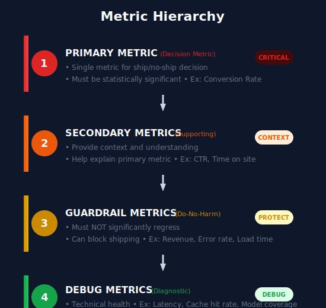
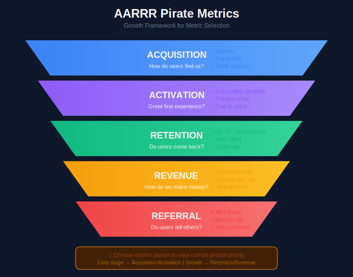

# Metrics and KPIs for A/B Testing

## Table of Contents
1. [Metric Taxonomy](#metric-taxonomy)
2. [Choosing the Right Metrics](#choosing-the-right-metrics)
3. [Metric Properties](#metric-properties)
4. [Common Metrics by Domain](#common-metrics-by-domain)
5. [Composite Metrics (OEC)](#composite-metrics-oec)
6. [Metric Computation](#metric-computation)
7. [Metric Validation](#metric-validation)

---

## Metric Taxonomy

### The Metric Hierarchy



### Metric Types

```python
from enum import Enum
from dataclasses import dataclass
from typing import Optional, List

class MetricType(Enum):
    """Classification of metric types"""

    # By computation
    RATE = "rate"           # Events / Opportunities (CTR, CVR)
    MEAN = "mean"           # Average per unit (Revenue/user)
    COUNT = "count"         # Total occurrences
    RATIO = "ratio"         # Numerator / Denominator (Revenue/Session)
    PERCENTILE = "percentile"  # Distribution-based (p50, p99 latency)

    # By timing
    IMMEDIATE = "immediate"     # Measurable during session
    DELAYED = "delayed"         # Requires attribution window
    LONG_TERM = "long_term"     # Weeks/months to observe

@dataclass
class MetricDefinition:
    """Complete metric specification"""

    name: str
    description: str
    metric_type: MetricType

    # Computation
    numerator: str          # What we count/sum
    denominator: str        # What we divide by
    aggregation: str        # user, session, or event level

    # Statistical properties
    expected_variance: float
    minimum_detectable_effect: float

    # Timing
    observation_window_days: int
    attribution_model: str

    # Guardrail info
    guardrail_direction: Optional[str] = None  # 'increase' or 'decrease'
    guardrail_threshold: Optional[float] = None

    # Metadata
    owner: str = ""
    data_source: str = ""
    computation_query: str = ""
```

---

## Choosing the Right Metrics

### The AARRR Framework




### Decision Framework for Primary Metric

```python
def choose_primary_metric(experiment_type: str, business_goal: str) -> dict:
    """
    Framework for selecting the right primary metric
    """

    recommendations = {

        # E-commerce experiments
        ('recommendation', 'revenue'): {
            'primary': 'revenue_per_user',
            'secondary': ['ctr', 'add_to_cart_rate', 'items_per_order'],
            'guardrails': ['return_rate', 'page_load_time'],
            'rationale': 'Revenue captures full business impact'
        },

        ('recommendation', 'engagement'): {
            'primary': 'click_through_rate',
            'secondary': ['scroll_depth', 'time_on_page', 'items_viewed'],
            'guardrails': ['conversion_rate', 'bounce_rate'],
            'rationale': 'CTR best measures recommendation relevance'
        },

        # Search experiments
        ('search', 'relevance'): {
            'primary': 'success_rate',  # searches ending in click
            'secondary': ['mrr', 'ndcg', 'reformulation_rate'],
            'guardrails': ['no_results_rate', 'search_latency'],
            'rationale': 'Success rate indicates user found what they wanted'
        },

        # Content/Media experiments
        ('content', 'engagement'): {
            'primary': 'time_spent',
            'secondary': ['completion_rate', 'interactions', 'shares'],
            'guardrails': ['ad_revenue', 'page_load_time'],
            'rationale': 'Time spent indicates content value'
        },

        # Notification experiments
        ('notification', 'engagement'): {
            'primary': 'notification_click_rate',
            'secondary': ['app_opens', 'session_duration'],
            'guardrails': ['unsubscribe_rate', 'app_uninstall_rate'],
            'rationale': 'Click rate measures notification effectiveness'
        }
    }

    key = (experiment_type, business_goal)
    return recommendations.get(key, {
        'primary': 'needs_custom_definition',
        'rationale': 'Custom metric needed for this use case'
    })
```

---

## Metric Properties

### Desirable Metric Properties


### Metric Validation

```python
class MetricValidator:
    """
    Validate that metrics are suitable for A/B testing
    """

    @staticmethod
    def check_sensitivity(metric_values: np.ndarray,
                          expected_effect: float) -> dict:
        """
        Check if metric is sensitive enough to detect expected effect
        """
        std = np.std(metric_values)
        mean = np.mean(metric_values)
        cv = std / mean  # Coefficient of variation

        # Effect size in standard deviations
        effect_size = (expected_effect * mean) / std

        return {
            'mean': mean,
            'std': std,
            'coefficient_of_variation': cv,
            'effect_size_cohens_d': effect_size,
            'sensitivity_rating': 'high' if effect_size > 0.2 else 'low',
            'recommendation': 'Consider variance reduction' if cv > 1 else 'OK'
        }

    @staticmethod
    def check_stability(daily_values: list) -> dict:
        """
        Check metric stability over time
        """
        values = np.array(daily_values)
        day_over_day_change = np.abs(np.diff(values) / values[:-1])

        return {
            'mean_daily_change': np.mean(day_over_day_change),
            'max_daily_change': np.max(day_over_day_change),
            'stability_rating': 'stable' if np.mean(day_over_day_change) < 0.1 else 'unstable',
            'recommendation': 'Review for seasonality' if np.max(day_over_day_change) > 0.3 else 'OK'
        }

    @staticmethod
    def check_directionality(metric_name: str,
                            context: str) -> dict:
        """
        Verify metric has clear good/bad direction
        """
        ambiguous_metrics = {
            'time_on_site': 'Could be good (engagement) or bad (confusion)',
            'page_views': 'Could be good (exploration) or bad (lost)',
            'sessions': 'Depends on context',
            'clicks': 'Raw clicks may not indicate success'
        }

        is_ambiguous = metric_name.lower() in ambiguous_metrics

        return {
            'is_ambiguous': is_ambiguous,
            'concern': ambiguous_metrics.get(metric_name.lower(), None),
            'recommendation': 'Define success clearly' if is_ambiguous else 'OK'
        }
```

---

## Common Metrics by Domain

### E-commerce Metrics

```python
ECOMMERCE_METRICS = {

    # Engagement
    'click_through_rate': {
        'formula': 'clicks / impressions',
        'unit': 'percentage',
        'typical_value': '1-5%',
        'variance': 'low',
        'use_case': 'Measure recommendation relevance'
    },

    # Conversion
    'conversion_rate': {
        'formula': 'purchasers / visitors',
        'unit': 'percentage',
        'typical_value': '2-5%',
        'variance': 'medium',
        'use_case': 'Primary business metric'
    },

    'add_to_cart_rate': {
        'formula': 'add_to_cart_events / product_views',
        'unit': 'percentage',
        'typical_value': '5-15%',
        'variance': 'medium',
        'use_case': 'Purchase intent signal'
    },

    # Revenue
    'revenue_per_visitor': {
        'formula': 'total_revenue / visitors',
        'unit': 'currency',
        'typical_value': 'varies',
        'variance': 'high',
        'use_case': 'Overall business impact'
    },

    'average_order_value': {
        'formula': 'total_revenue / orders',
        'unit': 'currency',
        'typical_value': 'varies',
        'variance': 'medium-high',
        'use_case': 'Cart composition changes'
    },

    # Retention
    'return_rate': {
        'formula': 'returns / orders',
        'unit': 'percentage',
        'typical_value': '5-15%',
        'variance': 'medium',
        'use_case': 'Product quality guardrail'
    }
}
```

### Content/Media Metrics

```python
CONTENT_METRICS = {

    # Engagement
    'completion_rate': {
        'formula': 'completions / starts',
        'unit': 'percentage',
        'typical_value': '30-70%',
        'variance': 'medium',
        'use_case': 'Content quality indicator'
    },

    'time_watched': {
        'formula': 'sum(watch_time) / viewers',
        'unit': 'minutes',
        'typical_value': 'varies',
        'variance': 'high',
        'use_case': 'Engagement depth'
    },

    'scroll_depth': {
        'formula': 'max_scroll_position / page_length',
        'unit': 'percentage',
        'typical_value': '40-70%',
        'variance': 'medium',
        'use_case': 'Content consumption'
    },

    # Retention
    'days_active': {
        'formula': 'unique_days_with_activity / observation_period',
        'unit': 'days',
        'typical_value': 'varies',
        'variance': 'high',
        'use_case': 'Long-term engagement'
    },

    # Satisfaction
    'thumbs_up_rate': {
        'formula': 'thumbs_up / (thumbs_up + thumbs_down)',
        'unit': 'percentage',
        'typical_value': '80-95%',
        'variance': 'low',
        'use_case': 'Explicit satisfaction signal'
    }
}
```

### Search/Discovery Metrics

```python
SEARCH_METRICS = {

    # Relevance
    'success_rate': {
        'formula': 'searches_with_click / total_searches',
        'unit': 'percentage',
        'typical_value': '60-80%',
        'variance': 'low-medium',
        'use_case': 'Primary relevance indicator'
    },

    'mean_reciprocal_rank': {
        'formula': '1/rank of first clicked result',
        'unit': 'score (0-1)',
        'typical_value': '0.3-0.7',
        'variance': 'medium',
        'use_case': 'Ranking quality'
    },

    'ndcg': {
        'formula': 'DCG / ideal_DCG',
        'unit': 'score (0-1)',
        'typical_value': '0.4-0.8',
        'variance': 'medium',
        'use_case': 'Ranking with graded relevance'
    },

    # User behavior
    'reformulation_rate': {
        'formula': 'modified_queries / total_queries',
        'unit': 'percentage',
        'typical_value': '10-30%',
        'variance': 'medium',
        'use_case': 'User frustration signal (lower is better)'
    },

    'zero_results_rate': {
        'formula': 'queries_with_no_results / total_queries',
        'unit': 'percentage',
        'typical_value': '1-5%',
        'variance': 'low',
        'use_case': 'Coverage guardrail'
    },

    # Performance
    'search_latency_p50': {
        'formula': 'median(query_latency)',
        'unit': 'milliseconds',
        'typical_value': '50-200ms',
        'variance': 'medium',
        'use_case': 'Performance guardrail'
    }
}
```

---

## Composite Metrics (OEC)

### Overall Evaluation Criterion


### Building an OEC

```python
class OverallEvaluationCriterion:
    """
    Build and compute composite metrics (OEC)
    """

    def __init__(self):
        self.components = []
        self.weights = []
        self.normalizations = {}

    def add_component(self, metric_name: str, weight: float,
                      normalization: str = 'z_score',
                      direction: str = 'higher_better'):
        """
        Add metric component to OEC

        Parameters:
        -----------
        metric_name : str
            Name of the metric
        weight : float
            Relative importance (will be normalized)
        normalization : str
            'z_score', 'min_max', or 'none'
        direction : str
            'higher_better' or 'lower_better'
        """
        self.components.append({
            'name': metric_name,
            'weight': weight,
            'normalization': normalization,
            'direction': direction
        })

    def compute(self, metrics_data: dict) -> float:
        """
        Compute OEC value

        Parameters:
        -----------
        metrics_data : dict
            Dictionary with metric names as keys,
            containing 'control' and 'treatment' values
        """

        # Normalize weights
        total_weight = sum(c['weight'] for c in self.components)

        oec_value = 0
        contributions = []

        for component in self.components:
            name = component['name']
            weight = component['weight'] / total_weight

            control_val = metrics_data[name]['control']
            treatment_val = metrics_data[name]['treatment']

            # Calculate relative change
            if control_val != 0:
                relative_change = (treatment_val - control_val) / abs(control_val)
            else:
                relative_change = 0

            # Flip direction if lower is better
            if component['direction'] == 'lower_better':
                relative_change = -relative_change

            contribution = weight * relative_change
            oec_value += contribution

            contributions.append({
                'metric': name,
                'weight': weight,
                'relative_change': relative_change,
                'contribution': contribution
            })

        return {
            'oec_value': oec_value,
            'is_positive': oec_value > 0,
            'contributions': contributions
        }

# Example: E-commerce OEC
oec = OverallEvaluationCriterion()

oec.add_component('conversion_rate', weight=0.4, direction='higher_better')
oec.add_component('revenue_per_user', weight=0.4, direction='higher_better')
oec.add_component('return_rate', weight=0.2, direction='lower_better')

# Compute
result = oec.compute({
    'conversion_rate': {'control': 0.05, 'treatment': 0.052},
    'revenue_per_user': {'control': 25.0, 'treatment': 26.0},
    'return_rate': {'control': 0.08, 'treatment': 0.075}
})

print(f"OEC Value: {result['oec_value']:.2%}")

# Shows weighted average of relative changes
```

---

## Metric Computation

### SQL Templates for Common Metrics

```python
METRIC_SQL_TEMPLATES = {
    'conversion_rate': """
        SELECT
            variant,
            COUNT(DISTINCT CASE WHEN converted = 1 THEN user_id END) * 1.0 /
            COUNT(DISTINCT user_id) AS conversion_rate,
            COUNT(DISTINCT user_id) AS sample_size
        FROM experiment_data
        WHERE experiment_id = '{experiment_id}'
          AND exposure_date BETWEEN '{start_date}' AND '{end_date}'
        GROUP BY variant
    """,

    'revenue_per_user': """
        SELECT
            variant,
            SUM(revenue) * 1.0 / COUNT(DISTINCT user_id) AS revenue_per_user,
            COUNT(DISTINCT user_id) AS sample_size,
            STDDEV(user_revenue) AS std_dev
        FROM (
            SELECT
                user_id,
                variant,
                SUM(revenue) AS user_revenue
            FROM experiment_data
            WHERE experiment_id = '{experiment_id}'
              AND exposure_date BETWEEN '{start_date}' AND '{end_date}'
            GROUP BY user_id, variant
        ) user_level
        GROUP BY variant
    """,

    'click_through_rate': """
        SELECT
            variant,
            SUM(clicks) * 1.0 / SUM(impressions) AS ctr,
            SUM(impressions) AS total_impressions
        FROM experiment_data
        WHERE experiment_id = '{experiment_id}'
          AND exposure_date BETWEEN '{start_date}' AND '{end_date}'
        GROUP BY variant
    """
}
```

### Handling Edge Cases

```python
class MetricComputation:
    """
    Robust metric computation with edge case handling
    """

    @staticmethod
    def compute_rate_metric(numerator: int, denominator: int,
                            min_denominator: int = 100) -> dict:
        """
        Compute rate metric with safeguards
        """
        if denominator < min_denominator:
            return {
                'value': None,
                'valid': False,
                'reason': f'Insufficient sample (n={denominator})'
            }

        if denominator == 0:
            return {
                'value': None,
                'valid': False,
                'reason': 'Division by zero'
            }

        rate = numerator / denominator

        # Wilson score interval for confidence
        z = 1.96
        n = denominator
        p = rate

        ci_lower = (p + z**2/(2*n) - z*np.sqrt(p*(1-p)/n + z**2/(4*n**2))) / (1 + z**2/n)
        ci_upper = (p + z**2/(2*n) + z*np.sqrt(p*(1-p)/n + z**2/(4*n**2))) / (1 + z**2/n)

        return {
            'value': rate,
            'valid': True,
            'confidence_interval': (ci_lower, ci_upper),
            'sample_size': denominator
        }

    @staticmethod
    def compute_mean_metric(values: np.ndarray,
                            winsorize_pct: float = 0.01) -> dict:
        """
        Compute mean metric with outlier handling
        """
        if len(values) == 0:
            return {'value': None, 'valid': False, 'reason': 'No data'}

        # Winsorize to handle outliers
        lower = np.percentile(values, winsorize_pct * 100)
        upper = np.percentile(values, (1 - winsorize_pct) * 100)
        winsorized = np.clip(values, lower, upper)

        mean_val = np.mean(winsorized)
        std_val = np.std(winsorized, ddof=1)
        se = std_val / np.sqrt(len(values))

        return {
            'value': mean_val,
            'valid': True,
            'std': std_val,
            'standard_error': se,
            'confidence_interval': (mean_val - 1.96*se, mean_val + 1.96*se),
            'sample_size': len(values),
            'winsorization': {'lower': lower, 'upper': upper}
        }
```

---

## Summary

Effective metric design is crucial for trustworthy experimentation:

1. **Use a metric hierarchy** - Primary, Secondary, Guardrails, Debug
2. **Validate metric properties** - Sensitivity, directionality, stability
3. **Choose metrics aligned with goals** - Use frameworks like AARRR
4. **Consider composite metrics (OEC)** for multi-objective decisions
5. **Handle edge cases** in computation
6. **Document metric definitions** thoroughly

---

[← Previous: Experiment Design](../04_experiment_design/README.md) | [Next: Randomization Strategies →](../06_randomization/README.md)

---

<div align="center">

**[⬆ Back to Top](#)** | **[📚 Main Repository](https://github.com/Gaurav14cs17/ml_system_design)**

Made with 💜 by [Gaurav14cs17](https://github.com/Gaurav14cs17)

</div>
