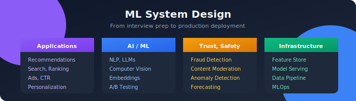

<div align="center">

# 🧠 ML System Design

### The Complete Guide to Production Machine Learning Systems

[](https://github.com/Gaurav14cs17)
[](https://github.com/Gaurav14cs17/ml_system_design/stargazers)
[](.)

*From interview prep to production deployment — master the art of ML system design*

---



</div>

---

## 🌟 What's Inside

This repository is your **comprehensive guide** to designing, building, and deploying production-grade machine learning systems. Whether you're preparing for FAANG interviews or architecting real-world ML platforms, you'll find battle-tested patterns and practical insights here.

<table>
<tr>
<td width="50%">

### 🎯 Perfect For

- **ML Engineers** preparing for system design interviews

- **Data Scientists** transitioning to production ML

- **Software Engineers** building ML-powered features

- **Tech Leads** designing scalable ML architectures

</td>
<td width="50%">

### ✨ Key Features

- 🔬 **Real-world case studies**

- 💡 **Best practices & anti-patterns**

- 🛠️ **Production-ready patterns**

</td>
</tr>
</table>

---

## 📚 Learning Tracks

### 🔴 Core ML Applications

<table>
<tr>
<td align="center" width="20%">
<a href="./01_recommendation_systems/README.md">

</a>
<br><sub>Content-based, collaborative filtering, hybrid systems</sub>
</td>
<td align="center" width="20%">
<a href="./02_search_ranking/README.md">

</a>
<br><sub>Query understanding, ranking models, serving</sub>
</td>
<td align="center" width="20%">
<a href="./03_ads_click_prediction/README.md">

</a>
<br><sub>Click prediction, real-time bidding</sub>
</td>
<td align="center" width="20%">
<a href="./04_nlp_systems/README.md">

</a>
<br><sub>LLMs, RAG, embeddings, chatbots</sub>
</td>
<td align="center" width="20%">
<a href="./05_computer_vision/README.md">

</a>
<br><sub>Detection, segmentation, OCR</sub>
</td>
</tr>
</table>

### 🟡 Trust & Safety

<table>
<tr>
<td align="center" width="33%">
<a href="./06_fraud_detection/README.md">

</a>
<br><sub>Real-time detection, rule engines, explainability</sub>
</td>
<td align="center" width="33%">
<a href="./07_content_moderation/README.md">

</a>
<br><sub>Text/image moderation, human-in-the-loop</sub>
</td>
<td align="center" width="33%">
<a href="./08_forecasting_time_series/README.md">

</a>
<br><sub>Time series, demand prediction, anomaly detection</sub>
</td>
</tr>
</table>

### 🟢 ML Infrastructure

<table>
<tr>
<td align="center" width="25%">
<a href="./09_feature_store/README.md">

</a>
<br><sub>Online/offline serving, feature engineering</sub>
</td>
<td align="center" width="25%">
<a href="./10_model_serving/README.md">

</a>
<br><sub>Inference optimization, A/B testing</sub>
</td>
<td align="center" width="25%">
<a href="./11_data_pipeline/README.md">

</a>
<br><sub>ETL, validation, orchestration</sub>
</td>
<td align="center" width="25%">
<a href="./12_mlops_monitoring/README.md">

</a>
<br><sub>CI/CD, monitoring, observability</sub>
</td>
</tr>
</table>

### 🔵 Advanced Topics

<table>
<tr>
<td align="center" width="33%">
<a href="./13_embedding_systems/README.md">

</a>
<br><sub>Vector search, similarity, ANN indexes</sub>
</td>
<td align="center" width="33%">
<a href="./14_personalization/README.md">

</a>
<br><sub>User modeling, context-aware recommendations</sub>
</td>
<td align="center" width="33%">
<a href="./15_ab_testing/README.md">

</a>
<br><sub>Experiment design, statistical analysis</sub>
</td>
</tr>
</table>

---

## 🗺️ Learning Path

```
                    +-------------------------------------------------------------+
                    |                    🎯 YOUR LEARNING JOURNEY                 |
                    +-------------------------------------------------------------+

    FUNDAMENTALS                    APPLICATIONS                    INFRASTRUCTURE
    ------------                    ------------                    --------------
         |                               |                               |
         ▼                               ▼                               ▼
    +---------+                    +---------+                    +---------+
    | Feature |------------------▶| Rec Sys |------------------▶| Feature |
    | Eng.    |                    | Search  |                    | Store   |
    +---------+                    | Ads     |                    +---------+
         |                         +---------+                         |
         |                               |                             |
         ▼                               ▼                             ▼
    +---------+                    +---------+                    +---------+
    |Embedding|------------------▶| NLP     |------------------▶| Model   |
    | Systems |                    | Vision  |                    | Serving |
    +---------+                    +---------+                    +---------+
                                        |                              |
                                        ▼                              ▼
                                   +---------+                    +---------+
                                   | Fraud   |------------------▶| MLOps   |
                                   | Safety  |                    | Monitor |
                                   +---------+                    +---------+

```

---

## 🚀 Quick Start

### For Interview Prep 📝

```bash
# Start with the most common interview topics

1. 01_recommendation_systems/  → Netflix, Spotify, Amazon

2. 02_search_ranking/          → Google, Elasticsearch

3. 03_ads_click_prediction/    → Meta, Google Ads

```

### For Production Systems 🏭

```bash
# Start with infrastructure fundamentals

1. 09_feature_store/           → Feast, Tecton patterns

2. 10_model_serving/           → TensorFlow Serving, Triton

3. 12_mlops_monitoring/        → MLflow, Kubeflow

```

---

## 📁 Repository Structure

```
ml_system_design/

|
+-- 📂 XX_topic_name/
|   +-- 📄 README.md              # Topic overview & navigation
|   +-- 📂 01_subtopic/

|   |   +-- 📄 README.md          # In-depth content
|   |   +-- 📂 images/            # Architecture diagrams (SVG)

|   +-- 📂 ...
|
+-- 📂 images/                    # Shared assets

```

---

## 💡 How to Use This Repository

| Goal | Recommended Approach |
|------|---------------------|
| **Interview Prep** | Focus on Recommendations, Search, Ads → then infrastructure topics |
| **Build Features** | Start with the application area closest to your use case |
| **Learn MLOps** | Begin with Feature Store → Model Serving → Monitoring |
| **Deep Dive** | Each topic has progressive sub-folders from basics to advanced |

---

## 🤝 Contributing

Contributions are welcome! Here's how you can help:

- 🐛 **Report Issues** — Found an error or outdated info?

- 💡 **Suggest Topics** — What's missing?

- 📝 **Improve Content** — PRs for corrections and additions

- 🎨 **Add Diagrams** — Visual learners appreciate it!

---

## ⭐ Support

If this repository helps you, consider giving it a ⭐ — it helps others discover it!

[](https://github.com/Gaurav14cs17/ml_system_design)

---

<div align="center">

### 📬 Stay Updated

*This repository is actively maintained with new content and improvements*

[](https://github.com/Gaurav14cs17)

---

**Made with 💜 by [Gaurav14cs17](https://github.com/Gaurav14cs17)**

*[Back to Top](#-ml-system-design)*

</div>

